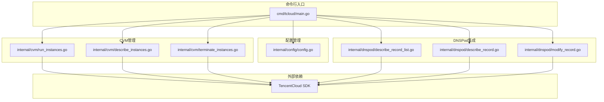
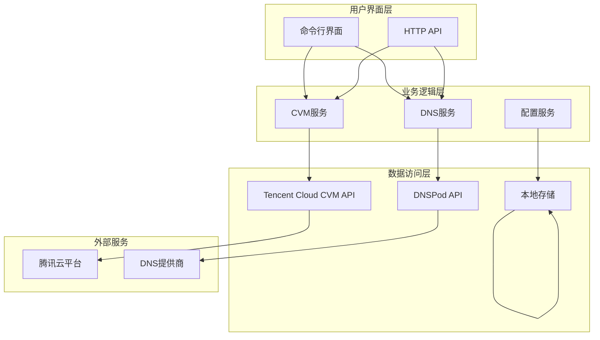
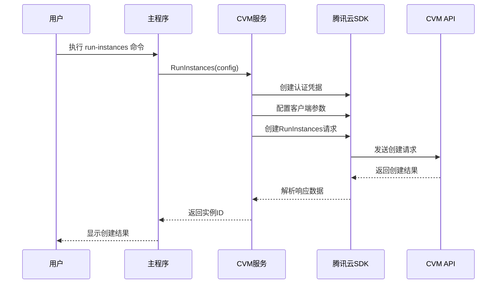
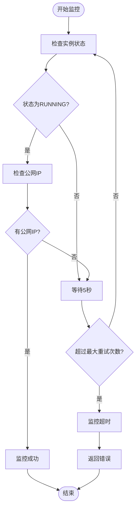
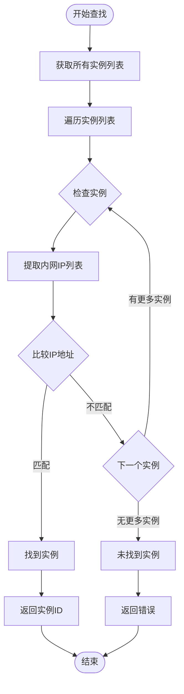
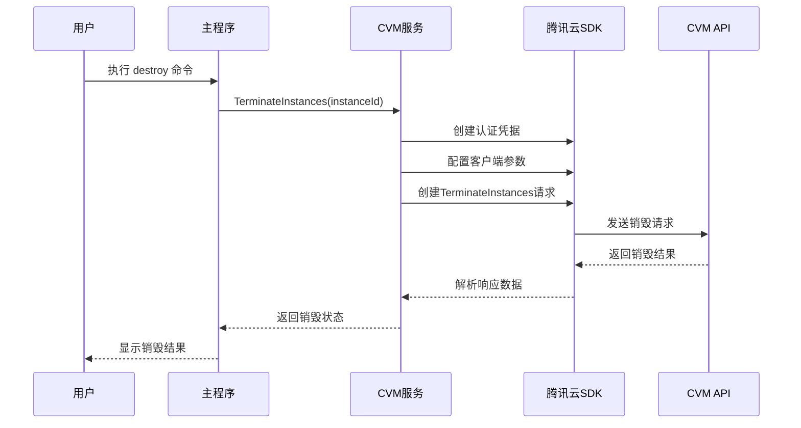
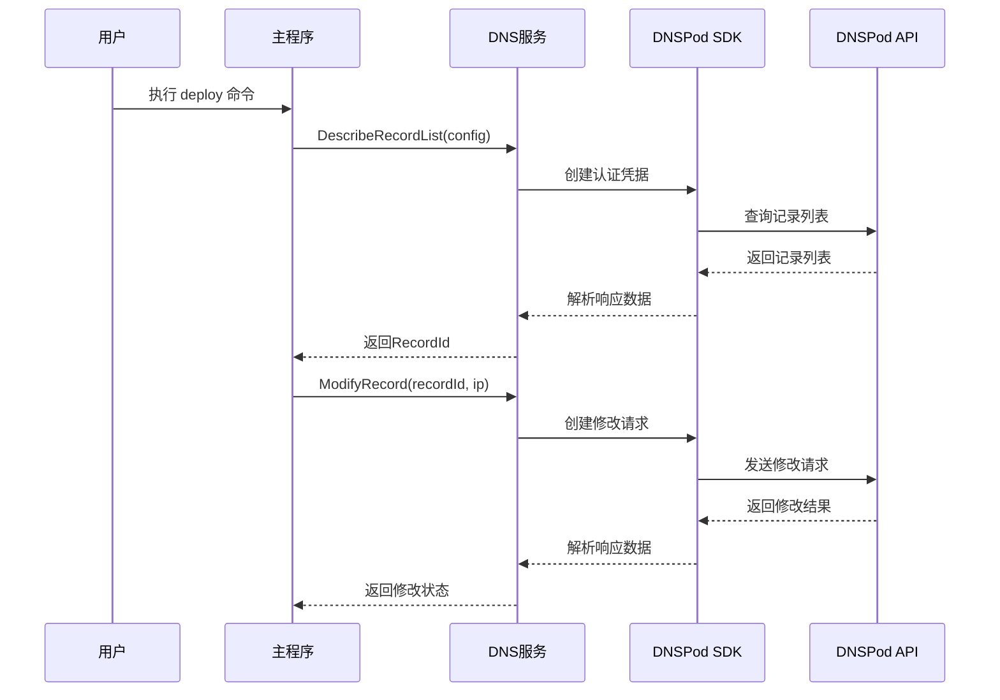
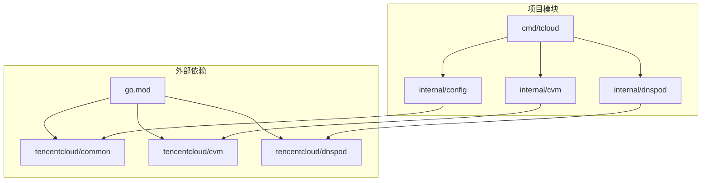

# CVM管理功能

<cite>
**本文档引用的文件**
- [main.go](file://cmd/tcloud/main.go)
- [run_instances.go](file://internal/cvm/run_instances.go)
- [describe_instances.go](file://internal/cvm/describe_instances.go)
- [terminate_instances.go](file://internal/cvm/terminate_instances.go)
- [config.go](file://internal/config/config.go)
- [describe_record_list.go](file://internal/dnspod/describe_record_list.go)
- [describe_record.go](file://internal/dnspod/describe_record.go)
- [modify_record.go](file://internal/dnspod/modify_record.go)
- [go.mod](file://go.mod)
</cite>

## 目录
1. [简介](#简介)
2. [项目结构](#项目结构)
3. [核心组件](#核心组件)
4. [架构概览](#架构概览)
5. [详细组件分析](#详细组件分析)
6. [依赖关系分析](#依赖关系分析)
7. [性能考虑](#性能考虑)
8. [故障排除指南](#故障排除指南)
9. [结论](#结论)

## 简介

本项目是一个基于腾讯云SDK的CVM（云虚拟主机）管理工具，提供了完整的竞价实例生命周期管理功能。该工具支持创建竞价实例、监控实例状态、获取公网IP、销毁实例以及与DNSPod服务集成的自动化部署和回收流程。

主要功能包括：
- **竞价实例创建**：支持按需创建CVM竞价实例
- **实例状态监控**：轮询查询实例状态和公网IP分配情况
- **实例销毁**：安全销毁指定实例
- **公网IP获取**：自动获取已运行实例的公网IP地址
- **内网IP查找**：通过内网IP地址查找对应实例
- **DNS集成**：自动修改DNS记录，实现域名解析指向
- **一键部署**：从创建实例到域名解析的完整自动化流程
- **一键回收**：从实例销毁到DNS还原的完整自动化流程

## 项目结构

项目采用模块化的Go语言项目结构，主要分为以下几个核心模块：

**图表来源**
- [main.go:12-196](file://cmd/tcloud/main.go#L12-L196)
- [config.go:31-59](file://internal/config/config.go#L31-L59)

**章节来源**
- [main.go:1-220](file://cmd/tcloud/main.go#L1-L220)
- [go.mod:1-10](file://go.mod#L1-L10)

## 核心组件

### 配置管理系统

配置系统负责管理腾讯云API访问凭证和环境配置，支持从JSON文件加载配置参数。

**关键配置项**：
- `secret_id` 和 `secret_key`：腾讯云API访问凭证
- `region`：地域配置
- `zone`：可用区配置
- `vpc_id` 和 `subnet_id`：网络配置
- `private_ip`：内网IP地址
- `instance_type`：实例规格
- `image_id`：镜像ID
- `key_id`：密钥对ID
- `max_price`：竞价实例最高价格
- `domain` 和 `subdomain`：DNS域名配置

### CVM管理模块

CVM管理模块提供完整的实例生命周期管理功能，包括创建、监控、销毁等操作。

**核心功能**：
- **实例创建**：支持竞价实例创建，配置网络、存储、安全组等参数
- **状态监控**：轮询查询实例状态，等待公网IP分配
- **实例销毁**：安全销毁指定实例
- **内网IP查找**：通过内网IP地址定位对应实例

### DNSPod集成模块

DNSPod集成模块提供域名解析管理功能，支持记录查询、修改和删除操作。

**核心功能**：
- **记录列表查询**：获取指定域名下的解析记录列表
- **记录详情查询**：获取单条解析记录的详细信息
- **记录修改**：修改解析记录的目标IP地址

**章节来源**
- [config.go:11-28](file://internal/config/config.go#L11-L28)
- [config.go:30-59](file://internal/config/config.go#L30-L59)

## 架构概览

系统采用分层架构设计，各模块职责清晰，通过接口进行解耦。

**图表来源**
- [main.go:76-196](file://cmd/tcloud/main.go#L76-L196)
- [run_instances.go:14-91](file://internal/cvm/run_instances.go#L14-L91)

## 详细组件分析

### 实例创建组件

实例创建组件负责竞价实例的创建过程，包含完整的配置参数设置和错误处理。

**图表来源**
- [main.go:76-83](file://cmd/tcloud/main.go#L76-L83)
- [run_instances.go:14-91](file://internal/cvm/run_instances.go#L14-L91)

**实现特点**：
- 使用竞价实例计费模式（SPOTPAID）
- 支持自定义实例规格和镜像
- 配置网络安全组和密钥对
- 设置系统盘类型和大小
- 配置公网带宽和网络类型

**章节来源**
- [run_instances.go:14-91](file://internal/cvm/run_instances.go#L14-L91)

### 实例状态监控组件

实例状态监控组件实现了竞价实例的轮询监控机制，确保实例完全启动并分配公网IP。

**图表来源**
- [describe_instances.go:15-64](file://internal/cvm/describe_instances.go#L15-L64)

**监控机制**：
- 最大重试次数：20次
- 重试间隔：5秒
- 状态检查：实例状态和公网IP双重验证
- 超时处理：超时返回错误信息

**章节来源**
- [describe_instances.go:15-64](file://internal/cvm/describe_instances.go#L15-L64)

### 内网IP查找组件

内网IP查找组件提供了通过内网IP地址定位实例的功能，支持遍历所有实例进行匹配。

**图表来源**
- [describe_instances.go:66-100](file://internal/cvm/describe_instances.go#L66-L100)

**查找策略**：
- 遍历所有可用实例
- 检查每个实例的内网IP地址
- 精确匹配指定的内网IP
- 返回匹配实例的ID和当前状态

**章节来源**
- [describe_instances.go:66-100](file://internal/cvm/describe_instances.go#L66-L100)

### 实例销毁组件

实例销毁组件提供了安全的实例销毁功能，确保资源正确释放。

**图表来源**
- [main.go:133-145](file://cmd/tcloud/main.go#L133-L145)
- [terminate_instances.go:14-36](file://internal/cvm/terminate_instances.go#L14-L36)

**销毁流程**：
- 验证实例ID有效性
- 发送销毁请求到腾讯云API
- 处理API响应结果
- 输出销毁状态信息

**章节来源**
- [terminate_instances.go:14-36](file://internal/cvm/terminate_instances.go#L14-L36)

### DNSPod集成组件

DNSPod集成组件提供了完整的域名解析管理功能，支持与CVM实例的自动化集成。

**图表来源**
- [main.go:85-131](file://cmd/tcloud/main.go#L85-L131)
- [describe_record_list.go:14-46](file://internal/dnspod/describe_record_list.go#L14-L46)

**DNS操作**：
- **记录查询**：获取指定域名和子域的解析记录
- **记录修改**：更新A记录的目标IP地址
- **记录详情**：获取单条记录的完整信息

**章节来源**
- [describe_record_list.go:14-46](file://internal/dnspod/describe_record_list.go#L14-L46)
- [describe_record.go:14-37](file://internal/dnspod/describe_record.go#L14-L37)
- [modify_record.go:14-41](file://internal/dnspod/modify_record.go#L14-L41)

## 依赖关系分析

项目使用Go模块系统管理依赖，主要依赖腾讯云官方SDK。

**图表来源**
- [go.mod:5-9](file://go.mod#L5-L9)

**依赖特性**：
- **版本锁定**：使用具体版本号确保构建一致性
- **模块化设计**：每个功能模块独立封装
- **接口抽象**：通过接口实现模块间解耦
- **错误处理**：统一的错误处理和返回机制

**章节来源**
- [go.mod:1-10](file://go.mod#L1-L10)

## 性能考虑

### 并发处理

系统采用同步调用模式，每个操作完成后才执行下一步。对于大量实例管理场景，可以考虑以下优化：

- **批量操作**：支持同时处理多个实例的批量创建、销毁
- **并发控制**：限制同时进行的API调用数量，避免触发限流
- **缓存机制**：缓存常用的配置和查询结果，减少重复调用

### 资源管理

- **连接池**：复用SDK客户端连接，减少连接建立开销
- **内存优化**：及时释放不再使用的对象和缓冲区
- **超时控制**：合理设置API调用超时时间，避免长时间阻塞

### 网络优化

- **重试策略**：实现指数退避的重试机制
- **断路器**：在API服务不稳定时快速失败
- **监控指标**：收集API调用成功率和延迟数据

## 故障排除指南

### 常见问题及解决方案

**配置文件问题**
- **症状**：加载配置失败
- **原因**：配置文件路径错误或格式不正确
- **解决**：检查配置文件路径和JSON格式

**API认证失败**
- **症状**：API调用返回认证错误
- **原因**：SecretID或SecretKey配置错误
- **解决**：验证腾讯云API凭证的有效性

**实例创建失败**
- **症状**：竞价实例创建失败
- **原因**：配额不足或参数配置错误
- **解决**：检查可用区配额和实例规格

**公网IP获取超时**
- **症状**：竞价实例创建后无法获取公网IP
- **原因**：竞价实例被回收或网络配置问题
- **解决**：检查竞价价格设置和网络配置

### 调试方法

**日志记录**
- 启用详细日志输出，记录每个API调用的请求和响应
- 使用结构化日志格式，便于分析和过滤
- 区分不同级别的日志信息（调试、信息、警告、错误）

**错误处理**
- 实现统一的错误处理机制
- 提供详细的错误上下文信息
- 支持错误重试和降级处理

**监控指标**
- 收集API调用成功率和延迟
- 监控实例状态变化
- 跟踪资源使用情况

**章节来源**
- [config.go:30-59](file://internal/config/config.go#L30-L59)
- [run_instances.go:72-78](file://internal/cvm/run_instances.go#L72-L78)
- [describe_instances.go:30-36](file://internal/cvm/describe_instances.go#L30-L36)

## 结论

本项目提供了一个完整的CVM管理解决方案，涵盖了竞价实例的全生命周期管理。通过模块化的设计和清晰的职责分离，系统具有良好的可维护性和扩展性。

**主要优势**：
- **功能完整**：从创建到销毁的完整流程覆盖
- **自动化程度高**：支持一键部署和回收流程
- **错误处理完善**：提供详细的错误信息和处理机制
- **配置灵活**：支持多种实例规格和网络配置

**改进建议**：
- 添加更多的监控和告警功能
- 实现配置热更新机制
- 增加更多的实例管理操作
- 提供Web界面或API接口

该工具为开发者提供了一个可靠的CVM管理基础，可以根据具体需求进行定制和扩展。