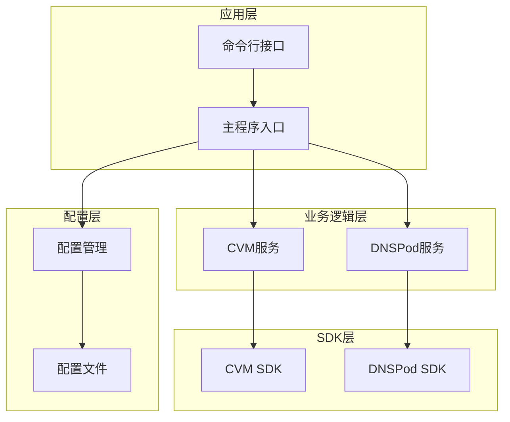
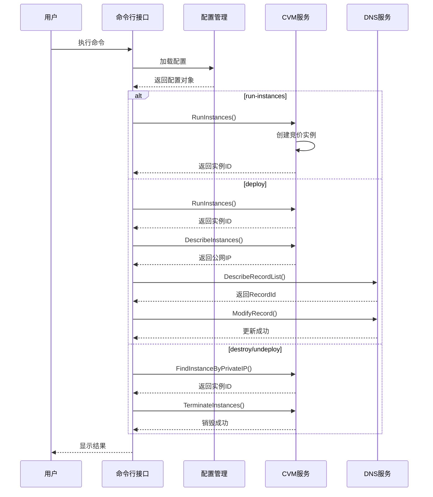
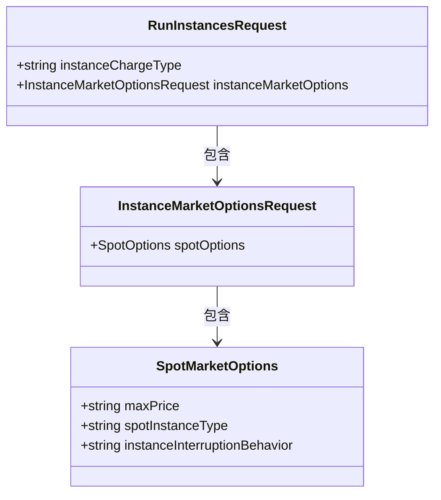
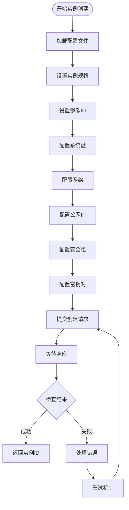
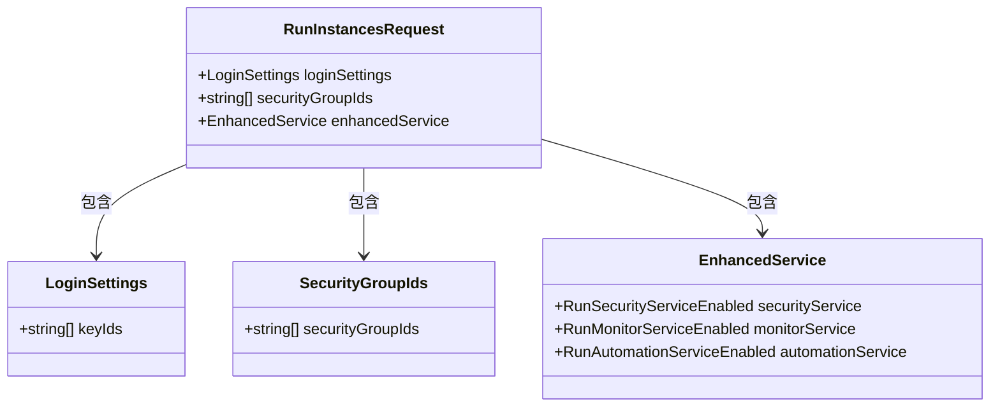
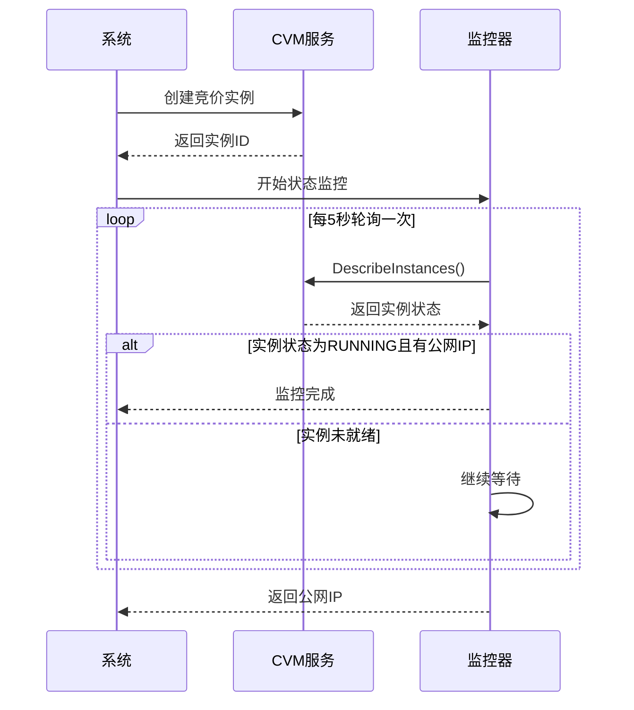
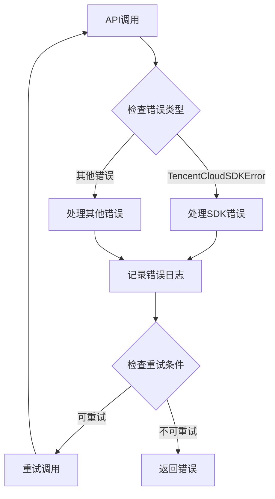
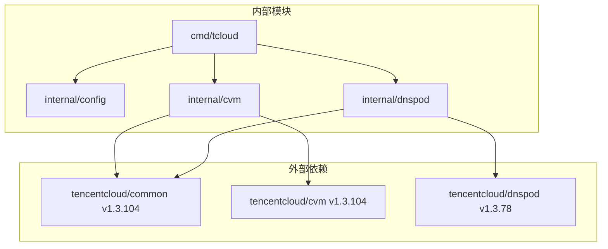

# 实例创建管理

<cite>
**本文档引用的文件**
- [main.go](file://cmd/tcloud/main.go)
- [run_instances.go](file://internal/cvm/run_instances.go)
- [describe_instances.go](file://internal/cvm/describe_instances.go)
- [terminate_instances.go](file://internal/cvm/terminate_instances.go)
- [config.go](file://internal/config/config.go)
- [describe_record_list.go](file://internal/dnspod/describe_record_list.go)
- [describe_record.go](file://internal/dnspod/describe_record.go)
- [modify_record.go](file://internal/dnspod/modify_record.go)
- [go.mod](file://go.mod)
</cite>

## 目录
1. [简介](#简介)
2. [项目结构](#项目结构)
3. [核心组件](#核心组件)
4. [架构概览](#架构概览)
5. [详细组件分析](#详细组件分析)
6. [依赖关系分析](#依赖关系分析)
7. [性能考虑](#性能考虑)
8. [故障排除指南](#故障排除指南)
9. [结论](#结论)
10. [附录](#附录)

## 简介

本项目是一个基于腾讯云SDK的CVM（云服务器）实例管理工具，专注于竞价实例的创建、管理和自动化部署。系统提供了完整的实例生命周期管理功能，包括实例创建、状态监控、公网IP获取、DNS解析更新以及实例销毁等操作。

该工具特别针对竞价实例（Spot Instances）进行了优化，通过SpotMarketOptions配置实现成本敏感型计算场景的自动化管理。系统采用模块化设计，将配置管理、CVM操作、DNS管理等功能分离到独立的包中，便于维护和扩展。

## 项目结构

项目采用分层架构设计，主要分为以下几个层次：



**图表来源**
- [main.go:12-196](file://cmd/tcloud/main.go#L12-L196)
- [config.go:31-59](file://internal/config/config.go#L31-L59)

**章节来源**
- [main.go:1-220](file://cmd/tcloud/main.go#L1-L220)
- [go.mod:1-10](file://go.mod#L1-L10)

## 核心组件

### 配置管理系统

配置系统负责管理所有腾讯云API调用所需的认证信息和环境参数。配置结构体包含了实例创建所需的所有关键参数：

- **认证信息**: SecretID、SecretKey
- **区域信息**: Region、Zone
- **网络配置**: VpcId、SubnetId、PrivateIP
- **实例规格**: InstanceType、ImageId、InstanceName
- **安全配置**: SecurityGroupIds、KeyId
- **竞价配置**: MaxPrice
- **DNS配置**: Domain、Subdomain

### CVM实例管理

CVM模块提供了完整的实例生命周期管理功能，包括竞价实例的创建、状态监控和销毁操作。

### DNS管理集成

DNSPod模块实现了与腾讯云DNS服务的集成，支持记录查询、详情获取和修改功能，为自动化部署流程提供域名解析管理能力。

**章节来源**
- [config.go:11-28](file://internal/config/config.go#L11-L28)
- [config.go:30-59](file://internal/config/config.go#L30-L59)

## 架构概览

系统采用命令行驱动的架构模式，通过单一入口点处理多种操作命令：



**图表来源**
- [main.go:76-196](file://cmd/tcloud/main.go#L76-L196)
- [run_instances.go:14-91](file://internal/cvm/run_instances.go#L14-L91)
- [describe_instances.go:15-64](file://internal/cvm/describe_instances.go#L15-L64)

**章节来源**
- [main.go:12-196](file://cmd/tcloud/main.go#L12-L196)

## 详细组件分析

### 竞价实例创建流程

竞价实例创建是系统的核心功能，通过SpotMarketOptions配置实现成本优化的实例部署。

#### SpotMarketOptions配置详解

竞价实例的创建依赖于精确的市场选项配置：



**图表来源**
- [run_instances.go:65-69](file://internal/cvm/run_instances.go#L65-L69)

竞价实例的关键配置参数：
- **计费类型**: SPOTPAID（竞价付费）
- **最高价格**: 由配置文件中的MaxPrice决定
- **中断行为**: 默认按实例类型中断

#### 实例规格选择策略

系统支持灵活的实例规格配置，通过配置文件统一管理：



**图表来源**
- [run_instances.go:14-91](file://internal/cvm/run_instances.go#L14-L91)

#### RunInstances API调用过程

竞价实例创建的API调用流程：

1. **认证初始化**: 使用SecretID和SecretKey创建凭证
2. **客户端配置**: 设置HTTP端点为cvm.tencentcloudapi.com
3. **请求构建**: 创建RunInstancesRequest实例
4. **参数配置**: 填充所有必需的实例创建参数
5. **API调用**: 执行RunInstances方法
6. **结果处理**: 解析响应并提取实例ID

**章节来源**
- [run_instances.go:14-91](file://internal/cvm/run_instances.go#L14-L91)

### 公网带宽配置

公网带宽配置确保竞价实例能够正常访问互联网资源：

| 配置项 | 值 | 说明 |
|--------|-----|------|
| InternetChargeType | TRAFFIC_POSTPAID_BY_HOUR | 按流量后付费 |
| InternetMaxBandwidthOut | 200 | 最大出站带宽(Mbps) |
| PublicIpAssigned | true | 分配公网IP |
| InternetServiceProvider | BGP | 网络运营商 |

### 安全组设置和密钥对绑定

系统集成了完整的网络安全配置：



**图表来源**
- [run_instances.go:50-64](file://internal/cvm/run_instances.go#L50-L64)

**章节来源**
- [run_instances.go:50-64](file://internal/cvm/run_instances.go#L50-L64)

### 实例创建状态监控

竞价实例创建后需要等待公网IP分配，系统实现了智能的状态监控机制：



**图表来源**
- [describe_instances.go:15-64](file://internal/cvm/describe_instances.go#L15-L64)

**章节来源**
- [describe_instances.go:15-64](file://internal/cvm/describe_instances.go#L15-L64)

### 错误处理和重试机制

系统实现了多层次的错误处理和重试机制：



**图表来源**
- [run_instances.go:72-78](file://internal/cvm/run_instances.go#L72-L78)
- [describe_instances.go:30-36](file://internal/cvm/describe_instances.go#L30-L36)

**章节来源**
- [run_instances.go:72-78](file://internal/cvm/run_instances.go#L72-L78)
- [describe_instances.go:30-36](file://internal/cvm/describe_instances.go#L30-L36)

## 依赖关系分析

系统依赖关系清晰明确，采用模块化设计：



**图表来源**
- [go.mod:5-9](file://go.mod#L5-L9)

**章节来源**
- [go.mod:5-9](file://go.mod#L5-L9)

## 性能考虑

### 竞价实例成本优化

竞价实例通过以下机制实现成本优化：

1. **价格竞争**: 实例价格随市场供需变化
2. **中断保护**: 支持配置最大价格限制
3. **批量创建**: 支持一次性创建多个实例
4. **自动扩展**: 可根据需求动态调整实例数量

### 状态监控性能

竞价实例状态监控采用轮询机制，平衡了实时性和资源消耗：

- **轮询间隔**: 5秒
- **最大重试次数**: 20次
- **总等待时间**: 100秒
- **网络开销**: 最小化，仅查询必要信息

### 网络配置优化

公网带宽配置针对竞价实例的特点进行了优化：

- **按需分配**: 仅在需要时分配公网IP
- **带宽适配**: 200Mbps带宽满足大多数应用场景
- **运营商选择**: BGP网络提供最优连接质量

## 故障排除指南

### 常见问题及解决方案

#### 配置文件问题
- **问题**: 配置文件加载失败
- **原因**: 文件路径不正确或权限不足
- **解决**: 检查配置文件路径和权限设置

#### 认证失败
- **问题**: API调用返回认证错误
- **原因**: SecretID或SecretKey配置错误
- **解决**: 验证密钥配置并重新生成

#### 竞价实例创建失败
- **问题**: 竞价实例无法创建
- **原因**: 价格超出限制或可用性不足
- **解决**: 调整MaxPrice或选择其他可用区

#### 状态监控超时
- **问题**: 实例状态监控超时
- **原因**: 网络延迟或API限流
- **解决**: 增加等待时间或检查网络连接

**章节来源**
- [config.go:44-58](file://internal/config/config.go#L44-L58)
- [run_instances.go:72-78](file://internal/cvm/run_instances.go#L72-L78)

## 结论

本项目提供了一个完整的竞价实例管理解决方案，具有以下特点：

1. **模块化设计**: 清晰的功能分离便于维护和扩展
2. **自动化程度高**: 支持一键部署和回收流程
3. **成本优化**: 通过竞价实例实现显著的成本节约
4. **错误处理完善**: 多层次的错误处理和重试机制
5. **配置灵活**: 通过配置文件统一管理所有参数

系统特别适合需要弹性计算资源的企业用户，能够有效降低云计算成本，同时保持服务的可靠性和可管理性。

## 附录

### 配置文件示例

配置文件应包含以下关键参数：

```json
{
    "secret_id": "your_secret_id",
    "secret_key": "your_secret_key",
    "region": "ap-beijing",
    "zone": "ap-beijing-1",
    "vpc_id": "vpc-xxxxxxxx",
    "subnet_id": "subnet-xxxxxxxx",
    "private_ip": "10.0.0.100",
    "instance_type": "S5.LARGE8",
    "image_id": "img-xxxxxxxx",
    "instance_name": "spot-instance-01",
    "key_id": "skey-xxxxxxxx",
    "security_group_ids": ["sg-xxxxxxxx"],
    "max_price": "0.1",
    "domain": "example.com",
    "subdomain": "www"
}
```

### 命令行使用示例

- **创建竞价实例**: `go run ./cmd/tcloud run-instances`
- **一键部署**: `go run ./cmd/tcloud deploy`
- **销毁实例**: `go run ./cmd/tcloud destroy`
- **一键回收**: `go run ./cmd/tcloud undeploy`