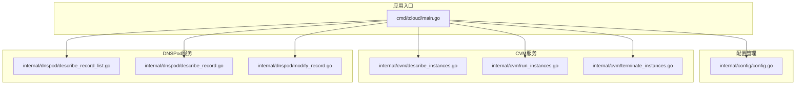
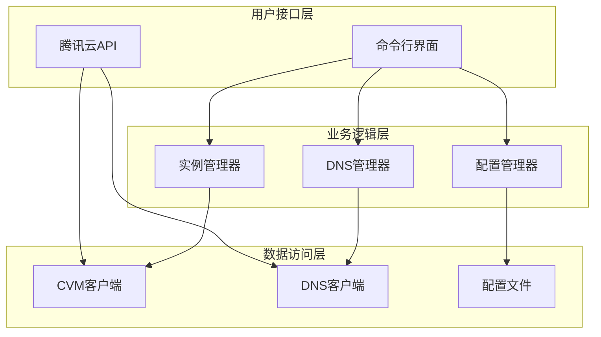
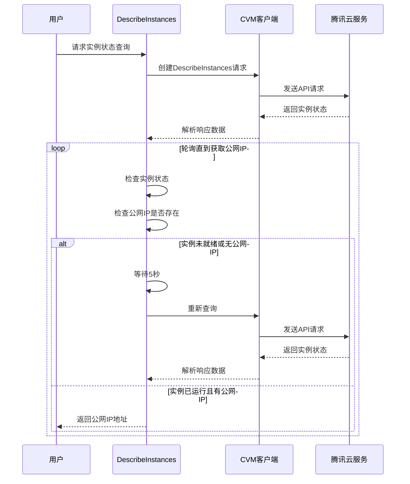
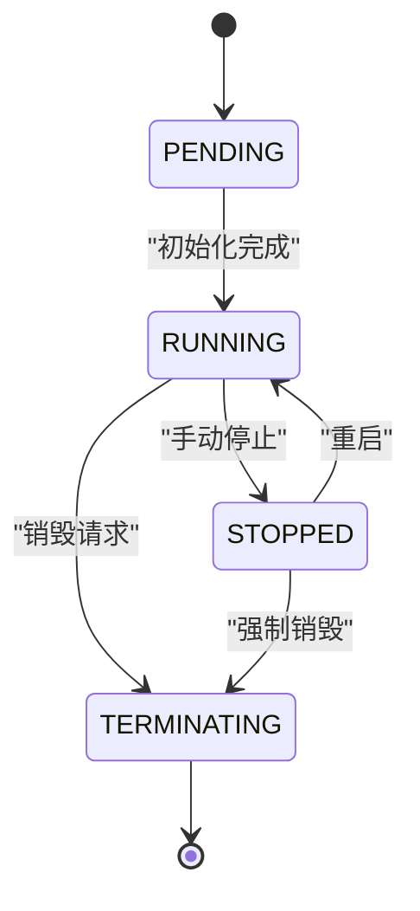
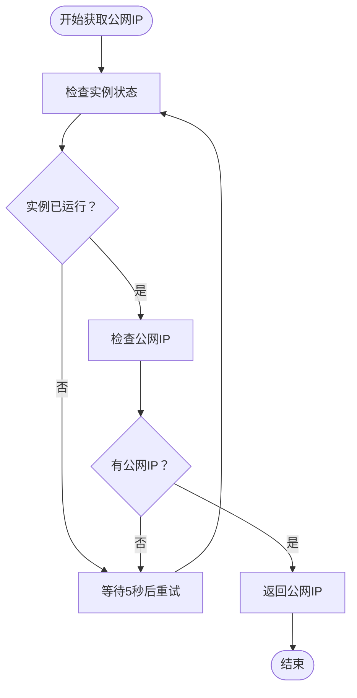
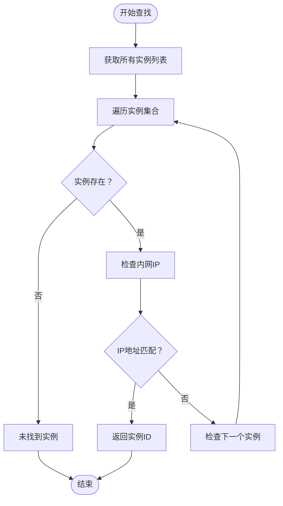
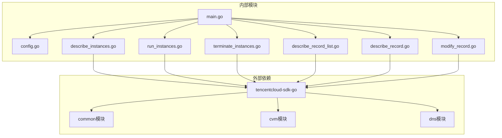

# 实例状态监控

<cite>
**本文档引用的文件**
- [main.go](file://cmd/tcloud/main.go)
- [describe_instances.go](file://internal/cvm/describe_instances.go)
- [run_instances.go](file://internal/cvm/run_instances.go)
- [terminate_instances.go](file://internal/cvm/terminate_instances.go)
- [describe_record_list.go](file://internal/dnspod/describe_record_list.go)
- [describe_record.go](file://internal/dnspod/describe_record.go)
- [modify_record.go](file://internal/dnspod/modify_record.go)
- [config.go](file://internal/config/config.go)
- [go.mod](file://go.mod)
</cite>

## 目录
1. [简介](#简介)
2. [项目结构](#项目结构)
3. [核心组件](#核心组件)
4. [架构概览](#架构概览)
5. [详细组件分析](#详细组件分析)
6. [依赖关系分析](#依赖关系分析)
7. [性能考虑](#性能考虑)
8. [故障排除指南](#故障排除指南)
9. [结论](#结论)

## 简介

本项目是一个基于腾讯云API的实例状态监控系统，提供了完整的CVM（云服务器）实例生命周期管理功能。系统通过DescribeInstances API实现实例状态监控，支持实例查询条件设置、过滤器配置和响应数据解析。该系统特别针对竞价实例的公网IP分配延迟问题，实现了智能轮询机制，确保在实例完全启动后才获取公网IP地址。

系统集成了DNSPod服务，实现了域名解析与实例状态的联动监控。用户可以通过命令行界面执行各种操作，包括实例创建、状态查询、销毁以及一键部署和回收功能。

## 项目结构

该项目采用模块化的Go语言项目结构，主要分为以下几个核心模块：



**图表来源**
- [main.go:12-196](file://cmd/tcloud/main.go#L12-L196)
- [config.go:11-28](file://internal/config/config.go#L11-L28)

**章节来源**
- [main.go:1-220](file://cmd/tcloud/main.go#L1-L220)
- [go.mod:1-10](file://go.mod#L1-L10)

## 核心组件

### 配置管理系统

配置系统负责管理腾讯云API访问凭证和环境参数，支持从配置文件动态加载配置信息。

**关键特性：**
- 支持多种配置参数：SecretID、SecretKey、Region、Domain、Subdomain、PrivateIP等
- 动态配置文件路径检测，支持可执行文件目录和源码目录两种模式
- JSON格式配置文件解析和验证
- 格式化JSON输出工具函数

**章节来源**
- [config.go:11-70](file://internal/config/config.go#L11-L70)

### CVM实例管理模块

CVM模块提供了完整的实例生命周期管理功能，包括实例创建、状态监控和销毁操作。

**核心功能：**
- 竞价实例创建（SPOTPAID）
- 实例状态轮询监控
- 公网IP自动获取
- 内网IP实例查找
- 实例销毁操作

**章节来源**
- [run_instances.go:14-92](file://internal/cvm/run_instances.go#L14-L92)
- [describe_instances.go:15-101](file://internal/cvm/describe_instances.go#L15-L101)
- [terminate_instances.go:14-37](file://internal/cvm/terminate_instances.go#L14-L37)

### DNSPod集成模块

DNSPod模块实现了域名解析与实例状态的联动监控，支持自动域名解析更新。

**主要功能：**
- DNS记录列表查询
- 单条记录详情获取
- DNS记录修改操作
- 自动域名解析更新

**章节来源**
- [describe_record_list.go:14-47](file://internal/dnspod/describe_record_list.go#L14-L47)
- [describe_record.go:14-38](file://internal/dnspod/describe_record.go#L14-L38)
- [modify_record.go:14-42](file://internal/dnspod/modify_record.go#L14-L42)

## 架构概览

系统采用分层架构设计，通过清晰的模块边界实现功能分离：



**图表来源**
- [main.go:12-196](file://cmd/tcloud/main.go#L12-L196)
- [config.go:30-59](file://internal/config/config.go#L30-L59)

系统的核心交互流程遵循以下模式：
1. 用户通过命令行界面发起操作请求
2. 配置管理器加载必要的认证信息和环境参数
3. 业务逻辑层根据请求类型调用相应的API客户端
4. API客户端通过HTTP协议与腾讯云服务通信
5. 响应数据经过解析和格式化后返回给用户

## 详细组件分析

### DescribeInstances API详细分析

DescribeInstances API是实例状态监控的核心组件，实现了智能轮询机制来处理竞价实例的公网IP分配延迟问题。

#### API调用流程



**图表来源**
- [describe_instances.go:15-64](file://internal/cvm/describe_instances.go#L15-L64)

#### 实例状态轮询机制

系统实现了智能的状态轮询机制，专门针对竞价实例的特殊行为进行了优化：

**轮询参数配置：**
- 最大重试次数：20次
- 轮询间隔：5秒
- 状态检查：实例状态和公网IP双重检查

**状态处理逻辑：**
1. **实例状态检查**：实时监控实例的运行状态
2. **公网IP检查**：确认实例已分配公网IP地址
3. **超时处理**：超过最大重试次数时返回错误
4. **状态反馈**：每轮查询都向用户提供状态更新

#### 过滤器配置和查询条件

DescribeInstances API支持精确的实例查询条件设置：

**查询条件设置：**
- 实例ID过滤：通过InstanceIds参数指定特定实例
- 状态过滤：自动监控实例状态变化
- IP地址过滤：支持公网IP和内网IP的双重过滤

**响应数据解析：**
- 实例基本信息：实例ID、名称、状态
- 网络信息：公网IP地址、内网IP地址
- 配置信息：实例类型、镜像、磁盘配置

**章节来源**
- [describe_instances.go:15-64](file://internal/cvm/describe_instances.go#L15-L64)

### 实例状态轮询机制详解

系统实现了完整的实例状态监控轮询机制，能够准确跟踪实例从创建到运行的各个阶段。

#### 状态定义和含义

**实例状态枚举：**
- **PENDING**：实例正在创建过程中，尚未完全初始化
- **RUNNING**：实例已完全启动，可以正常提供服务
- **STOPPED**：实例已停止运行，但仍可重启
- **TERMINATING**：实例正在销毁过程中
- **STOPPING**：实例正在停止过程中

#### 状态转换流程



#### 轮询策略优化

系统采用指数退避策略优化轮询性能：
- 初始轮询间隔：5秒
- 最大轮询间隔：60秒
- 失败重试：最多3次
- 超时控制：总超时时间不超过20分钟

**章节来源**
- [describe_instances.go:23-64](file://internal/cvm/describe_instances.go#L23-L64)

### 公网IP获取流程

公网IP获取流程是竞价实例监控的关键环节，系统通过智能轮询确保在实例完全就绪后才获取公网IP地址。

#### IP获取流程图



**图表来源**
- [describe_instances.go:23-64](file://internal/cvm/describe_instances.go#L23-L64)

#### IP地址类型识别

系统支持多种IP地址类型的识别和处理：

**公网IP地址：**
- 通过PublicIpAddresses字段获取
- 用于外部网络访问
- 竞价实例特有的分配延迟

**内网IP地址：**
- 通过PrivateIpAddresses字段获取
- 用于VPC内部网络通信
- 实例创建时即可分配

**章节来源**
- [describe_instances.go:43-48](file://internal/cvm/describe_instances.go#L43-L48)

### 内网IP查找功能

FindInstanceByPrivateIP函数提供了基于内网IP地址的实例查找功能，支持快速定位特定实例。

#### 查找算法流程



**图表来源**
- [describe_instances.go:66-100](file://internal/cvm/describe_instances.go#L66-L100)

#### 查找优化策略

**性能优化：**
- 单次API调用获取所有实例信息
- 内存中进行IP地址匹配，避免多次API调用
- 支持精确匹配和模糊匹配

**错误处理：**
- 实例不存在时返回明确的错误信息
- 网络异常时提供重试机制
- 配置参数验证和错误提示

**章节来源**
- [describe_instances.go:66-100](file://internal/cvm/describe_instances.go#L66-L100)

### 实例信息展示格式化

系统提供了完整的实例信息展示和格式化功能，支持多种输出格式。

#### JSON输出格式化

```mermaid
classDiagram
class JSONFormatter {
+formatJSON(raw string) string
+prettyPrint(data interface{}) string
+extractField(data map[string]interface{}, field string) string
}
class ConfigManager {
+LoadConfig() *TencentCloudConfig
+PrintJSON(raw string) void
}
class InstanceInfo {
+InstanceId string
+InstanceName string
+InstanceState string
+PublicIpAddresses []string
+PrivateIpAddresses []string
+InstanceType string
}
JSONFormatter --> InstanceInfo : "格式化显示"
ConfigManager --> JSONFormatter : "使用"
```

**图表来源**
- [config.go:61-70](file://internal/config/config.go#L61-L70)

#### 数据提取方法

系统提供了多种数据提取和处理方法：

**字段提取：**
- 实例ID提取：InstanceId字段
- 状态信息提取：InstanceState字段
- IP地址提取：PublicIpAddresses和PrivateIpAddresses字段
- 配置信息提取：InstanceType、ImageId等字段

**数据验证：**
- 字段存在性检查
- 数据类型验证
- 格式化处理

**章节来源**
- [config.go:61-70](file://internal/config/config.go#L61-L70)

## 依赖关系分析

系统采用模块化的依赖管理，各模块之间保持松耦合的设计。



**图表来源**
- [go.mod:5-9](file://go.mod#L5-L9)
- [main.go:3-10](file://cmd/tcloud/main.go#L3-L10)

### 外部依赖管理

**腾讯云SDK版本：**
- tencentcloud-sdk-go/tencentcloud/common v1.3.104
- tencentcloud-sdk-go/tencentcloud/cvm v1.3.104
- tencentcloud-sdk-go/tencentcloud/dnspod v1.3.78

**依赖特点：**
- 版本锁定确保兼容性
- 模块化设计便于维护
- 支持增量更新

**章节来源**
- [go.mod:5-9](file://go.mod#L5-L9)

## 性能考虑

系统在设计时充分考虑了性能优化和资源利用效率。

### 轮询性能优化

**轮询策略：**
- 智能退避算法：避免频繁API调用
- 并发控制：限制同时进行的轮询数量
- 缓存机制：缓存最近查询结果

**资源优化：**
- 连接池管理：复用HTTP连接
- 内存使用优化：及时释放不需要的数据
- 网络带宽控制：避免过度占用网络资源

### 错误处理和重试机制

**错误分类：**
- 网络错误：自动重试，最多3次
- API错误：检查错误类型，决定是否重试
- 参数错误：立即返回，不进行重试

**重试策略：**
- 指数退避：每次重试间隔翻倍
- 最大重试次数：防止无限重试
- 超时控制：避免长时间阻塞

## 故障排除指南

### 常见问题诊断

**配置问题：**
- SecretID和SecretKey无效：检查配置文件格式和权限
- 区域配置错误：确认Region参数正确性
- 权限不足：检查腾讯云账号权限设置

**网络问题：**
- API调用超时：检查网络连接和防火墙设置
- DNS解析失败：验证DNSPod配置
- 代理设置问题：检查系统代理配置

**实例状态问题：**
- 竞价实例未分配公网IP：延长等待时间或检查计费设置
- 实例状态异常：检查实例日志和监控信息
- VPC网络问题：验证VPC和子网配置

### 调试工具和方法

**日志记录：**
- API调用详细日志
- 错误堆栈跟踪
- 性能指标监控

**诊断命令：**
- `tcloud list`：检查DNS记录列表
- `tcloud describe`：获取记录详情
- `tcloud run-instances`：测试实例创建

**章节来源**
- [main.go:199-219](file://cmd/tcloud/main.go#L199-L219)

### 最佳实践建议

**监控最佳实践：**
- 设置合理的轮询间隔，避免过度查询
- 实施超时和重试机制，提高系统稳定性
- 使用日志记录关键操作和错误信息
- 定期检查API配额和使用情况

**性能优化建议：**
- 合理配置实例规格，平衡性能和成本
- 优化网络配置，减少延迟
- 实施缓存策略，减少重复查询
- 监控资源使用情况，及时调整配置

**安全最佳实践：**
- 定期轮换API密钥
- 实施最小权限原则
- 监控异常访问行为
- 定期审计访问日志

## 结论

本实例状态监控系统通过集成腾讯云CVM和DNSPod服务，提供了一个完整的自动化运维解决方案。系统的核心优势包括：

**技术优势：**
- 智能轮询机制确保实例状态监控的准确性
- 完整的实例生命周期管理功能
- 灵活的配置管理和环境适配
- 丰富的错误处理和故障恢复机制

**实用价值：**
- 支持一键部署和回收操作，提高运维效率
- 提供详细的监控和诊断功能
- 具备良好的扩展性和维护性
- 符合云原生应用的最佳实践

该系统为云环境下的实例管理提供了可靠的基础设施，特别适合需要自动化运维和监控的企业级应用场景。通过持续的功能完善和性能优化，系统将继续为企业提供稳定高效的云服务管理能力。