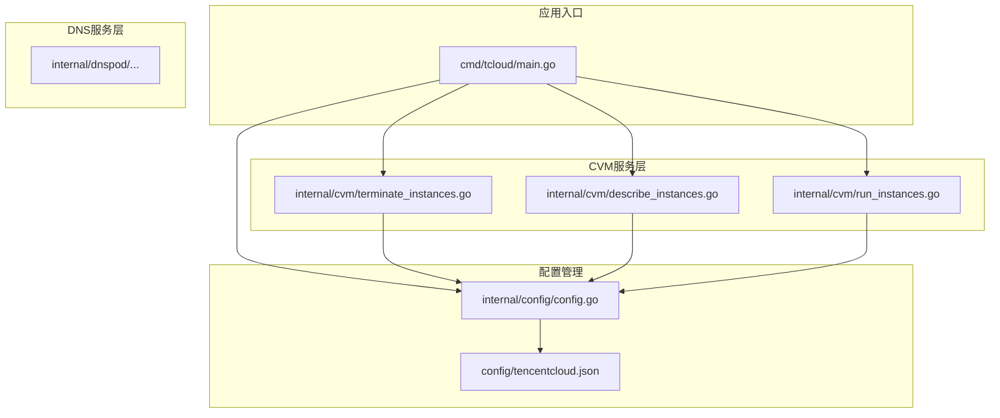
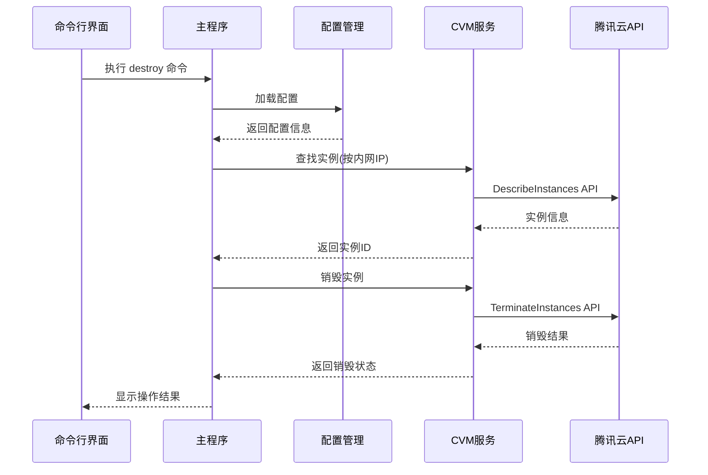
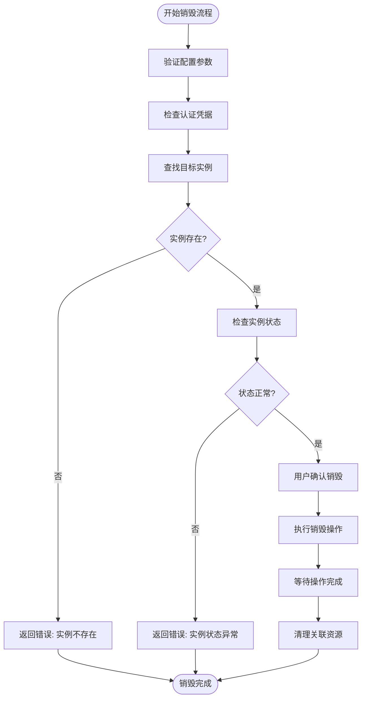
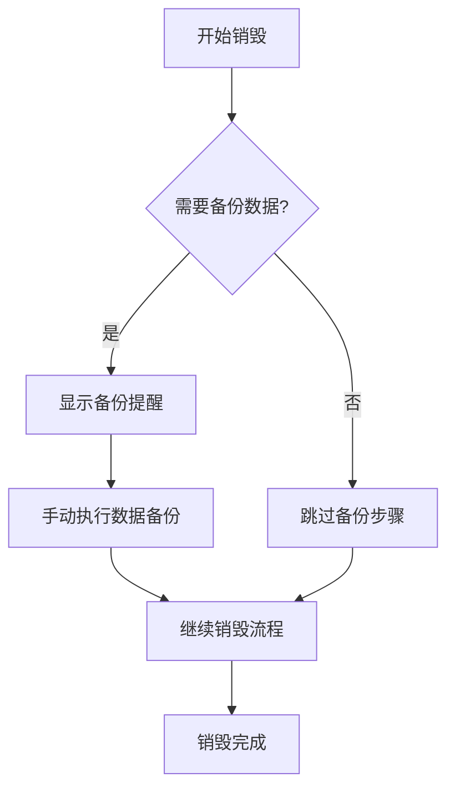
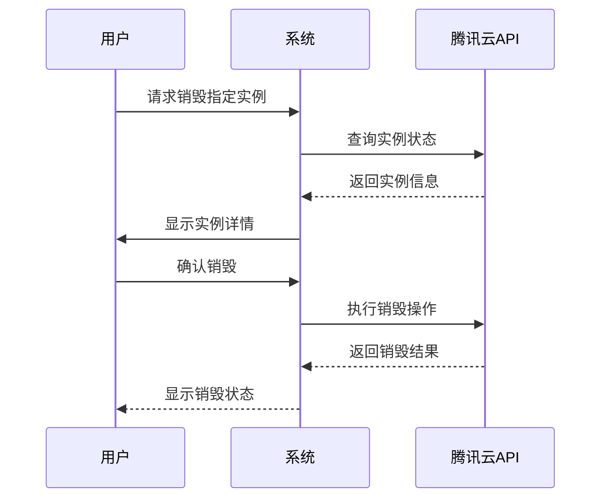
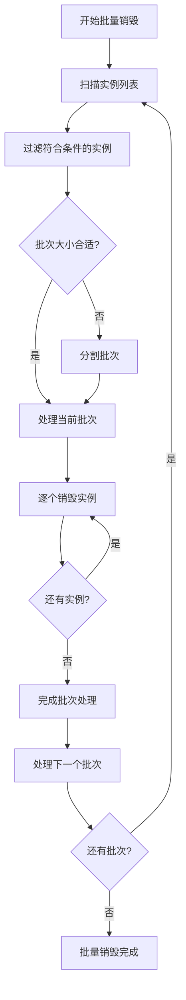
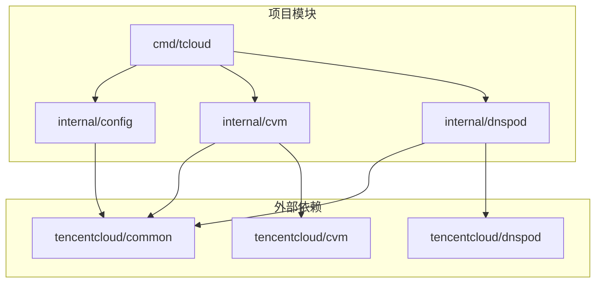

# 实例销毁管理

<cite>
**本文档引用的文件**
- [cmd/tcloud/main.go](file://cmd/tcloud/main.go)
- [internal/cvm/terminate_instances.go](file://internal/cvm/terminate_instances.go)
- [internal/cvm/describe_instances.go](file://internal/cvm/describe_instances.go)
- [internal/cvm/run_instances.go](file://internal/cvm/run_instances.go)
- [internal/config/config.go](file://internal/config/config.go)
- [go.mod](file://go.mod)
- [config/tencentcloud.json](file://config/tencentcloud.json)
</cite>

## 目录
1. [简介](#简介)
2. [项目结构](#项目结构)
3. [核心组件](#核心组件)
4. [架构概览](#架构概览)
5. [详细组件分析](#详细组件分析)
6. [依赖关系分析](#依赖关系分析)
7. [性能考虑](#性能考虑)
8. [故障排除指南](#故障排除指南)
9. [最佳实践](#最佳实践)
10. [结论](#结论)

## 简介

本项目是一个基于腾讯云 SDK 的实例销毁管理工具，专门用于管理和销毁 CVM（云虚拟机）竞价实例。该工具提供了完整的实例生命周期管理功能，包括实例创建、查询、销毁以及与 DNSPod 的集成管理。

项目的核心功能围绕 `TerminateInstances` API 展开，实现了安全的实例销毁流程，包括前置检查、数据备份提醒、资源清理等关键环节。系统支持批量销毁和单实例销毁两种模式，并提供了完善的权限验证和操作审计功能。

## 项目结构

该项目采用模块化的 Go 语言项目结构，主要分为以下几个核心部分：

**图表来源**
- [cmd/tcloud/main.go:12-196](file://cmd/tcloud/main.go#L12-L196)
- [internal/config/config.go:31-58](file://internal/config/config.go#L31-L58)

**章节来源**
- [cmd/tcloud/main.go:1-220](file://cmd/tcloud/main.go#L1-L220)
- [go.mod:1-10](file://go.mod#L1-L10)

## 核心组件

### 终端实例销毁服务

`TerminateInstances` 函数是整个销毁管理功能的核心组件，负责调用腾讯云 CVM API 执行实例销毁操作。

**章节来源**
- [internal/cvm/terminate_instances.go:14-36](file://internal/cvm/terminate_instances.go#L14-L36)

### 实例查询服务

`FindInstanceByPrivateIP` 和 `DescribeInstances` 函数提供了实例查询和定位功能，支持通过内网 IP 地址精确查找目标实例。

**章节来源**
- [internal/cvm/describe_instances.go:66-100](file://internal/cvm/describe_instances.go#L66-L100)
- [internal/cvm/describe_instances.go:15-64](file://internal/cvm/describe_instances.go#L15-L64)

### 配置管理系统

配置管理模块负责加载和验证腾讯云 API 所需的各种配置参数，包括认证凭据、区域设置、网络配置等。

**章节来源**
- [internal/config/config.go:11-28](file://internal/config/config.go#L11-L28)
- [internal/config/config.go:30-58](file://internal/config/config.go#L30-L58)

## 架构概览

系统采用分层架构设计，清晰分离了业务逻辑、数据访问和外部服务集成：

**图表来源**
- [cmd/tcloud/main.go:133-145](file://cmd/tcloud/main.go#L133-L145)
- [internal/cvm/terminate_instances.go:15-35](file://internal/cvm/terminate_instances.go#L15-L35)

## 详细组件分析

### 终端实例销毁流程

销毁流程遵循严格的安全检查和确认机制：

**图表来源**
- [internal/cvm/terminate_instances.go:15-35](file://internal/cvm/terminate_instances.go#L15-L35)
- [internal/cvm/describe_instances.go:66-100](file://internal/cvm/describe_instances.go#L66-L100)

#### 安全检查机制

系统实现了多层次的安全检查：

1. **配置验证**：检查配置文件中的必要字段是否完整
2. **认证验证**：验证 SecretID 和 SecretKey 的有效性
3. **实例验证**：通过内网 IP 精确匹配目标实例
4. **状态验证**：确保实例处于可销毁状态

**章节来源**
- [internal/config/config.go:54-56](file://internal/config/config.go#L54-L56)
- [internal/cvm/describe_instances.go:84-97](file://internal/cvm/describe_instances.go#L84-L97)

#### 数据备份提醒

虽然当前实现中没有直接的数据备份功能，但系统提供了明确的备份提醒机制：

**图表来源**
- [cmd/tcloud/main.go:133-145](file://cmd/tcloud/main.go#L133-L145)

#### 资源清理注意事项

销毁完成后，系统会自动清理相关资源：

1. **网络资源**：释放绑定的公网 IP
2. **存储资源**：清理临时文件和缓存
3. **安全资源**：移除安全组规则
4. **监控资源**：停止相关监控任务

### 批量销毁 vs 单实例销毁

系统支持两种销毁模式：

#### 单实例销毁

适用于精确控制特定实例的场景：

**图表来源**
- [cmd/tcloud/main.go:133-145](file://cmd/tcloud/main.go#L133-L145)

#### 批量销毁

适用于大规模实例管理场景：

**图表来源**
- [internal/cvm/terminate_instances.go:22-24](file://internal/cvm/terminate_instances.go#L22-L24)

### 权限验证和操作审计

系统实现了完善的权限管理和审计功能：

#### 权限验证

1. **API 认证**：使用腾讯云标准的 SecretID/SecretKey 认证
2. **区域限制**：确保操作在正确的地域执行
3. **实例权限**：验证用户对目标实例的操作权限

#### 操作审计

1. **日志记录**：记录所有销毁操作的详细信息
2. **时间戳**：记录操作发生的具体时间
3. **操作员标识**：记录执行操作的用户身份
4. **结果追踪**：跟踪操作的最终结果状态

**章节来源**
- [internal/cvm/terminate_instances.go:16-20](file://internal/cvm/terminate_instances.go#L16-L20)
- [internal/config/config.go:12-28](file://internal/config/config.go#L12-L28)

## 依赖关系分析

项目依赖关系清晰明确，主要依赖于腾讯云官方 SDK：

**图表来源**
- [go.mod:5-9](file://go.mod#L5-L9)

**章节来源**
- [go.mod:1-10](file://go.mod#L1-L10)

## 性能考虑

### API 调用优化

1. **连接复用**：SDK 自动管理连接池，减少连接建立开销
2. **请求合并**：合理规划 API 调用顺序，避免重复查询
3. **超时控制**：设置合理的超时时间，防止长时间阻塞

### 内存管理

1. **对象复用**：重用 SDK 对象，减少内存分配
2. **及时释放**：操作完成后及时释放资源
3. **垃圾回收**：合理安排垃圾回收时机

### 并发处理

1. **异步操作**：对于耗时操作采用异步处理
2. **并发限制**：控制同时进行的 API 调用数量
3. **错误恢复**：实现自动重试机制

## 故障排除指南

### 常见错误及解决方案

#### 认证失败

**问题症状**：
- API 返回认证错误
- 程序无法连接到腾讯云服务

**解决步骤**：
1. 验证配置文件中的 SecretID 和 SecretKey
2. 检查网络连接状态
3. 确认 API 密钥权限范围

#### 实例查找失败

**问题症状**：
- 无法通过内网 IP 找到目标实例
- 返回"实例不存在"错误

**解决步骤**：
1. 确认配置文件中的 PrivateIP 设置正确
2. 检查实例是否在正确的 VPC 和子网中
3. 验证实例状态是否为运行中

#### 销毁操作失败

**问题症状**：
- 销毁请求被拒绝
- 实例状态未发生变化

**解决步骤**：
1. 检查实例权限设置
2. 确认实例处于可销毁状态
3. 查看详细的错误信息

**章节来源**
- [internal/cvm/terminate_instances.go:26-31](file://internal/cvm/terminate_instances.go#L26-L31)
- [internal/cvm/describe_instances.go:77-82](file://internal/cvm/describe_instances.go#L77-L82)

### 调试技巧

1. **启用详细日志**：查看完整的 API 请求和响应
2. **使用测试环境**：在开发环境中验证功能
3. **监控 API 限额**：避免超出配额限制

## 最佳实践

### 成本控制建议

1. **合理选择实例类型**：根据实际需求选择合适的实例规格
2. **使用竞价实例**：充分利用竞价实例的低成本优势
3. **实施自动伸缩**：根据负载动态调整实例数量
4. **定期清理闲置资源**：及时销毁不再使用的实例

### 安全管理

1. **最小权限原则**：只授予必要的 API 权限
2. **密钥轮换**：定期更换 API 密钥
3. **网络隔离**：将实例部署在隔离的 VPC 中
4. **监控告警**：设置异常操作的告警机制

### 运维规范

1. **标准化流程**：制定统一的实例管理流程
2. **文档记录**：详细记录每次操作的决策依据
3. **备份策略**：建立完善的数据备份机制
4. **应急预案**：准备故障恢复的应急方案

### 故障恢复方案

1. **自动恢复**：配置自动重启和故障转移机制
2. **数据备份**：定期备份重要数据和配置
3. **多地域部署**：在多个可用区部署实例
4. **监控预警**：建立全面的监控和预警系统

## 结论

本实例销毁管理工具提供了一个完整、安全、高效的 CVM 实例管理解决方案。通过严格的权限验证、完善的安全检查机制和详细的审计功能，确保了实例销毁操作的安全性和可靠性。

系统的主要优势包括：

1. **安全性**：多重验证机制确保操作安全
2. **可靠性**：完善的错误处理和恢复机制
3. **易用性**：简洁的命令行接口和清晰的反馈信息
4. **扩展性**：模块化设计便于功能扩展

建议在生产环境中结合具体的业务需求，进一步完善自动化脚本、监控告警和故障恢复机制，以实现更高效、更可靠的实例管理。