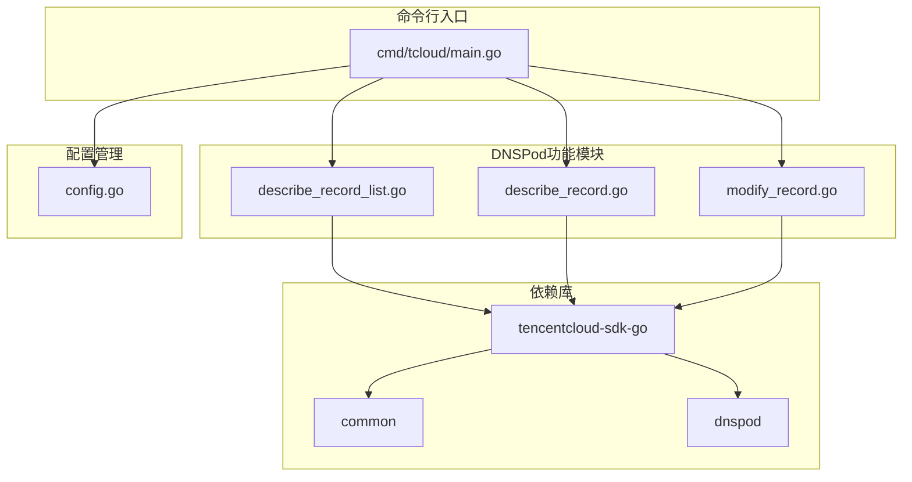
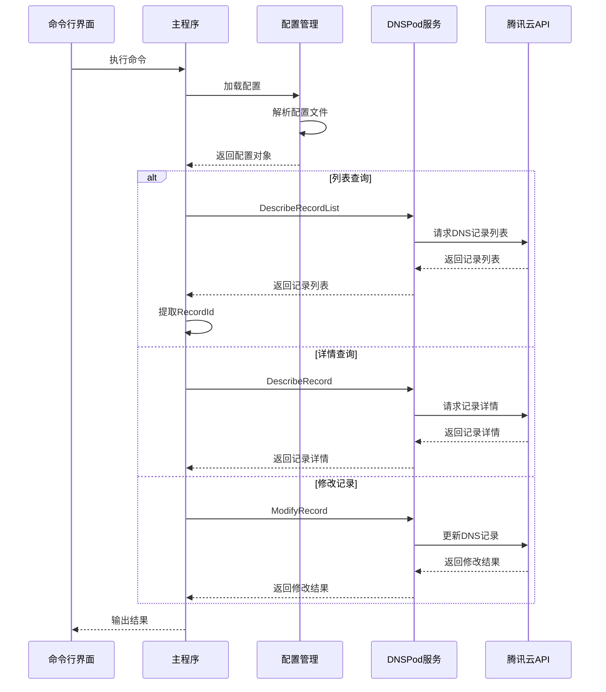
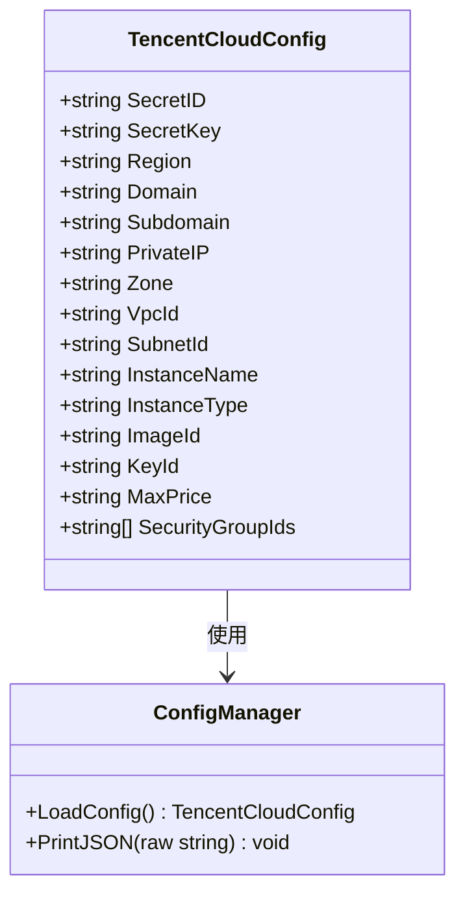
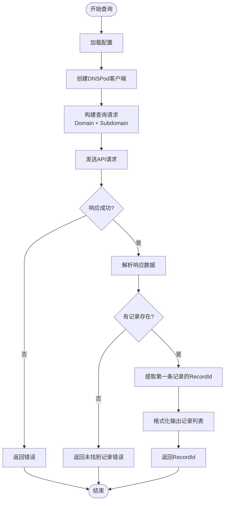
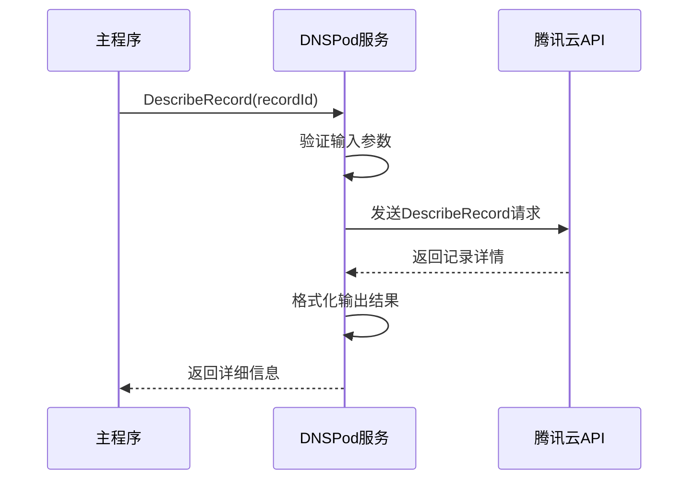
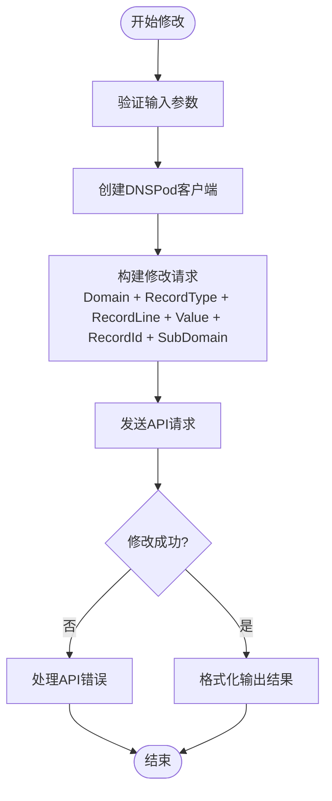
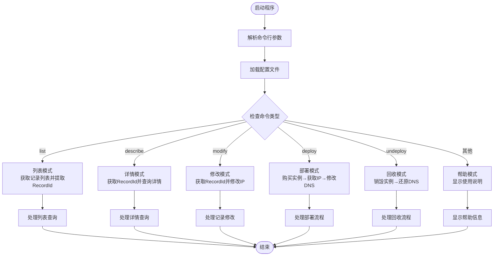
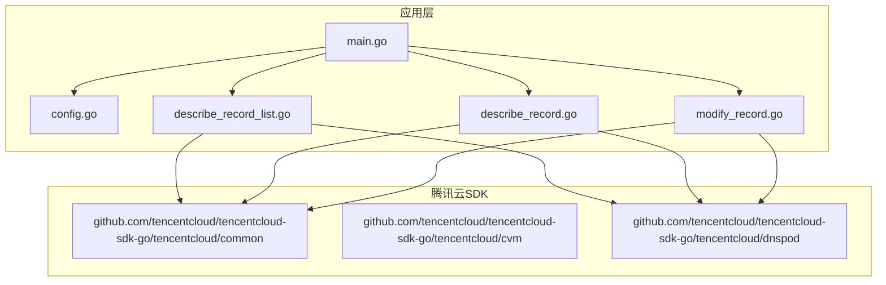
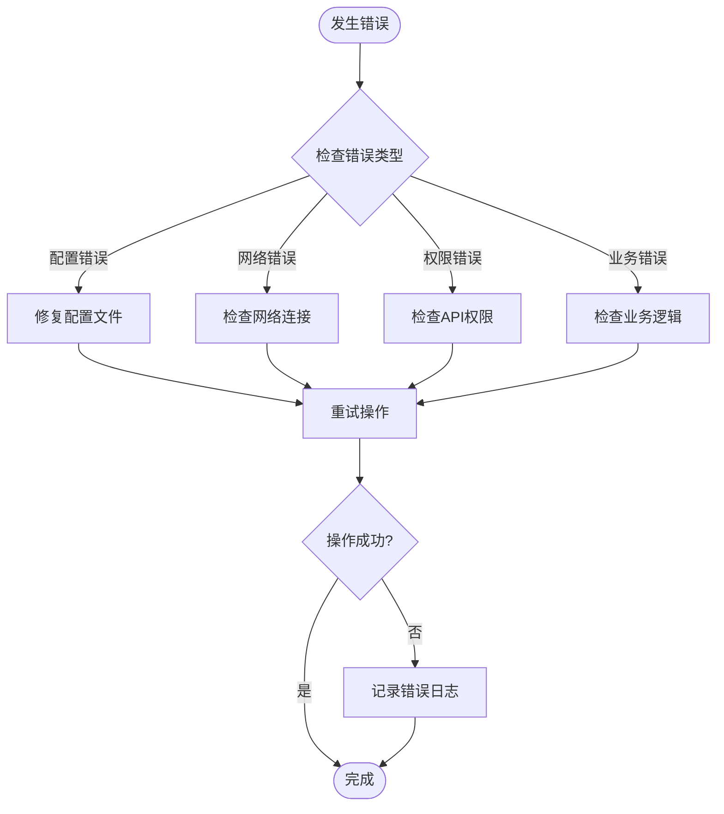

# DNS管理功能

<cite>
**本文档引用的文件**
- [main.go](file://cmd/tcloud/main.go)
- [describe_record.go](file://internal/dnspod/describe_record.go)
- [describe_record_list.go](file://internal/dnspod/describe_record_list.go)
- [modify_record.go](file://internal/dnspod/modify_record.go)
- [config.go](file://internal/config/config.go)
- [go.mod](file://go.mod)
</cite>

## 目录
1. [简介](#简介)
2. [项目结构](#项目结构)
3. [核心组件](#核心组件)
4. [架构概览](#架构概览)
5. [详细组件分析](#详细组件分析)
6. [依赖关系分析](#依赖关系分析)
7. [性能考虑](#性能考虑)
8. [故障排除指南](#故障排除指南)
9. [结论](#结论)

## 简介

本项目是一个基于腾讯云DNSPod服务的DNS管理工具，提供了完整的DNS记录查询、详情查看和修改功能。该工具通过命令行接口实现了自动化DNS管理，支持A记录的创建、更新和删除操作，并集成了CVM实例管理功能，实现了从基础设施到域名解析的一站式管理。

## 项目结构

项目采用模块化的Go语言项目结构，主要分为以下几个核心部分：



**图表来源**
- [main.go:1-220](file://cmd/tcloud/main.go#L1-L220)
- [describe_record_list.go:1-47](file://internal/dnspod/describe_record_list.go#L1-L47)
- [describe_record.go:1-38](file://internal/dnspod/describe_record.go#L1-L38)
- [modify_record.go:1-42](file://internal/dnspod/modify_record.go#L1-L42)

**章节来源**
- [main.go:1-220](file://cmd/tcloud/main.go#L1-L220)
- [go.mod:1-10](file://go.mod#L1-L10)

## 核心组件

### 配置管理系统

配置系统负责管理腾讯云API访问凭证和域名相关信息，支持从配置文件自动加载配置。

### DNS记录查询组件

提供两种查询模式：
- **列表查询**：获取指定域名下的所有DNS记录，自动提取第一条记录的RecordId
- **详情查询**：根据RecordId获取特定DNS记录的详细信息

### DNS记录修改组件

专门用于修改A类型的DNS记录，支持IP地址的动态更新。

**章节来源**
- [config.go:11-28](file://internal/config/config.go#L11-L28)
- [describe_record_list.go:14-46](file://internal/dnspod/describe_record_list.go#L14-L46)
- [describe_record.go:14-37](file://internal/dnspod/describe_record.go#L14-L37)
- [modify_record.go:14-41](file://internal/dnspod/modify_record.go#L14-L41)

## 架构概览

系统采用分层架构设计，实现了清晰的关注点分离：



**图表来源**
- [main.go:27-196](file://cmd/tcloud/main.go#L27-L196)
- [describe_record_list.go:15-46](file://internal/dnspod/describe_record_list.go#L15-L46)
- [describe_record.go:15-37](file://internal/dnspod/describe_record.go#L15-L37)
- [modify_record.go:15-41](file://internal/dnspod/modify_record.go#L15-L41)

## 详细组件分析

### 配置管理组件

配置管理组件负责处理腾讯云API的认证信息和域名配置参数：



**图表来源**
- [config.go:11-28](file://internal/config/config.go#L11-L28)
- [config.go:30-70](file://internal/config/config.go#L30-L70)

配置参数说明：
- **SecretID/SecretKey**：腾讯云API访问凭证
- **Domain/Subdomain**：域名和子域名配置
- **Region/Zone**：地域和可用区设置
- **VpcId/SubnetId**：网络配置参数

**章节来源**
- [config.go:11-28](file://internal/config/config.go#L11-L28)
- [config.go:30-70](file://internal/config/config.go#L30-L70)

### DNS记录列表查询组件

该组件实现了自动提取RecordId的机制：



**图表来源**
- [describe_record_list.go:15-46](file://internal/dnspod/describe_record_list.go#L15-L46)

**章节来源**
- [describe_record_list.go:14-46](file://internal/dnspod/describe_record_list.go#L14-L46)

### DNS记录详情查询组件

详情查询组件提供了精确的记录信息获取：



**图表来源**
- [describe_record.go:15-37](file://internal/dnspod/describe_record.go#L15-L37)

**章节来源**
- [describe_record.go:14-37](file://internal/dnspod/describe_record.go#L14-L37)

### DNS记录修改组件

修改组件专门处理A记录的更新操作：



**图表来源**
- [modify_record.go:15-41](file://internal/dnspod/modify_record.go#L15-L41)

**章节来源**
- [modify_record.go:14-41](file://internal/dnspod/modify_record.go#L14-L41)

### 主程序控制流

主程序实现了完整的命令行接口，支持多种操作模式：



**图表来源**
- [main.go:12-196](file://cmd/tcloud/main.go#L12-L196)

**章节来源**
- [main.go:12-196](file://cmd/tcloud/main.go#L12-L196)

## 依赖关系分析

项目依赖关系清晰明确，主要依赖于腾讯云官方SDK：



**图表来源**
- [go.mod:5-9](file://go.mod#L5-L9)
- [main.go:3-10](file://cmd/tcloud/main.go#L3-L10)

**章节来源**
- [go.mod:1-10](file://go.mod#L1-L10)

## 性能考虑

### API调用优化

1. **连接复用**：SDK自动管理HTTP连接池，减少连接建立开销
2. **批量操作**：列表查询一次性获取所有记录，避免多次API调用
3. **错误重试**：SDK内置重试机制，提高API调用成功率

### 内存管理

1. **JSON序列化**：使用缓冲区进行JSON格式化，避免内存泄漏
2. **字符串处理**：合理使用指针传递，减少不必要的内存复制

### 并发处理

当前实现为同步阻塞模式，适合命令行工具场景。如需扩展为Web服务，建议：
- 实现异步API调用
- 添加请求队列管理
- 实现连接池优化

## 故障排除指南

### 常见错误类型

1. **配置文件错误**
   - 配置文件不存在或格式不正确
   - SecretID/SecretKey为空或无效
   - 域名配置参数缺失

2. **API调用错误**
   - 网络连接超时
   - 腾讯云API限流
   - 权限不足

3. **记录操作错误**
   - RecordId不存在
   - DNS记录类型不匹配
   - 子域名配置错误

### 调试方法

1. **启用详细日志**
   ```bash
   export TENCENTCLOUD_SDK_LOG_LEVEL=DEBUG
   ```

2. **验证配置**
   ```bash
   go run ./cmd/tcloud list
   ```

3. **检查网络连接**
   ```bash
   ping dnspod.tencentcloudapi.com
   ```

### 错误处理策略



**章节来源**
- [describe_record_list.go:27-31](file://internal/dnspod/describe_record_list.go#L27-L31)
- [describe_record.go:27-31](file://internal/dnspod/describe_record.go#L27-L31)
- [modify_record.go:31-35](file://internal/dnspod/modify_record.go#L31-L35)

## 结论

本DNS管理工具提供了完整的DNSPod服务集成方案，具有以下特点：

### 优势
1. **功能完整**：覆盖DNS记录的查询、详情查看和修改全流程
2. **自动化程度高**：RecordId自动提取机制简化了操作流程
3. **易于使用**：简洁的命令行接口，支持一键部署和回收
4. **错误处理完善**：详细的错误信息和重试机制

### 改进建议
1. **添加缓存机制**：DNS记录查询结果缓存，减少重复API调用
2. **实现批量操作**：支持多条记录的批量查询和修改
3. **增加监控告警**：DNS变更后的状态监控和异常告警
4. **扩展记录类型**：支持更多DNS记录类型的管理

### 最佳实践

1. **A记录管理最佳实践**
   - 修改前先查询当前状态，确保操作的准确性
   - 使用0.0.0.0作为回收时的占位符，避免影响其他服务
   - 定期备份重要的DNS配置信息

2. **配置管理最佳实践**
   - 将敏感信息存储在环境变量中，而非配置文件
   - 分离开发、测试、生产环境的配置
   - 定期轮换API密钥，提高安全性

3. **变更管理最佳实践**
   - 在非业务高峰期执行DNS变更操作
   - 准备回滚计划，确保能够快速恢复
   - 记录每次变更的详细信息，便于审计追踪

该工具为DNS管理提供了可靠的自动化解决方案，适合需要频繁管理域名解析的服务场景。