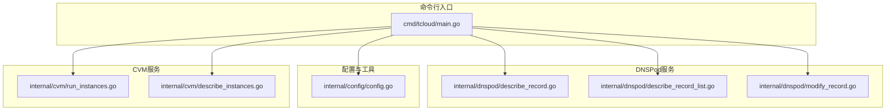
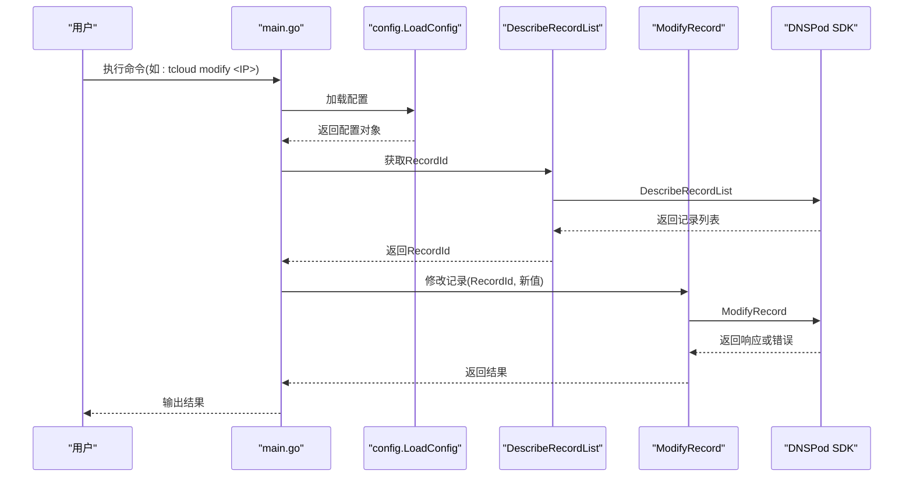
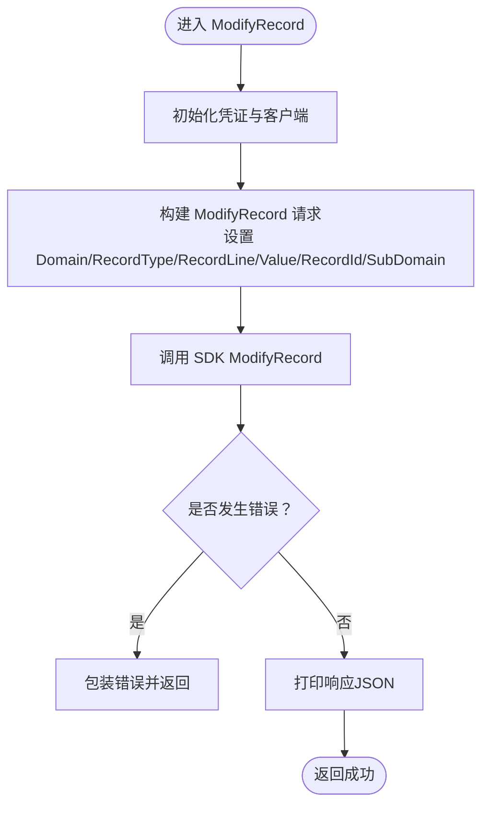
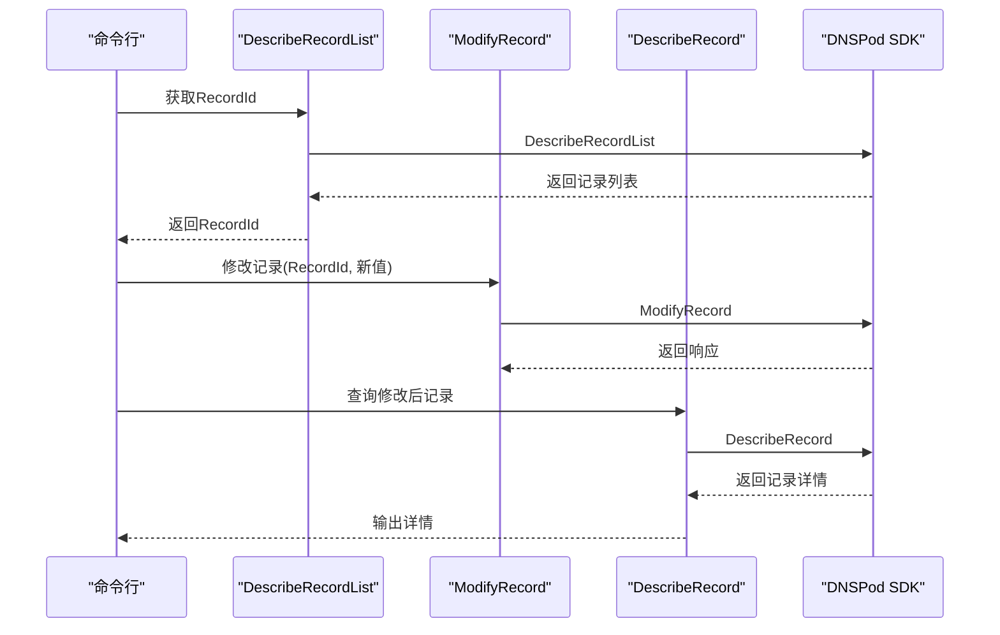
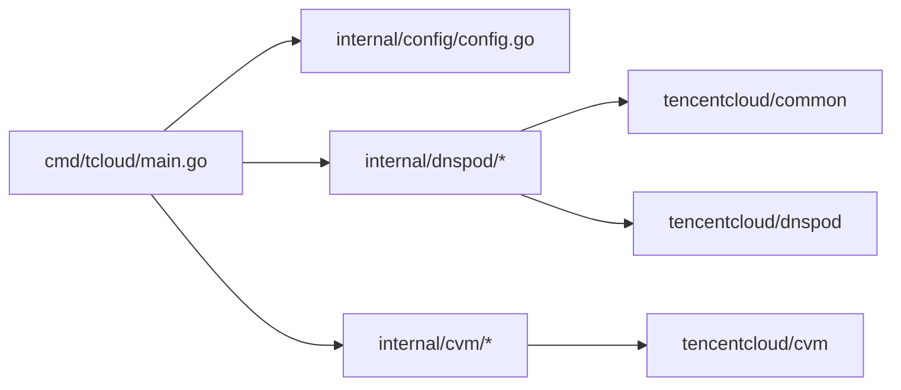

# DNS记录修改

<cite>
**本文引用的文件**
- [cmd/tcloud/main.go](file://cmd/tcloud/main.go)
- [internal/dnspod/modify_record.go](file://internal/dnspod/modify_record.go)
- [internal/dnspod/describe_record.go](file://internal/dnspod/describe_record.go)
- [internal/dnspod/describe_record_list.go](file://internal/dnspod/describe_record_list.go)
- [internal/config/config.go](file://internal/config/config.go)
- [internal/cvm/describe_instances.go](file://internal/cvm/describe_instances.go)
- [internal/cvm/run_instances.go](file://internal/cvm/run_instances.go)
- [go.mod](file://go.mod)
</cite>

## 目录
1. [简介](#简介)
2. [项目结构](#项目结构)
3. [核心组件](#核心组件)
4. [架构总览](#架构总览)
5. [详细组件分析](#详细组件分析)
6. [依赖分析](#依赖分析)
7. [性能考虑](#性能考虑)
8. [故障排查指南](#故障排查指南)
9. [结论](#结论)
10. [附录](#附录)

## 简介
本文件围绕DNS记录修改功能进行深入技术文档化，重点解释ModifyRecord函数的实现机制与调用链路，覆盖A记录修改流程、参数校验与安全检查、原子性与回滚思路、批量与条件修改建议、生效时间与传播延迟、备份与验证策略，以及常见错误与解决方案。文档基于仓库中的实际代码实现进行分析，确保内容与实现一致。

## 项目结构
该项目采用模块化分层组织：
- cmd/tcloud：命令行入口，负责解析用户命令、加载配置、编排业务流程
- internal/dnspod：DNSPod相关操作封装（查询记录、查询列表、修改记录）
- internal/config：配置加载与JSON打印工具
- internal/cvm：CVM实例管理（创建、查询、销毁），用于一键部署/回收场景
- go.mod：依赖声明

图表来源
- [cmd/tcloud/main.go:12-196](file://cmd/tcloud/main.go#L12-L196)
- [internal/dnspod/modify_record.go:14-41](file://internal/dnspod/modify_record.go#L14-L41)
- [internal/dnspod/describe_record.go:14-37](file://internal/dnspod/describe_record.go#L14-L37)
- [internal/dnspod/describe_record_list.go:14-46](file://internal/dnspod/describe_record_list.go#L14-L46)
- [internal/config/config.go:30-69](file://internal/config/config.go#L30-L69)
- [internal/cvm/run_instances.go:14-91](file://internal/cvm/run_instances.go#L14-L91)
- [internal/cvm/describe_instances.go:15-64](file://internal/cvm/describe_instances.go#L15-L64)

章节来源
- [cmd/tcloud/main.go:12-196](file://cmd/tcloud/main.go#L12-L196)
- [go.mod:1-10](file://go.mod#L1-10)

## 核心组件
- ModifyRecord：通过腾讯云DNSPod SDK修改指定记录的值（A记录），返回标准响应或错误
- DescribeRecord：查询单条记录详情，便于修改前后对比
- DescribeRecordList：查询记录列表并提取第一条记录的RecordId，作为修改目标
- LoadConfig：从配置文件加载密钥、区域、域名、子域等必要参数
- RunInstances/DescribeInstances：CVM相关能力，支撑一键部署/回收流程

章节来源
- [internal/dnspod/modify_record.go:14-41](file://internal/dnspod/modify_record.go#L14-L41)
- [internal/dnspod/describe_record.go:14-37](file://internal/dnspod/describe_record.go#L14-L37)
- [internal/dnspod/describe_record_list.go:14-46](file://internal/dnspod/describe_record_list.go#L14-L46)
- [internal/config/config.go:30-59](file://internal/config/config.go#L30-L59)
- [internal/cvm/run_instances.go:14-91](file://internal/cvm/run_instances.go#L14-L91)
- [internal/cvm/describe_instances.go:15-64](file://internal/cvm/describe_instances.go#L15-L64)

## 架构总览
命令行入口根据用户输入选择命令，加载配置后调用对应模块。以“modify”为例，先通过DescribeRecordList获取RecordId，再调用ModifyRecord修改A记录值；“deploy/undeploy”则串联CVM与DNSPod，形成端到端的自动化流程。

图表来源
- [cmd/tcloud/main.go:57-74](file://cmd/tcloud/main.go#L57-L74)
- [internal/dnspod/describe_record_list.go:14-46](file://internal/dnspod/describe_record_list.go#L14-L46)
- [internal/dnspod/modify_record.go:14-41](file://internal/dnspod/modify_record.go#L14-L41)

## 详细组件分析

### ModifyRecord 函数实现机制
- 输入参数：配置对象、记录ID、新的记录值
- 客户端初始化：使用配置中的SecretID/SecretKey、Endpoint、Region等构造客户端
- 请求构建：设置域名、记录类型(A)、线路(默认)、记录值、RecordId、子域名
- 调用与错误处理：区分SDK错误与通用请求错误，统一包装返回
- 输出：打印标准化的响应JSON

图表来源
- [internal/dnspod/modify_record.go:14-41](file://internal/dnspod/modify_record.go#L14-L41)

章节来源
- [internal/dnspod/modify_record.go:14-41](file://internal/dnspod/modify_record.go#L14-L41)

### A记录修改流程
- 前置步骤：通过DescribeRecordList获取RecordId，或在命令行中直接传入
- 执行修改：调用ModifyRecord，将RecordId与新值传递给SDK
- 结果确认：调用DescribeRecord核对修改后的记录值

图表来源
- [cmd/tcloud/main.go:57-74](file://cmd/tcloud/main.go#L57-L74)
- [internal/dnspod/describe_record_list.go:14-46](file://internal/dnspod/describe_record_list.go#L14-L46)
- [internal/dnspod/modify_record.go:14-41](file://internal/dnspod/modify_record.go#L14-L41)
- [internal/dnspod/describe_record.go:14-37](file://internal/dnspod/describe_record.go#L14-L37)

章节来源
- [cmd/tcloud/main.go:57-74](file://cmd/tcloud/main.go#L57-L74)
- [internal/dnspod/describe_record_list.go:14-46](file://internal/dnspod/describe_record_list.go#L14-L46)
- [internal/dnspod/describe_record.go:14-37](file://internal/dnspod/describe_record.go#L14-L37)

### 参数验证与安全检查
- 配置校验：LoadConfig会检查密钥字段是否为空，避免空凭据导致的后续调用失败
- 请求参数：ModifyRecord固定设置记录类型为A、线路为默认，记录值由调用方提供
- 错误分类：区分SDK错误与通用网络错误，便于定位问题来源
- 安全建议（基于实现现状）：
  - 当前实现未对记录值进行格式校验（例如IP合法性）。建议在调用前增加格式校验与白名单控制
  - 对RecordId进行存在性与权限校验（可通过DescribeRecord确认）
  - 对敏感操作增加二次确认与审计日志

章节来源
- [internal/config/config.go:54-56](file://internal/config/config.go#L54-L56)
- [internal/dnspod/modify_record.go:22-28](file://internal/dnspod/modify_record.go#L22-L28)

### 原子性保证与回滚机制
- 现状：ModifyRecord为单次API调用，未提供事务级原子性保证
- 回滚思路：
  - 修改前先DescribeRecord保存当前值
  - 修改失败时使用保存的值再次调用ModifyRecord进行回滚
  - 在“undeploy”流程中，通过将记录指向0.0.0.0实现快速降级
- 建议：
  - 将“读取→修改→校验→回滚”的过程封装为原子操作
  - 引入幂等键与重试策略，避免重复修改造成的影响

章节来源
- [cmd/tcloud/main.go:175-180](file://cmd/tcloud/main.go#L175-L180)
- [internal/dnspod/describe_record.go:14-37](file://internal/dnspod/describe_record.go#L14-L37)

### 批量修改与条件修改
- 批量修改：当前ModifyRecord仅支持单条记录修改。建议扩展为批量接口，按RecordId列表循环调用ModifyRecord，并收集每个结果
- 条件修改：当前未实现条件判断（如仅当记录值不等于目标值时才修改）。可在调用前先DescribeRecord比较值，满足条件后再调用ModifyRecord
- 幂等与去重：建议引入外部幂等键（如UUID），避免重复提交导致的多次修改

章节来源
- [internal/dnspod/modify_record.go:14-41](file://internal/dnspod/modify_record.go#L14-L41)
- [internal/dnspod/describe_record.go:14-37](file://internal/dnspod/describe_record.go#L14-L37)

### 生效时间、缓存清理与传播延迟
- 生效时间：DNS记录修改后立即生效，但具体解析可见性取决于上游缓存与递归服务器刷新周期
- 缓存清理：当前实现未包含缓存清理逻辑。建议在修改后触发缓存刷新（如通过DNSPod提供的缓存刷新接口或第三方工具）
- 传播延迟：不同DNS服务商与递归服务器的缓存刷新时间不同，通常在数秒至数十分钟之间
- 建议：
  - 修改后主动查询验证（如DescribeRecord）
  - 使用dig/nslookup等工具跨地域验证解析结果
  - 在高并发场景下增加重试与退避策略

章节来源
- [internal/dnspod/describe_record.go:14-37](file://internal/dnspod/describe_record.go#L14-L37)

### 修改前备份与修改后验证
- 备份策略：
  - 修改前调用DescribeRecord获取当前记录详情，保存关键字段（如RecordId、Value、Line等）
  - 将备份信息写入本地文件或外部存储，便于回滚
- 验证方法：
  - 修改后再次调用DescribeRecord核对值
  - 使用dig/nslookup等工具进行跨地域验证
  - 在“deploy/undeploy”流程中，明确打印修改前后对比

章节来源
- [cmd/tcloud/main.go:109-126](file://cmd/tcloud/main.go#L109-L126)
- [cmd/tcloud/main.go:182-186](file://cmd/tcloud/main.go#L182-L186)
- [internal/dnspod/describe_record.go:14-37](file://internal/dnspod/describe_record.go#L14-L37)

### 常见修改错误与解决方案
- 配置缺失：SecretID/SecretKey为空会导致认证失败
  - 解决：检查配置文件，确保密钥字段非空
- 记录不存在：RecordId无效或已被删除
  - 解决：重新调用DescribeRecordList获取最新RecordId
- 权限不足：账号缺少DNSPod权限
  - 解决：检查CAM策略与授权范围
- 请求错误：网络异常或SDK错误
  - 解决：重试、检查Endpoint与Region配置
- 值格式错误：记录值不符合A记录要求
  - 解决：在调用前进行IP合法性校验

章节来源
- [internal/config/config.go:54-56](file://internal/config/config.go#L54-L56)
- [internal/dnspod/modify_record.go:31-36](file://internal/dnspod/modify_record.go#L31-L36)

## 依赖分析
- 外部SDK：tencentcloud-sdk-go（common、cvm、dnspod）
- 内部模块：config、dnspod、cvm
- 依赖关系：main.go依赖config与dnspod；dnspod依赖config；cvm独立于dnspod

图表来源
- [go.mod:5-9](file://go.mod#L5-L9)
- [cmd/tcloud/main.go:7-9](file://cmd/tcloud/main.go#L7-L9)

章节来源
- [go.mod:1-10](file://go.mod#L1-L10)
- [cmd/tcloud/main.go:7-9](file://cmd/tcloud/main.go#L7-L9)

## 性能考虑
- API调用频率：单条记录修改为O(1)，批量修改需注意速率限制
- 重试策略：对瞬时错误增加指数退避重试
- 并发控制：批量修改时使用限流器避免触发风控
- 日志与监控：记录每次修改的上下文（RecordId、旧值、新值、时间戳）

## 故障排查指南
- 配置问题
  - 症状：加载配置失败或密钥为空
  - 排查：检查配置文件路径与字段
- 认证失败
  - 症状：SDK报错或权限不足
  - 排查：确认SecretID/SecretKey正确，检查CAM策略
- 记录不存在
  - 症状：DescribeRecordList返回空或错误
  - 排查：确认域名、子域、区域配置正确
- 修改失败
  - 症状：ModifyRecord返回错误
  - 排查：查看错误类型（SDK错误/网络错误），重试或回滚

章节来源
- [internal/config/config.go:54-56](file://internal/config/config.go#L54-L56)
- [internal/dnspod/modify_record.go:31-36](file://internal/dnspod/modify_record.go#L31-L36)
- [internal/dnspod/describe_record_list.go:27-31](file://internal/dnspod/describe_record_list.go#L27-L31)

## 结论
本实现提供了简洁可靠的DNS记录修改能力，通过DescribeRecordList获取目标RecordId，再调用ModifyRecord完成A记录值的更新。当前版本强调易用性与可观察性，建议在生产环境中补充参数校验、幂等控制、回滚机制与缓存刷新策略，以提升安全性与稳定性。

## 附录
- 一键部署/回收流程
  - deploy：创建实例→获取公网IP→查询修改前记录→修改DNS→查询修改后记录
  - undeploy：查找实例→查询销毁前记录→销毁实例→修改DNS为0.0.0.0→查询修改后记录
- 命令参考
  - list/describe：查询记录列表与详情
  - modify：修改记录值
  - run-instances/deploy/destroy/undeploy：CVM相关操作

章节来源
- [cmd/tcloud/main.go:85-132](file://cmd/tcloud/main.go#L85-L132)
- [cmd/tcloud/main.go:147-190](file://cmd/tcloud/main.go#L147-L190)