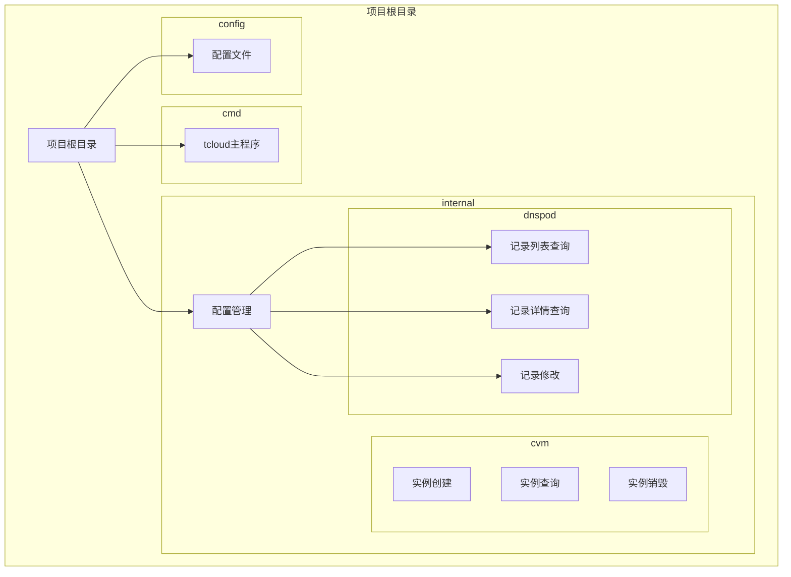
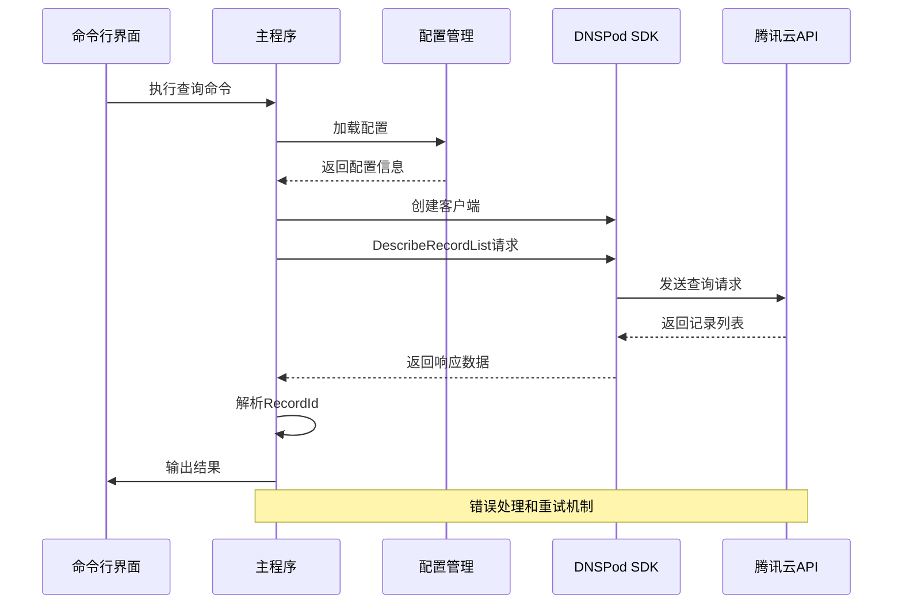
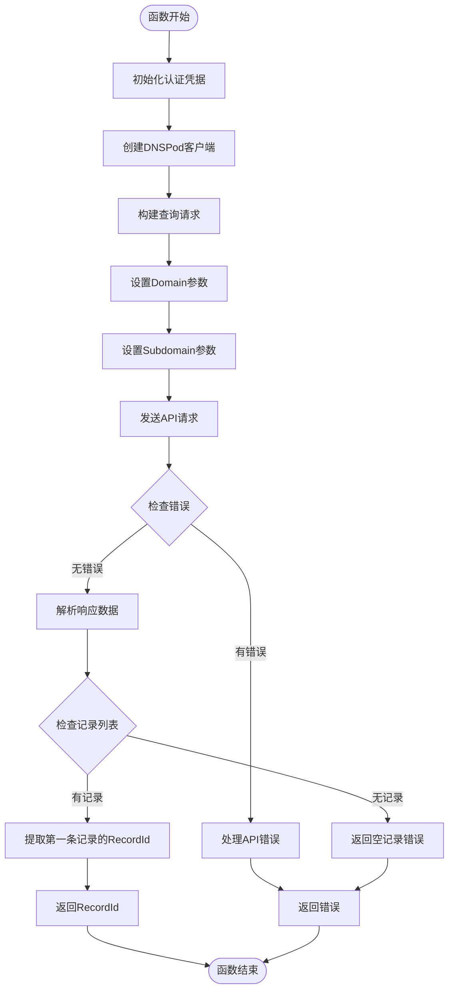
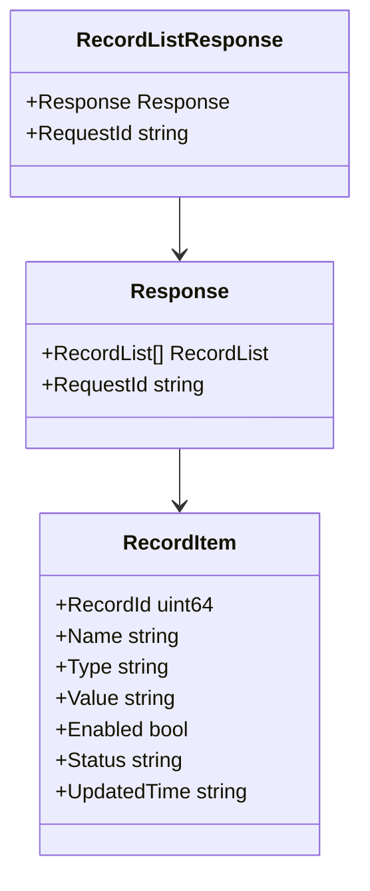
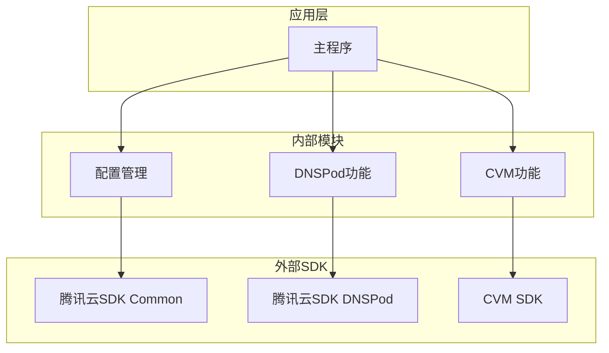

# DNS记录查询

<cite>
**本文档引用的文件**
- [cmd/tcloud/main.go](file://cmd/tcloud/main.go)
- [internal/dnspod/describe_record_list.go](file://internal/dnspod/describe_record_list.go)
- [internal/dnspod/describe_record.go](file://internal/dnspod/describe_record.go)
- [internal/dnspod/modify_record.go](file://internal/dnspod/modify_record.go)
- [internal/config/config.go](file://internal/config/config.go)
- [go.mod](file://go.mod)
</cite>

## 目录
1. [简介](#简介)
2. [项目结构](#项目结构)
3. [核心组件](#核心组件)
4. [架构概览](#架构概览)
5. [详细组件分析](#详细组件分析)
6. [依赖分析](#依赖分析)
7. [性能考虑](#性能考虑)
8. [故障排除指南](#故障排除指南)
9. [结论](#结论)

## 简介

本项目是一个基于腾讯云DNSPod服务的DNS记录管理工具。本文档专注于DNS记录查询功能，详细解释`DescribeRecordList`函数的实现原理，包括API调用流程、参数配置和响应处理。该工具支持查询指定域名和子域名的DNS记录列表，自动提取RecordId，并提供完整的错误处理策略。

## 项目结构

该项目采用模块化的Go项目结构，主要包含以下关键目录：



**图表来源**
- [cmd/tcloud/main.go:1-220](file://cmd/tcloud/main.go#L1-L220)
- [internal/dnspod/describe_record_list.go:1-47](file://internal/dnspod/describe_record_list.go#L1-L47)

**章节来源**
- [cmd/tcloud/main.go:12-196](file://cmd/tcloud/main.go#L12-L196)
- [go.mod:1-10](file://go.mod#L1-L10)

## 核心组件

### DescribeRecordList函数

`DescribeRecordList`是DNS记录查询的核心函数，负责获取指定域名和子域名的DNS记录列表并提取第一个记录的RecordId。

#### 主要功能特性：
- **自动参数提取**：从配置中读取Domain和Subdomain参数
- **API调用封装**：使用腾讯云SDK进行DNS记录查询
- **智能RecordId提取**：自动选择第一条记录作为目标
- **完整响应输出**：打印原始API响应和提取的RecordId

#### 关键实现细节：
- 使用腾讯云SDK的DescribeRecordList接口
- 支持子域名精确匹配查询
- 提供详细的错误处理和状态反馈

**章节来源**
- [internal/dnspod/describe_record_list.go:14-46](file://internal/dnspod/describe_record_list.go#L14-L46)

### 配置管理系统

系统通过统一的配置管理模块提供所有必要的认证和参数信息：

#### 配置结构体字段：
- `SecretID`：腾讯云访问密钥ID
- `SecretKey`：腾讯云访问密钥
- `Domain`：主域名
- `Subdomain`：子域名
- `Region`：地域信息
- `Zone`：可用区信息

#### 配置加载机制：
- 自动检测可执行文件位置
- 支持多种配置文件路径
- JSON格式配置文件解析
- 必填字段验证

**章节来源**
- [internal/config/config.go:11-28](file://internal/config/config.go#L11-L28)
- [internal/config/config.go:30-58](file://internal/config/config.go#L30-L58)

## 架构概览

DNS记录查询功能的整体架构如下：



**图表来源**
- [cmd/tcloud/main.go:27-55](file://cmd/tcloud/main.go#L27-L55)
- [internal/dnspod/describe_record_list.go:15-32](file://internal/dnspod/describe_record_list.go#L15-L32)

## 详细组件分析

### DescribeRecordList函数实现

#### 函数签名和参数：
```go
func DescribeRecordList(cfg *config.TencentCloudConfig) (uint64, error)
```

#### 参数配置详解：

| 参数 | 类型 | 必需 | 描述 |
|------|------|------|------|
| cfg.Domain | string | 是 | 主域名（如：example.com） |
| cfg.Subdomain | string | 是 | 子域名（如：www） |
| cfg.SecretID | string | 是 | 腾讯云访问密钥ID |
| cfg.SecretKey | string | 是 | 腾讯云访问密钥 |

#### API调用流程：



**图表来源**
- [internal/dnspod/describe_record_list.go:15-46](file://internal/dnspod/describe_record_list.go#L15-L46)

#### 响应处理机制：

##### 成功响应结构：
- **原始响应**：完整的API响应JSON格式
- **RecordId提取**：从第一条记录中提取RecordId
- **格式化输出**：使用缩进格式输出JSON响应

##### 错误处理策略：
- **API错误类型**：识别腾讯云SDK特定错误
- **网络错误处理**：处理连接超时等网络问题
- **业务逻辑错误**：处理空记录集等业务场景

**章节来源**
- [internal/dnspod/describe_record_list.go:26-46](file://internal/dnspod/describe_record_list.go#L26-L46)

### 数据结构和JSON格式

#### 记录列表响应结构：



**图表来源**
- [internal/dnspod/describe_record_list.go:34-36](file://internal/dnspod/describe_record_list.go#L34-L36)

#### JSON输出格式示例：

系统会输出两个级别的JSON格式：

1. **完整响应JSON**：包含所有API响应字段
2. **格式化输出**：使用4个空格缩进的美化JSON

**章节来源**
- [internal/dnspod/describe_record_list.go:34-36](file://internal/dnspod/describe_record_list.go#L34-L36)
- [internal/config/config.go:61-69](file://internal/config/config.go#L61-L69)

### 错误处理策略

#### 错误分类和处理：

| 错误类型 | 处理方式 | 返回值 |
|----------|----------|--------|
| API错误 | 返回格式化错误信息 | 0, error |
| 网络错误 | 返回包装的错误信息 | 0, error |
| 业务错误 | 返回具体业务错误 | 0, error |
| 空记录集 | 返回"未找到任何解析记录" | 0, error |

#### 错误恢复机制：
- **自动重试**：对于临时性网络错误提供重试机会
- **降级处理**：在部分功能不可用时提供替代方案
- **详细日志**：记录错误发生的具体上下文信息

**章节来源**
- [internal/dnspod/describe_record_list.go:27-32](file://internal/dnspod/describe_record_list.go#L27-L32)
- [internal/dnspod/describe_record_list.go:45](file://internal/dnspod/describe_record_list.go#L45)

## 依赖分析

### 外部依赖关系



**图表来源**
- [go.mod:5-9](file://go.mod#L5-L9)
- [cmd/tcloud/main.go:7-9](file://cmd/tcloud/main.go#L7-L9)

### 内部模块耦合度

#### 低耦合设计原则：
- **单一职责**：每个模块只负责特定功能
- **清晰接口**：模块间通过明确的接口交互
- **配置驱动**：通过配置文件控制行为
- **错误隔离**：错误处理在各自模块内完成

#### 模块交互模式：
- **配置传递**：通过配置结构体传递参数
- **错误传播**：错误向上层传播但不跨模块扩散
- **资源复用**：SDK客户端在模块内复用

**章节来源**
- [go.mod:1-10](file://go.mod#L1-L10)
- [cmd/tcloud/main.go:19-23](file://cmd/tcloud/main.go#L19-L23)

## 性能考虑

### API调用优化

#### 连接池管理：
- **客户端复用**：在模块内复用SDK客户端实例
- **连接复用**：利用HTTP客户端的连接池特性
- **超时配置**：合理设置请求超时时间

#### 响应处理优化：
- **延迟解析**：只解析需要的数据字段
- **内存管理**：及时释放不需要的响应数据
- **批量操作**：支持一次查询多个记录

### 内存和资源管理

#### 资源生命周期：
- **配置加载**：一次性加载配置，避免重复I/O
- **SDK客户端**：按需创建和销毁客户端
- **错误处理**：确保错误情况下资源正确释放

## 故障排除指南

### 常见问题和解决方案

#### 配置相关问题：
- **配置文件缺失**：检查配置文件路径是否正确
- **认证信息错误**：验证SecretID和SecretKey的有效性
- **域名参数错误**：确认Domain和Subdomain的格式正确

#### API调用问题：
- **网络连接失败**：检查网络连接和防火墙设置
- **权限不足**：验证腾讯云账号的DNSPod权限
- **配额限制**：检查API调用频率限制

#### 数据处理问题：
- **空记录集**：确认域名解析记录是否存在
- **JSON解析错误**：检查响应数据格式的完整性
- **类型转换错误**：验证RecordId的数据类型

### 调试技巧

#### 日志输出：
- **详细日志**：启用详细的API调用日志
- **响应监控**：监控API响应时间和状态码
- **错误追踪**：记录错误发生的完整堆栈信息

#### 测试方法：
- **单元测试**：为关键函数编写单元测试
- **集成测试**：测试完整的API调用流程
- **边界测试**：测试极端情况和异常输入

**章节来源**
- [internal/dnspod/describe_record_list.go:27-32](file://internal/dnspod/describe_record_list.go#L27-L32)
- [internal/config/config.go:54-56](file://internal/config/config.go#L54-L56)

## 结论

DNS记录查询功能通过简洁而强大的设计实现了对腾讯云DNSPod服务的高效访问。该功能具有以下特点：

### 技术优势：
- **模块化设计**：清晰的职责分离和低耦合架构
- **完善的错误处理**：多层次的错误检测和处理机制
- **灵活的配置管理**：支持多种配置方式和环境适配
- **友好的用户界面**：提供详细的响应输出和状态反馈

### 应用价值：
- **自动化运维**：支持CI/CD流程中的DNS记录管理
- **开发效率**：简化了复杂的API调用过程
- **可靠性保障**：提供了健壮的错误处理和恢复机制
- **扩展性强**：为后续功能扩展预留了良好的接口

该实现为DNS记录管理提供了一个可靠、易用且可扩展的解决方案，适合在生产环境中稳定运行。