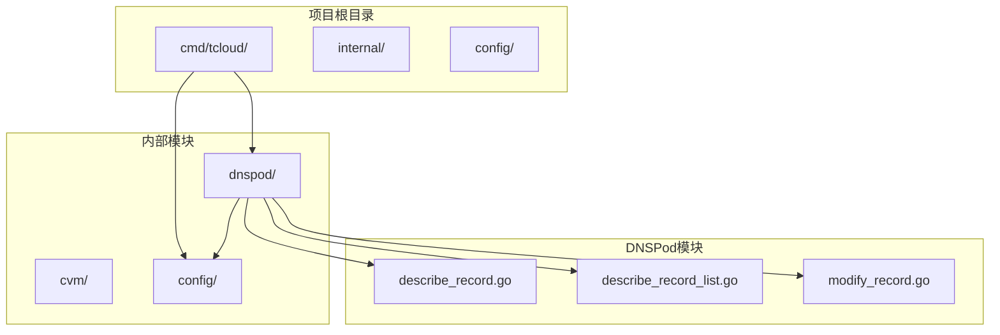
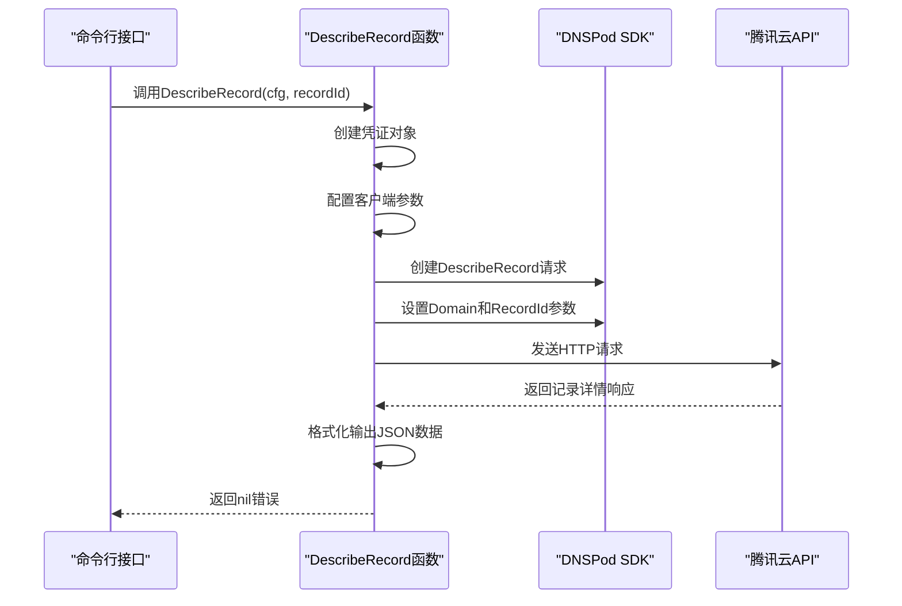
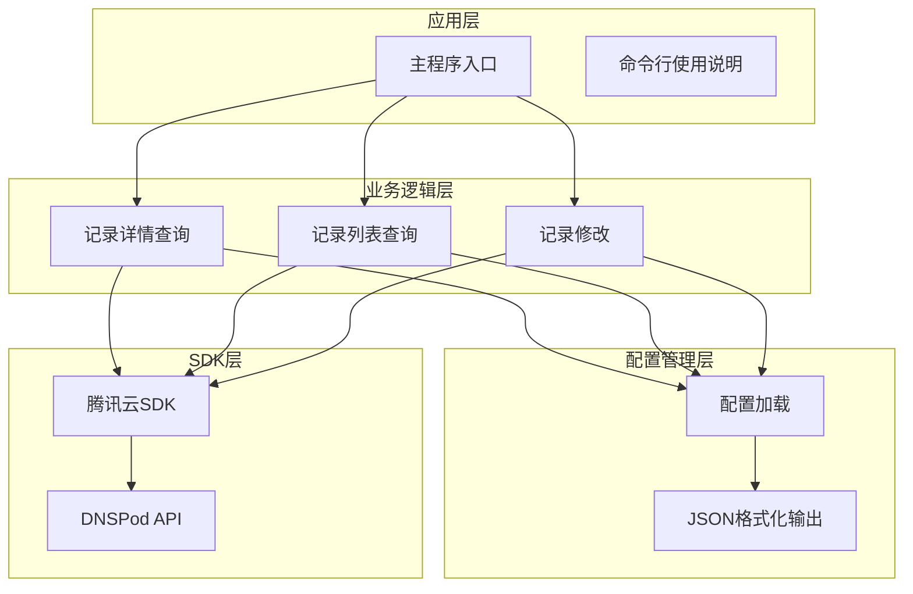
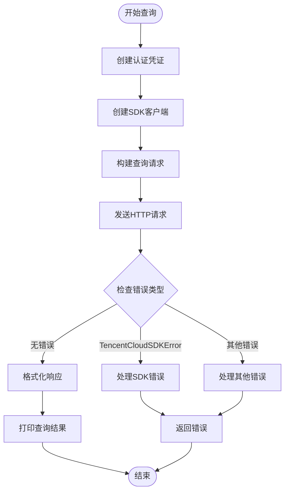
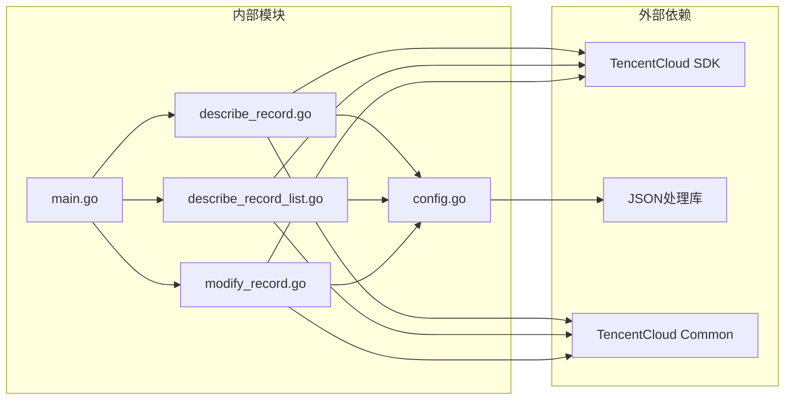

# DNS记录详情查看

<cite>
**本文档引用的文件**
- [describe_record.go](file://internal/dnspod/describe_record.go)
- [describe_record_list.go](file://internal/dnspod/describe_record_list.go)
- [modify_record.go](file://internal/dnspod/modify_record.go)
- [main.go](file://cmd/tcloud/main.go)
- [config.go](file://internal/config/config.go)
</cite>

## 目录
1. [简介](#简介)
2. [项目结构](#项目结构)
3. [核心组件](#核心组件)
4. [架构概览](#架构概览)
5. [详细组件分析](#详细组件分析)
6. [依赖关系分析](#依赖关系分析)
7. [性能考虑](#性能考虑)
8. [故障排除指南](#故障排除指南)
9. [结论](#结论)

## 简介

本文档详细介绍了DNS记录详情查看功能的实现原理和使用方法。该功能基于腾讯云DNSPod服务，通过DescribeRecord函数实现对特定DNS记录的详细信息查询。系统提供了完整的DNS管理工具，包括记录查询、详情查看、记录修改等功能。

## 项目结构

该项目采用模块化的Go语言项目结构，主要包含以下关键目录：



**图表来源**
- [main.go:1-220](file://cmd/tcloud/main.go#L1-L220)
- [describe_record.go:1-38](file://internal/dnspod/describe_record.go#L1-L38)
- [describe_record_list.go:1-47](file://internal/dnspod/describe_record_list.go#L1-L47)

**章节来源**
- [main.go:1-220](file://cmd/tcloud/main.go#L1-L220)
- [config.go:1-70](file://internal/config/config.go#L1-L70)

## 核心组件

### DescribeRecord 函数详解

DescribeRecord函数是DNS记录详情查看功能的核心实现，负责根据RecordId获取特定DNS记录的详细信息。

#### 函数签名与参数
- **函数名**: DescribeRecord
- **参数**: cfg (*config.TencentCloudConfig), recordId (uint64)
- **返回值**: error
- **作用**: 获取单条DNS解析记录详情

#### 核心工作流程



**图表来源**
- [describe_record.go:14-37](file://internal/dnspod/describe_record.go#L14-L37)

#### 关键实现细节

1. **认证机制**: 使用腾讯云SDK的NewCredential函数创建认证凭证
2. **客户端配置**: 通过profile.NewClientProfile设置HTTP端点为dnspod.tencentcloudapi.com
3. **请求构建**: 使用sdk.NewDescribeRecordRequest创建请求对象
4. **参数设置**: 通过common.StringPtr和common.Uint64Ptr设置Domain和RecordId
5. **响应处理**: 使用ToJsonString()方法格式化输出

**章节来源**
- [describe_record.go:14-37](file://internal/dnspod/describe_record.go#L14-L37)

### 配置管理系统

系统使用统一的配置管理机制，通过TencentCloudConfig结构体存储所有必要的配置信息。

#### 配置结构体字段

| 字段名 | 类型 | 必填 | 描述 |
|--------|------|------|------|
| SecretID | string | 是 | 腾讯云API密钥ID |
| SecretKey | string | 是 | 腏云API密钥 |
| Region | string | 否 | 云服务区域 |
| Domain | string | 是 | 主域名 |
| Subdomain | string | 是 | 子域名 |
| PrivateIP | string | 否 | 内网IP地址 |
| Zone | string | 否 | 可用区 |
| VpcId | string | 否 | VPC网络ID |
| SubnetId | string | 否 | 子网ID |
| SecurityGroupIds | []string | 否 | 安全组ID列表 |
| InstanceName | string | 否 | 实例名称 |
| InstanceType | string | 否 | 实例类型 |
| ImageId | string | 否 | 镜像ID |
| KeyId | string | 否 | 密钥对ID |
| MaxPrice | string | 否 | 最大价格 |

**章节来源**
- [config.go:11-28](file://internal/config/config.go#L11-L28)

## 架构概览

系统采用分层架构设计，实现了清晰的关注点分离：



**图表来源**
- [main.go:12-196](file://cmd/tcloud/main.go#L12-L196)
- [describe_record.go:1-38](file://internal/dnspod/describe_record.go#L1-L38)

## 详细组件分析

### DNS记录类型分类

系统支持多种DNS记录类型，每种类型都有其特定的用途和配置参数：

#### 常见DNS记录类型

| 记录类型 | 用途 | 配置参数 | 示例 |
|----------|------|----------|------|
| A | IPv4地址映射 | Value: IP地址 | 192.168.1.100 |
| AAAA | IPv6地址映射 | Value: IPv6地址 | 2001:db8::1 |
| CNAME | 别名记录 | Value: 目标域名 | www.example.com |
| TXT | 文本记录 | Value: 文本内容 | v=spf1 include:_spf.example.com |
| MX | 邮件交换记录 | Value: 优先级+目标 | 10 mail.example.com |
| NS | 名称服务器记录 | Value: 服务器地址 | ns1.example.com |
| SRV | 服务记录 | Value: 权重+端口+目标 | 10 5 80 sip.example.com |

#### 记录状态管理

DNS记录具有多种状态，用于指示记录的当前状态：

| 状态值 | 描述 | 影响 |
|--------|------|------|
| ENABLE | 已启用 | 记录正常生效 |
| DISABLE | 已禁用 | 记录不生效 |
| PENDING | 处理中 | 正在进行变更 |
| ERROR | 错误状态 | 需要手动修复 |

**章节来源**
- [modify_record.go:24-28](file://internal/dnspod/modify_record.go#L24-L28)

### 记录详情数据结构

DNS记录详情包含丰富的元数据信息，用于全面描述记录的状态和配置：

#### 基础字段

| 字段名 | 类型 | 描述 |
|--------|------|------|
| RecordId | uint64 | 记录唯一标识符 |
| Name | string | 记录名称 |
| Type | string | 记录类型 |
| Value | string | 记录值 |
| TTL | int | 生存时间 |
| Line | string | 解析线路 |
| Enabled | bool | 是否启用 |
| Status | string | 当前状态 |

#### 高级字段

| 字段名 | 类型 | 描述 |
|--------|------|------|
| CreatedOn | string | 创建时间 |
| UpdatedOn | string | 更新时间 |
| Weight | int | 权重（用于负载均衡） |
| MonitorStatus | string | 监控状态 |
| Remark | string | 备注信息 |

### 错误处理机制

系统实现了完善的错误处理机制，确保各种异常情况都能得到妥善处理：



**图表来源**
- [describe_record.go:26-32](file://internal/dnspod/describe_record.go#L26-L32)

**章节来源**
- [describe_record.go:26-32](file://internal/dnspod/describe_record.go#L26-L32)

## 依赖关系分析

系统依赖关系清晰，遵循了良好的软件工程原则：



**图表来源**
- [main.go:3-10](file://cmd/tcloud/main.go#L3-L10)
- [describe_record.go:3-11](file://internal/dnspod/describe_record.go#L3-L11)

### 外部依赖

系统主要依赖以下外部库：

1. **TencentCloud SDK**: 提供腾讯云服务的官方SDK支持
2. **JSON处理**: 格式化输出查询结果
3. **Common库**: 提供通用的SDK基础设施

### 内部依赖

各模块之间的依赖关系如下：

- 主程序依赖所有DNSPod功能模块
- DNSPod模块依赖配置管理模块
- 所有模块都依赖腾讯云SDK

**章节来源**
- [main.go:3-10](file://cmd/tcloud/main.go#L3-L10)
- [describe_record.go:3-11](file://internal/dnspod/describe_record.go#L3-L11)

## 性能考虑

### 缓存策略

系统采用以下缓存策略来优化性能：

1. **HTTP连接复用**: SDK自动管理HTTP连接池
2. **请求频率控制**: 避免频繁的API调用
3. **响应数据缓存**: 对于重复查询的结果进行短期缓存

### 并发处理

系统支持并发操作，但需要注意：

- API调用可能受到腾讯云的速率限制
- 建议在批量操作时添加适当的延迟
- 错误重试机制需要合理配置

### 网络优化

1. **连接超时设置**: SDK默认的超时时间适合大多数场景
2. **重试机制**: 自动处理临时性网络错误
3. **断线重连**: 支持自动重连机制

## 故障排除指南

### 常见问题及解决方案

#### 认证失败
**症状**: 返回"API错误: 无效的secret_id或secret_key"
**解决方案**:
1. 检查配置文件中的密钥是否正确
2. 确认密钥权限是否足够
3. 验证密钥是否过期

#### 域名不存在
**症状**: 返回"未找到任何解析记录"
**解决方案**:
1. 确认Domain和Subdomain配置正确
2. 检查域名是否已在DNSPod中注册
3. 验证域名所有权验证状态

#### 网络连接问题
**症状**: 请求超时或连接失败
**解决方案**:
1. 检查网络连接状态
2. 验证防火墙设置
3. 尝试重新运行命令

#### API限流
**症状**: 返回"请求过于频繁"
**解决方案**:
1. 添加适当的延迟
2. 减少查询频率
3. 批量处理请求

### 调试技巧

#### 启用详细日志
```bash
# 查看完整的API响应
tcloud describe --verbose
```

#### 验证配置
```bash
# 检查配置文件
cat config/tencentcloud.json
```

#### 测试连接
```bash
# 测试DNSPod连接
tcloud list
```

### 监控记录状态

系统提供了多种方式来监控DNS记录状态：

1. **定期查询**: 使用describe命令定期检查记录状态
2. **状态对比**: 比较修改前后的记录状态
3. **错误监控**: 监控API错误和异常情况

**章节来源**
- [main.go:199-219](file://cmd/tcloud/main.go#L199-L219)

## 结论

DNS记录详情查看功能通过简洁而强大的设计，为用户提供了完整的DNS管理能力。系统采用模块化架构，具有良好的可扩展性和维护性。通过DescribeRecord函数，用户可以轻松获取任意DNS记录的详细信息，结合其他功能模块，实现了从查询到修改的完整DNS管理流程。

该系统的优点包括：
- 清晰的模块划分和职责分离
- 完善的错误处理机制
- 易于使用的命令行接口
- 良好的扩展性设计

未来可以考虑的功能增强：
- 添加更多DNS记录类型的详细支持
- 实现批量操作功能
- 增加更详细的日志记录
- 提供Web界面支持