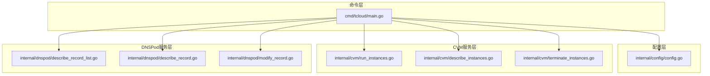
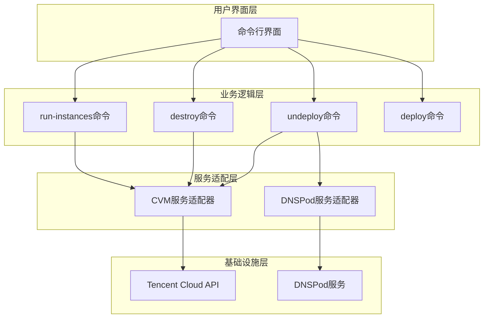
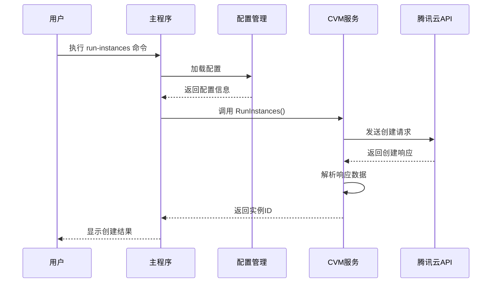
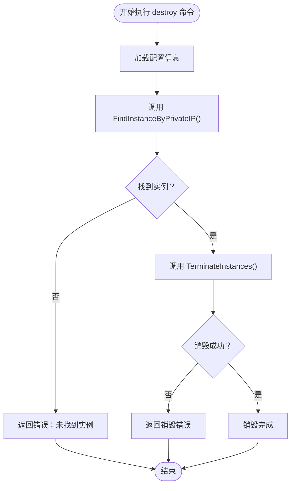
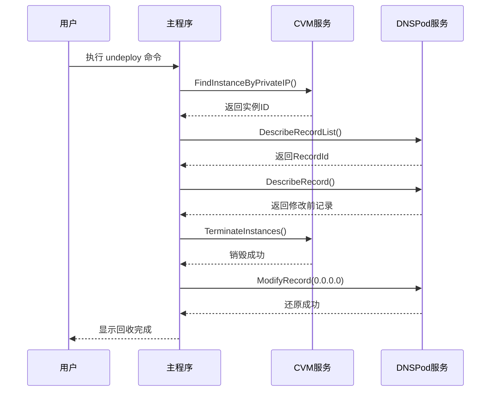
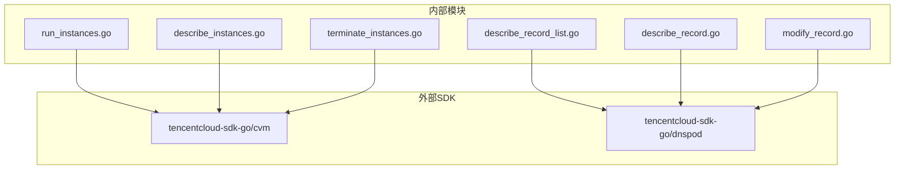
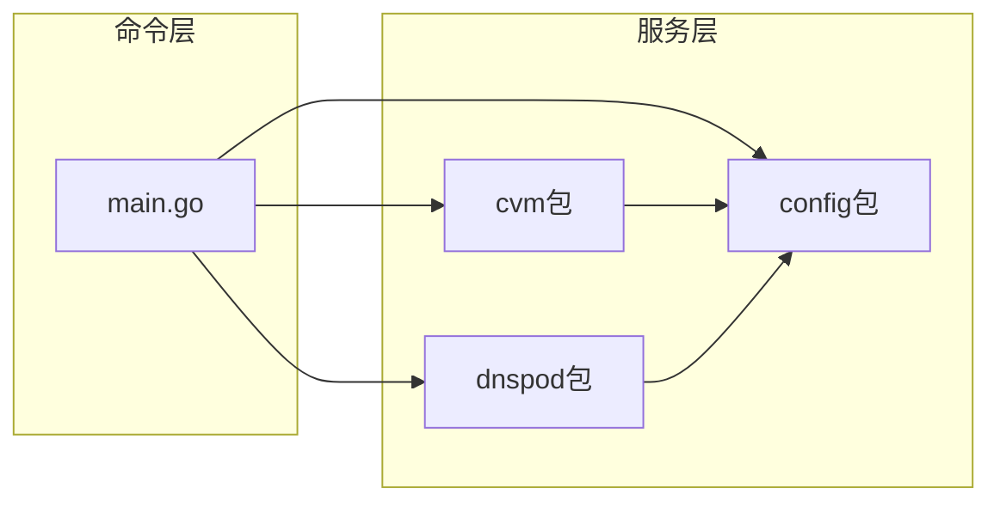
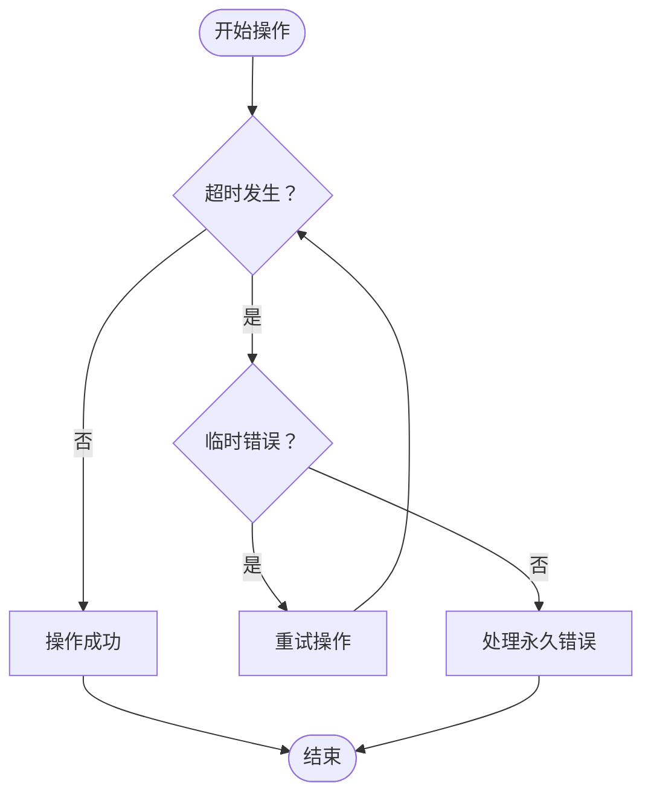

# CVM实例管理命令

<cite>
**本文档引用的文件**
- [cmd/tcloud/main.go](file://cmd/tcloud/main.go)
- [internal/cvm/run_instances.go](file://internal/cvm/run_instances.go)
- [internal/cvm/terminate_instances.go](file://internal/cvm/terminate_instances.go)
- [internal/cvm/describe_instances.go](file://internal/cvm/describe_instances.go)
- [internal/dnspod/describe_record.go](file://internal/dnspod/describe_record.go)
- [internal/dnspod/describe_record_list.go](file://internal/dnspod/describe_record_list.go)
- [internal/dnspod/modify_record.go](file://internal/dnspod/modify_record.go)
- [internal/config/config.go](file://internal/config/config.go)
</cite>

## 目录
1. [简介](#简介)
2. [项目结构](#项目结构)
3. [核心组件](#核心组件)
4. [架构概览](#架构概览)
5. [详细组件分析](#详细组件分析)
6. [依赖关系分析](#依赖关系分析)
7. [性能考虑](#性能考虑)
8. [故障排除指南](#故障排除指南)
9. [安全考虑](#安全考虑)
10. [结论](#结论)

## 简介

本项目是一个基于腾讯云API的CVM（云虚拟机）实例管理工具，提供了完整的命令行接口来管理云上实例。该工具集成了DNSPod服务，实现了从实例创建到DNS解析的完整自动化管理流程。

主要功能包括：
- **run-instances**：创建竞价型CVM实例
- **destroy**：根据内网IP自动查找并销毁实例
- **undeploy**：一键回收机制，包含实例销毁和DNS还原
- **deploy**：一键部署，包含实例创建、公网IP获取和DNS修改

## 项目结构

项目采用模块化的Go语言项目结构，按照功能域进行组织：



**图表来源**
- [cmd/tcloud/main.go:12-196](file://cmd/tcloud/main.go#L12-L196)
- [internal/config/config.go:31-59](file://internal/config/config.go#L31-L59)

**章节来源**
- [cmd/tcloud/main.go:12-196](file://cmd/tcloud/main.go#L12-L196)
- [internal/config/config.go:31-59](file://internal/config/config.go#L31-L59)

## 核心组件

### 配置管理系统

配置系统负责管理腾讯云API访问凭证和各种环境参数：

- **SecretID/SecretKey**：腾讯云API访问密钥
- **Region/Zone**：地域和可用区配置
- **VPC/Subnet**：网络配置
- **域名解析**：DNSPod域名和子域名配置
- **实例规格**：镜像、实例类型、安全组等

### CVM实例管理模块

提供完整的CVM实例生命周期管理功能：

- **实例创建**：支持竞价实例创建
- **实例查询**：支持按ID查询和内网IP查找
- **实例销毁**：安全销毁指定实例

### DNSPod集成模块

实现域名解析的自动化管理：

- **记录查询**：获取DNS记录列表和详情
- **记录修改**：动态更新A记录指向
- **记录还原**：支持将记录还原为0.0.0.0

**章节来源**
- [internal/config/config.go:11-28](file://internal/config/config.go#L11-L28)
- [internal/cvm/run_instances.go:14-91](file://internal/cvm/run_instances.go#L14-L91)
- [internal/dnspod/describe_record_list.go:14-46](file://internal/dnspod/describe_record_list.go#L14-L46)

## 架构概览

系统采用分层架构设计，各层职责清晰分离：



**图表来源**
- [cmd/tcloud/main.go:76-196](file://cmd/tcloud/main.go#L76-L196)
- [internal/cvm/run_instances.go:15-91](file://internal/cvm/run_instances.go#L15-L91)

## 详细组件分析

### run-instances 命令详解

#### 功能概述
run-instances命令用于创建竞价型CVM实例，是整个自动化流程的起点。

#### 实例创建流程



**图表来源**
- [cmd/tcloud/main.go:76-84](file://cmd/tcloud/main.go#L76-L84)
- [internal/cvm/run_instances.go:15-91](file://internal/cvm/run_instances.go#L15-L91)

#### 关键参数配置

| 参数 | 类型 | 描述 | 默认值 |
|------|------|------|--------|
| InstanceChargeType | String | 计费方式 | SPOTPAID（竞价实例） |
| InstanceType | String | 实例规格 | 需要配置 |
| ImageId | String | 镜像ID | 需要配置 |
| Zone | String | 可用区 | 需要配置 |
| VpcId | String | VPC ID | 需要配置 |
| SubnetId | String | 子网ID | 需要配置 |
| PrivateIP | String | 内网IP地址 | 需要配置 |

#### 返回值说明

函数返回两个值：
- **实例ID**：创建成功的实例标识符
- **错误信息**：操作失败时的错误详情

#### 使用示例

```bash
# 基本使用
go run ./cmd/tcloud run-instances

# 查看详细输出
go run ./cmd/tcloud run-instances
```

**章节来源**
- [internal/cvm/run_instances.go:14-91](file://internal/cvm/run_instances.go#L14-L91)
- [cmd/tcloud/main.go:76-84](file://cmd/tcloud/main.go#L76-L84)

### destroy 命令详解

#### 功能概述
destroy命令通过内网IP地址自动查找并销毁对应的CVM实例，提供了一种便捷的实例清理方式。

#### 完整执行流程



**图表来源**
- [cmd/tcloud/main.go:133-146](file://cmd/tcloud/main.go#L133-L146)
- [internal/cvm/describe_instances.go:66-100](file://internal/cvm/describe_instances.go#L66-L100)
- [internal/cvm/terminate_instances.go:14-36](file://internal/cvm/terminate_instances.go#L14-L36)

#### 实例查找算法

系统采用遍历查询的方式查找匹配的实例：

1. **获取所有实例**：调用DescribeInstances API获取全部实例列表
2. **遍历匹配**：逐个检查实例的内网IP地址
3. **精确匹配**：比较内网IP地址字符串是否完全相等
4. **返回结果**：找到匹配实例后立即返回实例ID

#### 错误处理机制

- **配置加载失败**：检查配置文件是否存在和格式正确
- **实例查找失败**：当内网IP不匹配或实例不存在时返回错误
- **销毁操作失败**：API调用错误或权限不足时返回详细错误信息

#### 使用示例

```bash
# 基本使用
go run ./cmd/tcloud destroy

# 需要确保配置文件中的PrivateIP设置正确
```

**章节来源**
- [cmd/tcloud/main.go:133-146](file://cmd/tcloud/main.go#L133-L146)
- [internal/cvm/describe_instances.go:66-100](file://internal/cvm/describe_instances.go#L66-L100)
- [internal/cvm/terminate_instances.go:14-36](file://internal/cvm/terminate_instances.go#L14-L36)

### undeploy 命令详解

#### 功能概述
undeploy命令实现了一键回收机制，包含实例查找、销毁和DNS还原的完整流程。

#### 一键回收流程



**图表来源**
- [cmd/tcloud/main.go:147-191](file://cmd/tcloud/main.go#L147-L191)
- [internal/cvm/describe_instances.go:66-100](file://internal/cvm/describe_instances.go#L66-L100)
- [internal/dnspod/describe_record_list.go:14-46](file://internal/dnspod/describe_record_list.go#L14-L46)
- [internal/dnspod/modify_record.go:14-41](file://internal/dnspod/modify_record.go#L14-L41)

#### 详细执行步骤

1. **实例查找**：根据配置中的内网IP地址查找对应实例
2. **DNS记录获取**：查询域名解析记录的RecordId
3. **DNS还原**：将A记录指向修改为0.0.0.0，实现域名解析失效
4. **实例销毁**：安全销毁目标CVM实例

#### 安全特性

- **双重确认**：先查询DNS记录状态，再执行修改操作
- **顺序执行**：严格按照预定义步骤执行，避免中间状态异常
- **错误回滚**：遇到错误时及时停止，避免部分操作导致的状态不一致

#### 使用示例

```bash
# 一键回收
go run ./cmd/tcloud undeploy

# 将显示详细的执行步骤和结果
```

**章节来源**
- [cmd/tcloud/main.go:147-191](file://cmd/tcloud/main.go#L147-L191)

### deploy 命令详解

虽然文档要求重点分析三个命令，但deploy命令作为完整的部署流程，其工作原理与undeploy类似，只是缺少最后的DNS还原步骤。

#### 工作流程对比

| 步骤 | deploy命令 | undeploy命令 |
|------|------------|--------------|
| 1 | 创建实例 | 查找实例 |
| 2 | 获取公网IP | 获取DNS记录ID |
| 3 | 获取DNS记录ID | 显示销毁前记录 |
| 4 | 显示修改前记录 | 销毁实例 |
| 5 | 修改DNS记录 | 修改DNS记录为0.0.0.0 |
| 6 | 显示修改后记录 | 显示还原后记录 |
| 7 | 显示部署完成 | 显示回收完成 |

**章节来源**
- [cmd/tcloud/main.go:85-132](file://cmd/tcloud/main.go#L85-L132)

## 依赖关系分析

### 外部依赖

系统主要依赖腾讯云官方SDK：



**图表来源**
- [internal/cvm/run_instances.go:8-11](file://internal/cvm/run_instances.go#L8-L11)
- [internal/dnspod/describe_record_list.go:10-11](file://internal/dnspod/describe_record_list.go#L10-L11)

### 内部依赖关系



**图表来源**
- [cmd/tcloud/main.go:7-9](file://cmd/tcloud/main.go#L7-L9)

**章节来源**
- [cmd/tcloud/main.go:7-9](file://cmd/tcloud/main.go#L7-L9)

## 性能考虑

### API调用优化

1. **批量操作**：CVM API支持批量实例操作，可以减少API调用次数
2. **轮询策略**：实例状态查询采用指数退避策略，避免频繁API调用
3. **连接复用**：SDK客户端支持连接池，提高并发性能

### 内存管理

- **对象复用**：请求对象在多次调用间复用，减少内存分配
- **响应处理**：及时释放API响应数据，避免内存泄漏

### 网络优化

- **超时控制**：合理设置API调用超时时间
- **重试机制**：对临时性错误进行自动重试

## 故障排除指南

### 常见错误及解决方案

#### 配置相关错误

| 错误类型 | 错误信息 | 解决方案 |
|----------|----------|----------|
| 配置文件缺失 | "读取配置文件失败" | 检查config/tencentcloud.json是否存在 |
| 凭证无效 | "secret_id或secret_key为空" | 验证腾讯云API密钥配置 |
| 区域配置错误 | "API错误: InvalidParameter" | 检查Region和Zone配置是否正确 |

#### CVM相关错误

| 错误类型 | 错误信息 | 解决方案 |
|----------|----------|----------|
| 实例创建失败 | "API错误: InsufficientCapacity" | 检查可用区资源情况 |
| 权限不足 | "API错误: UnauthorizedOperation" | 验证CVM相关权限 |
| 实例不存在 | "未找到内网IP为...的实例" | 确认内网IP配置正确 |

#### DNS相关错误

| 错误类型 | 错误信息 | 解决方案 |
|----------|----------|----------|
| 记录不存在 | "未找到任何解析记录" | 检查域名和子域名配置 |
| 权限不足 | "API错误: UnauthorizedOperation" | 验证DNSPod权限 |
| 修改失败 | "请求失败: Timeout" | 检查网络连接和DNS服务状态 |

#### 超时和重试



**图表来源**
- [internal/cvm/describe_instances.go:25-63](file://internal/cvm/describe_instances.go#L25-L63)

### 调试建议

1. **启用详细日志**：使用`--detail`参数查看详细API响应
2. **检查网络连接**：确保能够正常访问腾讯云API
3. **验证权限配置**：确认所有必要的API权限都已授权
4. **监控API配额**：关注腾讯云API调用频率限制

**章节来源**
- [internal/cvm/describe_instances.go:25-63](file://internal/cvm/describe_instances.go#L25-L63)

## 安全考虑

### 凭证安全管理

1. **密钥存储**：敏感信息应存储在安全的位置，避免硬编码
2. **权限最小化**：只授予执行必要操作的最小权限集合
3. **定期轮换**：定期更换API密钥，降低泄露风险

### 操作审计

1. **命令记录**：记录所有关键操作的执行时间和结果
2. **变更追踪**：跟踪实例和DNS记录的所有变更
3. **异常监控**：监控异常操作和失败的API调用

### 数据保护

1. **传输加密**：确保所有API通信都使用HTTPS协议
2. **本地存储**：配置文件应设置适当的文件权限
3. **日志脱敏**：避免在日志中记录敏感信息

### 最佳实践

1. **双人审批**：对于重要的销毁操作，建议采用双人审批机制
2. **测试环境**：先在测试环境验证操作流程
3. **备份策略**：重要数据应有相应的备份和恢复策略
4. **监控告警**：建立完善的监控和告警机制

## 结论

本CVM实例管理工具提供了完整的云资源自动化管理能力，通过简洁的命令行接口实现了复杂的多步骤操作。系统的主要优势包括：

1. **功能完整性**：覆盖了从实例创建到销毁的完整生命周期管理
2. **操作简便性**：通过一键命令简化了复杂的多步骤操作
3. **安全性保障**：内置了多重安全检查和错误处理机制
4. **扩展性强**：模块化设计便于功能扩展和维护

建议在生产环境中使用时，结合实际需求进行适当的定制和增强，同时建立完善的操作规范和安全管理制度。