# 使用示例和最佳实践

<cite>
**本文档引用的文件**
- [main.go](file://cmd/tcloud/main.go)
- [config.go](file://internal/config/config.go)
- [describe_record.go](file://internal/dnspod/describe_record.go)
- [describe_record_list.go](file://internal/dnspod/describe_record_list.go)
- [modify_record.go](file://internal/dnspod/modify_record.go)
- [run_instances.go](file://internal/cvm/run_instances.go)
- [describe_instances.go](file://internal/cvm/describe_instances.go)
- [terminate_instances.go](file://internal/cvm/terminate_instances.go)
- [go.mod](file://go.mod)
</cite>

## 目录
1. [简介](#简介)
2. [项目结构](#项目结构)
3. [核心组件](#核心组件)
4. [架构概览](#架构概览)
5. [详细组件分析](#详细组件分析)
6. [依赖关系分析](#依赖关系分析)
7. [性能考虑](#性能考虑)
8. [故障排除指南](#故障排除指南)
9. [结论](#结论)
10. [附录](#附录)

## 简介

这是一个基于腾讯云API的命令行工具，提供了DNSPod和CVM服务的完整管理功能。该工具支持从简单的DNS记录查询到复杂的自动化部署流程，涵盖了开发、测试和生产环境的各种使用场景。

主要功能包括：
- DNS记录查询和管理
- CVM竞价实例的创建、查询和销毁
- 一键部署和回收流程
- 多环境配置管理
- 批量操作和脚本化支持

## 项目结构

该项目采用模块化设计，按照功能领域进行组织：

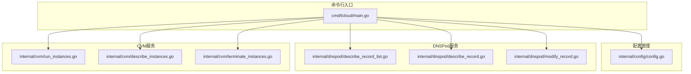

**图表来源**
- [main.go:12-196](file://cmd/tcloud/main.go#L12-L196)
- [config.go:31-59](file://internal/config/config.go#L31-L59)

**章节来源**
- [main.go:1-220](file://cmd/tcloud/main.go#L1-L220)
- [go.mod:1-10](file://go.mod#L1-L10)

## 核心组件

### 命令行接口设计

系统提供了一个统一的命令行界面，支持多种操作模式：

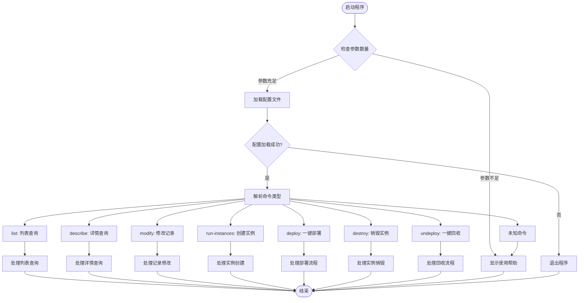

**图表来源**
- [main.go:12-196](file://cmd/tcloud/main.go#L12-L196)

### 配置管理系统

配置系统支持多环境配置，通过JSON文件管理所有必要的认证和参数信息：

**章节来源**
- [config.go:11-28](file://internal/config/config.go#L11-L28)
- [config.go:31-59](file://internal/config/config.go#L31-L59)

## 架构概览

系统采用分层架构设计，清晰分离了业务逻辑、数据访问和用户交互：

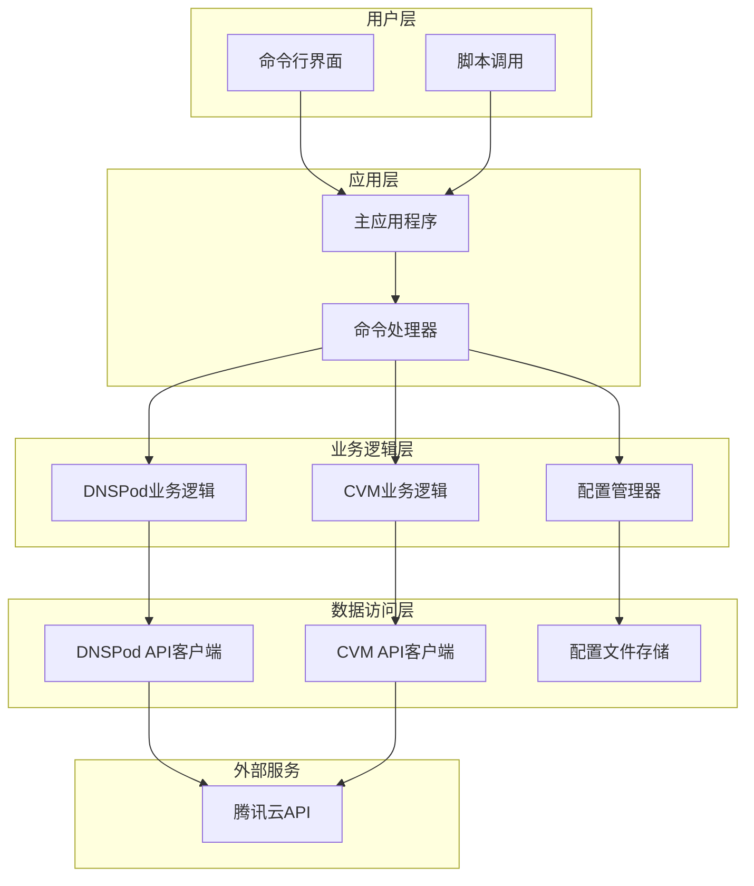

**图表来源**
- [main.go:3-10](file://cmd/tcloud/main.go#L3-L10)
- [config.go:31-59](file://internal/config/config.go#L31-L59)

## 详细组件分析

### DNSPod管理组件

DNSPod组件提供了完整的域名解析记录管理功能，支持查询、修改等操作。

#### DNS记录查询流程

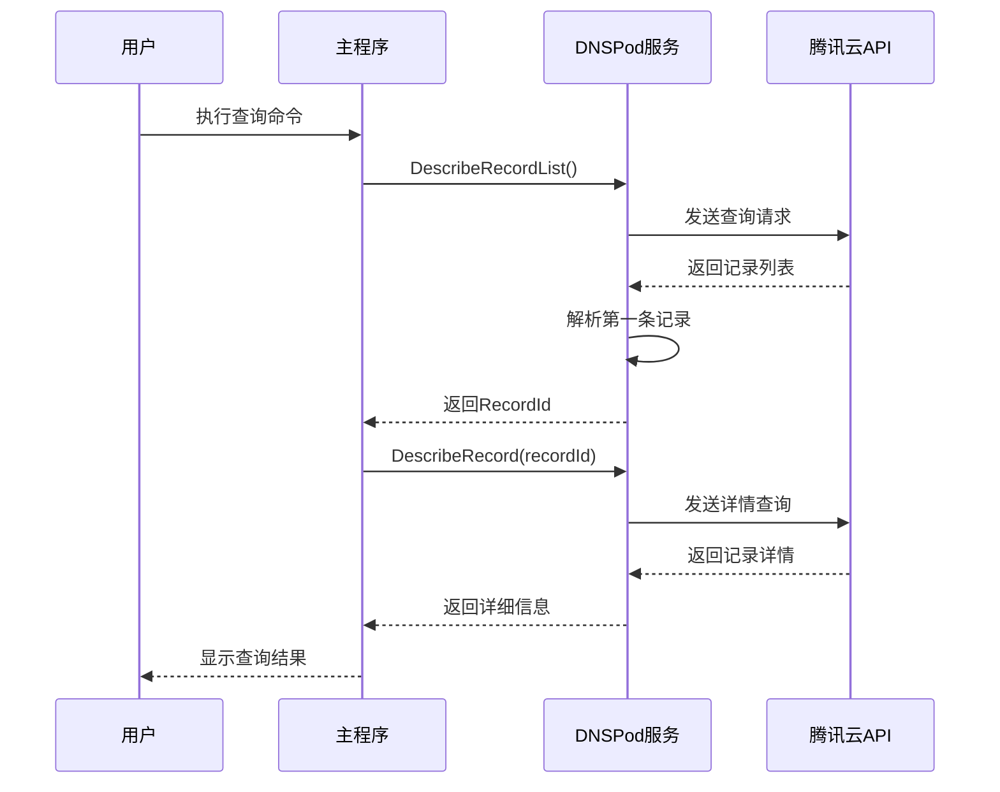

**图表来源**
- [main.go:27-55](file://cmd/tcloud/main.go#L27-L55)
- [describe_record_list.go:14-46](file://internal/dnspod/describe_record_list.go#L14-L46)
- [describe_record.go:14-37](file://internal/dnspod/describe_record.go#L14-L37)

#### DNS记录修改流程

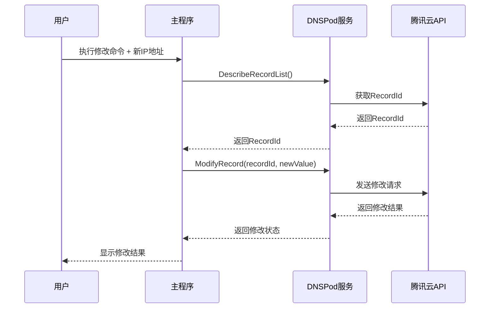

**图表来源**
- [main.go:57-74](file://cmd/tcloud/main.go#L57-L74)
- [modify_record.go:14-41](file://internal/dnspod/modify_record.go#L14-L41)

**章节来源**
- [describe_record_list.go:14-46](file://internal/dnspod/describe_record_list.go#L14-L46)
- [describe_record.go:14-37](file://internal/dnspod/describe_record.go#L14-L37)
- [modify_record.go:14-41](file://internal/dnspod/modify_record.go#L14-L41)

### CVM实例管理组件

CVM组件提供了完整的虚拟机生命周期管理功能，支持竞价实例的创建、查询和销毁。

#### 实例创建流程

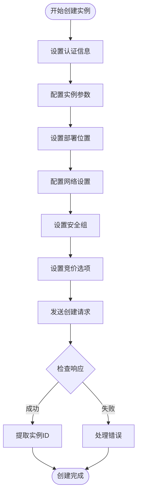

**图表来源**
- [run_instances.go:14-91](file://internal/cvm/run_instances.go#L14-L91)

#### 实例查询和等待流程

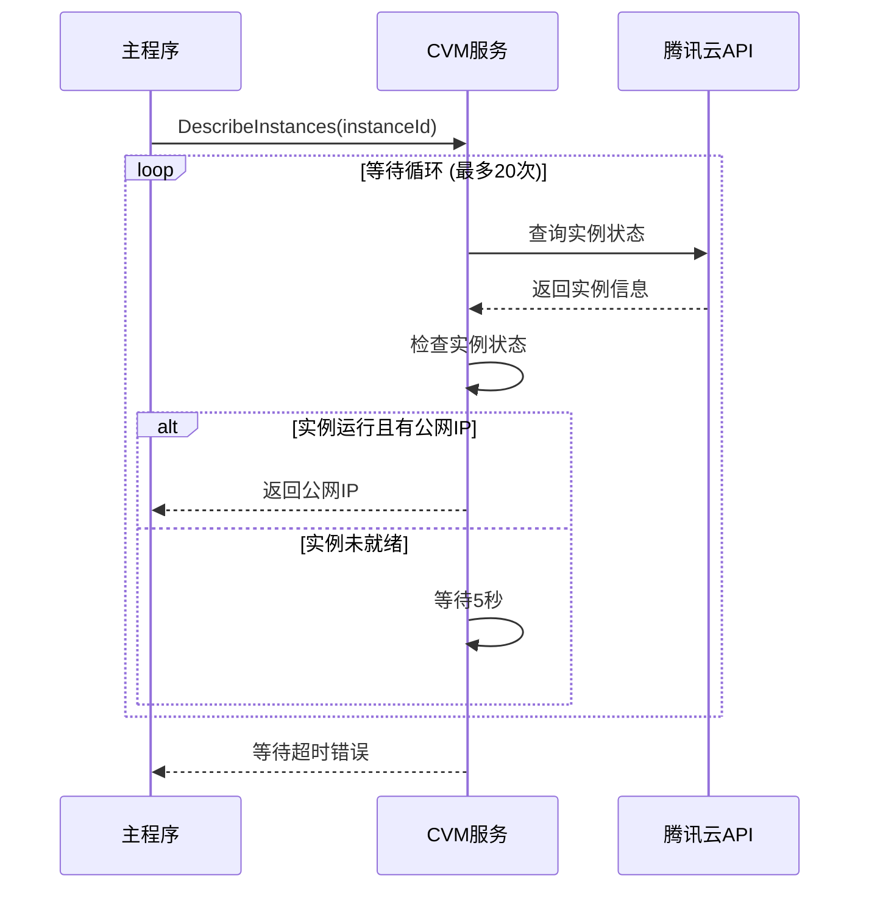

**图表来源**
- [describe_instances.go:15-64](file://internal/cvm/describe_instances.go#L15-L64)

**章节来源**
- [run_instances.go:14-91](file://internal/cvm/run_instances.go#L14-L91)
- [describe_instances.go:15-100](file://internal/cvm/describe_instances.go#L15-L100)
- [terminate_instances.go:14-36](file://internal/cvm/terminate_instances.go#L14-L36)

### 一键部署和回收流程

系统提供了完整的自动化部署和回收流程，支持端到端的基础设施管理。

#### 一键部署流程

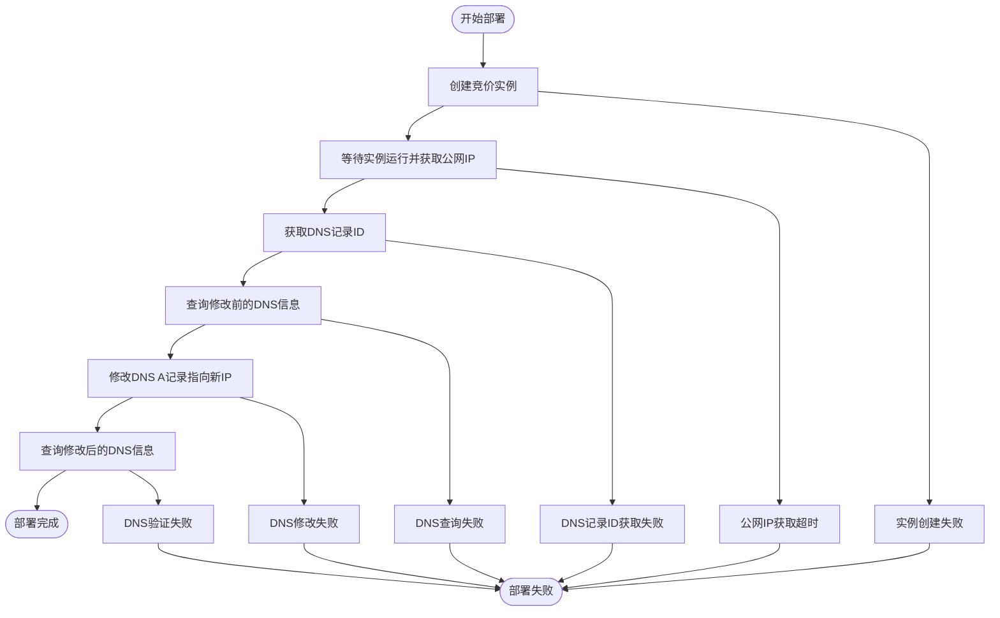

**图表来源**
- [main.go:85-131](file://cmd/tcloud/main.go#L85-L131)

#### 一键回收流程

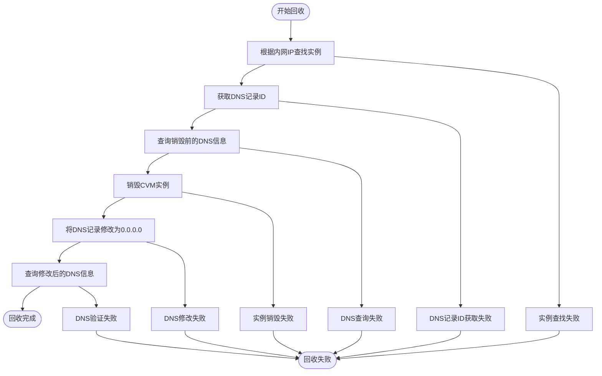

**图表来源**
- [main.go:147-190](file://cmd/tcloud/main.go#L147-L190)

**章节来源**
- [main.go:85-190](file://cmd/tcloud/main.go#L85-L190)

## 依赖关系分析

系统使用腾讯云官方SDK进行API调用，依赖关系清晰明确：

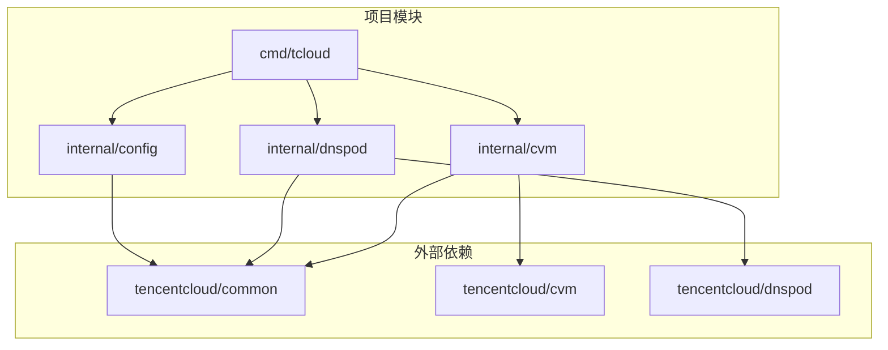

**图表来源**
- [go.mod:5-9](file://go.mod#L5-L9)
- [main.go:7-9](file://cmd/tcloud/main.go#L7-L9)

**章节来源**
- [go.mod:1-10](file://go.mod#L1-L10)

## 性能考虑

### 并发和异步处理

系统在处理多个API调用时采用了合理的并发策略：

1. **轮询机制优化**：实例查询采用5秒间隔的轮询，避免频繁API调用
2. **批量操作支持**：DNS记录查询支持批量获取，减少API调用次数
3. **连接复用**：SDK客户端在单个会话中复用连接

### 缓存策略

- **配置缓存**：配置文件在进程启动时加载并缓存
- **API响应缓存**：对于只读查询，可以考虑实现本地缓存机制

### 错误重试机制

系统实现了基本的错误处理和重试逻辑：

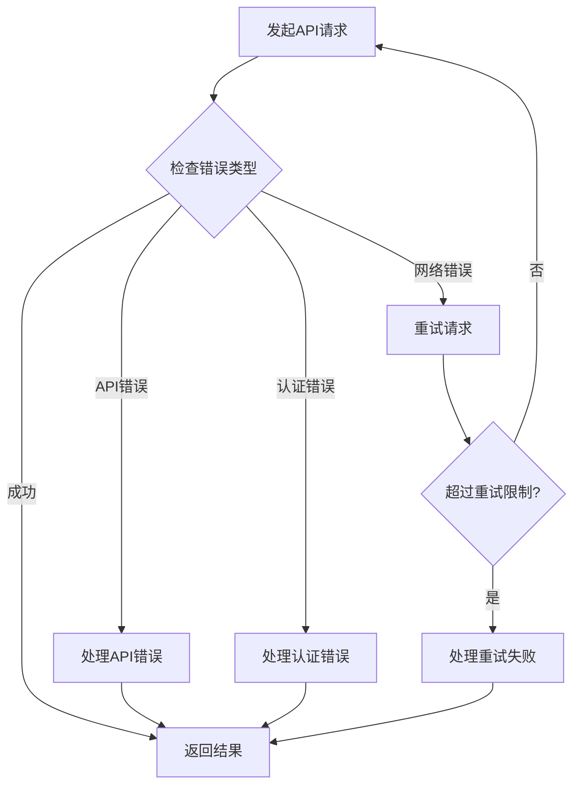

## 故障排除指南

### 常见错误类型和解决方案

#### 配置相关错误

| 错误类型 | 错误信息 | 可能原因 | 解决方案 |
|---------|---------|---------|---------|
| 配置文件加载失败 | "读取配置文件失败" | 配置文件不存在或权限不足 | 检查配置文件路径和权限 |
| JSON解析错误 | "解析配置文件失败" | 配置文件格式不正确 | 验证JSON格式的正确性 |
| 认证信息缺失 | "secret_id 或 secret_key 为空" | 凭证配置不完整 | 补充完整的认证信息 |

#### API调用错误

| 错误类型 | 错误信息 | 可能原因 | 解决方案 |
|---------|---------|---------|---------|
| API错误 | "API错误: ..." | 腾讯云API返回错误 | 检查参数和权限 |
| 请求失败 | "请求失败: ..." | 网络连接问题 | 检查网络连接和代理设置 |
| 等待超时 | "等待超时" | 实例启动时间过长 | 增加等待时间和重试次数 |

#### DNSPod相关错误

| 错误类型 | 错误信息 | 可能原因 | 解决方案 |
|---------|---------|---------|---------|
| 记录不存在 | "未找到任何解析记录" | 域名或子域名配置错误 | 检查域名配置 |
| 权限不足 | "API权限不足" | DNS管理权限不足 | 申请相应权限 |
| 参数错误 | "参数校验失败" | DNS记录参数不正确 | 验证记录参数 |

#### CVM相关错误

| 错误类型 | 错误信息 | 可能原因 | 解决方案 |
|---------|---------|---------|---------|
| 实例创建失败 | "创建实例失败" | 配额不足或参数错误 | 检查配额和参数 |
| 实例状态异常 | "实例状态不是RUNNING" | 实例启动异常 | 检查实例日志 |
| IP获取超时 | "等待超时" | 网络配置问题 | 检查VPC和子网配置 |

### 调试和诊断

#### 启用详细日志

```bash
# 设置调试级别
export DEBUG=1
./tcloud list

# 查看详细的API调用信息
./tcloud describe --verbose
```

#### 配置验证

```bash
# 验证配置文件
./tcloud list

# 检查DNS记录
./tcloud describe

# 测试CVM连接
./tcloud run-instances
```

**章节来源**
- [config.go:54-56](file://internal/config/config.go#L54-L56)
- [describe_record_list.go:45](file://internal/dnspod/describe_record_list.go#L45)
- [describe_instances.go:63](file://internal/cvm/describe_instances.go#L63)

## 结论

这个命令行工具提供了完整的腾讯云资源管理能力，具有以下特点：

1. **功能完整性**：覆盖了DNSPod和CVM的主要管理场景
2. **使用便捷性**：提供了一键部署和回收等高级功能
3. **错误处理**：完善的错误处理和恢复机制
4. **扩展性**：模块化设计便于功能扩展

建议在生产环境中使用时：
- 定期备份配置文件
- 实施适当的监控和告警
- 建立完善的变更管理流程
- 进行充分的测试验证

## 附录

### 使用示例集合

#### 基础查询操作

```bash
# 列出所有DNS记录
go run ./cmd/tcloud list

# 获取记录详情
go run ./cmd/tcloud describe

# 显示详细列表信息
go run ./cmd/tcloud list --detail
```

#### DNS记录管理

```bash
# 修改DNS记录为指定IP
go run ./cmd/tcloud modify 200.200.200.200

# 查询特定域名的记录
go run ./cmd/tcloud describe
```

#### 实例管理

```bash
# 创建竞价实例
go run ./cmd/tcloud run-instances

# 根据内网IP销毁实例
go run ./cmd/tcloud destroy

# 查找实例
go run ./cmd/tcloud describe
```

#### 自动化部署

```bash
# 一键部署
go run ./cmd/tcloud deploy

# 一键回收
go run ./cmd/tcloud undeploy
```

### 最佳实践指南

#### 开发环境配置

1. **配置文件管理**
   - 使用独立的配置文件用于开发环境
   - 包含最小权限的测试凭证
   - 定期轮换测试凭证

2. **脚本化操作**
   ```bash
   # 创建部署脚本
   #!/bin/bash
   echo "开始部署..."
   go run ./cmd/tcloud deploy
   echo "部署完成"
   ```

3. **批处理操作**
   ```bash
   # 批量修改多个域名
   for domain in domain1 domain2 domain3; do
       echo "处理 $domain"
       go run ./cmd/tcloud modify $domain 200.200.200.200
   done
   ```

#### 生产环境使用

1. **安全配置**
   - 使用专用的生产凭证
   - 实施最小权限原则
   - 定期审计访问日志

2. **监控和告警**
   - 监控API调用频率
   - 设置错误率告警
   - 实施变更通知

3. **备份和恢复**
   - 定期备份DNS配置
   - 建立快速恢复流程
   - 测试灾难恢复

#### 性能优化建议

1. **API调用优化**
   - 合理设置重试间隔
   - 批量处理相似操作
   - 实现必要的缓存机制

2. **资源管理**
   - 及时清理不需要的实例
   - 监控资源使用情况
   - 实施成本控制措施

3. **错误处理**
   - 实现优雅降级
   - 提供详细的错误信息
   - 建立故障转移机制

#### 常见问题解决

1. **配置问题**
   - 确认配置文件路径正确
   - 验证JSON格式有效性
   - 检查文件权限设置

2. **网络问题**
   - 检查防火墙设置
   - 验证DNS解析正常
   - 确认API端点可达

3. **权限问题**
   - 验证IAM权限设置
   - 检查服务授权状态
   - 确认API密钥有效