# 命令参考手册

<cite>
**本文档引用的文件**
- [cmd/tcloud/main.go](file://cmd/tcloud/main.go)
- [internal/config/config.go](file://internal/config/config.go)
- [internal/cvm/run_instances.go](file://internal/cvm/run_instances.go)
- [internal/cvm/describe_instances.go](file://internal/cvm/describe_instances.go)
- [internal/cvm/terminate_instances.go](file://internal/cvm/terminate_instances.go)
- [internal/dnspod/describe_record_list.go](file://internal/dnspod/describe_record_list.go)
- [internal/dnspod/describe_record.go](file://internal/dnspod/describe_record.go)
- [internal/dnspod/modify_record.go](file://internal/dnspod/modify_record.go)
- [go.mod](file://go.mod)
- [config/tencentcloud.json](file://config/tencentcloud.json)
</cite>

## 目录
1. [简介](#简介)
2. [项目结构](#项目结构)
3. [核心组件](#核心组件)
4. [架构概览](#架构概览)
5. [详细命令参考](#详细命令参考)
6. [命令依赖关系](#命令依赖关系)
7. [性能考虑](#性能考虑)
8. [故障排除指南](#故障排除指南)
9. [结论](#结论)

## 简介

这是一个基于腾讯云API的命令行工具，集成了DNSPod域名解析管理和CVM云服务器管理功能。该工具提供了完整的自动化部署和回收流程，支持批量操作和自动化脚本集成。

主要功能包括：
- DNS记录管理：列出、查询、修改DNS解析记录
- CVM实例管理：创建、查询、销毁云服务器实例
- 一键部署：自动化的完整部署流程
- 一键回收：自动化的资源回收流程

## 项目结构

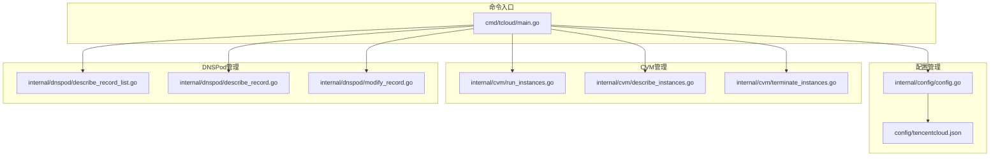

**图表来源**
- [cmd/tcloud/main.go:12-196](file://cmd/tcloud/main.go#L12-L196)
- [internal/config/config.go:31-59](file://internal/config/config.go#L31-L59)

**章节来源**
- [cmd/tcloud/main.go:1-220](file://cmd/tcloud/main.go#L1-L220)
- [go.mod:1-10](file://go.mod#L1-L10)

## 核心组件

### 配置管理系统

配置系统采用JSON文件存储，支持动态加载和验证：

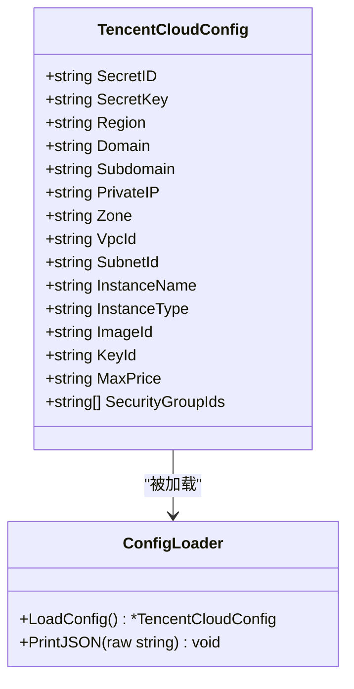

**图表来源**
- [internal/config/config.go:11-28](file://internal/config/config.go#L11-L28)
- [internal/config/config.go:30-69](file://internal/config/config.go#L30-L69)

### API客户端管理

系统集成了腾讯云官方SDK，支持多种服务调用：

- **CVM服务**：云服务器管理
- **DNSPod服务**：域名解析管理
- **通用认证**：统一的API认证机制

**章节来源**
- [internal/config/config.go:31-59](file://internal/config/config.go#L31-L59)
- [go.mod:5-9](file://go.mod#L5-L9)

## 架构概览

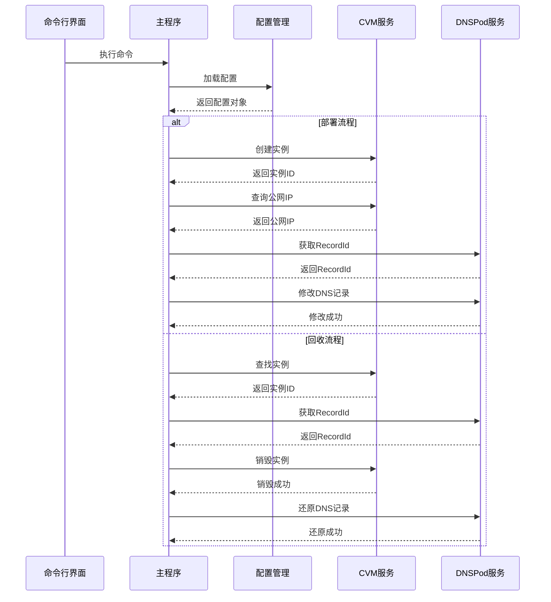

**图表来源**
- [cmd/tcloud/main.go:76-131](file://cmd/tcloud/main.go#L76-L131)
- [cmd/tcloud/main.go:147-190](file://cmd/tcloud/main.go#L147-L190)

## 详细命令参考

### list 命令

**功能描述**
获取DNS解析记录列表，并提取第一条记录的RecordId。

**语法**
```
tcloud list
tcloud list --detail
```

**参数选项**
- `--detail`: 显示详细信息，获取RecordId后自动查询记录详情

**使用示例**
```bash
# 基本用法
tcloud list

# 显示详细信息
tcloud list --detail
```

**执行流程**
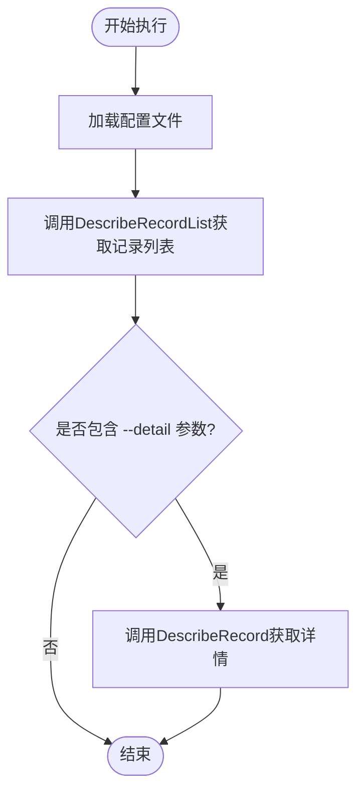

**图表来源**
- [cmd/tcloud/main.go:28-42](file://cmd/tcloud/main.go#L28-L42)

**最佳实践**
- 在执行前确保配置文件正确设置
- 使用`--detail`参数进行调试和验证
- 注意API调用频率限制

**章节来源**
- [cmd/tcloud/main.go:28-42](file://cmd/tcloud/main.go#L28-L42)
- [internal/dnspod/describe_record_list.go:14-46](file://internal/dnspod/describe_record_list.go#L14-L46)

### describe 命令

**功能描述**
自动获取DNS记录的详细信息，无需手动指定RecordId。

**语法**
```
tcloud describe
```

**参数选项**
无

**使用示例**
```bash
tcloud describe
```

**执行流程**
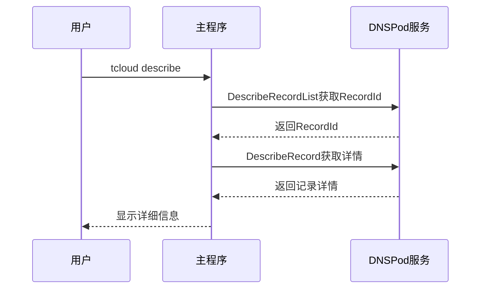

**图表来源**
- [cmd/tcloud/main.go:44-55](file://cmd/tcloud/main.go#L44-L55)

**最佳实践**
- 用于快速查看当前DNS配置状态
- 结合其他命令进行配置验证
- 注意权限要求

**章节来源**
- [cmd/tcloud/main.go:44-55](file://cmd/tcloud/main.go#L44-L55)
- [internal/dnspod/describe_record.go:14-37](file://internal/dnspod/describe_record.go#L14-L37)

### modify 命令

**功能描述**
修改DNS解析记录的IP地址值。

**语法**
```
tcloud modify <新IP地址>
```

**参数选项**
- `<新IP地址>`: 必需参数，要设置的新IP地址

**使用示例**
```bash
# 修改为指定IP
tcloud modify 200.200.200.200

# 修改为0.0.0.0（停用）
tcloud modify 0.0.0.0
```

**执行流程**
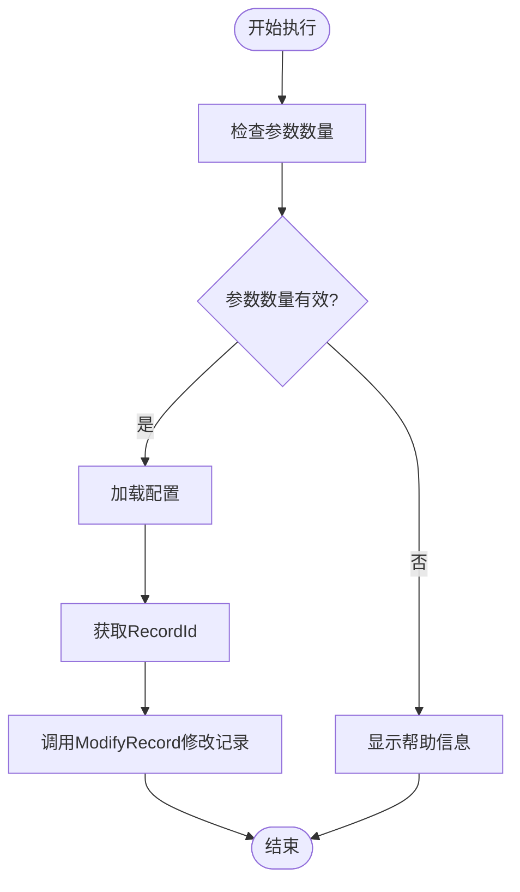

**图表来源**
- [cmd/tcloud/main.go:57-74](file://cmd/tcloud/main.go#L57-L74)

**最佳实践**
- 修改前先使用`describe`命令确认当前状态
- 使用`0.0.0.0`作为停用标记
- 注意DNS缓存可能影响生效时间

**章节来源**
- [cmd/tcloud/main.go:57-74](file://cmd/tcloud/main.go#L57-L74)
- [internal/dnspod/modify_record.go:14-41](file://internal/dnspod/modify_record.go#L14-L41)

### run-instances 命令

**功能描述**
创建腾讯云CVM竞价实例。

**语法**
```
tcloud run-instances
```

**参数选项**
无

**使用示例**
```bash
tcloud run-instances
```

**执行流程**
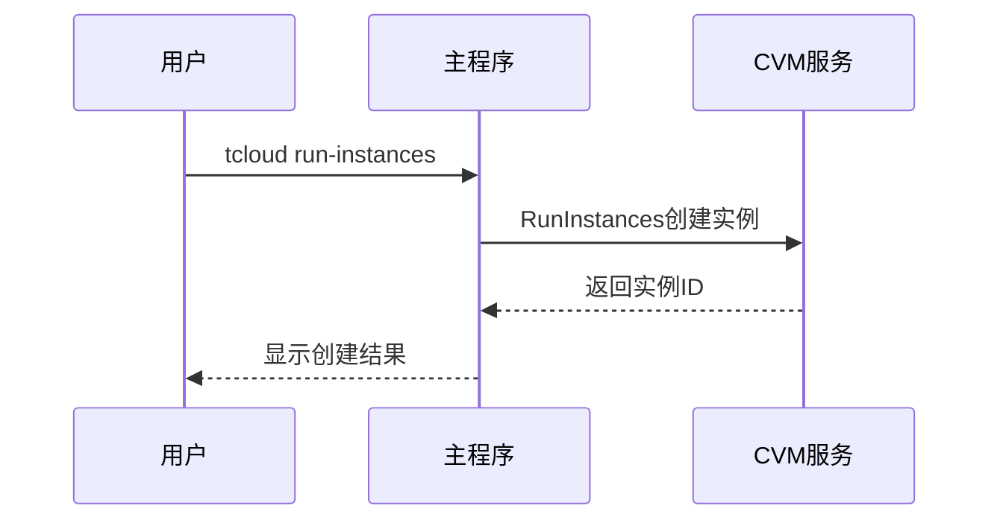

**图表来源**
- [cmd/tcloud/main.go:76-84](file://cmd/tcloud/main.go#L76-L84)

**最佳实践**
- 确保竞价实例配置符合预期
- 注意实例创建时间和状态检查
- 准备后续的公网IP获取步骤

**章节来源**
- [cmd/tcloud/main.go:76-84](file://cmd/tcloud/main.go#L76-L84)
- [internal/cvm/run_instances.go:14-91](file://internal/cvm/run_instances.go#L14-L91)

### deploy 命令

**功能描述**
一键部署：自动化的完整部署流程，包括创建实例、获取公网IP、修改DNS记录。

**语法**
```
tcloud deploy
```

**参数选项**
无

**使用示例**
```bash
tcloud deploy
```

**执行流程**
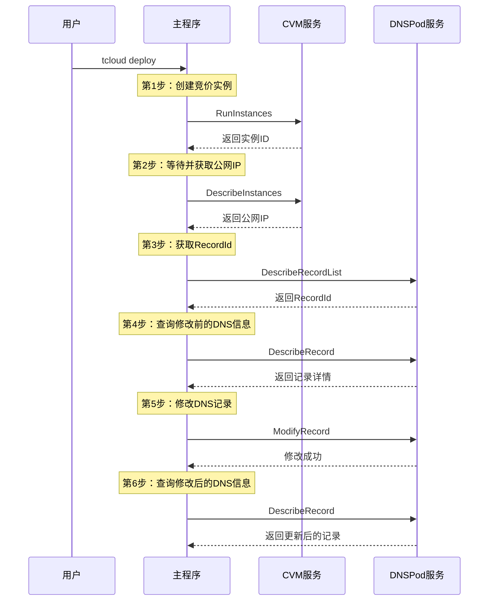

**图表来源**
- [cmd/tcloud/main.go:85-131](file://cmd/tcloud/main.go#L85-L131)

**执行顺序说明**
1. 创建CVM竞价实例
2. 等待实例运行并获取公网IP
3. 获取DNS记录的RecordId
4. 查询修改前的DNS解析状态
5. 修改DNS A记录指向新IP
6. 验证修改后的DNS解析状态

**最佳实践**
- 部署完成后立即验证DNS解析状态
- 监控实例运行状态和网络连通性
- 准备回滚方案以防部署失败

**章节来源**
- [cmd/tcloud/main.go:85-131](file://cmd/tcloud/main.go#L85-L131)

### destroy 命令

**功能描述**
根据内网IP地址自动查找并销毁CVM实例。

**语法**
```
tcloud destroy
```

**参数选项**
无

**使用示例**
```bash
tcloud destroy
```

**执行流程**
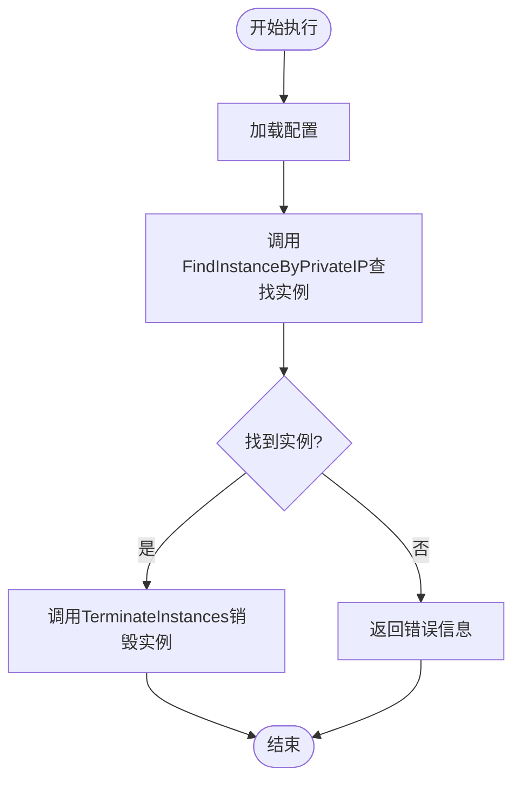

**图表来源**
- [cmd/tcloud/main.go:133-145](file://cmd/tcloud/main.go#L133-L145)

**最佳实践**
- 确认内网IP配置正确
- 销毁前备份重要数据
- 验证实例销毁状态

**章节来源**
- [cmd/tcloud/main.go:133-145](file://cmd/tcloud/main.go#L133-L145)
- [internal/cvm/describe_instances.go:66-100](file://internal/cvm/describe_instances.go#L66-L100)

### undeploy 命令

**功能描述**
一键回收：自动化的资源回收流程，包括查找实例、销毁实例、还原DNS记录。

**语法**
```
tcloud undeploy
```

**参数选项**
无

**使用示例**
```bash
tcloud undeploy
```

**执行流程**
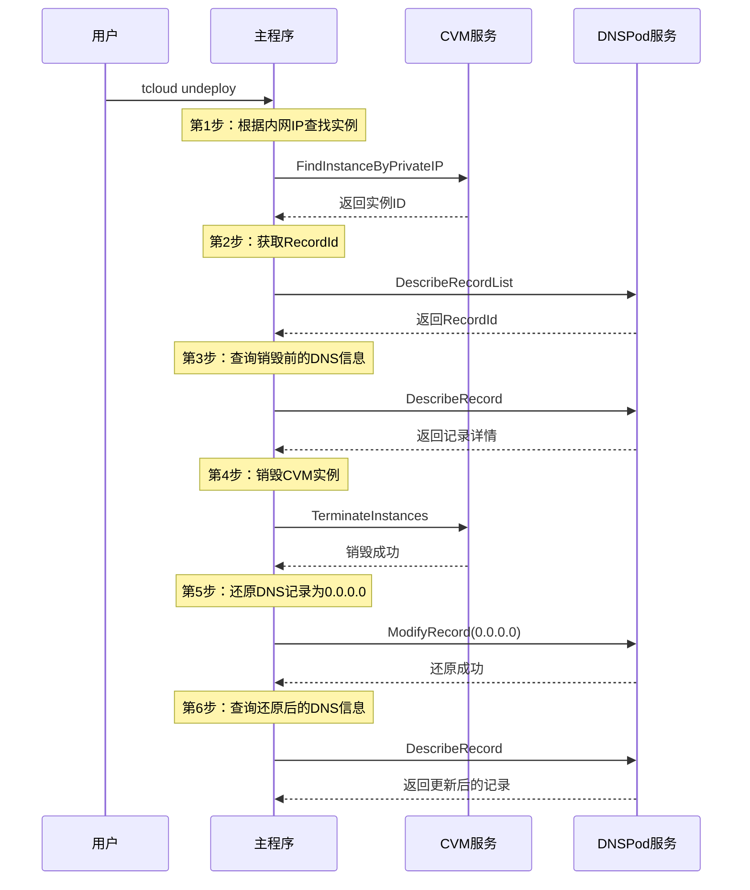

**图表来源**
- [cmd/tcloud/main.go:147-190](file://cmd/tcloud/main.go#L147-L190)

**执行顺序说明**
1. 根据内网IP自动查找CVM实例
2. 获取DNS记录的RecordId
3. 查询销毁前的DNS解析状态
4. 销毁CVM实例
5. 将DNS记录还原为0.0.0.0
6. 验证还原后的DNS解析状态

**最佳实践**
- 回收前确认所有相关资源状态
- 备份重要的配置信息
- 验证DNS解析完全停止

**章节来源**
- [cmd/tcloud/main.go:147-190](file://cmd/tcloud/main.go#L147-L190)

## 命令依赖关系

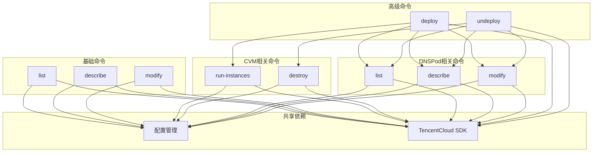

**图表来源**
- [cmd/tcloud/main.go:27-196](file://cmd/tcloud/main.go#L27-L196)

### 命令间依赖关系详解

**基础命令依赖**
- `list`、`describe`、`modify` 命令都依赖于DNSPod服务
- `run-instances`、`destroy` 命令都依赖于CVM服务

**高级命令依赖**
- `deploy` 命令依赖于所有基础命令功能
- `undeploy` 命令依赖于所有基础命令功能

**执行顺序约束**
- `deploy` 命令必须按固定顺序执行各步骤
- `undeploy` 命令必须按固定顺序执行各步骤
- 单独命令可以独立执行

**章节来源**
- [cmd/tcloud/main.go:27-196](file://cmd/tcloud/main.go#L27-L196)

## 性能考虑

### API调用优化

1. **批量操作支持**
   - 系统设计支持批量DNS记录操作
   - CVM实例管理支持批量实例操作

2. **重试机制**
   - 实例状态查询包含重试逻辑
   - 等待公网IP分配时采用轮询机制

3. **并发处理**
   - 建议在自动化脚本中合理安排API调用间隔
   - 避免同时触发大量API请求

### 内存和资源管理

1. **配置文件缓存**
   - 配置文件只在程序启动时加载一次
   - 避免重复IO操作

2. **连接池管理**
   - SDK自动管理HTTP连接
   - 建议在长时间运行的脚本中注意连接复用

## 故障排除指南

### 常见错误类型

**配置错误**
- `配置文件中 secret_id 或 secret_key 为空`
- 配置文件路径不存在
- JSON格式解析失败

**API调用错误**
- `API错误: %s` - 腾讯云API返回的错误
- `请求失败: %w` - 网络或请求异常
- `等待超时：实例 %s 未能在规定时间内获取公网IP`

**业务逻辑错误**
- `未找到内网IP为 %s 的实例`
- `未找到任何解析记录`
- `未获取到实例ID`

### 排错步骤

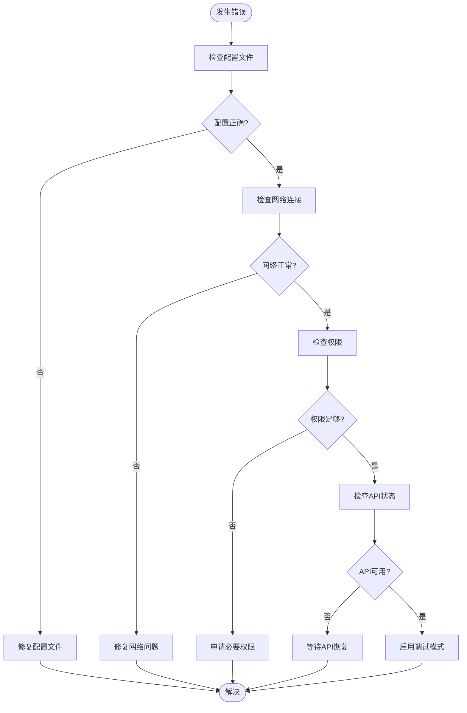

### 最佳实践建议

1. **配置验证**
   ```bash
   # 验证配置文件
   cat config/tencentcloud.json
   
   # 测试基本命令
   tcloud list
   ```

2. **权限检查**
   - 确保具有DNSPod和CVM服务的操作权限
   - 检查安全组和网络配置

3. **监控和日志**
   - 启用详细的日志输出
   - 监控API调用配额使用情况

4. **备份策略**
   - 部署前备份当前DNS配置
   - 销毁前备份重要数据

**章节来源**
- [internal/config/config.go:54-56](file://internal/config/config.go#L54-L56)
- [internal/cvm/describe_instances.go:63](file://internal/cvm/describe_instances.go#L63)
- [internal/cvm/describe_instances.go:99](file://internal/cvm/describe_instances.go#L99)

## 结论

本命令行工具提供了完整的腾讯云资源管理解决方案，涵盖了DNS解析和云服务器管理的核心功能。通过精心设计的命令体系和自动化流程，用户可以高效地管理云端资源。

### 主要优势

1. **完整的生命周期管理**：从创建到销毁的全流程支持
2. **自动化程度高**：一键部署和回收减少人工干预
3. **错误处理完善**：全面的错误检测和处理机制
4. **易于集成**：支持批量操作和自动化脚本

### 使用建议

1. **生产环境使用**
   - 建议在测试环境中充分验证后再在生产环境使用
   - 制定完善的回滚和应急响应计划

2. **安全考虑**
   - 定期轮换访问密钥
   - 最小权限原则配置
   - 启用审计日志

3. **运维最佳实践**
   - 建立监控告警机制
   - 定期备份重要配置
   - 制定变更管理流程

该工具为腾讯云资源管理提供了标准化的CLI接口，适合个人开发者和企业用户在各种场景下使用。