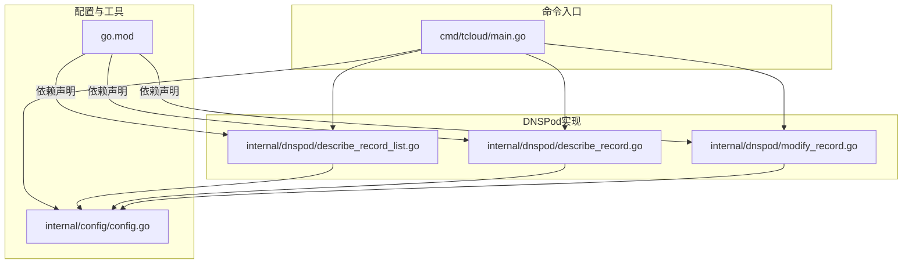
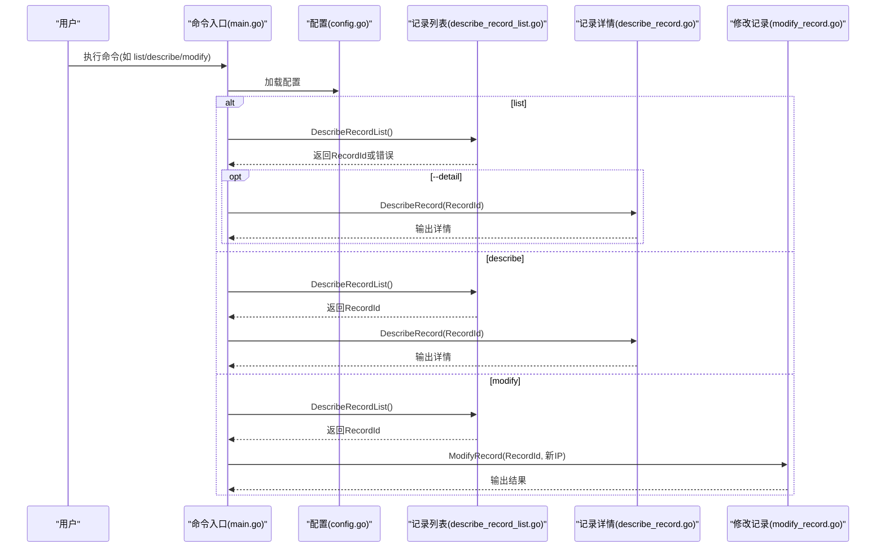
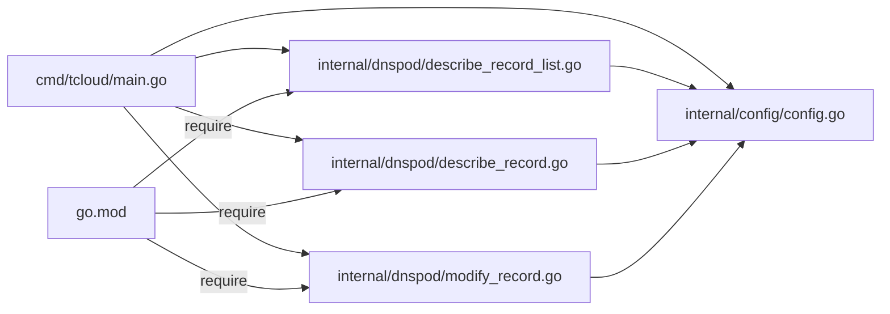

# 基础命令

<cite>
**本文引用的文件**
- [cmd/tcloud/main.go](file://cmd/tcloud/main.go)
- [internal/dnspod/describe_record_list.go](file://internal/dnspod/describe_record_list.go)
- [internal/dnspod/describe_record.go](file://internal/dnspod/describe_record.go)
- [internal/dnspod/modify_record.go](file://internal/dnspod/modify_record.go)
- [internal/config/config.go](file://internal/config/config.go)
- [go.mod](file://go.mod)
</cite>

## 目录
1. [简介](#简介)
2. [项目结构](#项目结构)
3. [核心组件](#核心组件)
4. [架构总览](#架构总览)
5. [详细组件分析](#详细组件分析)
6. [依赖分析](#依赖分析)
7. [性能考虑](#性能考虑)
8. [故障排查指南](#故障排查指南)
9. [结论](#结论)
10. [附录](#附录)

## 简介
本文件面向DNS管理的基础命令，聚焦于以下三个核心命令：
- list：列出DNS解析记录，并在特定模式下自动获取第一条记录的RecordId并查询详情
- describe：自动获取RecordId并查询指定记录的详情
- modify：自动获取RecordId并修改记录的IP值

文档将详细说明各命令的功能、语法、前置条件与依赖关系，给出成功与失败的输出格式说明，并提供常见使用场景与最佳实践建议。

## 项目结构
该工具采用模块化的Go项目结构，命令入口位于cmd/tcloud/main.go，DNSPod相关逻辑封装在internal/dnspod目录，配置加载与JSON格式化在internal/config中。

图表来源
- [cmd/tcloud/main.go:12-196](file://cmd/tcloud/main.go#L12-L196)
- [internal/dnspod/describe_record_list.go:14-46](file://internal/dnspod/describe_record_list.go#L14-L46)
- [internal/dnspod/describe_record.go:14-37](file://internal/dnspod/describe_record.go#L14-L37)
- [internal/dnspod/modify_record.go:14-41](file://internal/dnspod/modify_record.go#L14-L41)
- [internal/config/config.go:30-69](file://internal/config/config.go#L30-L69)
- [go.mod:5-9](file://go.mod#L5-L9)

章节来源
- [cmd/tcloud/main.go:12-196](file://cmd/tcloud/main.go#L12-L196)
- [internal/dnspod/describe_record_list.go:14-46](file://internal/dnspod/describe_record_list.go#L14-L46)
- [internal/dnspod/describe_record.go:14-37](file://internal/dnspod/describe_record.go#L14-L37)
- [internal/dnspod/modify_record.go:14-41](file://internal/dnspod/modify_record.go#L14-L41)
- [internal/config/config.go:30-69](file://internal/config/config.go#L30-L69)
- [go.mod:5-9](file://go.mod#L5-L9)

## 核心组件
- 命令入口与分发：cmd/tcloud/main.go负责解析命令行参数，加载配置，调用对应功能模块，并处理错误与帮助信息。
- DNSPod接口封装：
  - 列表与RecordId提取：internal/dnspod/describe_record_list.go
  - 详情查询：internal/dnspod/describe_record.go
  - 记录修改：internal/dnspod/modify_record.go
- 配置与工具：internal/config/config.go提供配置加载、校验与JSON格式化输出。

章节来源
- [cmd/tcloud/main.go:12-196](file://cmd/tcloud/main.go#L12-L196)
- [internal/dnspod/describe_record_list.go:14-46](file://internal/dnspod/describe_record_list.go#L14-L46)
- [internal/dnspod/describe_record.go:14-37](file://internal/dnspod/describe_record.go#L14-L37)
- [internal/dnspod/modify_record.go:14-41](file://internal/dnspod/modify_record.go#L14-L41)
- [internal/config/config.go:30-69](file://internal/config/config.go#L30-L69)

## 架构总览
命令执行流程遵循“配置加载 → 参数解析 → 业务调用 → 结果输出”的通用模式。list与describe均依赖describe_record_list获取RecordId；modify在修改前同样需要RecordId。

图表来源
- [cmd/tcloud/main.go:27-74](file://cmd/tcloud/main.go#L27-L74)
- [internal/dnspod/describe_record_list.go:14-46](file://internal/dnspod/describe_record_list.go#L14-L46)
- [internal/dnspod/describe_record.go:14-37](file://internal/dnspod/describe_record.go#L14-L37)
- [internal/dnspod/modify_record.go:14-41](file://internal/dnspod/modify_record.go#L14-L41)

## 详细组件分析

### list 命令
- 功能概述
  - 获取DNS解析记录列表，并打印完整响应。
  - 若传入--detail参数，则在获取到第一条记录的RecordId后，自动查询该记录的详情。
- 语法
  - tcloud list
  - tcloud list --detail
- 处理逻辑
  - 调用DescribeRecordList获取记录列表与第一条记录的RecordId。
  - 当存在--detail时，调用DescribeRecord打印详情。
- 成功输出
  - 列表模式：打印“记录列表”标题与完整响应；随后打印“获取到的RecordId”。
  - 详情模式：在列表输出后，打印“记录详情”标题与完整响应。
- 失败输出
  - 配置加载失败、API错误、请求失败等均会打印错误信息并退出。
- 前置条件与依赖
  - 需要有效的腾讯云SecretID/SecretKey与域名配置。
  - 需要存在至少一条匹配的解析记录以获取RecordId。
- 使用示例
  - 成功示例：执行tcloud list后看到“记录列表”和“记录详情”输出。
  - 失败示例：当未找到解析记录时，返回“未找到任何解析记录”。

章节来源
- [cmd/tcloud/main.go:27-42](file://cmd/tcloud/main.go#L27-L42)
- [internal/dnspod/describe_record_list.go:14-46](file://internal/dnspod/describe_record_list.go#L14-L46)
- [internal/dnspod/describe_record.go:14-37](file://internal/dnspod/describe_record.go#L14-L37)

### describe 命令
- 功能概述
  - 自动获取RecordId并查询指定记录的详情。
- 语法
  - tcloud describe
- 处理逻辑
  - 先调用DescribeRecordList获取RecordId，再调用DescribeRecord打印详情。
- 成功输出
  - 打印“记录详情”标题与完整响应。
- 失败输出
  - 配置加载失败、API错误、请求失败或未找到解析记录时，打印错误信息并退出。
- 前置条件与依赖
  - 需要有效的腾讯云SecretID/SecretKey与域名配置。
  - 需要存在至少一条匹配的解析记录以获取RecordId。
- 使用示例
  - 成功示例：执行tcloud describe后看到“记录详情”输出。
  - 失败示例：当未找到解析记录时，返回“未找到任何解析记录”。

章节来源
- [cmd/tcloud/main.go:44-55](file://cmd/tcloud/main.go#L44-L55)
- [internal/dnspod/describe_record_list.go:14-46](file://internal/dnspod/describe_record_list.go#L14-L46)
- [internal/dnspod/describe_record.go:14-37](file://internal/dnspod/describe_record.go#L14-L37)

### modify 命令
- 功能概述
  - 自动获取RecordId并修改记录的IP值（A记录类型）。
- 语法
  - tcloud modify <新IP地址>
- 参数要求
  - 必须提供一个合法的IPv4地址作为新IP。
- 处理逻辑
  - 解析命令行参数获取新IP。
  - 调用DescribeRecordList获取RecordId。
  - 调用ModifyRecord进行修改。
- 成功输出
  - 打印“修改记录结果”标题与完整响应。
- 失败输出
  - 配置加载失败、参数不足、API错误、请求失败或未找到解析记录时，打印错误信息并退出。
- 前置条件与依赖
  - 需要有效的腾讯云SecretID/SecretKey与域名配置。
  - 需要存在至少一条匹配的解析记录以获取RecordId。
- IP地址格式规范
  - 仅支持标准IPv4地址格式（例如：a.b.c.d）。
- 使用示例
  - 成功示例：执行tcloud modify 200.200.200.200后看到“修改记录结果”输出。
  - 失败示例：当未找到解析记录时，返回“未找到任何解析记录”。

章节来源
- [cmd/tcloud/main.go:57-74](file://cmd/tcloud/main.go#L57-L74)
- [internal/dnspod/describe_record_list.go:14-46](file://internal/dnspod/describe_record_list.go#L14-L46)
- [internal/dnspod/modify_record.go:14-41](file://internal/dnspod/modify_record.go#L14-L41)

### 自动RecordId获取机制
- 机制说明
  - list与describe命令在执行时，会先调用DescribeRecordList获取记录列表，并提取第一条记录的RecordId。
  - modify命令在执行时，同样会先调用DescribeRecordList获取RecordId，再进行修改。
- 行为细节
  - 若未找到任何解析记录，将返回错误并终止。
  - 仅使用第一条记录的RecordId，不处理多条记录的情况。
- 适用场景
  - 适用于子域下仅有一条A记录的场景。
  - 若存在多条同名记录，需谨慎使用，避免误改非预期记录。

章节来源
- [cmd/tcloud/main.go:27-74](file://cmd/tcloud/main.go#L27-L74)
- [internal/dnspod/describe_record_list.go:14-46](file://internal/dnspod/describe_record_list.go#L14-L46)

## 依赖分析
- 外部依赖
  - 腾讯云SDK：common、dnspod、cvm
- 内部依赖
  - 命令入口依赖配置加载与DNSPod实现。
  - DNSPod实现依赖配置结构体与JSON格式化工具。
- 依赖关系图

图表来源
- [cmd/tcloud/main.go:7-9](file://cmd/tcloud/main.go#L7-L9)
- [internal/dnspod/describe_record_list.go:3-11](file://internal/dnspod/describe_record_list.go#L3-L11)
- [internal/dnspod/describe_record.go:3-11](file://internal/dnspod/describe_record.go#L3-L11)
- [internal/dnspod/modify_record.go:3-11](file://internal/dnspod/modify_record.go#L3-L11)
- [go.mod:5-9](file://go.mod#L5-L9)

章节来源
- [cmd/tcloud/main.go:7-9](file://cmd/tcloud/main.go#L7-L9)
- [internal/dnspod/describe_record_list.go:3-11](file://internal/dnspod/describe_record_list.go#L3-L11)
- [internal/dnspod/describe_record.go:3-11](file://internal/dnspod/describe_record.go#L3-L11)
- [internal/dnspod/modify_record.go:3-11](file://internal/dnspod/modify_record.go#L3-L11)
- [go.mod:5-9](file://go.mod#L5-L9)

## 性能考虑
- API调用次数
  - list/describe：通常一次DescribeRecordList + 一次DescribeRecord（当使用--detail时）。
  - modify：通常一次DescribeRecordList + 一次ModifyRecord。
- 网络与超时
  - SDK默认HTTP配置可能影响请求耗时，建议在网络稳定环境下执行。
- 错误重试
  - 当前实现未内置重试逻辑，遇到临时网络问题需手动重试。

## 故障排查指南
- 配置文件问题
  - 现象：启动即报错，提示配置文件读取或解析失败。
  - 排查：确认配置文件路径与内容正确，secret_id与secret_key非空。
- 未找到解析记录
  - 现象：返回“未找到任何解析记录”。
  - 排查：确认域名与子域配置正确，且存在匹配的A记录。
- API错误
  - 现象：返回“API错误”类信息。
  - 排查：检查凭证权限、地域设置与网络连通性。
- 请求失败
  - 现象：返回“请求失败”类信息。
  - 排查：检查网络代理、防火墙与SDK版本兼容性。
- 参数不足
  - 现象：modify命令提示用法。
  - 排查：确保提供合法IPv4地址作为参数。

章节来源
- [internal/config/config.go:30-58](file://internal/config/config.go#L30-L58)
- [internal/dnspod/describe_record_list.go:27-32](file://internal/dnspod/describe_record_list.go#L27-L32)
- [internal/dnspod/describe_record.go:27-31](file://internal/dnspod/describe_record.go#L27-L31)
- [internal/dnspod/modify_record.go:31-35](file://internal/dnspod/modify_record.go#L31-L35)
- [cmd/tcloud/main.go:59-63](file://cmd/tcloud/main.go#L59-L63)

## 结论
本文档对DNS管理的基础命令进行了系统梳理，明确了list、describe、modify三者的功能边界、语法与行为差异，并总结了自动RecordId获取机制、前置条件与依赖关系。通过结合配置加载与SDK调用，这些命令能够高效地完成DNS记录的查询与修改任务。建议在生产环境中严格校验配置与参数，优先在测试环境验证后再执行关键操作。

## 附录
- 常见使用场景
  - 日常巡检：使用list查看解析状态，必要时使用--detail查看详细信息。
  - 快速定位：使用describe快速获取目标记录的完整信息。
  - 动态更新：使用modify配合公网IP变更，实现域名指向的自动化更新。
- 最佳实践
  - 在执行modify前，先使用describe核对当前记录状态，避免误改。
  - 对多条同名记录的场景，建议先精确选择RecordId，再进行修改。
  - 将敏感配置置于安全位置，避免泄露。
  - 定期检查凭证权限与SDK版本，确保API可用性。