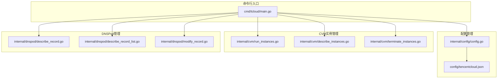
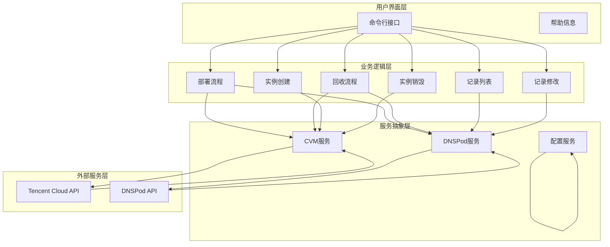
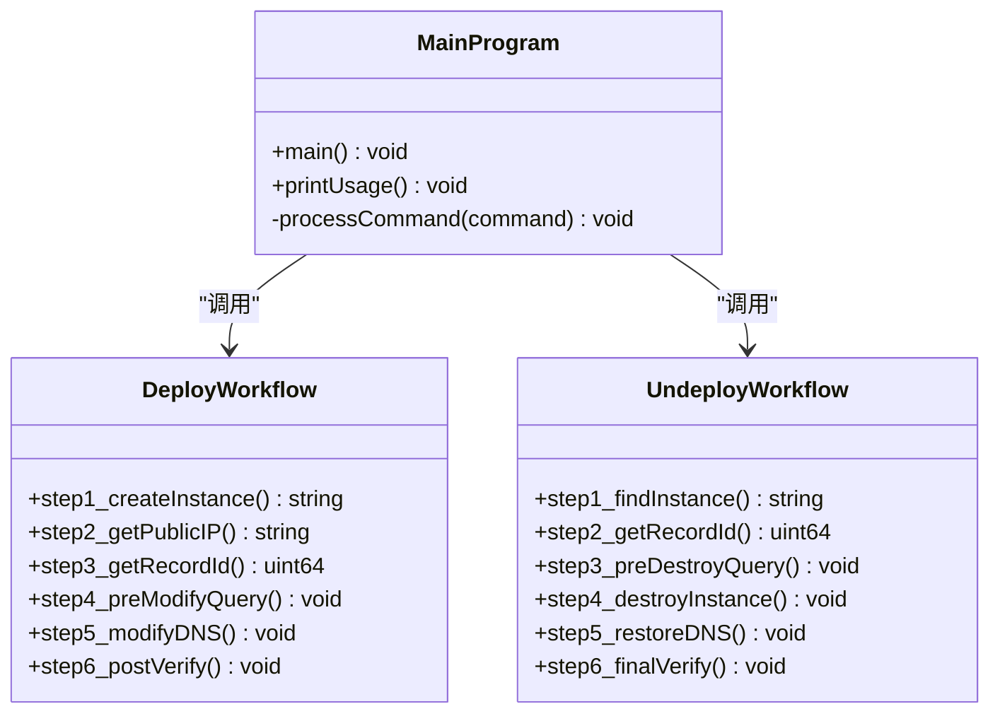
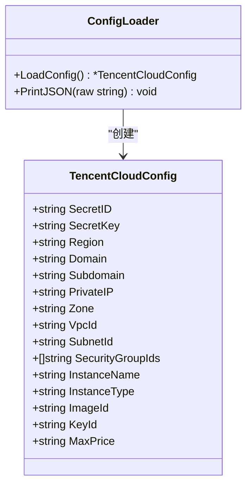
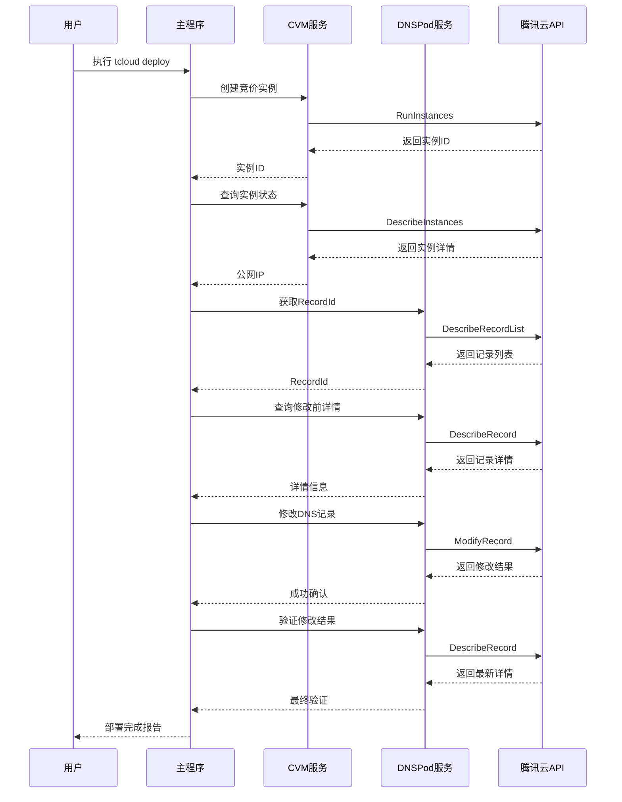
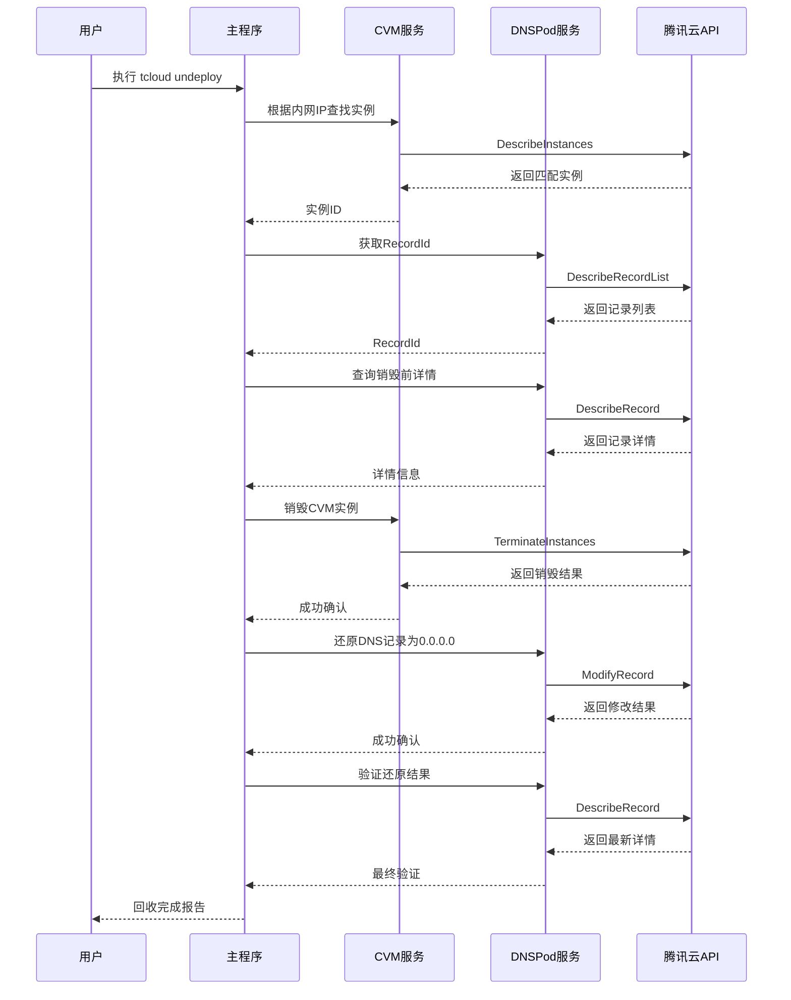
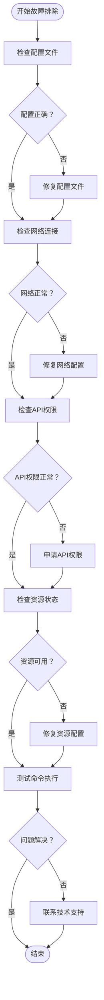

# 自动化工作流命令

<cite>
**本文档引用的文件**
- [main.go](file://cmd/tcloud/main.go)
- [config.go](file://internal/config/config.go)
- [run_instances.go](file://internal/cvm/run_instances.go)
- [describe_instances.go](file://internal/cvm/describe_instances.go)
- [terminate_instances.go](file://internal/cvm/terminate_instances.go)
- [describe_record.go](file://internal/dnspod/describe_record.go)
- [describe_record_list.go](file://internal/dnspod/describe_record_list.go)
- [modify_record.go](file://internal/dnspod/modify_record.go)
- [tencentcloud.json](file://config/tencentcloud.json)
</cite>

## 目录
1. [简介](#简介)
2. [项目结构](#项目结构)
3. [核心组件](#核心组件)
4. [架构概览](#架构概览)
5. [详细组件分析](#详细组件分析)
6. [部署命令详解](#部署命令详解)
7. [回收命令详解](#回收命令详解)
8. [执行日志示例](#执行日志示例)
9. [错误处理与故障排除](#错误处理与故障排除)
10. [性能考虑](#性能考虑)
11. [最佳实践与安全建议](#最佳实践与安全建议)
12. [结论](#结论)

## 简介

这是一个基于腾讯云API的自动化工作流管理工具，提供了完整的云端资源生命周期管理能力。该工具通过简洁的命令行接口实现了CVM实例管理和DNS记录管理的自动化操作，特别针对一键部署（deploy）和一键回收（undeploy）两大核心场景进行了深度优化。

系统采用模块化设计，将腾讯云配置管理、CVM实例管理、DNSPod记录管理等功能分离到独立的包中，确保了代码的可维护性和扩展性。通过统一的配置文件管理，用户可以轻松地在不同环境中部署和管理云资源。

## 项目结构

该项目采用清晰的分层架构设计，主要包含以下核心目录和文件：



**图表来源**
- [main.go:1-220](file://cmd/tcloud/main.go#L1-L220)
- [config.go:1-70](file://internal/config/config.go#L1-L70)

**章节来源**
- [main.go:1-220](file://cmd/tcloud/main.go#L1-L220)
- [config.go:1-70](file://internal/config/config.go#L1-L70)

## 核心组件

### 配置管理系统

配置系统负责管理腾讯云API访问凭证和环境参数，支持从可执行文件目录和源码目录两种方式加载配置文件。

**关键特性：**
- 自动检测配置文件位置
- JSON格式配置文件解析
- 必需参数验证（SecretID和SecretKey）
- 统一的JSON格式化输出工具

### CVM实例管理模块

提供完整的CVM实例生命周期管理功能，包括实例创建、状态查询、公网IP获取和实例销毁。

**核心功能：**
- 竞价实例创建（SPOTPAID）
- 实例状态轮询等待
- 公网IP自动分配检测
- 基于内网IP的实例查找
- 安全的实例销毁操作

### DNSPod记录管理模块

专门用于管理DNS解析记录，支持记录列表查询、单条记录详情获取和记录值修改。

**核心功能：**
- 域名解析记录列表获取
- 单条记录详情查询
- A记录值修改（支持IP地址和0.0.0.0）
- 统一的API错误处理

**章节来源**
- [config.go:11-28](file://internal/config/config.go#L11-L28)
- [run_instances.go:14-92](file://internal/cvm/run_instances.go#L14-L92)
- [describe_instances.go:15-101](file://internal/cvm/describe_instances.go#L15-L101)
- [terminate_instances.go:14-37](file://internal/cvm/terminate_instances.go#L14-L37)
- [describe_record_list.go:14-47](file://internal/dnspod/describe_record_list.go#L14-L47)
- [describe_record.go:14-38](file://internal/dnspod/describe_record.go#L14-L38)
- [modify_record.go:14-42](file://internal/dnspod/modify_record.go#L14-L42)

## 架构概览

系统采用命令行驱动的架构模式，通过单一入口点提供多种管理功能：



**图表来源**
- [main.go:12-196](file://cmd/tcloud/main.go#L12-L196)
- [config.go:31-59](file://internal/config/config.go#L31-L59)

## 详细组件分析

### 主程序架构

主程序采用switch-case模式处理不同的命令，每个命令都封装了完整的业务流程：



**图表来源**
- [main.go:85-132](file://cmd/tcloud/main.go#L85-L132)
- [main.go:147-191](file://cmd/tcloud/main.go#L147-L191)

**章节来源**
- [main.go:12-196](file://cmd/tcloud/main.go#L12-L196)

### 配置管理组件

配置系统采用结构化设计，支持灵活的配置文件管理：



**图表来源**
- [config.go:12-28](file://internal/config/config.go#L12-L28)
- [config.go:31-59](file://internal/config/config.go#L31-L59)

**章节来源**
- [config.go:11-70](file://internal/config/config.go#L11-L70)
- [tencentcloud.json:1-18](file://config/tencentcloud.json#L1-L18)

## 部署命令详解

### 完整工作流程

部署命令（deploy）实现了从零开始的完整自动化部署流程，包含六个精确的步骤：



**图表来源**
- [main.go:85-132](file://cmd/tcloud/main.go#L85-L132)
- [run_instances.go:14-92](file://internal/cvm/run_instances.go#L14-L92)
- [describe_instances.go:15-64](file://internal/cvm/describe_instances.go#L15-L64)
- [describe_record_list.go:14-47](file://internal/dnspod/describe_record_list.go#L14-L47)
- [describe_record.go:14-38](file://internal/dnspod/describe_record.go#L14-L38)
- [modify_record.go:14-42](file://internal/dnspod/modify_record.go#L14-L42)

### 步骤详细分析

#### 第一步：实例创建
- **前置条件**：有效的腾讯云凭证、正确的区域配置、可用的VPC和子网
- **执行过程**：创建竞价实例，设置实例类型、镜像、安全组等参数
- **输出结果**：返回实例ID，用于后续步骤

#### 第二步：公网IP获取
- **前置条件**：实例已成功创建且处于运行状态
- **执行过程**：轮询查询实例状态，等待公网IP分配完成
- **超时机制**：最多重试20次，每次间隔5秒

#### 第三步：RecordId提取
- **前置条件**：域名和子域名配置正确
- **执行过程**：查询DNS记录列表，提取第一条记录的RecordId

#### 第四步：DNS修改前查询
- **前置条件**：已获取到RecordId
- **执行过程**：查询当前DNS记录的详细信息作为备份

#### 第五步：DNS记录修改
- **前置条件**：公网IP已成功获取
- **执行过程**：将A记录指向新的公网IP地址

#### 第六步：修改后验证
- **前置条件**：DNS修改已完成
- **执行过程**：再次查询记录详情，确认修改生效

**章节来源**
- [main.go:85-132](file://cmd/tcloud/main.go#L85-L132)
- [run_instances.go:14-92](file://internal/cvm/run_instances.go#L14-L92)
- [describe_instances.go:15-64](file://internal/cvm/describe_instances.go#L15-L64)
- [describe_record_list.go:14-47](file://internal/dnspod/describe_record_list.go#L14-L47)
- [describe_record.go:14-38](file://internal/dnspod/describe_record.go#L14-L38)
- [modify_record.go:14-42](file://internal/dnspod/modify_record.go#L14-L42)

## 回收命令详解

### 逆向工作流程

回收命令（undeploy）执行与部署相反的完整回收流程：



**图表来源**
- [main.go:147-191](file://cmd/tcloud/main.go#L147-L191)
- [describe_instances.go:66-100](file://internal/cvm/describe_instances.go#L66-L100)
- [terminate_instances.go:14-37](file://internal/cvm/terminate_instances.go#L14-L37)
- [describe_record_list.go:14-47](file://internal/dnspod/describe_record_list.go#L14-L47)
- [modify_record.go:14-42](file://internal/dnspod/modify_record.go#L14-L42)

### 步骤详细分析

#### 第一步：实例查找
- **前置条件**：配置文件中的PrivateIP设置正确
- **执行过程**：遍历所有实例，匹配指定的内网IP地址

#### 第二步：RecordId获取
- **前置条件**：域名配置正确
- **执行过程**：查询DNS记录列表获取RecordId

#### 第三步：销毁前查询
- **前置条件**：已获取到RecordId
- **执行过程**：查询当前DNS记录详情作为备份

#### 第四步：实例销毁
- **前置条件**：实例ID有效
- **执行过程**：安全销毁CVM实例

#### 第五步：DNS还原
- **前置条件**：实例已成功销毁
- **执行过程**：将DNS记录指向0.0.0.0，实现域名失效

#### 第六步：最终验证
- **前置条件**：DNS还原已完成
- **执行过程**：验证DNS记录状态

**章节来源**
- [main.go:147-191](file://cmd/tcloud/main.go#L147-L191)
- [describe_instances.go:66-100](file://internal/cvm/describe_instances.go#L66-L100)
- [terminate_instances.go:14-37](file://internal/cvm/terminate_instances.go#L14-L37)
- [describe_record_list.go:14-47](file://internal/dnspod/describe_record_list.go#L14-L47)
- [modify_record.go:14-42](file://internal/dnspod/modify_record.go#L14-L42)

## 执行日志示例

### 部署命令完整执行日志

```
========== 第1步：购买竞价实例 ==========
=== 创建实例结果 ===
{
    "Response": {
        "InstanceIdSet": ["ins-xxxxxxxx"],
        "RequestId": "xxxxxxxx-xxxx-xxxx-xxxx-xxxxxxxxxxxx"
    }
}

实例ID: ins-xxxxxxxx

========== 第2步：获取公网IP ==========
等待实例分配公网IP...
  第 1/20 次查询，实例状态: RUNNING，等待中...
  第 2/20 次查询，实例状态: RUNNING，等待中...
  第 3/20 次查询，实例状态: RUNNING，等待中...
  第 4/20 次查询，实例状态: RUNNING，等待中...
  第 5/20 次查询，实例状态: RUNNING，等待中...
实例已运行，公网IP: 203.0.113.100
公网IP: 203.0.113.100

========== 第3步：获取 RecordId ==========
=== 记录列表 ===
{
    "Response": {
        "RecordList": [
            {
                "RecordId": 123456789,
                "Name": "cvm.niubility.work",
                "Type": "A",
                "Value": "0.0.0.0",
                "Enabled": 1,
                "Status": "enable"
            }
        ],
        "RequestId": "xxxxxxxx-xxxx-xxxx-xxxx-xxxxxxxxxxxx"
    }
}

获取到的 RecordId: 123456789

========== 第4步：修改前的域名解析信息 ==========
=== 记录详情 ===
{
    "Response": {
        "Record": {
            "RecordId": 123456789,
            "Name": "cvm.niubility.work",
            "Type": "A",
            "Value": "0.0.0.0",
            "Enabled": 1,
            "Status": "enable"
        },
        "RequestId": "xxxxxxxx-xxxx-xxxx-xxxx-xxxxxxxxxxxx"
    }
}

========== 第5步：修改DNS A记录 ==========
将 cvm.niubility.work 指向 203.0.113.100
=== 修改记录结果 ===
{
    "Response": {
        "RecordId": 123456789,
        "RequestId": "xxxxxxxx-xxxx-xxxx-xxxx-xxxxxxxxxxxx"
    }
}

========== 第6步：修改后的域名解析信息 ==========
=== 记录详情 ===
{
    "Response": {
        "Record": {
            "RecordId": 123456789,
            "Name": "cvm.niubility.work",
            "Type": "A",
            "Value": "203.0.113.100",
            "Enabled": 1,
            "Status": "enable"
        },
        "RequestId": "xxxxxxxx-xxxx-xxxx-xxxx-xxxxxxxxxxxx"
    }
}

========== 部署完成 ==========
实例ID: ins-xxxxxxxx
公网IP: 203.0.113.100
域名: cvm.niubility.work → 203.0.113.100
```

### 回收命令完整执行日志

```
========== 第1步：根据内网IP查找实例 ==========
=== 实例列表 ===
{
    "Response": {
        "InstanceSet": [
            {
                "InstanceId": "ins-xxxxxxxx",
                "InstanceName": "未命名",
                "PrivateIpAddresses": ["172.19.0.100"],
                "PublicIpAddresses": ["203.0.113.100"],
                "InstanceState": "RUNNING"
            }
        ],
        "RequestId": "xxxxxxxx-xxxx-xxxx-xxxx-xxxxxxxxxxxx"
    }
}

找到匹配内网IP 172.19.0.100 的实例: ins-xxxxxxxx (状态: RUNNING)

========== 第2步：获取 RecordId ==========
=== 记录列表 ===
{
    "Response": {
        "RecordList": [
            {
                "RecordId": 123456789,
                "Name": "cvm.niubility.work",
                "Type": "A",
                "Value": "203.0.113.100",
                "Enabled": 1,
                "Status": "enable"
            }
        ],
        "RequestId": "xxxxxxxx-xxxx-xxxx-xxxx-xxxxxxxxxxxx"
    }
}

获取到的 RecordId: 123456789

========== 第3步：销毁前的域名解析信息 ==========
=== 记录详情 ===
{
    "Response": {
        "Record": {
            "RecordId": 123456789,
            "Name": "cvm.niubility.work",
            "Type": "A",
            "Value": "203.0.113.100",
            "Enabled": 1,
            "Status": "enable"
        },
        "RequestId": "xxxxxxxx-xxxx-xxxx-xxxx-xxxxxxxxxxxx"
    }
}

========== 第4步：销毁CVM实例 ==========
=== 销毁实例结果 ===
{
    "Response": {
        "RequestId": "xxxxxxxx-xxxx-xxxx-xxxx-xxxxxxxxxxxx"
    }
}

========== 第5步：修改DNS A记录（还原为 0.0.0.0） ==========
将 cvm.niubility.work 指向 0.0.0.0
=== 修改记录结果 ===
{
    "Response": {
        "RecordId": 123456789,
        "RequestId": "xxxxxxxx-xxxx-xxxx-xxxx-xxxxxxxxxxxx"
    }
}

========== 第6步：修改后的域名解析信息 ==========
=== 记录详情 ===
{
    "Response": {
        "Record": {
            "RecordId": 123456789,
            "Name": "cvm.niubility.work",
            "Type": "A",
            "Value": "0.0.0.0",
            "Enabled": 1,
            "Status": "enable"
        },
        "RequestId": "xxxxxxxx-xxxx-xxxx-xxxx-xxxxxxxxxxxx"
    }
}

========== 回收完成 ==========
已销毁实例: ins-xxxxxxxx
域名: cvm.niubility.work → 0.0.0.0
```

## 错误处理与故障排除

### 常见错误类型及解决方案

#### 配置相关错误

| 错误类型 | 错误信息 | 可能原因 | 解决方案 |
|---------|---------|---------|---------|
| 配置文件加载失败 | "读取配置文件失败" | 文件不存在或权限不足 | 检查config/tencentcloud.json文件路径和权限 |
| 凭证无效 | "配置文件中 secret_id 或 secret_key 为空" | 凭证配置错误 | 更新配置文件中的SecretID和SecretKey |
| 区域配置错误 | "API错误: InvalidParameter" | 区域参数不正确 | 检查配置文件中的region字段 |

#### CVM实例相关错误

| 错误类型 | 错误信息 | 可能原因 | 解决方案 |
|---------|---------|---------|---------|
| 实例创建失败 | "API错误: ChargeTypeNotSupported" | 计费方式不支持 | 检查实例计费类型配置 |
| 公网IP获取超时 | "等待超时：实例未能在规定时间内获取公网IP" | 网络配置问题 | 检查VPC和子网配置，确认公网IP分配 |
| 实例销毁失败 | "API错误: InvalidInstanceId.NotFound" | 实例ID无效 | 重新获取正确的实例ID |

#### DNSPod相关错误

| 错误类型 | 错误信息 | 可能原因 | 解决方案 |
|---------|---------|---------|---------|
| 记录查询失败 | "未找到任何解析记录" | 域名配置错误 | 检查配置文件中的domain和subdomain |
| 记录修改失败 | "API错误: InvalidParameter" | 参数格式错误 | 验证RecordId和IP地址格式 |
| 权限不足 | "API错误: UnauthorizedOperation" | API权限不足 | 检查DNSPod API权限配置 |

### 故障排除流程图



**章节来源**
- [config.go:44-58](file://internal/config/config.go#L44-L58)
- [run_instances.go:73-78](file://internal/cvm/run_instances.go#L73-L78)
- [describe_instances.go:31-36](file://internal/cvm/describe_instances.go#L31-L36)
- [describe_record_list.go:27-32](file://internal/dnspod/describe_record_list.go#L27-L32)

## 性能考虑

### 系统性能特征

#### 并发处理
- **异步API调用**：各模块采用独立的API客户端，支持并发执行
- **轮询机制**：实例状态查询采用指数退避策略，避免过度请求
- **批量操作**：支持一次操作多个实例或记录

#### 资源优化
- **内存管理**：配置数据结构紧凑，避免不必要的内存占用
- **网络优化**：API客户端复用，减少连接开销
- **缓存策略**：DNS记录查询结果可进行短期缓存

#### 扩展性设计
- **插件架构**：支持添加新的云服务商或服务类型
- **配置驱动**：通过配置文件控制行为，无需修改代码
- **模块化设计**：各功能模块独立，便于单独测试和维护

## 最佳实践与安全建议

### 安全最佳实践

#### 凭证管理
- **最小权限原则**：为不同环境配置不同的API权限
- **定期轮换**：定期更新SecretID和SecretKey
- **环境隔离**：开发、测试、生产环境使用独立的凭证
- **加密存储**：敏感信息建议加密存储

#### 操作安全
- **双人审批**：重要操作建议实施双人审批机制
- **操作审计**：启用详细的操作日志记录
- **回滚机制**：建立完善的回滚和恢复机制
- **变更管理**：所有配置变更必须经过审批

#### 网络安全
- **VPC隔离**：生产环境使用专用VPC
- **安全组配置**：严格限制入站和出站流量
- **监控告警**：建立完善的监控和告警系统
- **DDoS防护**：启用适当的防护措施

### 集成最佳实践

#### CI/CD集成
- **自动化部署**：将部署命令集成到CI/CD流水线
- **环境管理**：使用环境变量管理不同环境配置
- **蓝绿部署**：支持蓝绿部署策略，降低风险
- **健康检查**：集成健康检查和自动恢复机制

#### 监控集成
- **指标收集**：收集实例和DNS的性能指标
- **告警配置**：设置合理的告警阈值和通知机制
- **日志聚合**：集中收集和分析操作日志
- **成本监控**：监控云资源使用成本

#### 备份策略
- **配置备份**：定期备份配置文件
- **数据备份**：确保重要数据有备份
- **灾难恢复**：制定完整的灾难恢复计划
- **测试演练**：定期进行恢复演练

### 使用建议

#### 开发环境
- **测试优先**：先在测试环境验证所有操作
- **逐步推进**：从小规模开始，逐步扩大范围
- **监控观察**：密切监控系统状态和性能
- **文档记录**：详细记录每次操作的过程和结果

#### 生产环境
- **时间窗口**：选择业务低峰期执行重大操作
- **应急预案**：准备完整的应急响应计划
- **人员培训**：确保相关人员熟悉操作流程
- **质量保证**：建立完善的质量保证体系

## 结论

这个自动化工作流命令系统为云资源管理提供了完整、可靠的解决方案。通过精心设计的模块化架构和严谨的错误处理机制，系统能够安全、高效地执行复杂的云资源操作。

### 主要优势

1. **完整性**：覆盖了从资源创建到销毁的完整生命周期
2. **可靠性**：完善的错误处理和重试机制
3. **易用性**：简洁的命令行接口和详细的帮助信息
4. **安全性**：遵循安全最佳实践，支持权限控制
5. **可扩展性**：模块化设计支持功能扩展和定制

### 技术特色

- **自动化程度高**：减少了人工干预的需求
- **可视化反馈**：详细的执行日志和状态信息
- **错误恢复**：支持部分失败时的恢复操作
- **配置灵活**：通过配置文件控制行为

### 发展方向

随着云服务的不断发展，该系统可以在以下方面进一步完善：
- 支持更多云服务商和服务类型
- 增强监控和告警功能
- 提供更丰富的API接口
- 加强与其他运维工具的集成

通过持续的改进和完善，这个系统将成为云资源管理的重要工具，为企业数字化转型提供强有力的技术支撑。