# 开发者指南

<cite>
**本文档引用的文件**
- [main.go](file://cmd/tcloud/main.go)
- [config.go](file://internal/config/config.go)
- [describe_instances.go](file://internal/cvm/describe_instances.go)
- [run_instances.go](file://internal/cvm/run_instances.go)
- [terminate_instances.go](file://internal/cvm/terminate_instances.go)
- [describe_record.go](file://internal/dnspod/describe_record.go)
- [describe_record_list.go](file://internal/dnspod/describe_record_list.go)
- [modify_record.go](file://internal/dnspod/modify_record.go)
- [go.mod](file://go.mod)
- [.gitignore](file://.gitignore)
</cite>

## 目录
1. [简介](#简介)
2. [项目结构](#项目结构)
3. [核心组件](#核心组件)
4. [架构概览](#架构概览)
5. [详细组件分析](#详细组件分析)
6. [依赖分析](#依赖分析)
7. [扩展开发指南](#扩展开发指南)
8. [测试策略](#测试策略)
9. [调试方法](#调试方法)
10. [错误处理与日志](#错误处理与日志)
11. [性能优化建议](#性能优化建议)
12. [安全加固措施](#安全加固措施)
13. [贡献与发布流程](#贡献与发布流程)
14. [故障排除指南](#故障排除指南)
15. [结论](#结论)

## 简介

这是一个基于腾讯云API的自动化管理工具，集成了CVM（云服务器）和DNSPod（域名解析）服务的管理功能。该工具提供了完整的基础设施即代码（IaC）解决方案，支持一键部署、回收和管理云资源。

项目采用模块化设计，通过清晰的分层架构实现了功能分离：命令行入口负责用户交互，配置模块管理环境变量，业务模块封装具体的API调用逻辑。

## 项目结构

项目采用标准的Go模块结构，主要分为以下几个层次：

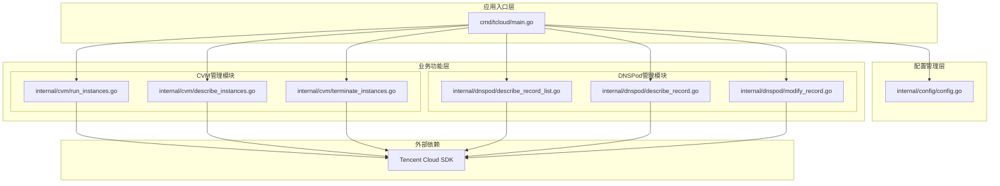

**图表来源**
- [main.go:12-196](file://cmd/tcloud/main.go#L12-L196)
- [config.go:31-59](file://internal/config/config.go#L31-L59)

**章节来源**
- [main.go:1-220](file://cmd/tcloud/main.go#L1-L220)
- [go.mod:1-10](file://go.mod#L1-L10)

## 核心组件

### 命令行入口组件

主程序作为系统的唯一入口点，负责：
- 解析命令行参数
- 加载配置文件
- 路由到相应的功能模块
- 处理用户交互和输出格式化

### 配置管理组件

配置模块提供统一的配置加载和验证机制：
- 支持从多个位置加载配置文件
- 验证必需的认证信息
- 提供JSON格式化输出工具

### 业务功能组件

系统包含两个主要的业务模块，每个模块都封装了完整的CRUD操作：

**CVM管理模块**：负责云服务器实例的生命周期管理
**DNSPod管理模块**：负责域名解析记录的查询和修改

**章节来源**
- [main.go:12-196](file://cmd/tcloud/main.go#L12-L196)
- [config.go:31-59](file://internal/config/config.go#L31-L59)

## 架构概览

系统采用分层架构设计，确保了良好的关注点分离和可维护性：

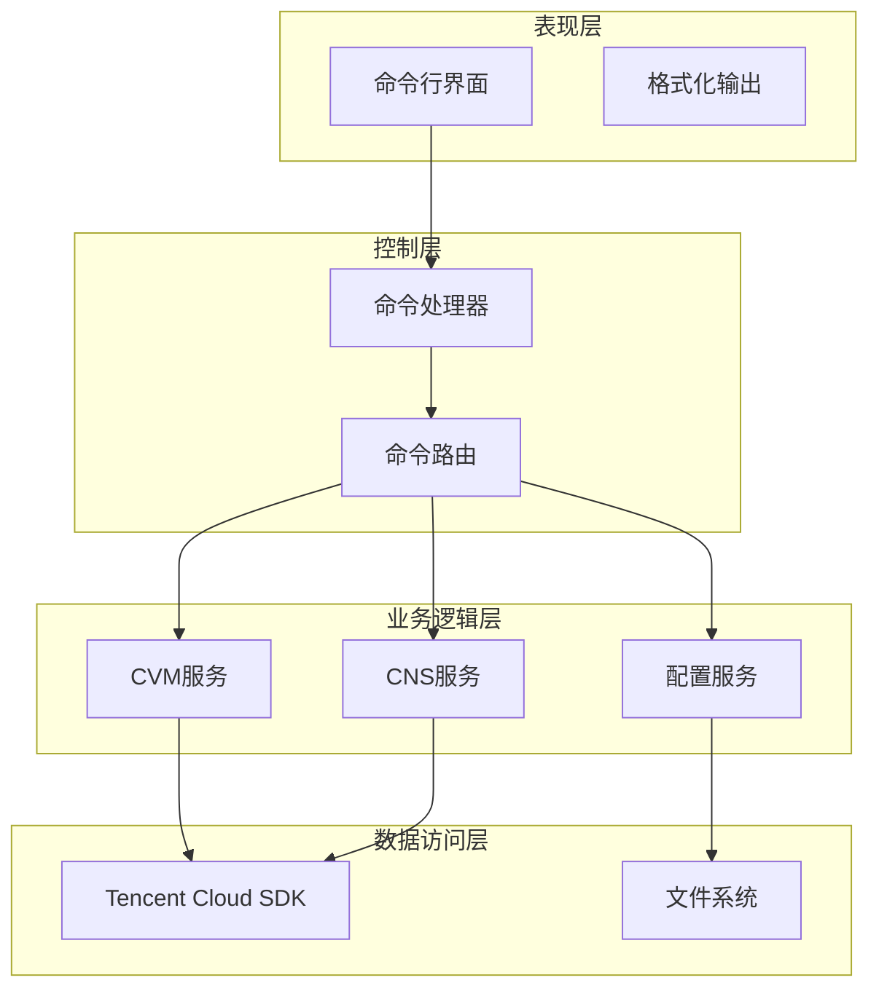

**图表来源**
- [main.go:27-196](file://cmd/tcloud/main.go#L27-L196)
- [config.go:31-59](file://internal/config/config.go#L31-L59)

## 详细组件分析

### 命令行接口设计

#### 主要命令类型

系统支持以下核心命令：

| 命令 | 功能描述 | 参数 | 使用场景 |
|------|----------|------|----------|
| `list` | 获取DNS记录列表 | `--detail` | 查看域名解析状态 |
| `describe` | 查询DNS记录详情 | 无 | 验证域名配置 |
| `modify <IP>` | 修改DNS记录值 | 新IP地址 | 更新域名指向 |
| `run-instances` | 创建竞价实例 | 无 | 启动新服务器 |
| `deploy` | 一键部署 | 无 | 完整的部署流程 |
| `destroy` | 销毁实例 | 无 | 清理资源 |
| `undeploy` | 一键回收 | 无 | 完整的回收流程 |

#### 命令执行流程

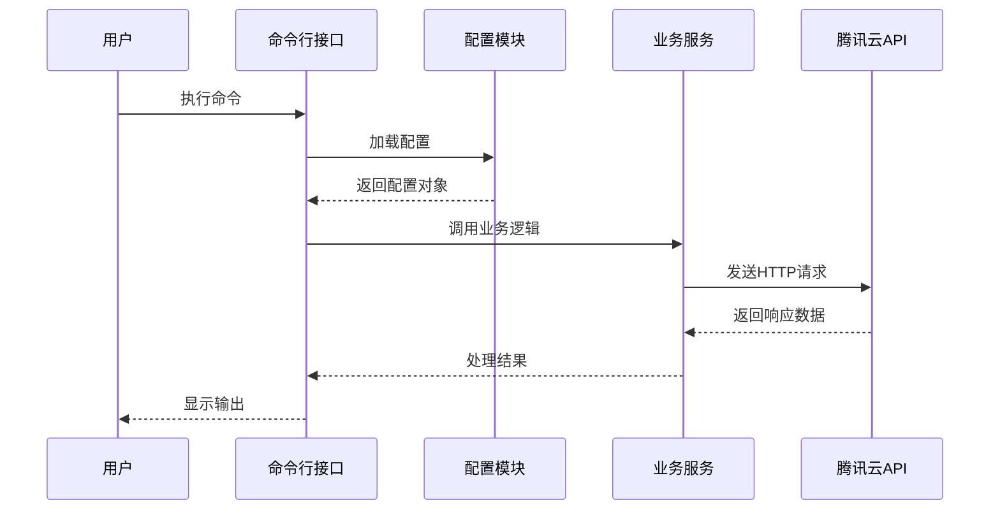

**图表来源**
- [main.go:27-196](file://cmd/tcloud/main.go#L27-L196)
- [config.go:31-59](file://internal/config/config.go#L31-L59)

**章节来源**
- [main.go:199-219](file://cmd/tcloud/main.go#L199-L219)

### 配置管理系统

#### 配置数据结构

配置模块定义了完整的腾讯云配置结构：

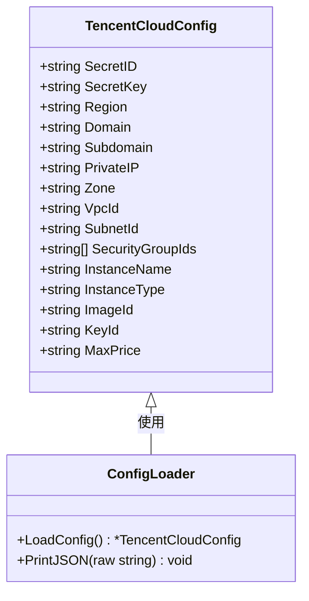

**图表来源**
- [config.go:11-28](file://internal/config/config.go#L11-L28)
- [config.go:30-69](file://internal/config/config.go#L30-L69)

#### 配置加载策略

配置模块实现了智能的配置文件加载机制：
- 首先尝试从可执行文件所在目录加载
- 如果失败，回退到源码目录
- 提供详细的错误信息和验证

**章节来源**
- [config.go:31-59](file://internal/config/config.go#L31-L59)

### CVM管理模块

#### 实例生命周期管理

CVM模块提供了完整的实例管理功能：

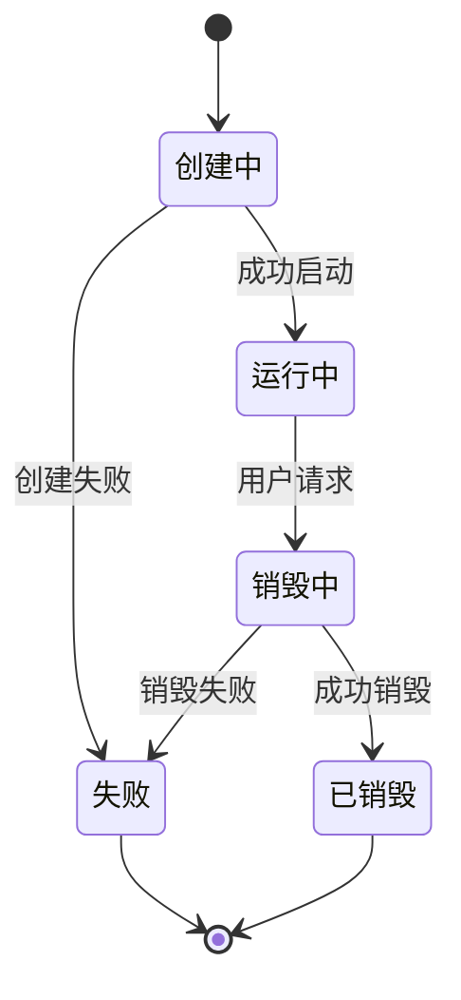

**图表来源**
- [run_instances.go:14-91](file://internal/cvm/run_instances.go#L14-L91)
- [describe_instances.go:15-64](file://internal/cvm/describe_instances.go#L15-L64)

#### 关键功能实现

**实例创建功能**：
- 支持竞价实例（Spot Instance）
- 配置网络和安全设置
- 设置登录凭据和监控服务

**实例查询功能**：
- 支持轮询查询公网IP
- 等待实例进入运行状态
- 提供详细的实例信息

**实例销毁功能**：
- 支持按实例ID销毁
- 提供确认和反馈机制

**章节来源**
- [run_instances.go:14-91](file://internal/cvm/run_instances.go#L14-L91)
- [describe_instances.go:15-100](file://internal/cvm/describe_instances.go#L15-L100)
- [terminate_instances.go:14-36](file://internal/cvm/terminate_instances.go#L14-L36)

### DNSPod管理模块

#### 域名解析管理

DNSPod模块专注于域名解析记录的管理：

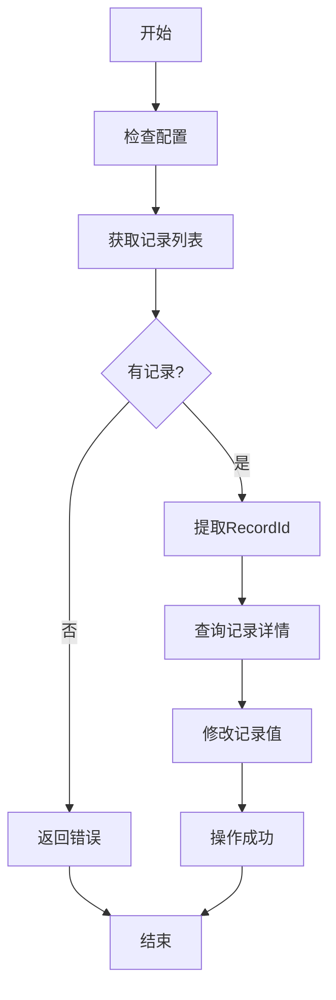

**图表来源**
- [describe_record_list.go:14-46](file://internal/dnspod/describe_record_list.go#L14-L46)
- [describe_record.go:14-37](file://internal/dnspod/describe_record.go#L14-L37)
- [modify_record.go:14-41](file://internal/dnspod/modify_record.go#L14-L41)

#### 核心功能特性

**记录查询功能**：
- 支持按域名和子域名查询
- 返回完整的记录列表
- 提供JSON格式化输出

**记录修改功能**：
- 支持动态IP更新
- 维护默认解析线路
- 提供修改前后对比

**记录详情查询**：
- 获取单条记录的完整信息
- 包含解析状态和TTL设置
- 支持调试和验证

**章节来源**
- [describe_record_list.go:14-46](file://internal/dnspod/describe_record_list.go#L14-L46)
- [describe_record.go:14-37](file://internal/dnspod/describe_record.go#L14-L37)
- [modify_record.go:14-41](file://internal/dnspod/modify_record.go#L14-L41)

## 依赖分析

### 外部依赖关系

项目使用了腾讯云官方SDK，实现了对多个云服务的统一访问：

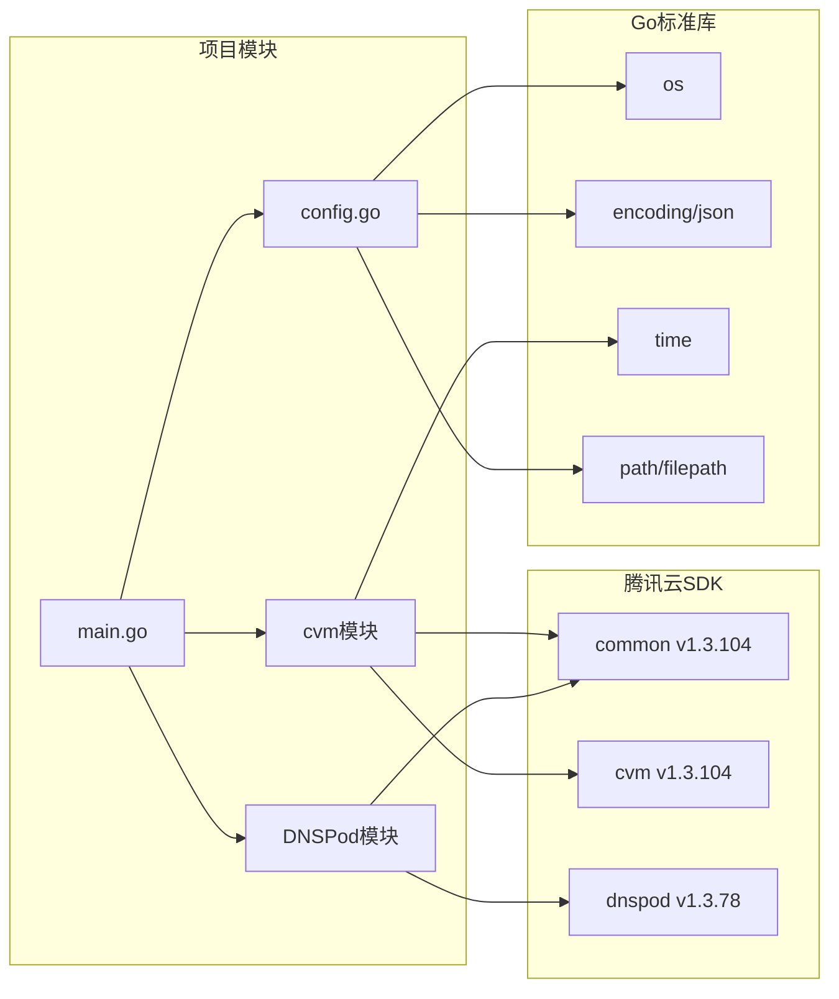

**图表来源**
- [go.mod:5-9](file://go.mod#L5-L9)
- [main.go:3-10](file://cmd/tcloud/main.go#L3-L10)

### 内部模块依赖

模块间的依赖关系保持简单清晰，遵循单一职责原则：

- 主程序依赖所有业务模块
- 业务模块共享配置模块
- 业务模块不相互依赖
- 配置模块不依赖业务模块

**章节来源**
- [go.mod:1-10](file://go.mod#L1-L10)

## 扩展开发指南

### 新功能开发流程

#### 1. 添加新的业务模块

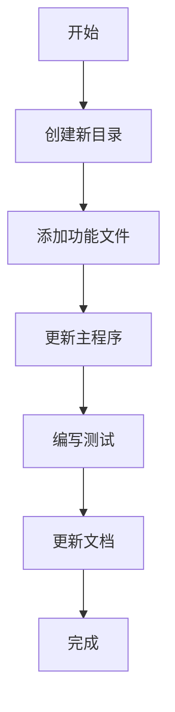

**开发步骤**：
1. 在`internal/`目录下创建新模块目录
2. 实现核心业务逻辑函数
3. 在主程序中注册新命令
4. 编写单元测试和集成测试
5. 更新使用文档

#### 2. 扩展现有模块功能

**最佳实践**：
- 保持向后兼容性
- 添加适当的错误处理
- 提供详细的日志输出
- 编写对应的测试用例

#### 3. 接口设计原则

**设计模式**：
- 使用接口抽象业务逻辑
- 保持函数签名一致性
- 提供清晰的错误信息
- 支持配置驱动的扩展

**章节来源**
- [main.go:27-196](file://cmd/tcloud/main.go#L27-L196)

### 代码组织规范

#### 文件命名约定
- 业务逻辑文件使用小写命名
- 功能相关的函数在同一文件中
- 测试文件以`_test.go`结尾

#### 包结构设计
- 每个模块独立成包
- 共享功能放在`internal/config`中
- 避免循环依赖

## 测试策略

### 单元测试

#### 测试框架选择

推荐使用Go标准库的testing包，结合mock对象进行测试。

#### 测试覆盖范围

**核心测试类别**：
- 配置加载和验证
- API调用模拟
- 错误处理路径
- 边界条件测试

#### 测试用例设计

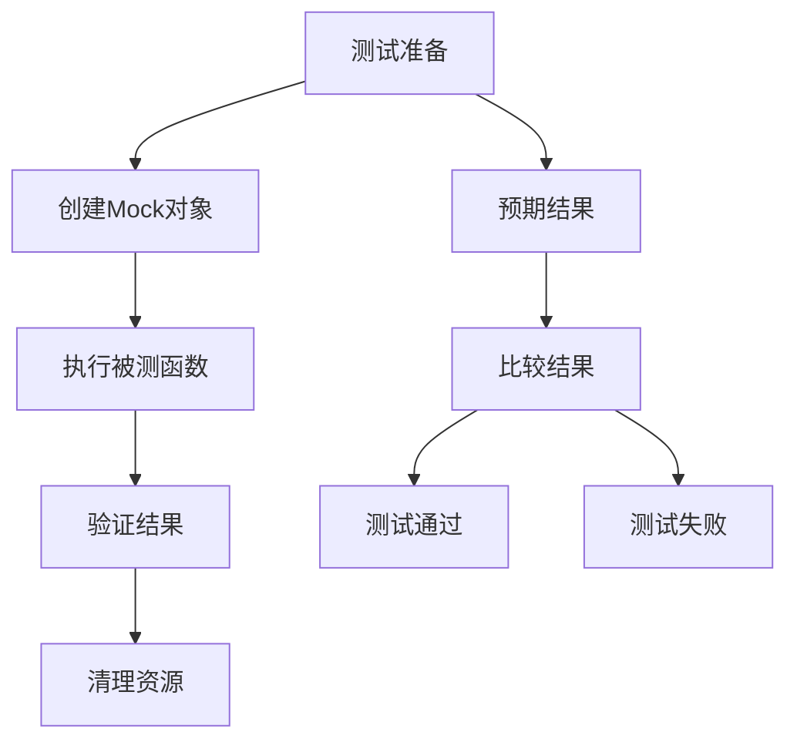

### 集成测试

#### 环境要求

- 腾讯云账号和API密钥
- 有效的域名和解析记录
- 测试用的VPC和子网配置

#### 测试策略

**安全测试**：
- 使用测试专用的API密钥
- 避免影响生产环境
- 自动清理测试资源

**稳定性测试**：
- 网络异常处理
- API限流应对
- 超时重试机制

## 调试方法

### 开发调试技巧

#### 日志记录策略

**日志级别**：
- 错误级别：API调用失败
- 调试级别：详细的操作过程
- 信息级别：重要的系统状态

#### 调试工具

**常用工具**：
- Go调试器（dlv）
- 网络抓包工具
- API测试工具

#### 常见问题诊断

**连接问题**：
- 检查网络连通性
- 验证API密钥权限
- 确认区域配置正确

**认证问题**：
- 验证密钥格式
- 检查权限范围
- 确认时间同步

**章节来源**
- [main.go:199-219](file://cmd/tcloud/main.go#L199-L219)

## 错误处理与日志

### 错误处理机制

系统实现了多层次的错误处理：

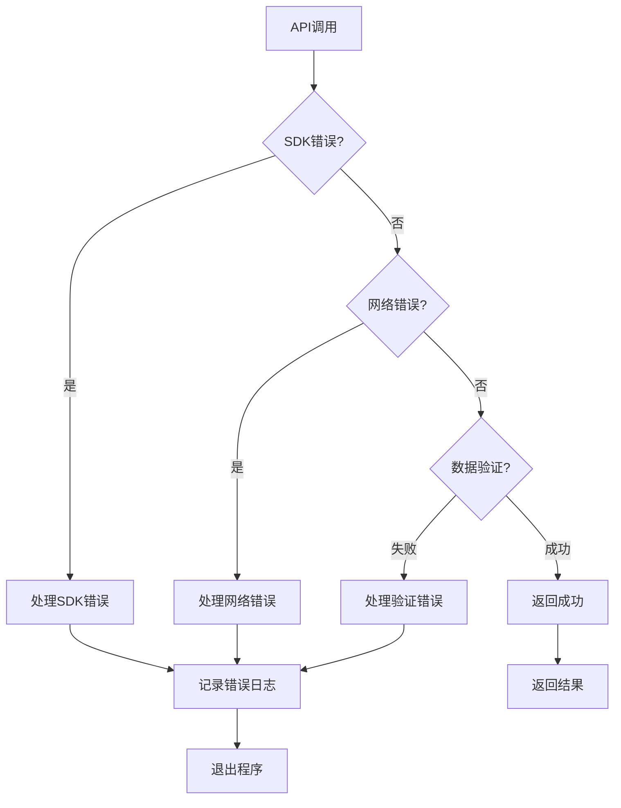

**图表来源**
- [describe_instances.go:31-36](file://internal/cvm/describe_instances.go#L31-L36)
- [run_instances.go:73-78](file://internal/cvm/run_instances.go#L73-L78)

### 日志记录规范

#### 日志格式

**统一的日志输出格式**：
- 时间戳：ISO 8601格式
- 级别：ERROR/INFO/DEBUG
- 模块：功能模块标识
- 消息：具体的操作信息

#### 错误分类

**错误类型**：
- 配置错误：配置文件缺失或格式错误
- 认证错误：API密钥无效或权限不足
- 网络错误：连接超时或网络中断
- 业务错误：API返回的业务异常

**章节来源**
- [config.go:54-56](file://internal/config/config.go#L54-L56)

## 性能优化建议

### 代码性能优化

#### 并发处理

**优化策略**：
- 使用goroutine处理独立的API调用
- 实现带超时的HTTP请求
- 合理使用连接池

#### 内存管理

**最佳实践**：
- 避免不必要的字符串拼接
- 及时释放大对象
- 使用缓冲区复用

### 网络性能优化

#### 请求优化

**优化措施**：
- 实现指数退避重试
- 使用连接复用
- 减少不必要的API调用

#### 缓存策略

**缓存设计**：
- DNS记录ID缓存
- 实例状态缓存
- 配置信息缓存

## 安全加固措施

### 密钥安全管理

#### 密钥存储

**安全存储方案**：
- 使用环境变量存储敏感信息
- 配置文件加密存储
- 临时密钥轮换机制

#### 权限控制

**最小权限原则**：
- 限制API密钥权限范围
- 使用只读权限进行查询
- 定期审查权限设置

### 网络安全

#### 传输安全

**安全传输**：
- 强制HTTPS协议
- 证书验证机制
- 网络隔离策略

#### 输入验证

**输入保护**：
- 严格的参数验证
- SQL注入防护
- XSS攻击防护

## 贡献与发布流程

### 代码贡献流程

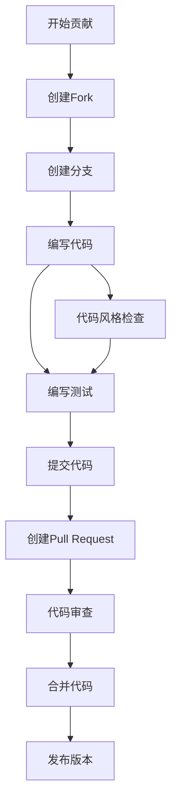

### 版本发布流程

#### 发布准备

**发布检查清单**：
- 所有测试通过
- 文档更新完成
- 版本号更新
- 变更日志编写

#### 自动化发布

**CI/CD流程**：
- 自动构建测试
- 自动打包发布
- 自动部署更新
- 自动通知团队

### 代码质量保证

#### 代码审查

**审查标准**：
- 功能正确性
- 代码可读性
- 性能考虑
- 安全性评估

#### 持续集成

**集成策略**：
- 每次提交触发测试
- 多平台兼容性测试
- 性能回归检测
- 安全扫描

## 故障排除指南

### 常见问题解决

#### 配置问题

**问题症状**：
- 配置文件加载失败
- API密钥验证失败
- 区域设置错误

**解决方法**：
1. 检查配置文件格式
2. 验证API密钥权限
3. 确认区域配置正确

#### 网络问题

**问题症状**：
- API调用超时
- 连接被拒绝
- DNS解析失败

**解决方法**：
1. 检查网络连通性
2. 验证防火墙设置
3. 测试代理配置

#### 权限问题

**问题症状**：
- API调用被拒绝
- 权限不足错误
- 访问被限制

**解决方法**：
1. 检查IAM权限
2. 验证安全组规则
3. 审查VPC网络配置

### 调试工具使用

#### 网络调试

**常用工具**：
- curl测试API端点
- tcpdump抓包分析
- nslookup域名解析

#### 日志分析

**日志查看**：
- 查看系统日志
- 分析应用日志
- 监控API调用

**章节来源**
- [main.go:13-23](file://cmd/tcloud/main.go#L13-L23)

## 结论

本项目提供了一个完整的云资源管理解决方案，具有以下特点：

**架构优势**：
- 清晰的模块化设计
- 良好的扩展性
- 完善的错误处理
- 详细的日志记录

**开发体验**：
- 简洁的命令行接口
- 丰富的功能覆盖
- 完善的文档支持
- 易于扩展的架构

**最佳实践**：
- 遵循Go语言开发规范
- 实施安全加固措施
- 建立完善的测试体系
- 提供详细的使用文档

通过遵循本指南，开发者可以快速理解和扩展这个项目，同时保持代码质量和系统稳定性。