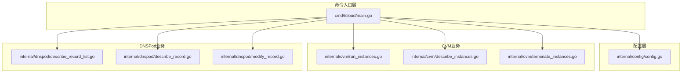
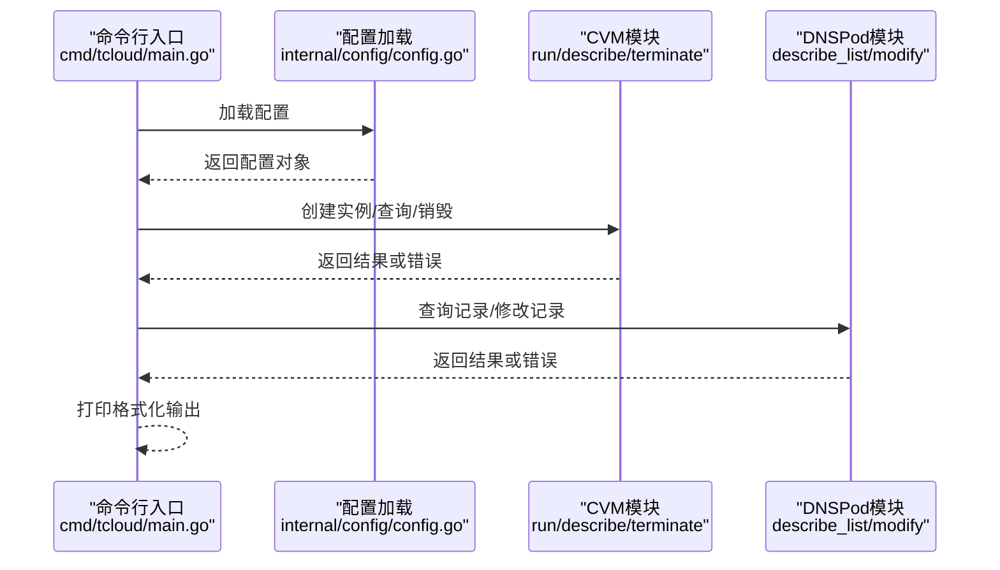
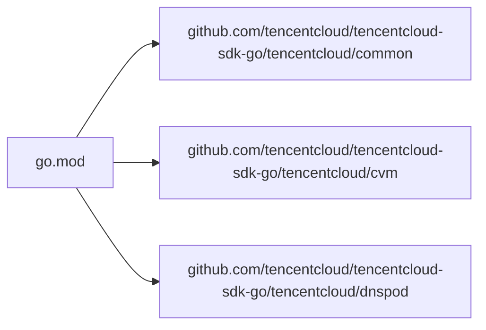

# 性能优化与安全

<cite>
**本文引用的文件**
- [cmd/tcloud/main.go](file://cmd/tcloud/main.go)
- [internal/config/config.go](file://internal/config/config.go)
- [internal/cvm/describe_instances.go](file://internal/cvm/describe_instances.go)
- [internal/cvm/run_instances.go](file://internal/cvm/run_instances.go)
- [internal/cvm/terminate_instances.go](file://internal/cvm/terminate_instances.go)
- [internal/dnspod/describe_record.go](file://internal/dnspod/describe_record.go)
- [internal/dnspod/describe_record_list.go](file://internal/dnspod/describe_record_list.go)
- [internal/dnspod/modify_record.go](file://internal/dnspod/modify_record.go)
- [go.mod](file://go.mod)
- [config/tencentcloud.json](file://config/tencentcloud.json)
</cite>

## 目录
1. [简介](#简介)
2. [项目结构](#项目结构)
3. [核心组件](#核心组件)
4. [架构总览](#架构总览)
5. [详细组件分析](#详细组件分析)
6. [依赖分析](#依赖分析)
7. [性能考量](#性能考量)
8. [故障排查指南](#故障排查指南)
9. [结论](#结论)
10. [附录](#附录)

## 简介
本文件面向性能优化与安全加固，结合仓库现有实现，系统阐述以下主题：
- 性能优化最佳实践：内存管理、并发处理、资源复用
- API调用优化策略与请求限流机制
- 安全编码规范与漏洞防护
- 配置文件安全存储与敏感信息保护
- 错误处理与异常恢复的安全考虑
- 监控指标与性能基准测试实施方案
- 安全审计与合规性检查指导

## 项目结构
该项目采用模块化的分层组织方式：
- 命令入口层：cmd/tcloud/main.go
- 配置加载层：internal/config/config.go
- 业务模块层：
  - CVM（云服务器）：internal/cvm/*（创建、查询、销毁）
  - DNSPod（域名解析）：internal/dnspod/*（查询、修改）

图表来源
- [cmd/tcloud/main.go:12-196](file://cmd/tcloud/main.go#L12-L196)
- [internal/config/config.go:30-59](file://internal/config/config.go#L30-L59)
- [internal/cvm/run_instances.go:14-91](file://internal/cvm/run_instances.go#L14-L91)
- [internal/cvm/describe_instances.go:15-64](file://internal/cvm/describe_instances.go#L15-L64)
- [internal/cvm/terminate_instances.go:14-36](file://internal/cvm/terminate_instances.go#L14-L36)
- [internal/dnspod/describe_record_list.go:14-46](file://internal/dnspod/describe_record_list.go#L14-L46)
- [internal/dnspod/describe_record.go:14-37](file://internal/dnspod/describe_record.go#L14-L37)
- [internal/dnspod/modify_record.go:14-41](file://internal/dnspod/modify_record.go#L14-L41)

章节来源
- [cmd/tcloud/main.go:12-196](file://cmd/tcloud/main.go#L12-L196)
- [internal/config/config.go:30-59](file://internal/config/config.go#L30-L59)

## 核心组件
- 配置加载与校验：负责从本地JSON文件加载密钥、区域、域名等参数，并进行必要校验。
- CVM操作：创建竞价实例、按内网IP查找实例、查询实例公网IP、销毁实例。
- DNSPod操作：查询解析记录列表并提取RecordId、查询单条记录详情、修改A记录值。

章节来源
- [internal/config/config.go:30-59](file://internal/config/config.go#L30-L59)
- [internal/cvm/run_instances.go:14-91](file://internal/cvm/run_instances.go#L14-L91)
- [internal/cvm/describe_instances.go:15-64](file://internal/cvm/describe_instances.go#L15-L64)
- [internal/cvm/terminate_instances.go:14-36](file://internal/cvm/terminate_instances.go#L14-L36)
- [internal/dnspod/describe_record_list.go:14-46](file://internal/dnspod/describe_record_list.go#L14-L46)
- [internal/dnspod/describe_record.go:14-37](file://internal/dnspod/describe_record.go#L14-L37)
- [internal/dnspod/modify_record.go:14-41](file://internal/dnspod/modify_record.go#L14-L41)

## 架构总览
整体流程围绕“配置加载”驱动“CVM/DNSPod”两个子系统协作，形成“部署/回收”的自动化流水线。

图表来源
- [cmd/tcloud/main.go:18-196](file://cmd/tcloud/main.go#L18-L196)
- [internal/config/config.go:30-59](file://internal/config/config.go#L30-L59)
- [internal/cvm/run_instances.go:14-91](file://internal/cvm/run_instances.go#L14-L91)
- [internal/cvm/describe_instances.go:15-64](file://internal/cvm/describe_instances.go#L15-L64)
- [internal/cvm/terminate_instances.go:14-36](file://internal/cvm/terminate_instances.go#L14-L36)
- [internal/dnspod/describe_record_list.go:14-46](file://internal/dnspod/describe_record_list.go#L14-L46)
- [internal/dnspod/describe_record.go:14-37](file://internal/dnspod/describe_record.go#L14-L37)
- [internal/dnspod/modify_record.go:14-41](file://internal/dnspod/modify_record.go#L14-L41)

## 详细组件分析

### 配置加载与安全
- 路径定位与容错：优先从可执行文件所在目录查找配置，若不存在则回退到源码目录，提升部署灵活性。
- JSON解析与校验：对空字段进行显式校验，避免后续API调用因缺失关键参数而失败。
- 输出美化：提供JSON格式化打印工具，便于调试与审计。

建议的安全增强：
- 将敏感字段标记为不可打印或仅在严格控制的日志级别下输出。
- 引入环境变量覆盖与密钥注入机制，避免硬编码在配置文件中。
- 对配置文件设置最小权限访问控制（只读、特定用户组）。

章节来源
- [internal/config/config.go:30-59](file://internal/config/config.go#L30-L59)
- [internal/config/config.go:61-69](file://internal/config/config.go#L61-L69)
- [config/tencentcloud.json:1-18](file://config/tencentcloud.json#L1-L18)

### CVM模块：创建、查询、销毁
- 创建实例：构造请求参数（计费类型、镜像、网络、安全组、密钥等），调用SDK创建竞价实例并返回实例ID。
- 查询实例：通过轮询等待实例进入运行态并具备公网IP，设置最大重试次数与固定间隔，避免忙等。
- 销毁实例：传入实例ID执行终止操作。

性能与安全要点：
- 轮询策略：固定休眠时间与最大重试次数，防止无限等待；可引入指数退避与抖动以降低峰值压力。
- SDK客户端复用：在高频调用场景下，应复用同一客户端实例，减少连接与握手开销。
- 参数校验：对输入参数进行边界与格式校验，避免无效请求导致API错误。

章节来源
- [internal/cvm/run_instances.go:14-91](file://internal/cvm/run_instances.go#L14-L91)
- [internal/cvm/describe_instances.go:15-64](file://internal/cvm/describe_instances.go#L15-L64)
- [internal/cvm/terminate_instances.go:14-36](file://internal/cvm/terminate_instances.go#L14-L36)

### DNSPod模块：查询与修改
- 查询记录列表：根据域名与子域筛选，提取第一条记录的RecordId用于后续操作。
- 查询单条记录：按RecordId查询详情并格式化输出。
- 修改记录：将A记录指向指定IP，支持从0.0.0.0还原。

安全与可靠性建议：
- 修改前/后均进行查询，确保变更前后状态可追溯。
- 对IP地址进行格式校验，防止非法值写入。
- 在批量操作中增加幂等性检查，避免重复修改。

章节来源
- [internal/dnspod/describe_record_list.go:14-46](file://internal/dnspod/describe_record_list.go#L14-L46)
- [internal/dnspod/describe_record.go:14-37](file://internal/dnspod/describe_record.go#L14-L37)
- [internal/dnspod/modify_record.go:14-41](file://internal/dnspod/modify_record.go#L14-L41)

### 命令入口与工作流编排
- 支持多命令模式：列出记录、描述记录、修改记录、创建实例、一键部署、销毁实例、一键回收。
- 工作流编排：部署/回收流程串联多个API调用，每一步均进行错误处理与状态提示。

性能与可用性建议：
- 将长链路流程拆分为独立函数，便于单元测试与并发扩展。
- 对外部API调用增加超时与重试策略，避免阻塞主线程。
- 使用结构化日志记录关键步骤与耗时，便于性能分析。

章节来源
- [cmd/tcloud/main.go:12-196](file://cmd/tcloud/main.go#L12-L196)

## 依赖分析
- 外部SDK：tencentcloud-sdk-go（common/cvm/dnspod）
- Go版本：1.26.3

图表来源
- [go.mod:5-9](file://go.mod#L5-L9)

章节来源
- [go.mod:1-10](file://go.mod#L1-L10)

## 性能考量

### 内存管理
- 避免在循环中频繁分配大对象：例如轮询查询时，尽量复用请求对象与缓冲区。
- 及时释放不再使用的字符串与切片，减少GC压力。
- 使用结构化日志时，避免拼接超长字符串，优先使用字段化输出。

### 并发处理
- API调用并发：在需要批量查询或修改时，使用goroutine池与带缓冲的channel进行并发控制，避免过度并发导致API限流或资源争用。
- 资源复用：复用HTTP连接与SDK客户端，减少握手与上下文切换成本。
- 控制并发度：通过信号量或限速器限制同时发起的请求数量。

### 资源复用
- SDK客户端复用：在同一会话中复用client实例，避免重复初始化。
- 连接池：在自定义HTTP适配器中启用连接复用与保活。
- 缓存：对不频繁变化的数据（如Zone、Region、子域等）进行短期缓存，减少重复请求。

### API调用优化与限流
- 请求限流：为每个API设置QPS上限，超出阈值时采用队列或退避策略。
- 指数退避：对临时性错误（如网络抖动、服务端过载）采用指数退避重试。
- 超时控制：为每次请求设置合理超时时间，避免长时间阻塞。
- 批量接口：优先使用批量查询/修改接口，减少往返次数。

### 性能基准测试
- 基准场景：创建/销毁实例、查询公网IP、修改DNS记录等关键路径。
- 指标采集：请求延迟、吞吐量、错误率、重试次数、并发度。
- 压测工具：使用go test的-bench功能或第三方压测工具，模拟高并发场景。
- 结果分析：对比不同限流策略与并发度下的性能表现，确定最优配置。

## 故障排查指南

### 错误处理与异常恢复
- 明确区分“API错误”与“请求失败”，前者通常来自SDK封装的错误类型，后者可能是网络或序列化问题。
- 对关键流程增加重试与回滚：例如修改DNS前备份当前值，失败时恢复。
- 结构化日志：记录请求ID、参数摘要、响应状态与耗时，便于定位问题。

### 常见问题与对策
- 配置缺失：在加载配置阶段即报错并退出，避免后续API调用失败。
- 实例状态异常：在轮询查询中记录状态变化，超过阈值时主动报错并提示人工干预。
- DNS记录不存在：在修改前先查询列表并提取RecordId，避免空指针或无效ID。

章节来源
- [internal/config/config.go:30-59](file://internal/config/config.go#L30-L59)
- [internal/cvm/describe_instances.go:15-64](file://internal/cvm/describe_instances.go#L15-L64)
- [internal/dnspod/describe_record_list.go:14-46](file://internal/dnspod/describe_record_list.go#L14-L46)

## 结论
本项目通过清晰的分层设计与模块化实现，提供了完整的CVM与DNSPod操作能力。为进一步提升性能与安全性，建议在现有基础上引入：
- SDK客户端与连接复用、并发控制与限流策略
- 更严格的配置与参数校验、敏感信息脱敏输出
- 结构化日志与可观测性指标，完善监控与告警
- 安全审计与合规检查流程，确保生产环境安全稳定

## 附录

### 安全编码规范与漏洞防护
- 输入验证：对所有外部输入（命令行参数、配置文件字段）进行白名单与格式校验。
- 最小权限：仅授予必要的API权限，避免过度授权。
- 密钥管理：使用环境变量或密钥管理服务注入密钥，避免硬编码与明文存储。
- 日志安全：禁止输出敏感字段，必要时进行脱敏处理。
- 传输安全：确保网络通信使用TLS，避免中间人攻击。

### 配置文件安全存储与敏感信息保护
- 文件权限：限制配置文件的读写权限，仅允许运行账户访问。
- 存储位置：将配置文件放置在受控目录，避免被意外泄露。
- 加密存储：对敏感字段进行加密存储，解密过程在运行时完成。
- 审计追踪：记录配置文件的访问与修改行为，定期审计。

### 监控指标与性能基准测试
- 指标体系：请求延迟、错误率、并发度、重试次数、资源利用率。
- 基准测试：针对关键路径进行压力测试，评估不同并发与限流策略下的表现。
- 报告与优化：基于测试结果调整限流参数与并发度，持续优化性能。

### 安全审计与合规性检查
- 代码审计：定期对关键模块进行静态分析与动态扫描，发现潜在风险。
- 合规检查：对照行业标准（如等保、SOC）进行合规性评估，补齐缺失项。
- 应急预案：制定故障恢复与数据回滚方案，确保在异常情况下快速恢复。