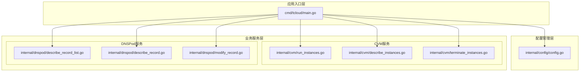
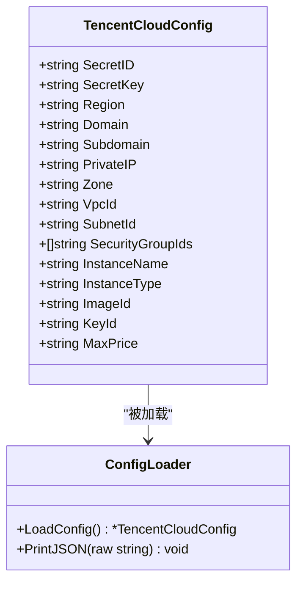
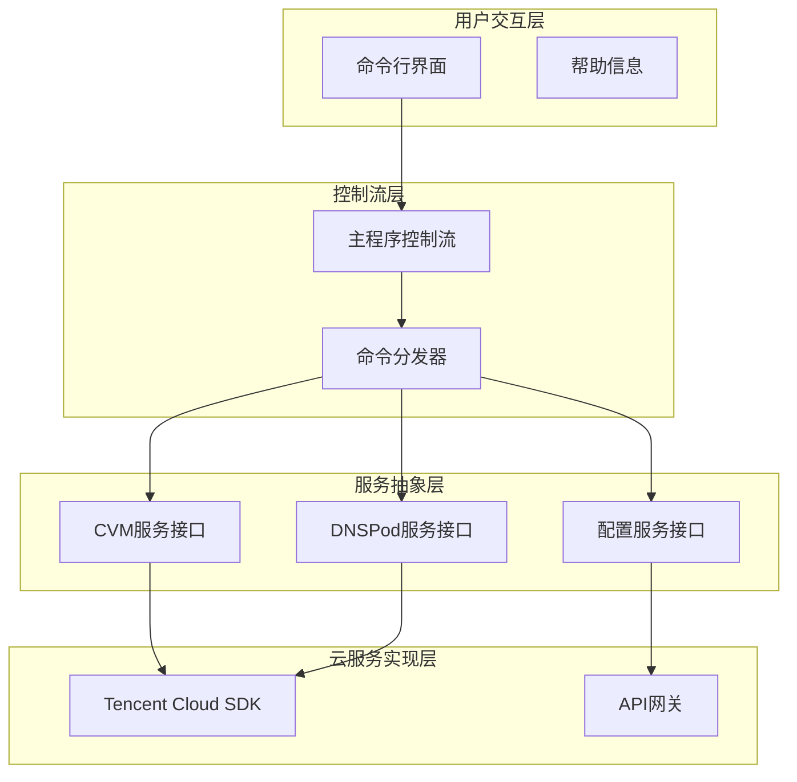
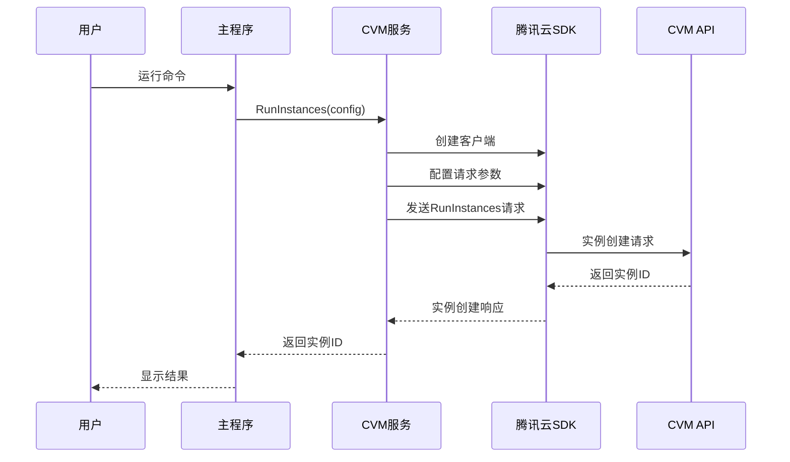
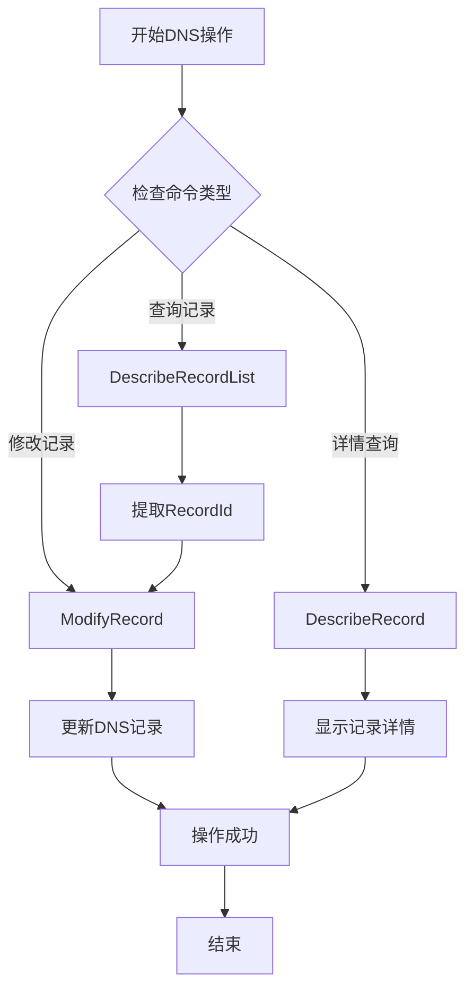
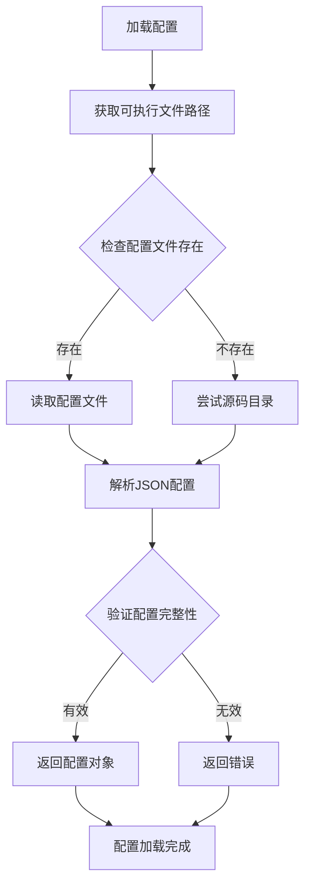
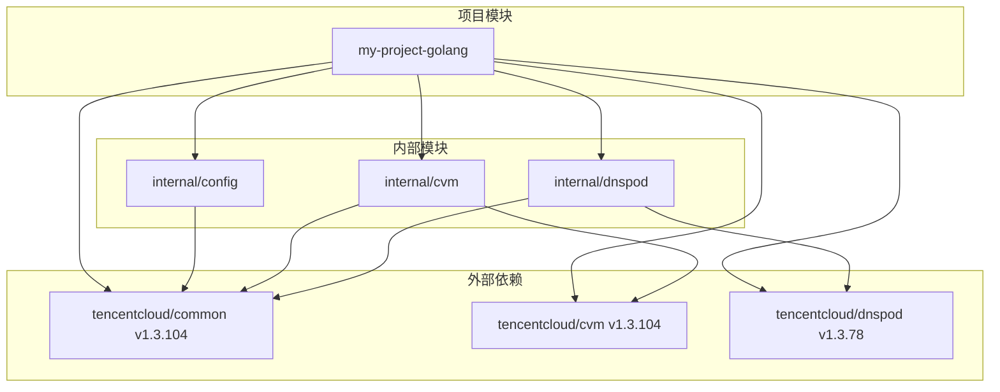
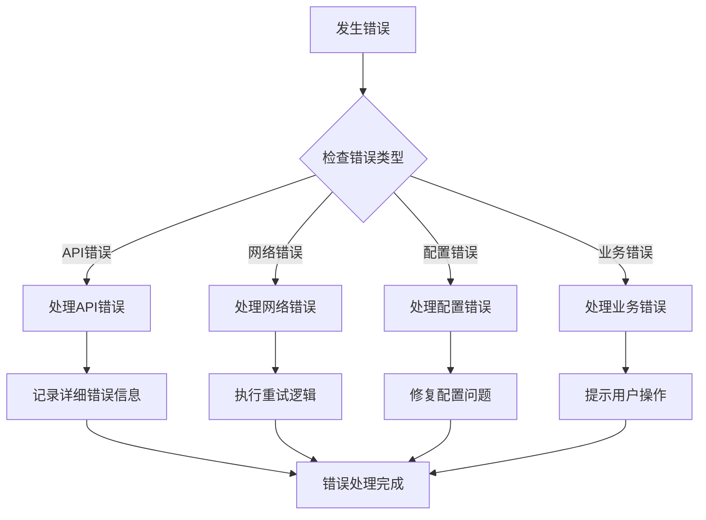

# 扩展开发指南

<cite>
**本文档引用的文件**
- [main.go](file://cmd/tcloud/main.go)
- [config.go](file://internal/config/config.go)
- [describe_instances.go](file://internal/cvm/describe_instances.go)
- [run_instances.go](file://internal/cvm/run_instances.go)
- [terminate_instances.go](file://internal/cvm/terminate_instances.go)
- [describe_record.go](file://internal/dnspod/describe_record.go)
- [describe_record_list.go](file://internal/dnspod/describe_record_list.go)
- [modify_record.go](file://internal/dnspod/modify_record.go)
- [go.mod](file://go.mod)
</cite>

## 目录
1. [简介](#简介)
2. [项目结构](#项目结构)
3. [核心组件](#核心组件)
4. [架构概览](#架构概览)
5. [详细组件分析](#详细组件分析)
6. [依赖分析](#依赖分析)
7. [性能考虑](#性能考虑)
8. [故障排除指南](#故障排除指南)
9. [结论](#结论)
10. [附录](#附录)

## 简介

本指南面向希望为腾讯云DNSPod和CVM管理工具添加新功能的开发者。该工具提供了完整的云服务管理能力，包括实例创建、销毁、DNS记录管理和一键部署/回收流程。本文档将详细说明如何添加新的云服务模块、新增命令行功能、实现最佳实践以及模块间的通信机制。

## 项目结构

该项目采用清晰的分层架构设计，主要分为以下几个层次：



**图表来源**
- [main.go:12-197](file://cmd/tcloud/main.go#L12-L197)
- [config.go:31-59](file://internal/config/config.go#L31-L59)

**章节来源**
- [main.go:1-220](file://cmd/tcloud/main.go#L1-L220)
- [go.mod:1-10](file://go.mod#L1-L10)

## 核心组件

### 配置管理系统

配置系统是整个应用的核心基础设施，负责管理腾讯云API密钥、区域设置、网络配置等关键参数。



**图表来源**
- [config.go:11-28](file://internal/config/config.go#L11-L28)
- [config.go:30-69](file://internal/config/config.go#L30-L69)

### 命令行接口设计

主程序实现了基于子命令的CLI架构，支持多种操作模式：

**章节来源**
- [main.go:12-197](file://cmd/tcloud/main.go#L12-L197)
- [config.go:31-59](file://internal/config/config.go#L31-L59)

## 架构概览

系统采用模块化设计，通过清晰的职责分离实现松耦合的架构：



**图表来源**
- [main.go:27-196](file://cmd/tcloud/main.go#L27-L196)
- [run_instances.go:15-91](file://internal/cvm/run_instances.go#L15-L91)

## 详细组件分析

### CVM服务模块

CVM（Cloud Virtual Machine）服务模块提供了完整的虚拟机生命周期管理功能：



**图表来源**
- [run_instances.go:15-91](file://internal/cvm/run_instances.go#L15-L91)
- [main.go:78-83](file://cmd/tcloud/main.go#L78-L83)

#### 关键特性

1. **竞价实例创建**：支持按需付费的竞价实例创建
2. **网络配置**：自动配置VPC、子网和安全组
3. **轮询等待**：智能等待实例状态变为运行中
4. **公网IP获取**：自动获取分配的公网IP地址

**章节来源**
- [run_instances.go:14-92](file://internal/cvm/run_instances.go#L14-L92)
- [describe_instances.go:15-101](file://internal/cvm/describe_instances.go#L15-L101)

### DNSPod服务模块

DNSPod服务模块专注于域名解析记录的管理：



**图表来源**
- [describe_record_list.go:14-46](file://internal/dnspod/describe_record_list.go#L14-L46)
- [modify_record.go:14-41](file://internal/dnspod/modify_record.go#L14-L41)

#### 核心功能

1. **记录列表查询**：支持按域名和子域名过滤
2. **记录详情获取**：提供完整的记录信息展示
3. **动态记录修改**：支持实时IP地址更新
4. **JSON格式化输出**：便于调试和日志记录

**章节来源**
- [describe_record.go:14-38](file://internal/dnspod/describe_record.go#L14-L38)
- [describe_record_list.go:14-46](file://internal/dnspod/describe_record_list.go#L14-L46)
- [modify_record.go:14-41](file://internal/dnspod/modify_record.go#L14-L41)

### 配置管理模块

配置系统采用灵活的文件加载策略：



**图表来源**
- [config.go:31-59](file://internal/config/config.go#L31-L59)

**章节来源**
- [config.go:31-70](file://internal/config/config.go#L31-L70)

## 依赖分析

项目使用Go模块系统管理依赖关系，主要依赖腾讯云官方SDK：



**图表来源**
- [go.mod:5-9](file://go.mod#L5-L9)

**章节来源**
- [go.mod:1-10](file://go.mod#L1-L10)

## 性能考虑

### 异步操作优化

系统中的网络请求采用同步模式，建议在扩展新功能时考虑以下优化：

1. **并发请求**：对于独立的API调用，可以考虑使用goroutine实现并发
2. **重试机制**：为网络不稳定的情况实现指数退避重试
3. **连接池**：复用SDK客户端连接以减少资源消耗
4. **缓存策略**：对频繁查询的数据实现本地缓存

### 内存管理

1. **大对象复用**：避免重复创建大型数据结构
2. **及时释放**：确保不再使用的资源及时释放
3. **批量操作**：对于批量API调用，合理控制批次大小

## 故障排除指南

### 常见错误类型



### 错误处理最佳实践

1. **错误包装**：使用`fmt.Errorf`包装底层错误，保留上下文信息
2. **统一处理**：在主程序中统一处理不同类型的错误
3. **用户友好**：向用户提供清晰的错误信息和解决方案
4. **日志记录**：详细记录错误堆栈和相关上下文

**章节来源**
- [describe_instances.go:31-36](file://internal/cvm/describe_instances.go#L31-L36)
- [run_instances.go:73-78](file://internal/cvm/run_instances.go#L73-L78)

## 结论

本指南详细介绍了如何在现有架构基础上进行扩展开发。通过遵循本文档的设计模式和最佳实践，开发者可以：

1. **保持架构一致性**：新功能应遵循现有的模块化设计
2. **确保代码质量**：严格遵守错误处理和日志记录标准
3. **提升用户体验**：提供清晰的命令行接口和详细的反馈信息
4. **保证系统稳定性**：通过合理的错误处理和性能优化确保系统可靠运行

## 附录

### 新功能开发步骤

#### 添加新的云服务模块

1. **创建目录结构**
   ```
   internal/
   └── new_service/
       ├── new_service.go
       └── new_service_test.go
   ```

2. **定义服务接口**
   ```go
   // 在new_service.go中定义服务函数
   func NewServiceOperation(cfg *config.TencentCloudConfig) error {
       // 实现服务逻辑
   }
   ```

3. **集成到主程序**
   ```go
   // 在main.go的switch语句中添加新命令
   case "new-command":
       if err := new_service.NewServiceOperation(cfg); err != nil {
           fmt.Printf("操作失败: %s\n", err)
           os.Exit(1)
       }
   ```

#### 新增命令行功能

1. **参数解析**
   ```go
   // 使用os.Args解析命令行参数
   if len(os.Args) < 3 {
       fmt.Println("参数不足")
       return
   }
   ```

2. **命令注册**
   ```go
   // 在printUsage函数中添加新命令描述
   fmt.Println("  new-command <参数1> [参数2]  新功能描述")
   ```

3. **执行逻辑**
   ```go
   // 实现具体的业务逻辑
   func handleNewCommand(args []string) error {
       // 处理命令逻辑
   }
   ```

#### 错误处理模板

```go
func SafeOperation(cfg *config.TencentCloudConfig) error {
    // 参数验证
    if cfg == nil {
        return fmt.Errorf("配置参数为空")
    }
    
    // 业务逻辑
    result, err := performOperation(cfg)
    if err != nil {
        return fmt.Errorf("操作失败: %w", err)
    }
    
    return nil
}
```

#### 日志记录最佳实践

1. **结构化日志**：使用统一的日志格式
2. **错误级别**：区分不同级别的错误信息
3. **上下文信息**：在日志中包含必要的上下文信息
4. **性能监控**：对关键操作添加性能指标

#### 配置管理扩展

1. **配置项添加**
   ```go
   type TencentCloudConfig struct {
       // ... 现有字段
       NewFeatureFlag bool `json:"new_feature_flag"`
       TimeoutSeconds int  `json:"timeout_seconds"`
   }
   ```

2. **配置验证**
   ```go
   if cfg.TimeoutSeconds <= 0 {
       return nil, fmt.Errorf("超时时间必须大于0")
   }
   ```

通过遵循这些指导原则和模板，开发者可以快速而安全地为项目添加新功能，同时保持代码质量和系统稳定性。