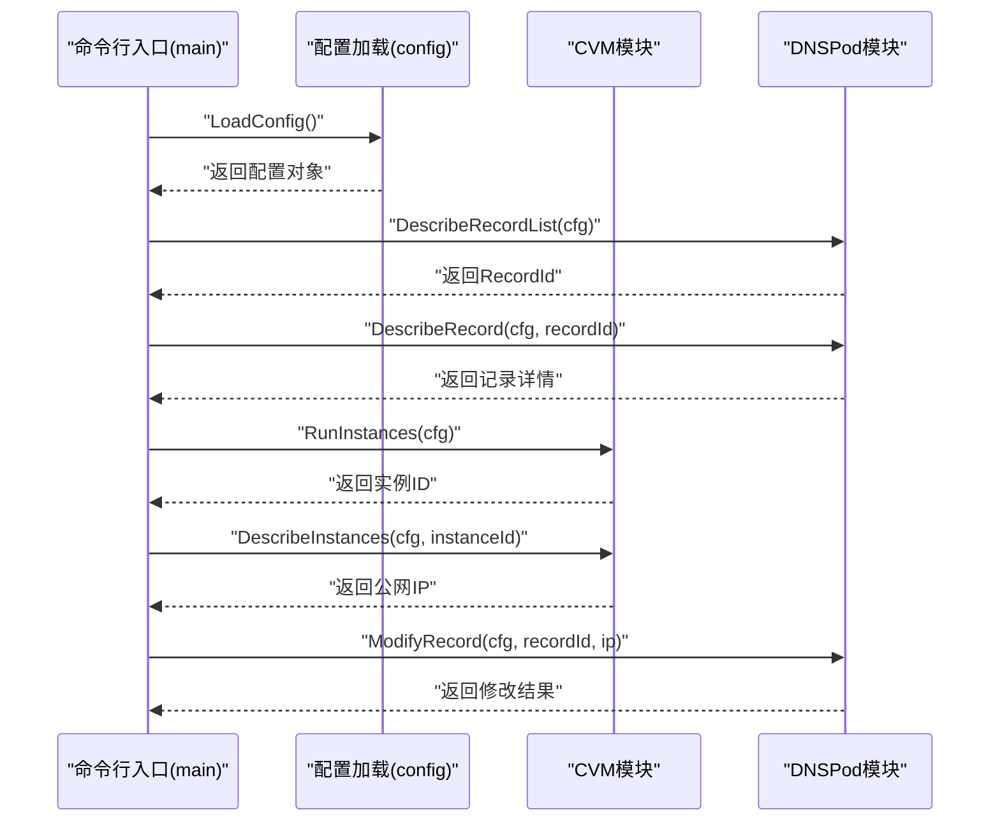
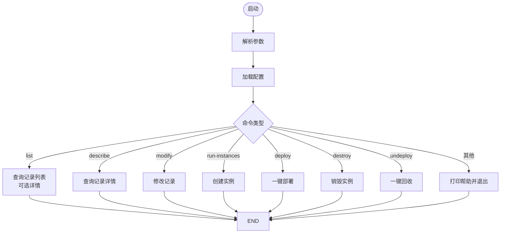
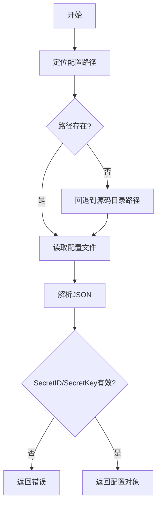
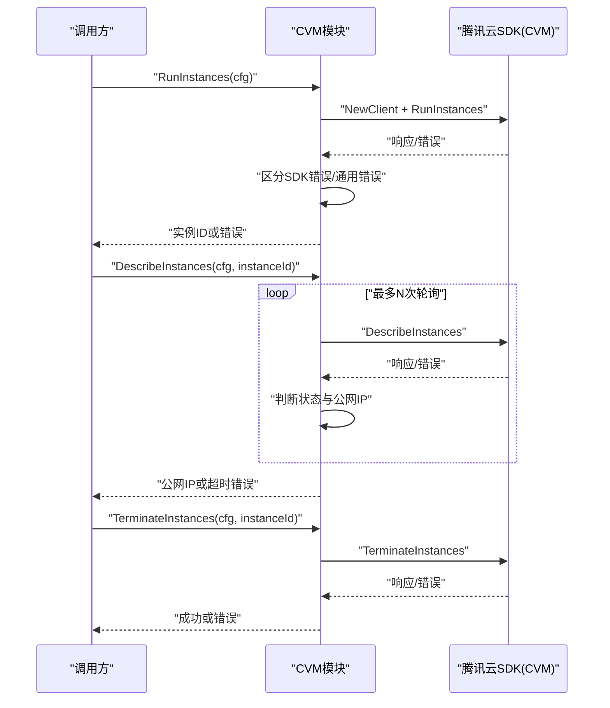
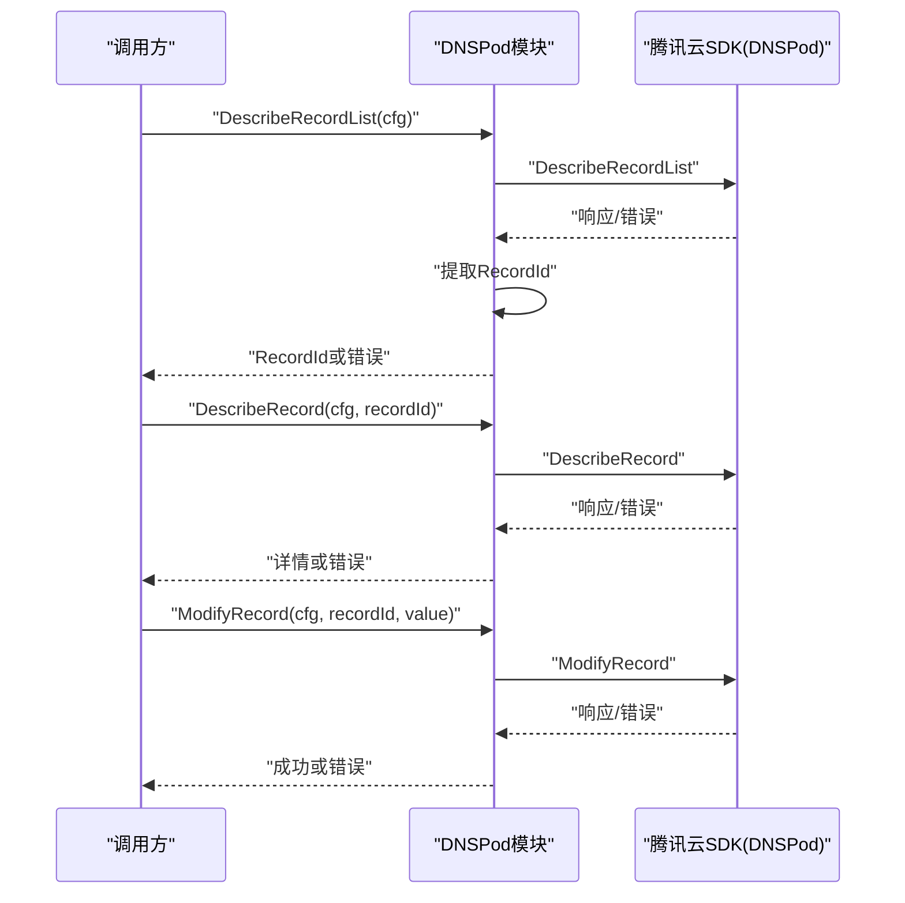
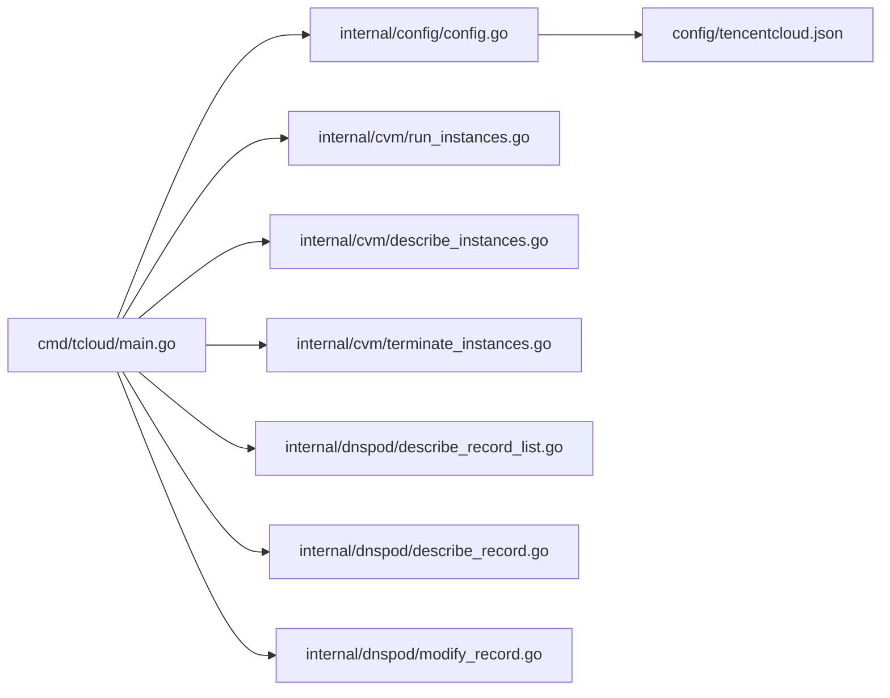

# 测试与调试

<cite>
**本文引用的文件**
- [main.go](file://cmd/tcloud/main.go)
- [config.go](file://internal/config/config.go)
- [run_instances.go](file://internal/cvm/run_instances.go)
- [describe_instances.go](file://internal/cvm/describe_instances.go)
- [terminate_instances.go](file://internal/cvm/terminate_instances.go)
- [describe_record_list.go](file://internal/dnspod/describe_record_list.go)
- [describe_record.go](file://internal/dnspod/describe_record.go)
- [modify_record.go](file://internal/dnspod/modify_record.go)
- [tencentcloud.json](file://config/tencentcloud.json)
- [go.mod](file://go.mod)
</cite>

## 目录
1. [简介](#简介)
2. [项目结构](#项目结构)
3. [核心组件](#核心组件)
4. [架构总览](#架构总览)
5. [详细组件分析](#详细组件分析)
6. [依赖分析](#依赖分析)
7. [性能考虑](#性能考虑)
8. [故障排查指南](#故障排查指南)
9. [结论](#结论)
10. [附录](#附录)

## 简介
本文件面向测试与调试场景，结合仓库现有实现，提供单元测试、集成测试、模拟环境搭建、调试技巧、日志分析、错误追踪、测试用例设计原则与覆盖率建议、配置文件与API调用测试方法、性能与压力测试实施指南，以及常见问题诊断与解决方案。由于当前仓库未包含测试文件，本文同时给出可直接落地的测试实践与最佳实践。

## 项目结构
该仓库采用按功能分层的模块化组织方式：
- cmd/tcloud：命令入口，负责参数解析与流程编排
- internal/config：配置加载与打印工具
- internal/cvm：CVM相关操作（创建、查询、销毁）
- internal/dnspod：DNSPod相关操作（查询记录列表、查询记录详情、修改记录）
- config：配置文件目录（tencentcloud.json）

```mermaid
graph TB
subgraph "命令行入口"
MAIN["cmd/tcloud/main.go"]
end
subgraph "配置模块"
CFG["internal/config/config.go"]
JSON["config/tencentcloud.json"]
end
subgraph "CVM模块"
RUN["internal/cvm/run_instances.go"]
DES["internal/cvm/describe_instances.go"]
TERM["internal/cvm/terminate_instances.go"]
end
subgraph "DNSPod模块"
DRL["internal/dnspod/describe_record_list.go"]
DR["internal/dnspod/describe_record.go"]
MR["internal/dnspod/modify_record.go"]
end
MAIN --> CFG
MAIN --> DRL
MAIN --> DR
MAIN --> MR
MAIN --> RUN
MAIN --> DES
MAIN --> TERM
CFG <- --> JSON
```

**图示来源**
- [main.go:1-220](file://cmd/tcloud/main.go#L1-L220)
- [config.go:1-70](file://internal/config/config.go#L1-L70)
- [run_instances.go:1-92](file://internal/cvm/run_instances.go#L1-L92)
- [describe_instances.go:1-101](file://internal/cvm/describe_instances.go#L1-L101)
- [terminate_instances.go:1-37](file://internal/cvm/terminate_instances.go#L1-L37)
- [describe_record_list.go:1-47](file://internal/dnspod/describe_record_list.go#L1-L47)
- [describe_record.go:1-38](file://internal/dnspod/describe_record.go#L1-L38)
- [modify_record.go:1-42](file://internal/dnspod/modify_record.go#L1-L42)
- [tencentcloud.json:1-18](file://config/tencentcloud.json#L1-L18)

**章节来源**
- [main.go:1-220](file://cmd/tcloud/main.go#L1-L220)
- [config.go:1-70](file://internal/config/config.go#L1-L70)
- [tencentcloud.json:1-18](file://config/tencentcloud.json#L1-L18)

## 核心组件
- 命令入口与流程控制：负责解析命令、加载配置、编排各子流程（如一键部署/回收）
- 配置模块：加载并校验配置，提供JSON格式化输出工具
- CVM模块：创建竞价实例、查询实例公网IP、销毁实例
- DNSPod模块：查询记录列表并提取RecordId、查询记录详情、修改A记录

**章节来源**
- [main.go:12-196](file://cmd/tcloud/main.go#L12-L196)
- [config.go:30-59](file://internal/config/config.go#L30-L59)
- [run_instances.go:14-91](file://internal/cvm/run_instances.go#L14-L91)
- [describe_instances.go:15-64](file://internal/cvm/describe_instances.go#L15-L64)
- [terminate_instances.go:14-36](file://internal/cvm/terminate_instances.go#L14-L36)
- [describe_record_list.go:14-46](file://internal/dnspod/describe_record_list.go#L14-L46)
- [describe_record.go:14-37](file://internal/dnspod/describe_record.go#L14-L37)
- [modify_record.go:14-41](file://internal/dnspod/modify_record.go#L14-L41)

## 架构总览
整体为“命令入口 -> 配置加载 -> 业务模块调用”的线性架构；业务模块通过腾讯云SDK发起HTTP请求，内部对SDK错误与通用网络错误进行区分处理。



**图示来源**
- [main.go:18-131](file://cmd/tcloud/main.go#L18-L131)
- [config.go:30-59](file://internal/config/config.go#L30-L59)
- [describe_record_list.go:14-46](file://internal/dnspod/describe_record_list.go#L14-L46)
- [describe_record.go:14-37](file://internal/dnspod/describe_record.go#L14-L37)
- [run_instances.go:14-91](file://internal/cvm/run_instances.go#L14-L91)
- [describe_instances.go:15-64](file://internal/cvm/describe_instances.go#L15-L64)
- [modify_record.go:14-41](file://internal/dnspod/modify_record.go#L14-L41)

## 详细组件分析

### 命令入口与流程控制
- 功能要点
  - 参数解析与帮助输出
  - 配置加载失败时直接退出
  - 各命令分支（list/describe/modify/run-instances/deploy/destroy/undeploy）
  - 一键部署/回收流程串联多个子步骤
- 测试关注点
  - 命令分支覆盖（含未知命令）
  - 配置加载异常路径
  - 子流程调用顺序与错误传播
  - 输出格式与提示信息验证



**图示来源**
- [main.go:12-196](file://cmd/tcloud/main.go#L12-L196)

**章节来源**
- [main.go:12-196](file://cmd/tcloud/main.go#L12-L196)

### 配置模块
- 功能要点
  - 支持可执行文件目录与源码目录两种配置路径探测
  - JSON解析与字段校验（SecretID/SecretKey非空）
  - JSON格式化输出工具
- 测试关注点
  - 文件不存在、读取失败、解析失败路径
  - SecretID/SecretKey为空的校验
  - 路径探测逻辑（可执行文件目录优先）



**图示来源**
- [config.go:30-59](file://internal/config/config.go#L30-L59)

**章节来源**
- [config.go:30-59](file://internal/config/config.go#L30-L59)
- [tencentcloud.json:1-18](file://config/tencentcloud.json#L1-L18)

### CVM模块
- 功能要点
  - 创建竞价实例：构造请求参数、调用SDK、解析响应、返回实例ID
  - 查询实例公网IP：轮询查询、等待实例运行并具备公网IP
  - 销毁实例：调用SDK并格式化输出
- 错误处理
  - SDK错误与通用错误区分
  - 请求失败包装为统一错误
- 测试关注点
  - 请求参数构造完整性
  - 轮询等待超时与状态判断
  - 错误类型区分与返回值



**图示来源**
- [run_instances.go:14-91](file://internal/cvm/run_instances.go#L14-L91)
- [describe_instances.go:15-64](file://internal/cvm/describe_instances.go#L15-L64)
- [terminate_instances.go:14-36](file://internal/cvm/terminate_instances.go#L14-L36)

**章节来源**
- [run_instances.go:14-91](file://internal/cvm/run_instances.go#L14-L91)
- [describe_instances.go:15-64](file://internal/cvm/describe_instances.go#L15-L64)
- [terminate_instances.go:14-36](file://internal/cvm/terminate_instances.go#L14-L36)

### DNSPod模块
- 功能要点
  - 查询记录列表并提取第一条记录的RecordId
  - 查询记录详情
  - 修改A记录（默认线路）
- 错误处理
  - SDK错误与通用错误区分
  - 未找到记录的兜底错误
- 测试关注点
  - 列表为空、仅一条记录等边界
  - RecordId提取与后续调用一致性
  - 修改记录参数正确性



**图示来源**
- [describe_record_list.go:14-46](file://internal/dnspod/describe_record_list.go#L14-L46)
- [describe_record.go:14-37](file://internal/dnspod/describe_record.go#L14-L37)
- [modify_record.go:14-41](file://internal/dnspod/modify_record.go#L14-L41)

**章节来源**
- [describe_record_list.go:14-46](file://internal/dnspod/describe_record_list.go#L14-L46)
- [describe_record.go:14-37](file://internal/dnspod/describe_record.go#L14-L37)
- [modify_record.go:14-41](file://internal/dnspod/modify_record.go#L14-L41)

## 依赖分析
- 外部依赖
  - 腾讯云SDK（common/cvm/dnspod）
- 内部依赖
  - 命令入口依赖配置模块与各业务模块
  - 业务模块依赖配置模块提供的配置对象
- 耦合与内聚
  - 业务模块与SDK耦合度高，但通过统一错误处理提升内聚
  - 命令入口作为编排层，职责清晰



**图示来源**
- [main.go:1-220](file://cmd/tcloud/main.go#L1-L220)
- [config.go:1-70](file://internal/config/config.go#L1-L70)
- [run_instances.go:1-92](file://internal/cvm/run_instances.go#L1-L92)
- [describe_instances.go:1-101](file://internal/cvm/describe_instances.go#L1-L101)
- [terminate_instances.go:1-37](file://internal/cvm/terminate_instances.go#L1-L37)
- [describe_record_list.go:1-47](file://internal/dnspod/describe_record_list.go#L1-L47)
- [describe_record.go:1-38](file://internal/dnspod/describe_record.go#L1-L38)
- [modify_record.go:1-42](file://internal/dnspod/modify_record.go#L1-L42)
- [tencentcloud.json:1-18](file://config/tencentcloud.json#L1-L18)

**章节来源**
- [go.mod:5-9](file://go.mod#L5-L9)
- [main.go:1-220](file://cmd/tcloud/main.go#L1-L220)

## 性能考虑
- 轮询策略
  - CVM查询公网IP采用固定次数与间隔的轮询，建议在测试中以更短间隔与更少重试次数验证逻辑正确性
- 并发与超时
  - 建议在测试中注入超时与并发场景，评估错误处理与资源释放
- 日志与可观测性
  - 当前实现以打印为主，建议在测试中引入结构化日志与指标采集，便于性能分析

[本节为通用指导，无需特定文件引用]

## 故障排查指南
- 配置加载失败
  - 检查配置文件是否存在与可读
  - 校验SecretID/SecretKey是否为空
- API错误与请求失败
  - SDK错误与通用错误需区分处理，确保错误信息可追踪
- 实例公网IP等待超时
  - 检查实例状态与网络配置，确认轮询次数与间隔设置合理
- DNS记录修改异常
  - 确认RecordId提取正确，域名与子域名校验

**章节来源**
- [config.go:44-59](file://internal/config/config.go#L44-L59)
- [describe_instances.go:23-64](file://internal/cvm/describe_instances.go#L23-L64)
- [describe_record_list.go:26-46](file://internal/dnspod/describe_record_list.go#L26-L46)

## 结论
本项目以清晰的模块划分与明确的错误处理实现了基础的云资源管理能力。测试与调试应围绕“配置加载、API调用、流程编排、错误处理”四个维度展开，结合模拟环境与结构化日志，持续提升系统稳定性与可维护性。

[本节为总结，无需特定文件引用]

## 附录

### 单元测试编写方法与测试框架选择
- 推荐框架
  - Go标准库testing：内置断言、基准测试、并行测试
  - gomonkey：用于函数桩与依赖替换
  - testify：提供丰富断言与配套mock工具
- 编写要点
  - 将外部依赖（SDK、文件系统）抽象为接口，便于注入与替换
  - 针对错误路径与边界条件编写测试用例
  - 使用表驱动测试覆盖多输入组合

**章节来源**
- [config.go:30-59](file://internal/config/config.go#L30-L59)
- [run_instances.go:14-91](file://internal/cvm/run_instances.go#L14-L91)
- [describe_instances.go:15-64](file://internal/cvm/describe_instances.go#L15-L64)
- [terminate_instances.go:14-36](file://internal/cvm/terminate_instances.go#L14-L36)
- [describe_record_list.go:14-46](file://internal/dnspod/describe_record_list.go#L14-L46)
- [describe_record.go:14-37](file://internal/dnspod/describe_record.go#L14-L37)
- [modify_record.go:14-41](file://internal/dnspod/modify_record.go#L14-L41)

### 集成测试设计策略与模拟环境搭建
- 设计策略
  - 以真实配置文件为基线，通过桩或Mock替换外部服务
  - 分层测试：命令入口流程、业务模块API调用、配置加载
  - 场景覆盖：成功路径、超时、网络错误、权限错误
- 模拟环境
  - 使用gomonkey替换SDK客户端，返回预设响应
  - 使用内存文件系统模拟配置文件读取
  - 使用本地HTTP服务器模拟第三方API行为

**章节来源**
- [main.go:12-196](file://cmd/tcloud/main.go#L12-L196)
- [config.go:30-59](file://internal/config/config.go#L30-L59)
- [tencentcloud.json:1-18](file://config/tencentcloud.json#L1-L18)

### 调试技巧与工具使用
- 日志分析
  - 在测试中启用结构化日志，记录请求ID、参数摘要与响应状态
  - 对比预期与实际响应，定位差异
- 错误追踪
  - 区分SDK错误与通用错误，保留原始错误上下文
  - 使用栈跟踪与时间戳辅助定位问题发生阶段
- 工具推荐
  - Go pprof：CPU/内存分析
  - Delve：交互式调试器

**章节来源**
- [run_instances.go:73-78](file://internal/cvm/run_instances.go#L73-L78)
- [describe_instances.go:31-36](file://internal/cvm/describe_instances.go#L31-L36)
- [terminate_instances.go:26-31](file://internal/cvm/terminate_instances.go#L26-L31)
- [describe_record_list.go:27-32](file://internal/dnspod/describe_record_list.go#L27-L32)
- [describe_record.go:27-32](file://internal/dnspod/describe_record.go#L27-L32)
- [modify_record.go:30-36](file://internal/dnspod/modify_record.go#L30-L36)

### 测试用例设计原则与覆盖率要求
- 设计原则
  - 输入覆盖：正常值、边界值、异常值
  - 分支覆盖：每个if/else与switch分支至少一次
  - 异常覆盖：各类错误路径均被测试
- 覆盖率目标
  - 语句覆盖率≥80%，分支覆盖率≥60%
  - 关键路径（配置加载、API调用、流程编排）达到更高覆盖率

**章节来源**
- [config.go:30-59](file://internal/config/config.go#L30-L59)
- [run_instances.go:14-91](file://internal/cvm/run_instances.go#L14-L91)
- [describe_instances.go:15-64](file://internal/cvm/describe_instances.go#L15-L64)
- [terminate_instances.go:14-36](file://internal/cvm/terminate_instances.go#L14-L36)
- [describe_record_list.go:14-46](file://internal/dnspod/describe_record_list.go#L14-L46)
- [describe_record.go:14-37](file://internal/dnspod/describe_record.go#L14-L37)
- [modify_record.go:14-41](file://internal/dnspod/modify_record.go#L14-L41)

### 配置文件测试与API调用测试方法
- 配置文件测试
  - 正常配置：验证字段解析与校验
  - 缺失字段：验证错误返回
  - 路径探测：验证可执行文件目录优先策略
- API调用测试
  - 使用桩返回不同响应（成功、超时、错误），验证错误处理与重试逻辑
  - 参数构造完整性校验

**章节来源**
- [config.go:30-59](file://internal/config/config.go#L30-L59)
- [tencentcloud.json:1-18](file://config/tencentcloud.json#L1-L18)
- [run_instances.go:14-91](file://internal/cvm/run_instances.go#L14-L91)
- [describe_instances.go:15-64](file://internal/cvm/describe_instances.go#L15-L64)
- [terminate_instances.go:14-36](file://internal/cvm/terminate_instances.go#L14-L36)
- [describe_record_list.go:14-46](file://internal/dnspod/describe_record_list.go#L14-L46)
- [describe_record.go:14-37](file://internal/dnspod/describe_record.go#L14-L37)
- [modify_record.go:14-41](file://internal/dnspod/modify_record.go#L14-L41)

### 性能测试与压力测试实施指南
- 性能测试
  - 基准测试：针对关键函数（配置解析、API调用）编写Benchmark
  - 资源占用：监控内存与GC行为
- 压力测试
  - 并发调用：模拟高并发下的API调用与错误恢复
  - 轮询策略：调整轮询次数与间隔，评估延迟与成功率

**章节来源**
- [describe_instances.go:23-64](file://internal/cvm/describe_instances.go#L23-L64)
- [run_instances.go:14-91](file://internal/cvm/run_instances.go#L14-L91)

### 常见问题诊断与解决方案
- 配置加载失败
  - 检查配置文件路径与权限
  - 校验JSON格式与必填字段
- API调用失败
  - 检查凭证与网络连通性
  - 区分SDK错误与业务错误
- 实例公网IP等待超时
  - 检查实例状态与网络配置
  - 调整轮询策略与超时阈值

**章节来源**
- [config.go:44-59](file://internal/config/config.go#L44-L59)
- [describe_instances.go:23-64](file://internal/cvm/describe_instances.go#L23-L64)
- [run_instances.go:73-78](file://internal/cvm/run_instances.go#L73-L78)
- [terminate_instances.go:26-31](file://internal/cvm/terminate_instances.go#L26-L31)
- [describe_record_list.go:27-32](file://internal/dnspod/describe_record_list.go#L27-L32)
- [describe_record.go:27-32](file://internal/dnspod/describe_record.go#L27-L32)
- [modify_record.go:30-36](file://internal/dnspod/modify_record.go#L30-L36)