# 项目架构设计

<cite>
**本文档引用的文件**
- [cmd/tcloud/main.go](file://cmd/tcloud/main.go)
- [internal/config/config.go](file://internal/config/config.go)
- [internal/cvm/run_instances.go](file://internal/cvm/run_instances.go)
- [internal/cvm/describe_instances.go](file://internal/cvm/describe_instances.go)
- [internal/cvm/terminate_instances.go](file://internal/cvm/terminate_instances.go)
- [internal/dnspod/describe_record_list.go](file://internal/dnspod/describe_record_list.go)
- [internal/dnspod/describe_record.go](file://internal/dnspod/describe_record.go)
- [internal/dnspod/modify_record.go](file://internal/dnspod/modify_record.go)
- [go.mod](file://go.mod)
- [.gitignore](file://.gitignore)
</cite>

## 目录
1. [引言](#引言)
2. [项目结构](#项目结构)
3. [核心组件](#核心组件)
4. [架构概览](#架构概览)
5. [详细组件分析](#详细组件分析)
6. [依赖关系分析](#依赖关系分析)
7. [性能考虑](#性能考虑)
8. [故障排除指南](#故障排除指南)
9. [结论](#结论)
10. [架构演进建议](#架构演进建议)

## 引言

本项目是一个基于Go语言开发的腾讯云资源管理工具，集成了CVM（云服务器）实例管理和DNSPod域名解析管理功能。项目采用模块化设计，通过清晰的包结构实现了配置管理、命令行入口和业务逻辑分离，为用户提供了一键化的云资源管理体验。

该工具支持多种操作模式，包括独立的DNS记录管理、CVM实例管理，以及完整的端到端部署和回收流程。通过统一的配置管理机制和标准化的错误处理，确保了系统的稳定性和可维护性。

## 项目结构

项目采用标准的Go模块结构，遵循清晰的包层次组织：

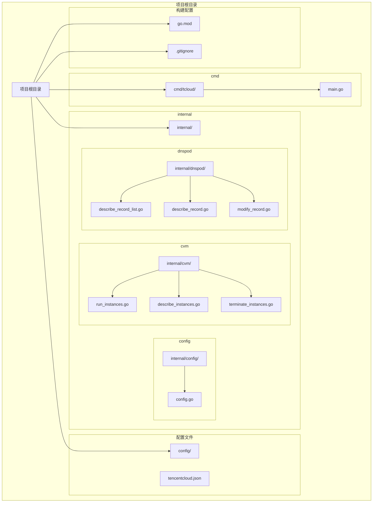

**图表来源**
- [cmd/tcloud/main.go:1-220](file://cmd/tcloud/main.go#L1-L220)
- [internal/config/config.go:1-70](file://internal/config/config.go#L1-L70)
- [internal/cvm/run_instances.go:1-92](file://internal/cvm/run_instances.go#L1-L92)

### 包结构设计原则

项目采用了以下设计原则：

1. **模块化分离**：每个功能域独立为一个包，便于维护和测试
2. **依赖倒置**：内部包不依赖外部包，而是被外部包依赖
3. **单一职责**：每个包专注于特定的功能领域
4. **接口抽象**：通过接口定义清晰的依赖边界

**章节来源**
- [cmd/tcloud/main.go:1-220](file://cmd/tcloud/main.go#L1-L220)
- [internal/config/config.go:1-70](file://internal/config/config.go#L1-L70)

## 核心组件

### 配置管理模块

配置管理模块是整个系统的核心基础设施，负责统一管理腾讯云相关的配置信息。

```mermaid
classDiagram
class TencentCloudConfig {
+string SecretID
+string SecretKey
+string Region
+string Domain
+string Subdomain
+string PrivateIP
+string Zone
+string VpcId
+string SubnetId
+string InstanceName
+string InstanceType
+string ImageId
+string KeyId
+string MaxPrice
+[]string SecurityGroupIds
}
class ConfigLoader {
+LoadConfig() *TencentCloudConfig
+PrintJSON(raw string) void
-findConfigPath() string
-validateConfig(cfg *TencentCloudConfig) error
}
class ConfigFile {
+string configPath
+map[string]interface{} data
}
ConfigLoader --> TencentCloudConfig : "创建"
ConfigLoader --> ConfigFile : "读取"
TencentCloudConfig --> ConfigFile : "存储"
```

**图表来源**
- [internal/config/config.go:11-28](file://internal/config/config.go#L11-L28)
- [internal/config/config.go:30-59](file://internal/config/config.go#L30-L59)

### 命令行入口组件

命令行入口作为系统的对外接口，负责解析用户输入并分发到相应的业务逻辑。

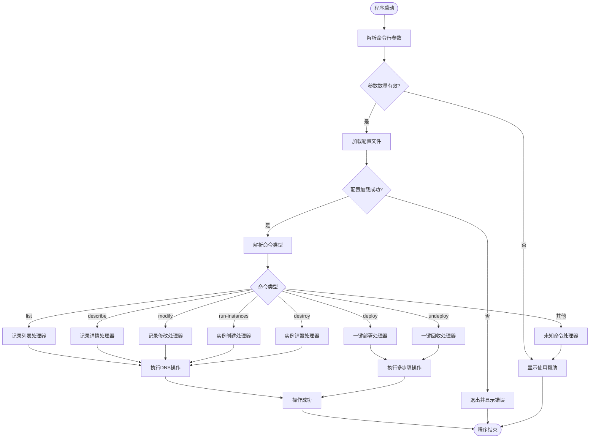

**图表来源**
- [cmd/tcloud/main.go:12-196](file://cmd/tcloud/main.go#L12-L196)

**章节来源**
- [internal/config/config.go:1-70](file://internal/config/config.go#L1-L70)
- [cmd/tcloud/main.go:1-220](file://cmd/tcloud/main.go#L1-L220)

## 架构概览

项目采用分层架构设计，通过清晰的职责分离实现了高内聚、低耦合的系统结构：

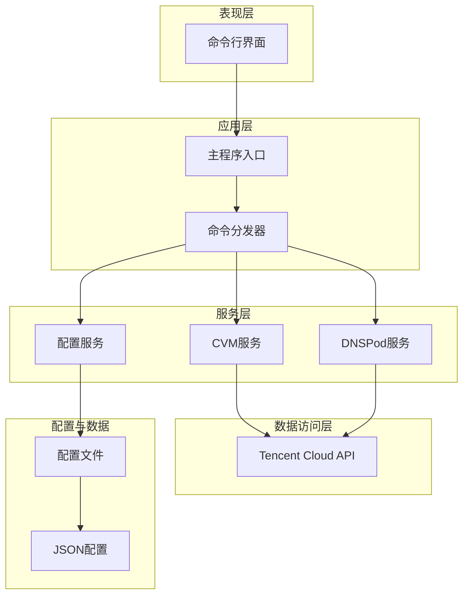

**图表来源**
- [cmd/tcloud/main.go:3-10](file://cmd/tcloud/main.go#L3-L10)
- [internal/config/config.go:30-59](file://internal/config/config.go#L30-L59)

### 设计模式应用

项目中应用了以下设计模式：

1. **工厂模式**：用于创建不同类型的腾讯云客户端
2. **策略模式**：用于不同的命令处理策略
3. **模板方法模式**：用于统一的API调用流程
4. **单例模式**：用于配置加载的缓存机制

## 详细组件分析

### 配置管理模块详解

配置管理模块是整个系统的基础，提供了统一的配置加载和验证机制。

#### 配置数据结构

配置模块定义了完整的腾讯云配置结构，涵盖了所有必要的API调用参数：

```mermaid
erDiagram
TENCENT_CLOUD_CONFIG {
string SECRET_ID
string SECRET_KEY
string REGION
string DOMAIN
string SUBDOMAIN
string PRIVATE_IP
string ZONE
string VPC_ID
string SUBNET_ID
string INSTANCE_NAME
string INSTANCE_TYPE
string IMAGE_ID
string KEY_ID
string MAX_PRICE
[]string SECURITY_GROUP_IDS
}
CONFIG_FILE {
string PATH
json DATA
}
CONFIG_LOADER {
func LOAD_CONFIG()
func PRINT_JSON()
func FIND_CONFIG_PATH()
func VALIDATE_CONFIG()
}
CONFIG_LOADER --> TENCENT_CLOUD_CONFIG : "创建"
CONFIG_FILE --> CONFIG_LOADER : "读取"
TENCENT_CLOUD_CONFIG --> CONFIG_FILE : "存储"
```

**图表来源**
- [internal/config/config.go:11-28](file://internal/config/config.go#L11-L28)
- [internal/config/config.go:30-59](file://internal/config/config.go#L30-L59)

#### 配置加载机制

配置加载机制采用了智能路径查找策略，确保在不同环境下的兼容性：

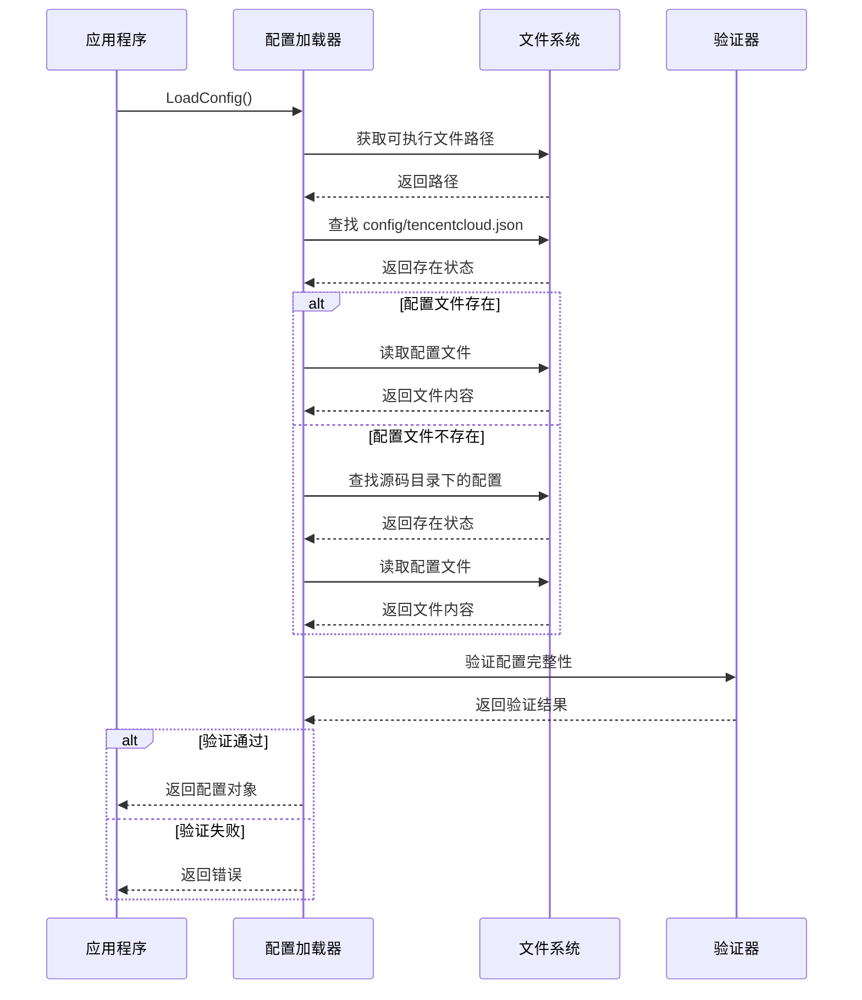

**图表来源**
- [internal/config/config.go:30-59](file://internal/config/config.go#L30-L59)

#### 文件路径处理策略

配置模块实现了灵活的文件路径处理策略，支持多种部署场景：

| 场景 | 路径策略 | 优先级 |
|------|----------|--------|
| 开发环境 | 相对路径 `config/tencentcloud.json` | 2 |
| 生产环境 | 可执行文件同目录 `config/tencentcloud.json` | 1 |
| 容器环境 | 可执行文件同目录或挂载卷 | 1 |

**章节来源**
- [internal/config/config.go:30-59](file://internal/config/config.go#L30-L59)

### CVM服务组件

CVM服务组件提供了完整的云服务器生命周期管理功能，包括实例创建、查询和销毁。

#### 实例创建流程

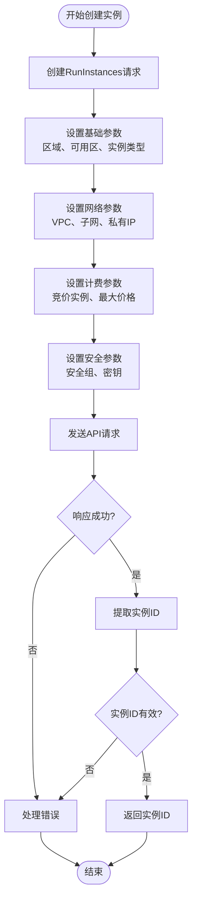

**图表来源**
- [internal/cvm/run_instances.go:14-91](file://internal/cvm/run_instances.go#L14-L91)

#### 实例查询与等待机制

CVM查询组件实现了智能的实例状态等待机制，特别针对竞价实例的公网IP分配进行了优化：

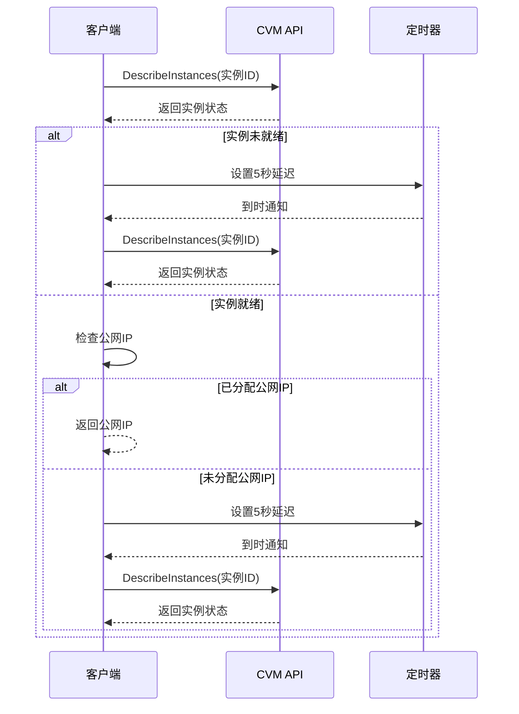

**图表来源**
- [internal/cvm/describe_instances.go:15-64](file://internal/cvm/describe_instances.go#L15-L64)

**章节来源**
- [internal/cvm/run_instances.go:1-92](file://internal/cvm/run_instances.go#L1-L92)
- [internal/cvm/describe_instances.go:1-101](file://internal/cvm/describe_instances.go#L1-L101)

### DNSPod服务组件

DNSPod服务组件提供了完整的域名解析记录管理功能，支持记录查询、修改等操作。

#### 记录查询与提取流程

DNSPod查询组件实现了智能的记录ID提取机制，确保操作的准确性：

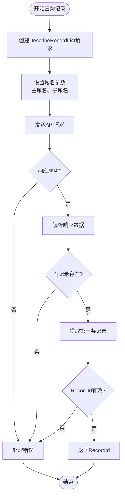

**图表来源**
- [internal/dnspod/describe_record_list.go:14-46](file://internal/dnspod/describe_record_list.go#L14-L46)

#### 记录修改流程

DNSPod修改组件提供了原子性的记录更新操作：

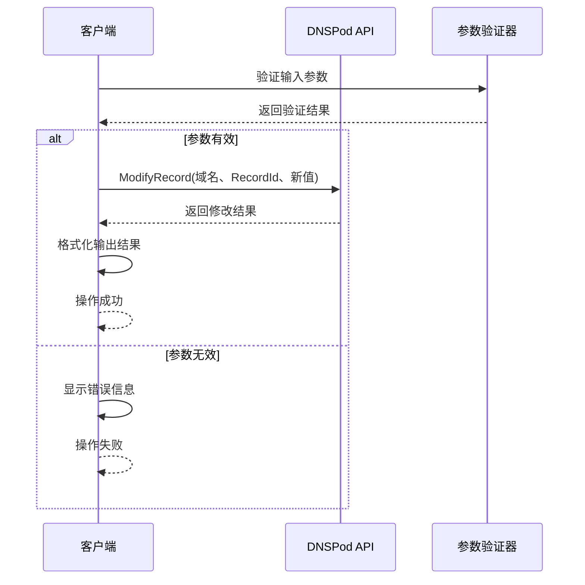

**图表来源**
- [internal/dnspod/modify_record.go:14-41](file://internal/dnspod/modify_record.go#L14-L41)

**章节来源**
- [internal/dnspod/describe_record_list.go:1-47](file://internal/dnspod/describe_record_list.go#L1-L47)
- [internal/dnspod/describe_record.go:1-38](file://internal/dnspod/describe_record.go#L1-L38)
- [internal/dnspod/modify_record.go:1-42](file://internal/dnspod/modify_record.go#L1-L42)

### 命令行入口详解

命令行入口组件实现了完整的命令分发机制，支持多种操作模式：

#### 命令分发架构

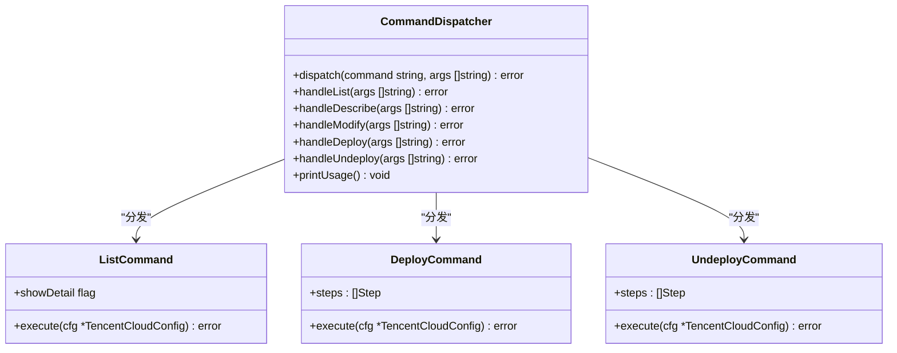

**图表来源**
- [cmd/tcloud/main.go:27-196](file://cmd/tcloud/main.go#L27-L196)

#### 多步骤操作流程

一键部署和回收操作实现了复杂的多步骤协调机制：

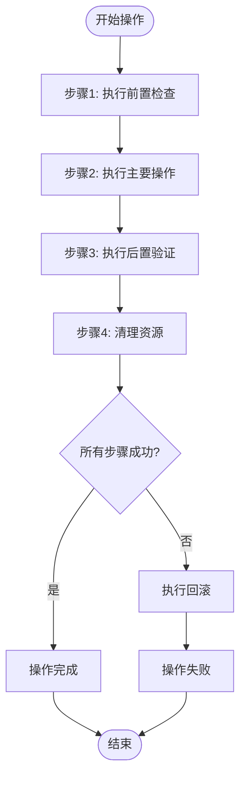

**图表来源**
- [cmd/tcloud/main.go:85-132](file://cmd/tcloud/main.go#L85-L132)
- [cmd/tcloud/main.go:147-190](file://cmd/tcloud/main.go#L147-L190)

**章节来源**
- [cmd/tcloud/main.go:1-220](file://cmd/tcloud/main.go#L1-L220)

## 依赖关系分析

项目采用清晰的依赖层次结构，避免了循环依赖问题：

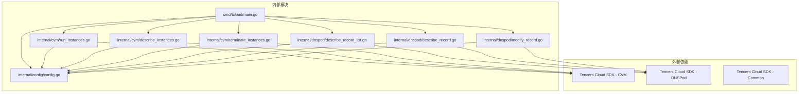

**图表来源**
- [go.mod:5-9](file://go.mod#L5-L9)
- [cmd/tcloud/main.go:3-10](file://cmd/tcloud/main.go#L3-L10)

### 依赖注入与解耦

项目通过以下方式实现依赖解耦：

1. **接口抽象**：所有外部SDK调用都通过封装函数进行
2. **配置传递**：通过参数传递配置对象，避免全局状态
3. **错误传播**：保持错误信息的原始上下文
4. **模块化导入**：严格的包导入规则

**章节来源**
- [go.mod:1-10](file://go.mod#L1-L10)

## 性能考虑

### 并发与异步处理

项目中的性能优化主要体现在以下几个方面：

1. **API调用优化**：合理设置重试机制和超时时间
2. **批量操作**：支持批量查询和操作减少API调用次数
3. **连接复用**：SDK客户端的连接池机制
4. **缓存策略**：配置信息的内存缓存

### 内存管理

- **配置缓存**：配置信息只加载一次并缓存
- **字符串处理**：避免不必要的字符串复制
- **切片扩容**：合理预估切片容量避免重复扩容

### 网络优化

- **超时设置**：合理的请求超时和重试策略
- **错误重试**：对临时性错误进行自动重试
- **连接复用**：SDK层面的连接池优化

## 故障排除指南

### 常见问题诊断

#### 配置文件相关问题

| 问题类型 | 症状 | 解决方案 |
|----------|------|----------|
| 配置文件缺失 | 启动时报错"读取配置文件失败" | 检查配置文件路径和权限 |
| 配置格式错误 | 解析配置时出现JSON错误 | 使用在线JSON验证工具检查格式 |
| 凭证无效 | API调用返回认证错误 | 验证SecretID和SecretKey的有效性 |
| 权限不足 | API调用返回权限错误 | 检查腾讯云账号权限配置 |

#### 网络连接问题

| 问题类型 | 症状 | 解决方案 |
|----------|------|----------|
| DNS解析失败 | 无法连接到腾讯云API | 检查网络连接和DNS设置 |
| 超时错误 | API请求超时 | 检查防火墙设置和网络质量 |
| SSL证书问题 | HTTPS连接失败 | 更新系统证书或检查代理设置 |

#### 业务逻辑问题

| 问题类型 | 症状 | 解决方案 |
|----------|------|----------|
| 实例状态异常 | 查询不到公网IP | 检查实例状态和网络配置 |
| DNS记录不存在 | 无法找到RecordId | 验证域名和子域名配置 |
| 权限配置错误 | 无法创建或修改资源 | 检查安全组和VPC配置 |

**章节来源**
- [internal/config/config.go:44-56](file://internal/config/config.go#L44-L56)
- [internal/cvm/describe_instances.go:23-63](file://internal/cvm/describe_instances.go#L23-L63)

## 结论

本项目展现了良好的Go语言工程实践，通过模块化设计、清晰的职责分离和完善的错误处理机制，构建了一个功能完整、易于维护的云资源管理工具。

### 主要优势

1. **架构清晰**：分层设计使得代码结构易于理解和维护
2. **扩展性强**：模块化设计便于添加新的功能模块
3. **可靠性高**：完善的错误处理和重试机制
4. **用户体验好**：简洁的命令行接口和详细的反馈信息

### 技术亮点

- 统一的配置管理机制
- 智能的命令分发系统
- 完整的多步骤操作流程
- 优雅的错误处理策略

## 架构演进建议

### 短期改进计划

1. **增加日志系统**：引入结构化日志记录，便于问题排查
2. **添加单元测试**：为关键模块添加自动化测试
3. **优化配置管理**：支持环境变量和命令行参数覆盖
4. **增强错误处理**：提供更详细的错误信息和恢复建议

### 中期发展规划

1. **插件化架构**：支持第三方插件扩展功能
2. **Web界面**：提供图形化管理界面
3. **监控告警**：集成云监控和告警功能
4. **多云支持**：扩展支持其他云服务商

### 长期演进方向

1. **微服务化**：将功能模块拆分为独立的服务
2. **容器化部署**：支持Docker和Kubernetes部署
3. **API网关**：提供RESTful API接口
4. **自动化运维**：集成CI/CD和自动化运维流程

通过持续的架构演进和功能扩展，该项目将成为一个成熟的企业级云资源管理平台。