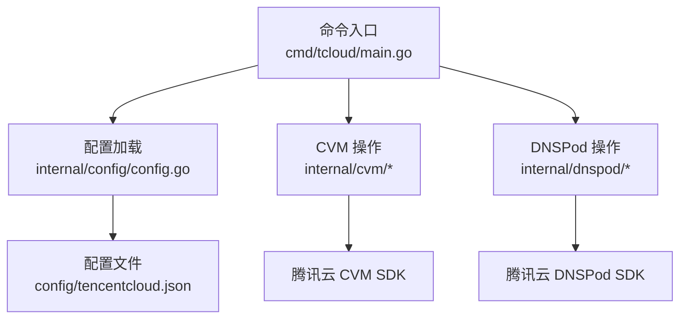
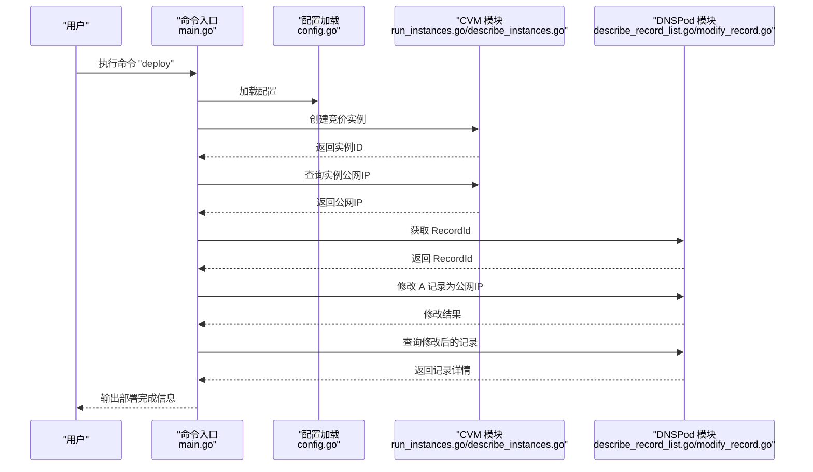
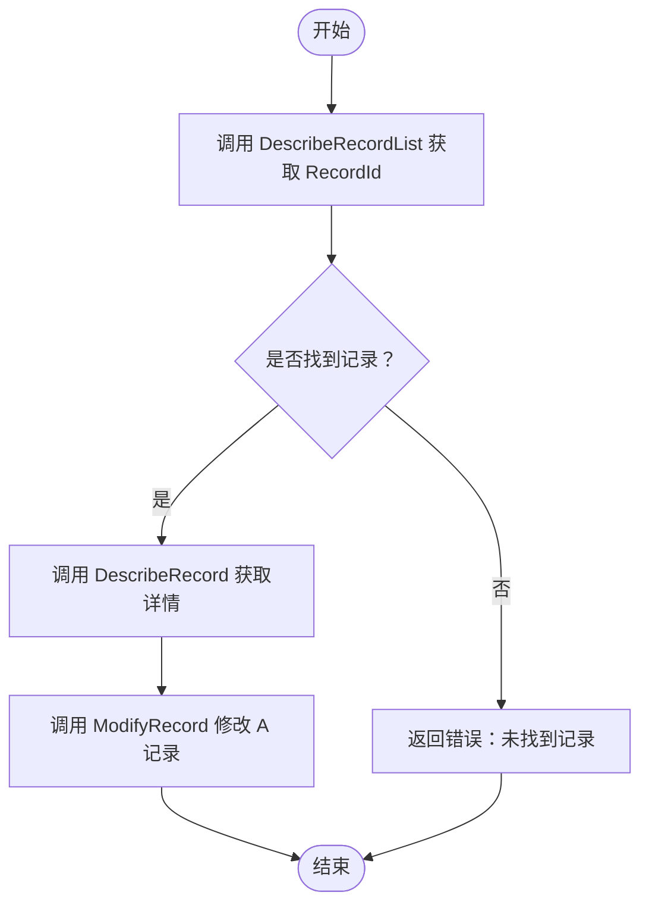
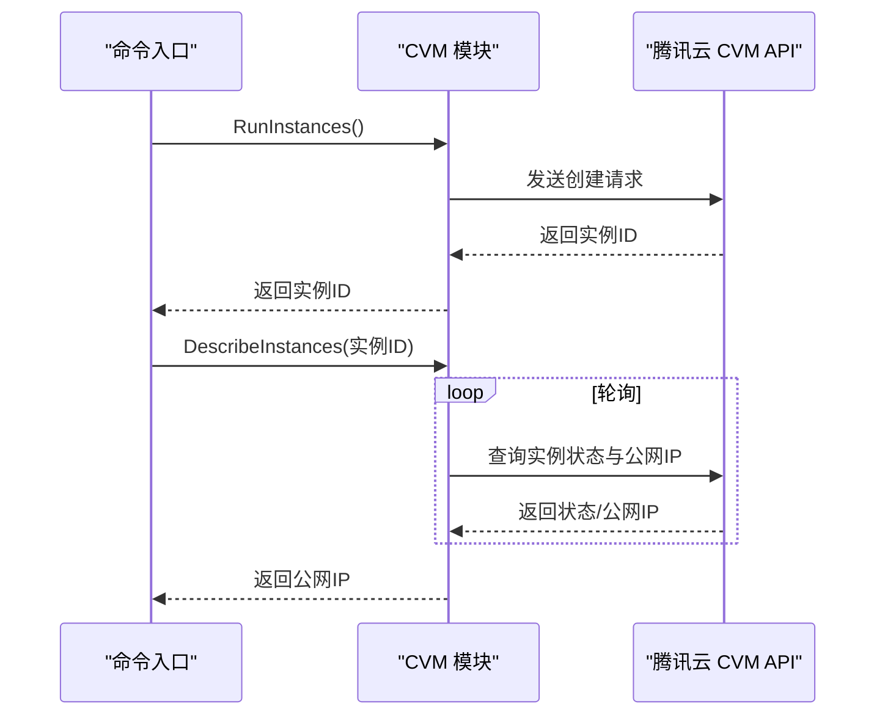

# 快速开始

<cite>
**本文引用的文件**
- [main.go](file://cmd/tcloud/main.go)
- [config.go](file://internal/config/config.go)
- [tencentcloud.json](file://config/tencentcloud.json)
- [describe_instances.go](file://internal/cvm/describe_instances.go)
- [run_instances.go](file://internal/cvm/run_instances.go)
- [terminate_instances.go](file://internal/cvm/terminate_instances.go)
- [describe_record.go](file://internal/dnspod/describe_record.go)
- [describe_record_list.go](file://internal/dnspod/describe_record_list.go)
- [modify_record.go](file://internal/dnspod/modify_record.go)
- [go.mod](file://go.mod)
</cite>

## 目录
1. [简介](#简介)
2. [项目结构](#项目结构)
3. [核心组件](#核心组件)
4. [架构总览](#架构总览)
5. [详细组件分析](#详细组件分析)
6. [依赖分析](#依赖分析)
7. [性能考虑](#性能考虑)
8. [故障排查指南](#故障排查指南)
9. [结论](#结论)
10. [附录](#附录)

## 简介
本指南面向首次使用腾讯云自动化管理工具的新用户，帮助你在约30分钟内完成环境准备、安装与配置，并成功执行首次操作。工具支持以下典型场景：
- 列出并查看 DNS 解析记录
- 修改 DNS A 记录指向新的公网 IP
- 创建 CVM 竞价实例
- 一键部署：创建实例 → 获取公网 IP → 修改 DNS
- 销毁实例与一键回收：销毁实例 → 还原 DNS

你将学会如何准备环境、安装依赖、生成并配置 tencentcloud.json，以及使用 list、describe、modify、run-instances、deploy、destroy、undeploy 等基础命令。

## 项目结构
该仓库采用模块化的 Go 项目结构，命令入口位于 cmd/tcloud/main.go，核心业务逻辑分布在 internal 子包中：
- cmd/tcloud/main.go：命令行入口，解析参数并分发到具体子功能
- internal/config/config.go：配置加载与校验
- internal/cvm/*：CVM 实例生命周期管理（创建、查询、销毁）
- internal/dnspod/*：DNSPod 记录查询与修改
- config/tencentcloud.json：工具所需的配置文件

图表来源
- [main.go:12-196](file://cmd/tcloud/main.go#L12-L196)
- [config.go:30-59](file://internal/config/config.go#L30-L59)

章节来源
- [main.go:12-196](file://cmd/tcloud/main.go#L12-L196)
- [config.go:30-59](file://internal/config/config.go#L30-L59)

## 核心组件
- 命令行入口与分发：解析命令行参数，调用对应功能模块
- 配置加载：从 config/tencentcloud.json 读取并校验必要字段
- CVM 模块：创建、查询、销毁实例；查询公网 IP
- DNSPod 模块：列出记录、查询详情、修改 A 记录

章节来源
- [main.go:27-196](file://cmd/tcloud/main.go#L27-L196)
- [config.go:30-59](file://internal/config/config.go#L30-L59)
- [run_instances.go:14-91](file://internal/cvm/run_instances.go#L14-L91)
- [describe_instances.go:15-64](file://internal/cvm/describe_instances.go#L15-L64)
- [describe_record_list.go:14-46](file://internal/dnspod/describe_record_list.go#L14-L46)
- [describe_record.go:14-37](file://internal/dnspod/describe_record.go#L14-L37)
- [modify_record.go:14-41](file://internal/dnspod/modify_record.go#L14-L41)

## 架构总览
下面的序列图展示了“一键部署”流程：创建实例 → 获取公网 IP → 获取 RecordId → 修改 DNS → 再次查询确认。

图表来源
- [main.go:85-131](file://cmd/tcloud/main.go#L85-L131)
- [run_instances.go:14-91](file://internal/cvm/run_instances.go#L14-L91)
- [describe_instances.go:15-64](file://internal/cvm/describe_instances.go#L15-L64)
- [describe_record_list.go:14-46](file://internal/dnspod/describe_record_list.go#L14-L46)
- [modify_record.go:14-41](file://internal/dnspod/modify_record.go#L14-L41)

## 详细组件分析

### 命令行入口与命令分发
- 支持命令：list、describe、modify、run-instances、deploy、destroy、undeploy
- list 支持 --detail 参数，自动查询第一条记录详情
- modify 需要提供新的 IP 地址作为参数
- deploy 与 undeploy 提供多步骤的一键化流程

章节来源
- [main.go:27-196](file://cmd/tcloud/main.go#L27-L196)

### 配置加载与 tencentcloud.json
- 配置文件位置优先从可执行文件所在目录下的 config/tencentcloud.json 读取；若不存在则回退到源码目录的 config/tencentcloud.json
- 必需字段：secret_id、secret_key
- 其他常用字段：region、domain、subdomain、private_ip、zone、vpc_id、subnet_id、security_group_ids、instance_name、instance_type、image_id、key_id、max_price

章节来源
- [config.go:30-59](file://internal/config/config.go#L30-L59)
- [tencentcloud.json:1-18](file://config/tencentcloud.json#L1-L18)

### DNSPod 模块
- 列表与详情：通过 DescribeRecordList 获取第一条记录的 RecordId；通过 DescribeRecord 获取记录详情
- 修改：通过 ModifyRecord 将 A 记录指向指定 IP

图表来源
- [describe_record_list.go:14-46](file://internal/dnspod/describe_record_list.go#L14-L46)
- [describe_record.go:14-37](file://internal/dnspod/describe_record.go#L14-L37)
- [modify_record.go:14-41](file://internal/dnspod/modify_record.go#L14-L41)

章节来源
- [describe_record_list.go:14-46](file://internal/dnspod/describe_record_list.go#L14-L46)
- [describe_record.go:14-37](file://internal/dnspod/describe_record.go#L14-L37)
- [modify_record.go:14-41](file://internal/dnspod/modify_record.go#L14-L41)

### CVM 模块
- 创建实例：使用 RunInstances 创建竞价实例，返回实例 ID
- 查询公网 IP：DescribeInstances 轮询等待实例运行并返回公网 IP
- 销毁实例：TerminateInstances 销毁指定实例
- 查找实例：FindInstanceByPrivateIP 根据内网 IP 查找实例

图表来源
- [run_instances.go:14-91](file://internal/cvm/run_instances.go#L14-L91)
- [describe_instances.go:15-64](file://internal/cvm/describe_instances.go#L15-L64)

章节来源
- [run_instances.go:14-91](file://internal/cvm/run_instances.go#L14-L91)
- [describe_instances.go:15-64](file://internal/cvm/describe_instances.go#L15-L64)
- [terminate_instances.go](file://internal/cvm/terminate_instances.go)

## 依赖分析
- 使用腾讯云官方 Go SDK：common、cvm、dnspod
- Go 版本要求：1.26.3

章节来源
- [go.mod:1-10](file://go.mod#L1-L10)

## 性能考虑
- DNSPod 查询与修改为单次 API 调用，延迟主要取决于网络与接口响应时间
- CVM 查询公网 IP 采用轮询机制，默认最多重试若干次，每次间隔固定时间，避免频繁请求导致限流
- 一键部署流程按步骤顺序执行，适合初学者理解与排障

[本节为通用建议，不涉及特定文件分析]

## 故障排查指南
- 配置文件缺失或不可读
  - 现象：启动时报错提示无法加载配置
  - 处理：确认 config/tencentcloud.json 是否存在且可读；检查 secret_id 与 secret_key 是否填写
  - 参考
    - [config.go:30-59](file://internal/config/config.go#L30-L59)
    - [tencentcloud.json:1-18](file://config/tencentcloud.json#L1-L18)
- 未找到记录或 RecordId 为空
  - 现象：DescribeRecordList 返回空列表
  - 处理：确认 domain 与 subdomain 设置正确；检查 DNS 记录是否存在
  - 参考
    - [describe_record_list.go:14-46](file://internal/dnspod/describe_record_list.go#L14-L46)
- 修改记录失败
  - 现象：ModifyRecord 报错
  - 处理：检查权限与网络；确认 RecordId 正确；核对目标 IP 格式
  - 参考
    - [modify_record.go:14-41](file://internal/dnspod/modify_record.go#L14-L41)
- 创建实例失败
  - 现象：RunInstances 报错
  - 处理：检查 region、zone、vpc_id、subnet_id、security_group_ids、instance_type、image_id、key_id、max_price 等参数；确认配额与权限
  - 参考
    - [run_instances.go:14-91](file://internal/cvm/run_instances.go#L14-L91)
- 获取公网 IP 超时
  - 现象：DescribeInstances 在多次轮询后仍无公网 IP
  - 处理：检查实例状态是否为 RUNNING；确认网络计费方式与带宽配置；适当延长等待时间
  - 参考
    - [describe_instances.go:15-64](file://internal/cvm/describe_instances.go#L15-L64)
- 销毁实例失败
  - 现象：TerminateInstances 报错
  - 处理：确认实例 ID 正确；检查安全组与网络策略；确认实例处于可终止状态
  - 参考
    - [terminate_instances.go](file://internal/cvm/terminate_instances.go)

## 结论
通过本指南，你已经了解了工具的整体架构、配置方法与常用命令。建议在首次使用时：
- 先用 list 与 describe 确认 DNS 记录状态
- 用 run-instances 创建实例并用 describe_instances 获取公网 IP
- 用 modify 将 A 记录指向公网 IP
- 最后用 deploy/undeploy 验证一键化流程

[本节为总结性内容，不涉及特定文件分析]

## 附录

### 环境准备与安装
- 安装 Go：确保本地已安装 Go 1.26.3 或以上版本
- 获取项目：克隆或下载仓库至本地
- 安装依赖：进入项目根目录，执行依赖安装（Go 模块会自动拉取 SDK）

章节来源
- [go.mod:1-10](file://go.mod#L1-L10)

### 初始配置
- 准备 tencentcloud.json：将 config/tencentcloud.json 中的占位符替换为你的实际信息
  - 必填项：secret_id、secret_key
  - 常用项：region、domain、subdomain、private_ip、zone、vpc_id、subnet_id、security_group_ids、instance_name、instance_type、image_id、key_id、max_price
- 验证配置：运行 list 命令查看记录列表，确认配置有效

章节来源
- [tencentcloud.json:1-18](file://config/tencentcloud.json#L1-L18)
- [config.go:30-59](file://internal/config/config.go#L30-L59)

### 基础命令使用示例
- 列出记录并可选查看详情
  - 示例：go run ./cmd/tcloud list
  - 示例：go run ./cmd/tcloud list --detail
- 查看记录详情
  - 示例：go run ./cmd/tcloud describe
- 修改 A 记录
  - 示例：go run ./cmd/tcloud modify 200.200.200.200
- 创建 CVM 竞价实例
  - 示例：go run ./cmd/tcloud run-instances
- 一键部署
  - 示例：go run ./cmd/tcloud deploy
- 销毁实例
  - 示例：go run ./cmd/tcloud destroy
- 一键回收
  - 示例：go run ./cmd/tcloud undeploy

章节来源
- [main.go:205-219](file://cmd/tcloud/main.go#L205-L219)