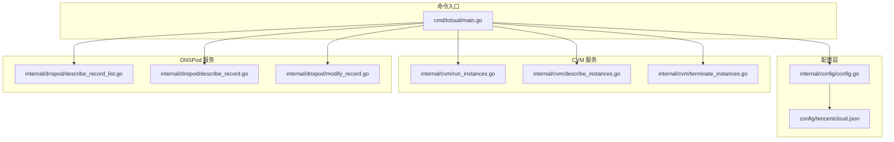
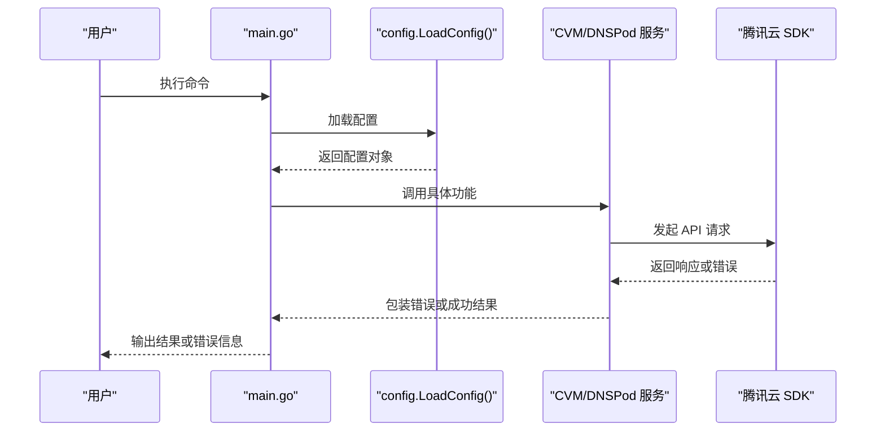
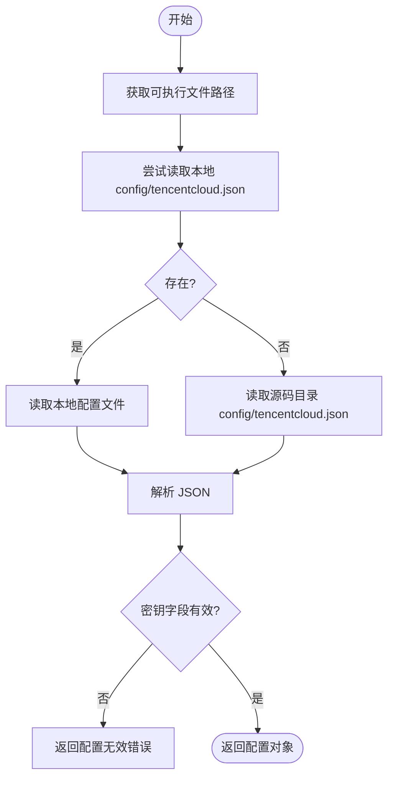
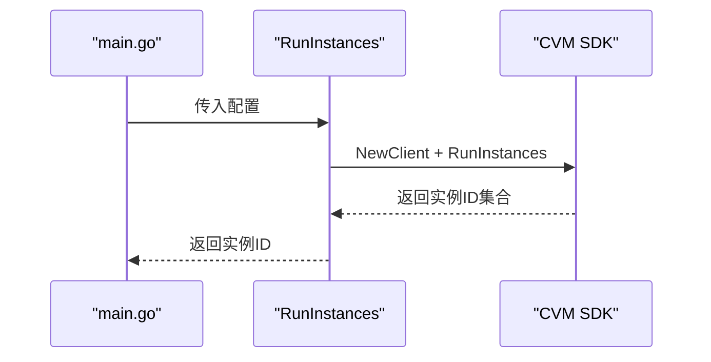
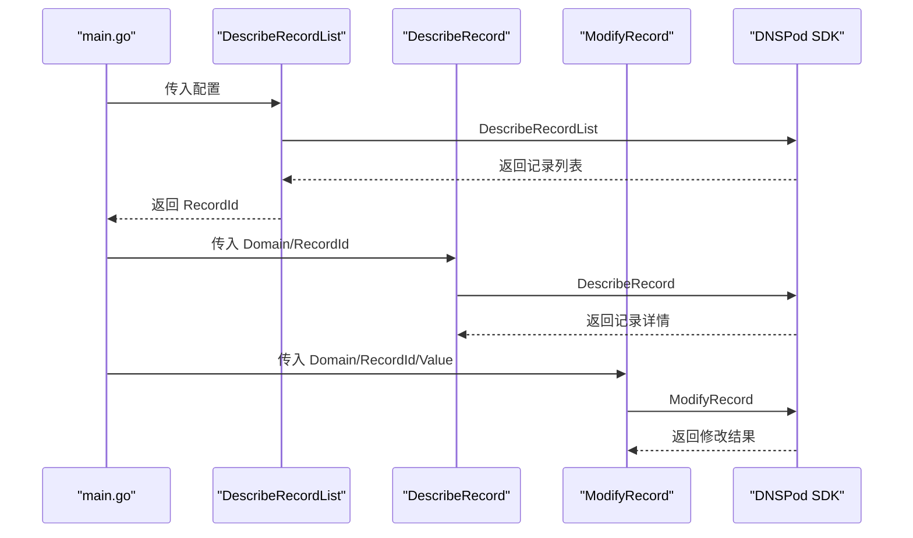
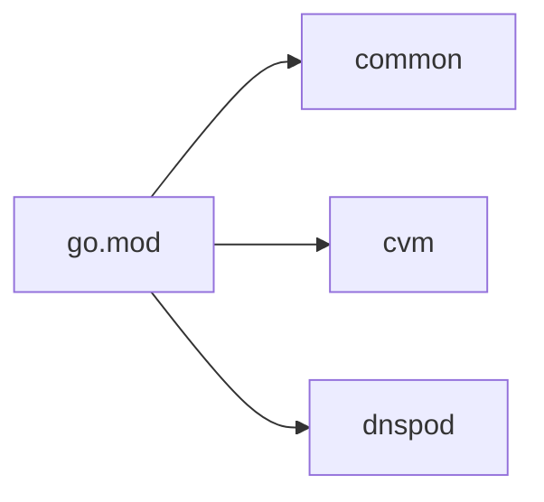

# 故障排除

<cite>
**本文引用的文件**
- [cmd/tcloud/main.go](file://cmd/tcloud/main.go)
- [internal/config/config.go](file://internal/config/config.go)
- [internal/cvm/run_instances.go](file://internal/cvm/run_instances.go)
- [internal/cvm/describe_instances.go](file://internal/cvm/describe_instances.go)
- [internal/cvm/terminate_instances.go](file://internal/cvm/terminate_instances.go)
- [internal/dnspod/describe_record_list.go](file://internal/dnspod/describe_record_list.go)
- [internal/dnspod/describe_record.go](file://internal/dnspod/describe_record.go)
- [internal/dnspod/modify_record.go](file://internal/dnspod/modify_record.go)
- [config/tencentcloud.json](file://config/tencentcloud.json)
- [go.mod](file://go.mod)
</cite>

## 目录
1. [简介](#简介)
2. [项目结构](#项目结构)
3. [核心组件](#核心组件)
4. [架构总览](#架构总览)
5. [详细组件分析](#详细组件分析)
6. [依赖分析](#依赖分析)
7. [性能考虑](#性能考虑)
8. [故障排除指南](#故障排除指南)
9. [结论](#结论)
10. [附录](#附录)

## 简介
本故障排除文档面向使用本项目进行腾讯云 CVM 实例管理与 DNSPod 域名解析自动化操作的用户。内容覆盖配置错误、API 调用失败、权限不足、网络与超时、DNS 解析异常、实例生命周期管理等问题的诊断与修复方法，并提供日志分析与调试技巧、性能优化建议以及联系技术支持与反馈问题的渠道。

## 项目结构
项目采用模块化分层设计：
- 命令入口层：cmd/tcloud/main.go，负责解析命令行参数、加载配置、调度各子功能。
- 配置层：internal/config/config.go，负责读取并校验配置文件。
- 业务服务层：
  - CVM 层：internal/cvm/*，封装竞价实例的创建、查询、销毁。
  - DNSPod 层：internal/dnspod/*，封装记录查询、记录列表查询、记录修改。
- 配置文件：config/tencentcloud.json，包含密钥、地域、域名、子域、VPC/子网、安全组、实例规格等关键参数。

图表来源
- [cmd/tcloud/main.go:12-196](file://cmd/tcloud/main.go#L12-L196)
- [internal/config/config.go:31-59](file://internal/config/config.go#L31-L59)
- [internal/cvm/run_instances.go:15-91](file://internal/cvm/run_instances.go#L15-L91)
- [internal/cvm/describe_instances.go:16-64](file://internal/cvm/describe_instances.go#L16-L64)
- [internal/cvm/terminate_instances.go:15-36](file://internal/cvm/terminate_instances.go#L15-L36)
- [internal/dnspod/describe_record_list.go:15-46](file://internal/dnspod/describe_record_list.go#L15-L46)
- [internal/dnspod/describe_record.go:15-37](file://internal/dnspod/describe_record.go#L15-L37)
- [internal/dnspod/modify_record.go:15-41](file://internal/dnspod/modify_record.go#L15-L41)

章节来源
- [cmd/tcloud/main.go:12-196](file://cmd/tcloud/main.go#L12-L196)
- [internal/config/config.go:31-59](file://internal/config/config.go#L31-L59)
- [config/tencentcloud.json:1-18](file://config/tencentcloud.json#L1-L18)

## 核心组件
- 配置加载与校验：从可执行文件所在目录或源码目录读取配置文件，解析 JSON 并校验密钥字段。
- CVM 管理：创建竞价实例、按内网 IP 查找实例、查询实例公网 IP、销毁实例。
- DNSPod 管理：查询记录列表并提取 RecordId、查询单条记录详情、修改 A 记录值。
- 命令编排：支持 list、describe、modify、run-instances、deploy、destroy、undeploy 等命令。

章节来源
- [internal/config/config.go:31-59](file://internal/config/config.go#L31-L59)
- [internal/cvm/run_instances.go:15-91](file://internal/cvm/run_instances.go#L15-L91)
- [internal/cvm/describe_instances.go:16-64](file://internal/cvm/describe_instances.go#L16-L64)
- [internal/cvm/terminate_instances.go:15-36](file://internal/cvm/terminate_instances.go#L15-L36)
- [internal/dnspod/describe_record_list.go:15-46](file://internal/dnspod/describe_record_list.go#L15-L46)
- [internal/dnspod/describe_record.go:15-37](file://internal/dnspod/describe_record.go#L15-L37)
- [internal/dnspod/modify_record.go:15-41](file://internal/dnspod/modify_record.go#L15-L41)
- [cmd/tcloud/main.go:27-196](file://cmd/tcloud/main.go#L27-L196)

## 架构总览
命令入口根据用户输入选择对应功能，依次调用配置加载与各服务模块。CVM 与 DNSPod 通过腾讯云 SDK 客户端发起 API 请求，错误统一包装为“API错误”或“请求失败”。

图表来源
- [cmd/tcloud/main.go:19-23](file://cmd/tcloud/main.go#L19-L23)
- [internal/config/config.go:31-59](file://internal/config/config.go#L31-L59)
- [internal/cvm/run_instances.go:72-78](file://internal/cvm/run_instances.go#L72-L78)
- [internal/dnspod/describe_record_list.go:26-32](file://internal/dnspod/describe_record_list.go#L26-L32)

## 详细组件分析

### 配置加载与校验
- 路径优先级：优先从可执行文件所在目录读取 config/tencentcloud.json；若不存在则回退到源码目录。
- 校验逻辑：必须包含密钥字段，否则报错。
- JSON 格式化输出：提供 PrintJSON 辅助函数用于美化打印响应。

图表来源
- [internal/config/config.go:32-58](file://internal/config/config.go#L32-L58)

章节来源
- [internal/config/config.go:31-59](file://internal/config/config.go#L31-L59)
- [config/tencentcloud.json:1-18](file://config/tencentcloud.json#L1-L18)

### CVM 组件
- 创建实例：设置计费类型为竞价、指定可用区、镜像、系统盘、VPC/子网、公网带宽、登录密钥、安全组、增强服务、市场选项等。
- 查询实例：轮询等待实例运行且具备公网 IP，超时则报错。
- 销毁实例：传入实例 ID 执行终止。
- 按内网 IP 查找实例：遍历所有实例匹配 PrivateIpAddresses。

图表来源
- [internal/cvm/run_instances.go:15-91](file://internal/cvm/run_instances.go#L15-L91)
- [cmd/tcloud/main.go:88-92](file://cmd/tcloud/main.go#L88-L92)

章节来源
- [internal/cvm/run_instances.go:15-91](file://internal/cvm/run_instances.go#L15-L91)
- [internal/cvm/describe_instances.go:16-64](file://internal/cvm/describe_instances.go#L16-L64)
- [internal/cvm/terminate_instances.go:15-36](file://internal/cvm/terminate_instances.go#L15-L36)
- [internal/cvm/describe_instances.go:67-100](file://internal/cvm/describe_instances.go#L67-L100)

### DNSPod 组件
- 查询记录列表：按域名与子域筛选，提取第一条记录的 RecordId。
- 查询单条记录：按 Domain 与 RecordId 查询详情。
- 修改记录：按 Domain、RecordId、RecordType、RecordLine、Value 修改 A 记录。

图表来源
- [internal/dnspod/describe_record_list.go:15-46](file://internal/dnspod/describe_record_list.go#L15-L46)
- [internal/dnspod/describe_record.go:15-37](file://internal/dnspod/describe_record.go#L15-L37)
- [internal/dnspod/modify_record.go:15-41](file://internal/dnspod/modify_record.go#L15-L41)

章节来源
- [internal/dnspod/describe_record_list.go:15-46](file://internal/dnspod/describe_record_list.go#L15-L46)
- [internal/dnspod/describe_record.go:15-37](file://internal/dnspod/describe_record.go#L15-L37)
- [internal/dnspod/modify_record.go:15-41](file://internal/dnspod/modify_record.go#L15-L41)

## 依赖分析
- 外部 SDK：使用腾讯云官方 Go SDK 的 common、cvm、dnspod 三个模块。
- 版本：go.mod 中声明了具体版本号，确保兼容性。

图表来源
- [go.mod:5-9](file://go.mod#L5-L9)

章节来源
- [go.mod:1-10](file://go.mod#L1-L10)

## 性能考虑
- 轮询策略：查询实例公网 IP 时采用固定次数与间隔的轮询，避免频繁请求导致资源浪费。
- 超时控制：设置最大重试次数，防止长时间阻塞。
- 日志输出：对关键步骤进行阶段性输出，便于定位耗时环节。
- 建议：
  - 合理调整轮询间隔与次数以平衡准确性与性能。
  - 在批量操作时合并请求，减少重复初始化客户端的开销。
  - 使用异步或并发处理多个独立任务（如多实例查询），但需注意 API 限流与幂等性。

[本节为通用性能建议，不直接分析具体文件]

## 故障排除指南

### 一、配置错误类问题
- 现象
  - 启动即报“加载配置文件失败”或“解析配置文件失败”。
  - 报“配置文件中 secret_id 或 secret_key 为空”。
- 诊断
  - 检查配置文件是否存在且路径正确（可执行文件目录优先）。
  - 检查 JSON 格式是否合法，字段是否齐全。
  - 确认密钥字段非空。
- 修复
  - 将配置文件放置于可执行文件所在目录或源码目录的 config 子目录。
  - 补充缺失字段，确保密钥有效。
  - 使用 PrintJSON 辅助核对响应结构。

章节来源
- [internal/config/config.go:32-58](file://internal/config/config.go#L32-L58)
- [config/tencentcloud.json:1-18](file://config/tencentcloud.json#L1-L18)

### 二、API 调用失败类问题
- 现象
  - 报“API错误”或“请求失败”，随后退出。
- 诊断
  - 检查网络连通性与代理设置。
  - 确认地域、可用区、VPC/子网、安全组等参数与实际环境一致。
  - 核对实例规格、镜像 ID、密钥 ID 是否有效。
- 修复
  - 更新配置文件中的地域、可用区、VPC/子网、安全组、实例规格、镜像 ID、密钥 ID 等参数。
  - 如为网络问题，检查防火墙与代理设置。
  - 对于 DNSPod 修改，确认 RecordId 正确且记录类型为 A。

章节来源
- [internal/cvm/run_instances.go:73-78](file://internal/cvm/run_instances.go#L73-L78)
- [internal/cvm/describe_instances.go:31-36](file://internal/cvm/describe_instances.go#L31-L36)
- [internal/cvm/terminate_instances.go:26-31](file://internal/cvm/terminate_instances.go#L26-L31)
- [internal/dnspod/describe_record_list.go:28-32](file://internal/dnspod/describe_record_list.go#L28-L32)
- [internal/dnspod/describe_record.go:27-32](file://internal/dnspod/describe_record.go#L27-L32)
- [internal/dnspod/modify_record.go:31-36](file://internal/dnspod/modify_record.go#L31-L36)

### 三、权限不足类问题
- 现象
  - API 返回权限相关错误（例如密钥无效、无访问权限）。
- 诊断
  - 确认密钥具有相应产品与地域的操作权限。
  - 检查是否启用了相关服务授权。
- 修复
  - 在腾讯云控制台为密钥授予 CVM 与 DNSPod 的必要权限。
  - 使用更严格的最小权限策略，仅授予所需操作。

章节来源
- [internal/config/config.go:54-56](file://internal/config/config.go#L54-L56)

### 四、网络与超时类问题
- 现象
  - 查询实例公网 IP 时提示“等待超时：实例未能在规定时间内获取公网IP”。
- 诊断
  - 实例可能仍在启动或分配公网 IP 的过程中。
  - 网络不稳定或请求被限流。
- 修复
  - 增加轮询次数或延长间隔，或在部署流程中加入更完善的健康检查。
  - 检查网络与代理设置，必要时更换地域或可用区。

章节来源
- [internal/cvm/describe_instances.go:26-63](file://internal/cvm/describe_instances.go#L26-L63)

### 五、DNS 解析异常类问题
- 现象
  - 修改 DNS 记录后未生效或解析异常。
- 诊断
  - 确认 RecordId 来自正确的域名与子域组合。
  - 检查记录类型与线路是否匹配。
- 修复
  - 先查询记录列表获取最新 RecordId，再执行修改。
  - 使用 describe 命令核对修改前后记录详情。

章节来源
- [internal/dnspod/describe_record_list.go:39-45](file://internal/dnspod/describe_record_list.go#L39-L45)
- [internal/dnspod/modify_record.go:22-29](file://internal/dnspod/modify_record.go#L22-L29)

### 六、实例生命周期管理类问题
- 现象
  - 无法根据内网 IP 查找实例，或销毁失败。
- 诊断
  - 检查配置中的 PrivateIP 是否与实例实际内网 IP 一致。
  - 确认实例处于可销毁状态。
- 修复
  - 更新配置中的 PrivateIP。
  - 先查询实例详情，确认状态后再执行销毁。

章节来源
- [internal/cvm/describe_instances.go:85-99](file://internal/cvm/describe_instances.go#L85-L99)
- [internal/cvm/terminate_instances.go:22-31](file://internal/cvm/terminate_instances.go#L22-L31)

### 七、日志分析与调试技巧
- 关键输出点
  - 配置加载阶段：打印配置文件路径与解析结果。
  - API 调用阶段：打印请求与响应的 JSON 结构（使用 PrintJSON）。
  - 流程阶段：按步骤输出“第N步”提示，便于定位卡顿环节。
- 调试建议
  - 在开发环境中开启更详细的日志输出。
  - 使用 PrintJSON 核对响应字段，快速定位字段缺失或类型不符。
  - 分步执行命令，逐步缩小问题范围。

章节来源
- [internal/config/config.go:62-69](file://internal/config/config.go#L62-L69)
- [cmd/tcloud/main.go:30-34](file://cmd/tcloud/main.go#L30-L34)
- [cmd/tcloud/main.go:95-100](file://cmd/tcloud/main.go#L95-L100)
- [cmd/tcloud/main.go:117-120](file://cmd/tcloud/main.go#L117-L120)

### 八、性能问题识别与优化
- 识别
  - 轮询等待时间过长。
  - 多次重复初始化客户端造成资源浪费。
  - 批量操作未合并请求。
- 优化
  - 调整轮询间隔与次数，结合实例状态变化动态缩短等待。
  - 复用 SDK 客户端实例，减少初始化成本。
  - 合理拆分与合并请求，避免不必要的重复调用。

章节来源
- [internal/cvm/describe_instances.go:26-63](file://internal/cvm/describe_instances.go#L26-L63)

### 九、联系技术支持与反馈问题
- 渠道
  - 腾讯云官网技术支持页面。
  - 控制台工单系统。
  - 社区论坛与问答平台。
- 反馈要点
  - 提供完整的命令输出（含 PrintJSON 的响应片段）。
  - 明确问题发生的具体步骤与期望行为。
  - 附上配置文件的关键字段（脱敏敏感信息）。

[本节为通用指导，不直接分析具体文件]

## 结论
本项目通过清晰的命令编排与模块化设计，实现了 CVM 与 DNSPod 的自动化管理。针对常见问题，建议优先检查配置文件与密钥有效性，其次关注网络与超时、权限与参数一致性。通过分步调试与日志输出，可快速定位问题并实施修复。对于性能优化，应结合业务场景调整轮询策略与客户端复用策略。

[本节为总结性内容，不直接分析具体文件]

## 附录

### A. 常见错误代码与含义
- 配置加载失败
  - 描述：无法读取或解析配置文件。
  - 处理：检查文件路径与 JSON 格式，确保密钥字段非空。
- API 错误
  - 描述：SDK 返回的 API 错误。
  - 处理：核对地域、可用区、VPC/子网、安全组、实例规格、镜像 ID、密钥 ID 等参数。
- 请求失败
  - 描述：网络或 SDK 层面的请求异常。
  - 处理：检查网络连通性与代理设置，必要时更换地域或可用区。
- 等待超时
  - 描述：实例未能在规定时间内获取公网 IP。
  - 处理：增加轮询次数或延长间隔，检查实例状态与网络。

章节来源
- [internal/config/config.go:44-56](file://internal/config/config.go#L44-L56)
- [internal/cvm/describe_instances.go:31-36](file://internal/cvm/describe_instances.go#L31-L36)
- [internal/cvm/describe_instances.go:63](file://internal/cvm/describe_instances.go#L63)

### B. 常用命令与用法
- 列表与详情
  - list：获取记录列表并提取 RecordId。
  - list --detail：获取记录列表后自动查询第一条记录详情。
  - describe：自动获取 RecordId 并查询记录详情。
- 修改记录
  - modify <IP>：自动获取 RecordId 并修改记录的 IP 值。
- 实例管理
  - run-instances：创建 CVM 竞价实例。
  - deploy：一键部署（创建实例→获取公网 IP→修改 DNS）。
  - destroy：根据内网 IP 查找并销毁 CVM 实例。
  - undeploy：一键回收（查找实例→销毁→还原 DNS）。

章节来源
- [cmd/tcloud/main.go:200-219](file://cmd/tcloud/main.go#L200-L219)