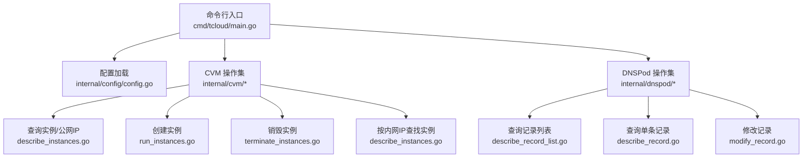
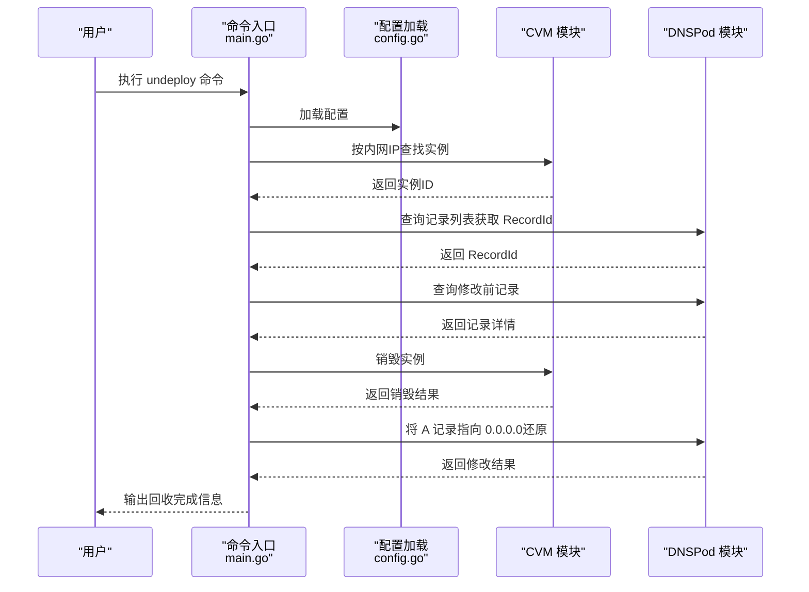
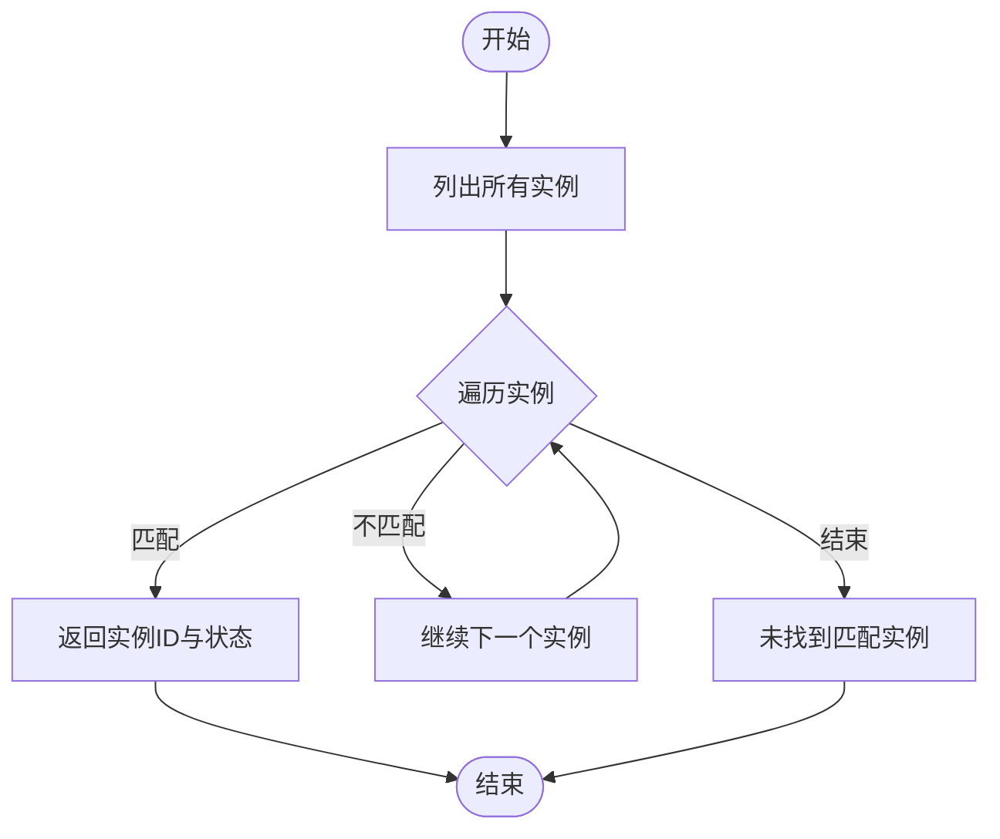
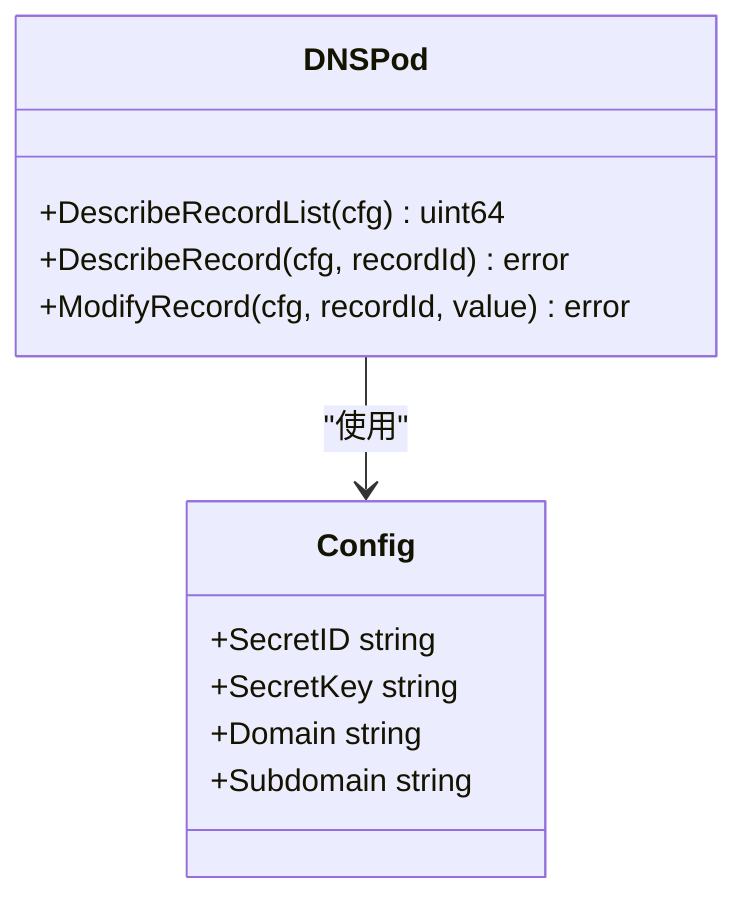
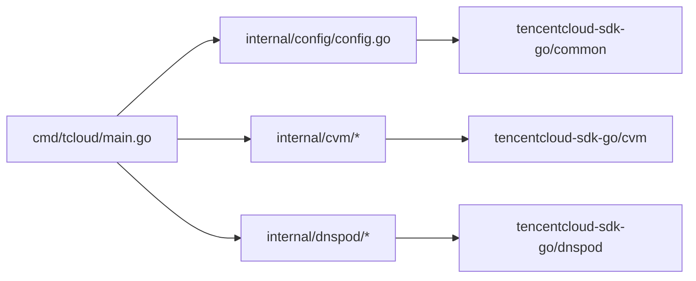

# 一键回收流程

<cite>
**本文引用的文件**
- [cmd/tcloud/main.go](file://cmd/tcloud/main.go)
- [internal/config/config.go](file://internal/config/config.go)
- [internal/cvm/describe_instances.go](file://internal/cvm/describe_instances.go)
- [internal/cvm/run_instances.go](file://internal/cvm/run_instances.go)
- [internal/cvm/terminate_instances.go](file://internal/cvm/terminate_instances.go)
- [internal/dnspod/describe_record.go](file://internal/dnspod/describe_record.go)
- [internal/dnspod/describe_record_list.go](file://internal/dnspod/describe_record_list.go)
- [internal/dnspod/modify_record.go](file://internal/dnspod/modify_record.go)
</cite>

## 目录
1. [简介](#简介)
2. [项目结构](#项目结构)
3. [核心组件](#核心组件)
4. [架构总览](#架构总览)
5. [详细组件分析](#详细组件分析)
6. [依赖关系分析](#依赖关系分析)
7. [性能考量](#性能考量)
8. [故障排查指南](#故障排查指南)
9. [结论](#结论)
10. [附录](#附录)

## 简介
本文件围绕“一键回收”流程展开，详细阐述 undeploy 命令的完整执行步骤：从根据内网 IP 查找实例，到销毁实例，再到还原 DNS 记录。文档重点说明以下方面：
- 实例查找的准确性验证与边界条件处理
- 实例销毁的安全确认与幂等性保障
- DNS 记录还原的原子性与一致性保证
- 回收过程中的资源清理顺序、依赖关系解除与状态同步机制
- 回收失败的恢复策略与数据备份方案
- 安全检查、权限验证与审计日志建议
- 防误操作与撤销机制的设计思路

## 项目结构
该工程采用模块化分层设计：
- cmd/tcloud：命令入口与用户交互，负责解析参数、加载配置并调度各子功能
- internal/config：配置加载与校验，提供腾讯云访问凭据、区域、域名、子域、私有 IP、网络与实例规格等参数
- internal/cvm：CVM 实例生命周期管理，包括创建、查询、销毁与按内网 IP 查找
- internal/dnspod：DNSPod 解析记录管理，包括查询记录列表、查询单条记录、修改记录

图表来源
- [cmd/tcloud/main.go:12-196](file://cmd/tcloud/main.go#L12-L196)
- [internal/config/config.go:31-59](file://internal/config/config.go#L31-L59)
- [internal/cvm/describe_instances.go:15-100](file://internal/cvm/describe_instances.go#L15-L100)
- [internal/cvm/run_instances.go:14-91](file://internal/cvm/run_instances.go#L14-L91)
- [internal/cvm/terminate_instances.go:14-36](file://internal/cvm/terminate_instances.go#L14-L36)
- [internal/dnspod/describe_record_list.go:14-46](file://internal/dnspod/describe_record_list.go#L14-L46)
- [internal/dnspod/describe_record.go:14-37](file://internal/dnspod/describe_record.go#L14-L37)
- [internal/dnspod/modify_record.go:14-41](file://internal/dnspod/modify_record.go#L14-L41)

章节来源
- [cmd/tcloud/main.go:12-196](file://cmd/tcloud/main.go#L12-L196)
- [internal/config/config.go:31-59](file://internal/config/config.go#L31-L59)

## 核心组件
- 命令入口与流程编排：负责解析命令、加载配置、按序执行回收步骤，并打印阶段性结果
- 配置模块：统一加载腾讯云凭据、区域、域名、子域、私有 IP、网络与实例规格等参数
- CVM 模块：提供创建、查询、销毁实例的能力；支持按内网 IP 查找实例
- DNSPod 模块：提供查询记录列表、查询单条记录、修改记录的能力

章节来源
- [cmd/tcloud/main.go:12-196](file://cmd/tcloud/main.go#L12-L196)
- [internal/config/config.go:11-28](file://internal/config/config.go#L11-L28)
- [internal/cvm/run_instances.go:14-91](file://internal/cvm/run_instances.go#L14-L91)
- [internal/cvm/describe_instances.go:15-100](file://internal/cvm/describe_instances.go#L15-L100)
- [internal/cvm/terminate_instances.go:14-36](file://internal/cvm/terminate_instances.go#L14-L36)
- [internal/dnspod/describe_record_list.go:14-46](file://internal/dnspod/describe_record_list.go#L14-L46)
- [internal/dnspod/describe_record.go:14-37](file://internal/dnspod/describe_record.go#L14-L37)
- [internal/dnspod/modify_record.go:14-41](file://internal/dnspod/modify_record.go#L14-L41)

## 架构总览
一键回收（undeploy）是一个串行流程，严格遵循“先定位、再销毁、后还原”的顺序，确保 DNS 指向在销毁过程中始终处于可控状态。流程图如下：

图表来源
- [cmd/tcloud/main.go:147-191](file://cmd/tcloud/main.go#L147-L191)
- [internal/cvm/describe_instances.go:66-100](file://internal/cvm/describe_instances.go#L66-L100)
- [internal/cvm/terminate_instances.go:14-36](file://internal/cvm/terminate_instances.go#L14-L36)
- [internal/dnspod/describe_record_list.go:14-46](file://internal/dnspod/describe_record_list.go#L14-L46)
- [internal/dnspod/describe_record.go:14-37](file://internal/dnspod/describe_record.go#L14-L37)
- [internal/dnspod/modify_record.go:14-41](file://internal/dnspod/modify_record.go#L14-L41)

## 详细组件分析

### 1) 命令入口与流程编排（undeploy）
- 功能职责：解析命令、加载配置、按序执行回收步骤、打印阶段性结果
- 关键点：
  - 步骤1：按内网 IP 查找实例
  - 步骤2：获取 RecordId（通过查询记录列表）
  - 步骤3：查询销毁前记录（用于审计与回滚依据）
  - 步骤4：销毁实例
  - 步骤5：将 A 记录指向 0.0.0.0（还原）
  - 步骤6：查询修改后记录（确认最终状态）

章节来源
- [cmd/tcloud/main.go:147-191](file://cmd/tcloud/main.go#L147-L191)

### 2) 配置加载与校验
- 功能职责：从配置文件加载腾讯云凭据、区域、域名、子域、私有 IP、网络与实例规格等参数
- 关键点：
  - 支持可执行文件目录与源码目录两种配置路径
  - 校验 SecretID 与 SecretKey 是否为空
  - 提供 JSON 格式化输出工具函数

章节来源
- [internal/config/config.go:31-59](file://internal/config/config.go#L31-L59)
- [internal/config/config.go:61-69](file://internal/config/config.go#L61-L69)

### 3) CVM 组件
- 实例查找（按内网 IP）：遍历所有实例，匹配 PrivateIpAddresses 中的指定内网 IP，返回实例 ID 与状态
- 实例销毁：调用终止接口，打印返回结果
- 实例查询（公网 IP）：轮询查询实例状态与公网 IP，等待实例运行并具备公网 IP 后返回

图表来源
- [internal/cvm/describe_instances.go:66-100](file://internal/cvm/describe_instances.go#L66-L100)

章节来源
- [internal/cvm/describe_instances.go:15-100](file://internal/cvm/describe_instances.go#L15-L100)
- [internal/cvm/terminate_instances.go:14-36](file://internal/cvm/terminate_instances.go#L14-L36)

### 4) DNSPod 组件
- 记录列表查询：按域名与子域查询记录列表，返回第一条记录的 RecordId
- 单条记录查询：按 Domain 与 RecordId 查询记录详情
- 记录修改：按 Domain、RecordType、RecordLine、Value、RecordId、SubDomain 修改 A 记录

图表来源
- [internal/dnspod/describe_record_list.go:14-46](file://internal/dnspod/describe_record_list.go#L14-L46)
- [internal/dnspod/describe_record.go:14-37](file://internal/dnspod/describe_record.go#L14-L37)
- [internal/dnspod/modify_record.go:14-41](file://internal/dnspod/modify_record.go#L14-L41)
- [internal/config/config.go:11-28](file://internal/config/config.go#L11-L28)

章节来源
- [internal/dnspod/describe_record_list.go:14-46](file://internal/dnspod/describe_record_list.go#L14-L46)
- [internal/dnspod/describe_record.go:14-37](file://internal/dnspod/describe_record.go#L14-L37)
- [internal/dnspod/modify_record.go:14-41](file://internal/dnspod/modify_record.go#L14-L41)

## 依赖关系分析
- 命令入口依赖配置模块与 CVM/DNSPod 模块
- CVM/DNSPod 模块依赖配置模块提供的凭据与参数
- SDK 依赖：腾讯云官方 Go SDK（common、cvm、dnspod）

图表来源
- [cmd/tcloud/main.go:7-9](file://cmd/tcloud/main.go#L7-L9)
- [internal/cvm/run_instances.go:8-11](file://internal/cvm/run_instances.go#L8-L11)
- [internal/dnspod/modify_record.go:8-11](file://internal/dnspod/modify_record.go#L8-L11)
- [internal/config/config.go:31-59](file://internal/config/config.go#L31-L59)

章节来源
- [cmd/tcloud/main.go:7-9](file://cmd/tcloud/main.go#L7-L9)
- [internal/cvm/run_instances.go:8-11](file://internal/cvm/run_instances.go#L8-L11)
- [internal/dnspod/modify_record.go:8-11](file://internal/dnspod/modify_record.go#L8-L11)
- [internal/config/config.go:31-59](file://internal/config/config.go#L31-L59)

## 性能考量
- 实例查询轮询：CVM 查询公网 IP 采用固定次数与间隔的轮询策略，避免频繁 API 调用导致的资源浪费
- 幂等性：DNS 修改以 RecordId 为准，若重复执行相同值，可视为幂等
- 并发与重试：当前实现为串行执行，未引入并发；如需扩展，应考虑限流与重试策略

[本节为通用性能讨论，不直接分析具体文件]

## 故障排查指南
- 配置加载失败
  - 症状：提示配置文件读取或解析失败
  - 排查：确认配置文件路径存在且包含有效的 SecretID/SecretKey
  - 参考
    - [internal/config/config.go:31-59](file://internal/config/config.go#L31-L59)
- 实例查找失败
  - 症状：提示未找到内网 IP 对应的实例
  - 排查：确认配置中的 PrivateIP 与实际实例一致；检查区域与 VPC/Subnet 设置
  - 参考
    - [internal/cvm/describe_instances.go:66-100](file://internal/cvm/describe_instances.go#L66-L100)
- DNS 记录查询失败
  - 症状：无法获取 RecordId 或记录详情
  - 排查：确认 Domain/Subdomain 配置正确；检查 DNSPod 权限
  - 参考
    - [internal/dnspod/describe_record_list.go:14-46](file://internal/dnspod/describe_record_list.go#L14-L46)
    - [internal/dnspod/describe_record.go:14-37](file://internal/dnspod/describe_record.go#L14-L37)
- 实例销毁失败
  - 症状：API 返回错误或实例状态异常
  - 排查：检查实例状态、权限与区域设置；必要时手动在控制台确认
  - 参考
    - [internal/cvm/terminate_instances.go:14-36](file://internal/cvm/terminate_instances.go#L14-L36)
- DNS 还原失败
  - 症状：将 A 记录指向 0.0.0.0 失败
  - 排查：确认 RecordId 有效；检查 DNSPod 权限与网络环境
  - 参考
    - [internal/dnspod/modify_record.go:14-41](file://internal/dnspod/modify_record.go#L14-L41)

章节来源
- [internal/config/config.go:31-59](file://internal/config/config.go#L31-L59)
- [internal/cvm/describe_instances.go:66-100](file://internal/cvm/describe_instances.go#L66-L100)
- [internal/dnspod/describe_record_list.go:14-46](file://internal/dnspod/describe_record_list.go#L14-L46)
- [internal/dnspod/describe_record.go:14-37](file://internal/dnspod/describe_record.go#L14-L37)
- [internal/cvm/terminate_instances.go:14-36](file://internal/cvm/terminate_instances.go#L14-L36)
- [internal/dnspod/modify_record.go:14-41](file://internal/dnspod/modify_record.go#L14-L41)

## 结论
一键回收流程通过严格的顺序控制与可观测性输出，实现了从实例定位、销毁到 DNS 还原的闭环管理。尽管当前实现为串行、非事务性，但通过“先销毁、后还原”的顺序与中间态审计（前置/后置记录查询），在大多数场景下可满足安全与一致性要求。建议在生产环境中结合外部监控与审计系统，进一步完善失败恢复与撤销能力。

[本节为总结性内容，不直接分析具体文件]

## 附录

### A. 一键回收流程步骤详解
- 步骤1：根据内网 IP 查找实例
  - 使用 CVM 列表查询并匹配 PrivateIpAddresses
  - 返回实例 ID 与状态
  - 参考
    - [internal/cvm/describe_instances.go:66-100](file://internal/cvm/describe_instances.go#L66-L100)
- 步骤2：获取 RecordId
  - 通过 DNSPod 记录列表查询返回第一条记录的 RecordId
  - 参考
    - [internal/dnspod/describe_record_list.go:14-46](file://internal/dnspod/describe_record_list.go#L14-L46)
- 步骤3：销毁前记录查询
  - 查询当前 A 记录详情，作为审计与回滚依据
  - 参考
    - [internal/dnspod/describe_record.go:14-37](file://internal/dnspod/describe_record.go#L14-L37)
- 步骤4：销毁 CVM 实例
  - 调用终止接口销毁实例
  - 参考
    - [internal/cvm/terminate_instances.go:14-36](file://internal/cvm/terminate_instances.go#L14-L36)
- 步骤5：还原 DNS 记录
  - 将 A 记录指向 0.0.0.0，使域名解析失效
  - 参考
    - [internal/dnspod/modify_record.go:14-41](file://internal/dnspod/modify_record.go#L14-L41)
- 步骤6：销毁后记录查询
  - 确认 A 记录已还原为 0.0.0.0
  - 参考
    - [internal/dnspod/describe_record.go:14-37](file://internal/dnspod/describe_record.go#L14-L37)

章节来源
- [cmd/tcloud/main.go:147-191](file://cmd/tcloud/main.go#L147-L191)
- [internal/cvm/describe_instances.go:66-100](file://internal/cvm/describe_instances.go#L66-L100)
- [internal/cvm/terminate_instances.go:14-36](file://internal/cvm/terminate_instances.go#L14-L36)
- [internal/dnspod/describe_record_list.go:14-46](file://internal/dnspod/describe_record_list.go#L14-L46)
- [internal/dnspod/describe_record.go:14-37](file://internal/dnspod/describe_record.go#L14-L37)
- [internal/dnspod/modify_record.go:14-41](file://internal/dnspod/modify_record.go#L14-L41)

### B. 安全检查与权限验证
- 凭据校验：配置加载阶段强制校验 SecretID 与 SecretKey
- 区域与网络：确保 Region、VpcId、SubnetId、PrivateIP 与实例实际配置一致
- 权限范围：仅授予必要的 CVM 与 DNSPod 操作权限，避免过度授权
- 审计日志：建议在关键节点（查找、销毁、修改 DNS）输出结构化日志，便于审计与回溯

章节来源
- [internal/config/config.go:31-59](file://internal/config/config.go#L31-L59)

### C. 数据备份与恢复策略
- DNS 备份：在销毁前导出记录详情，保存为备份文件
- 实例元数据：记录实例 ID、内网 IP、公网 IP、创建时间、状态等关键信息
- 恢复流程：若 DNS 还原失败，可基于备份文件进行二次修复；若实例状态异常，可在控制台手动恢复

[本节为通用建议，不直接分析具体文件]

### D. 防误操作与撤销机制
- 确认提示：在执行销毁与 DNS 修改前增加二次确认
- 撤销设计：提供“仅销毁实例”与“仅还原 DNS”的子流程，便于部分失败时的局部回滚
- 版本化记录：对 DNS 修改前后状态进行版本化存储，支持快速回滚

[本节为通用建议，不直接分析具体文件]