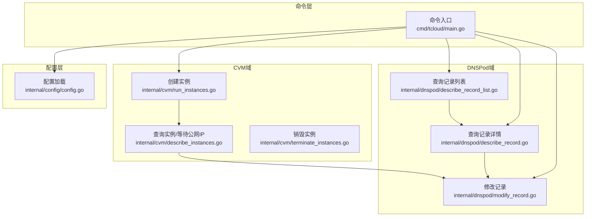
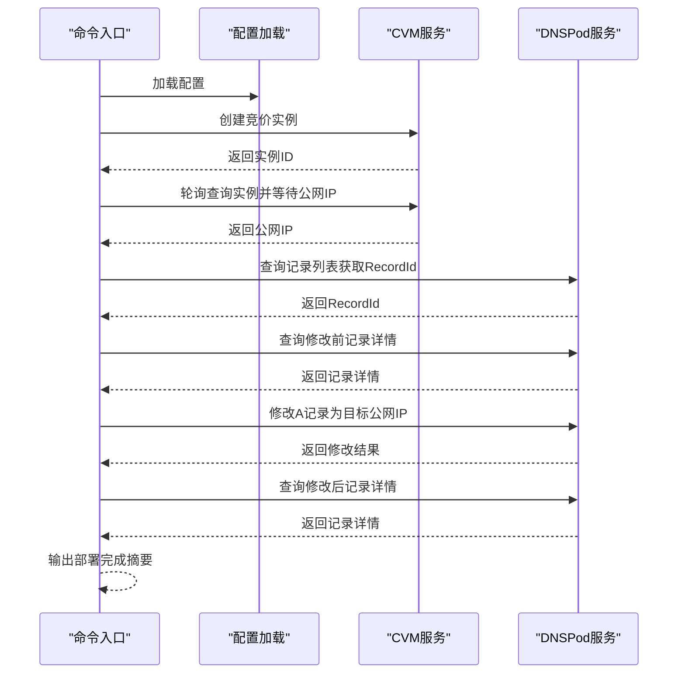
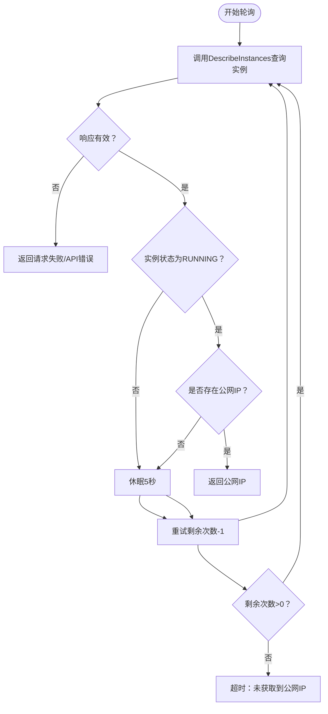
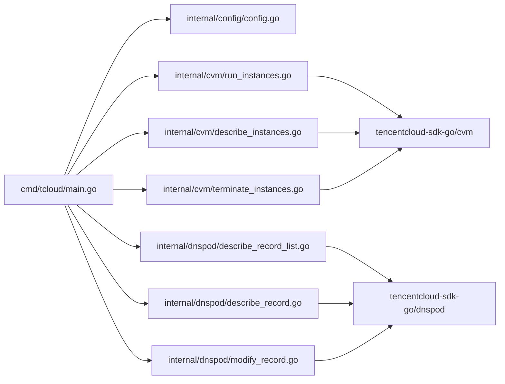

# 一键部署流程

<cite>
**本文引用的文件**
- [cmd/tcloud/main.go](file://cmd/tcloud/main.go)
- [internal/config/config.go](file://internal/config/config.go)
- [internal/cvm/run_instances.go](file://internal/cvm/run_instances.go)
- [internal/cvm/describe_instances.go](file://internal/cvm/describe_instances.go)
- [internal/cvm/terminate_instances.go](file://internal/cvm/terminate_instances.go)
- [internal/dnspod/describe_record_list.go](file://internal/dnspod/describe_record_list.go)
- [internal/dnspod/describe_record.go](file://internal/dnspod/describe_record.go)
- [internal/dnspod/modify_record.go](file://internal/dnspod/modify_record.go)
- [go.mod](file://go.mod)
</cite>

## 目录
1. [简介](#简介)
2. [项目结构](#项目结构)
3. [核心组件](#核心组件)
4. [架构总览](#架构总览)
5. [详细组件分析](#详细组件分析)
6. [依赖关系分析](#依赖关系分析)
7. [性能与可靠性考虑](#性能与可靠性考虑)
8. [故障排查指南](#故障排查指南)
9. [结论](#结论)
10. [附录](#附录)

## 简介
本文件面向“一键部署”流程，系统性阐述从创建CVM竞价实例、等待公网IP、获取DNS记录ID，到修改DNS A记录的完整执行链路。文档覆盖：
- 每一步的实现原理、参数传递与错误处理
- 实例创建后的轮询等待机制、公网IP获取的超时处理
- DNS记录修改的原子性保障思路
- 部署过程中的监控指标、日志记录与审计建议
- 失败回滚策略与重试机制
- 配置文件关键参数对部署流程的影响

## 项目结构
该项目采用分层与按域划分的组织方式：
- cmd/tcloud：命令入口，解析命令行参数并调度各子域逻辑
- internal/config：配置加载与校验
- internal/cvm：CVM相关操作（创建、查询、销毁）
- internal/dnspod：DNSPod相关操作（查询记录、查询记录列表、修改记录）

图表来源
- [cmd/tcloud/main.go:12-196](file://cmd/tcloud/main.go#L12-L196)
- [internal/config/config.go:30-59](file://internal/config/config.go#L30-L59)
- [internal/cvm/run_instances.go:14-91](file://internal/cvm/run_instances.go#L14-L91)
- [internal/cvm/describe_instances.go:15-64](file://internal/cvm/describe_instances.go#L15-L64)
- [internal/cvm/terminate_instances.go:14-36](file://internal/cvm/terminate_instances.go#L14-L36)
- [internal/dnspod/describe_record_list.go:14-46](file://internal/dnspod/describe_record_list.go#L14-L46)
- [internal/dnspod/describe_record.go:14-37](file://internal/dnspod/describe_record.go#L14-L37)
- [internal/dnspod/modify_record.go:14-41](file://internal/dnspod/modify_record.go#L14-L41)

章节来源
- [cmd/tcloud/main.go:12-196](file://cmd/tcloud/main.go#L12-L196)
- [go.mod:1-10](file://go.mod#L1-10)

## 核心组件
- 命令入口与流程编排：负责解析命令、加载配置、串行执行部署或回收流程，并打印阶段性日志
- 配置加载器：从本地JSON文件加载密钥、区域、VPC/子网、安全组、实例规格、镜像、密钥、竞价上限等关键参数
- CVM域：创建竞价实例、轮询等待公网IP、根据内网IP查找实例、销毁实例
- DNSPod域：查询记录列表以获取RecordId、查询记录详情、修改A记录

章节来源
- [cmd/tcloud/main.go:12-196](file://cmd/tcloud/main.go#L12-L196)
- [internal/config/config.go:11-28](file://internal/config/config.go#L11-L28)
- [internal/cvm/run_instances.go:14-91](file://internal/cvm/run_instances.go#L14-L91)
- [internal/cvm/describe_instances.go:15-64](file://internal/cvm/describe_instances.go#L15-L64)
- [internal/cvm/terminate_instances.go:14-36](file://internal/cvm/terminate_instances.go#L14-L36)
- [internal/dnspod/describe_record_list.go:14-46](file://internal/dnspod/describe_record_list.go#L14-L46)
- [internal/dnspod/describe_record.go:14-37](file://internal/dnspod/describe_record.go#L14-L37)
- [internal/dnspod/modify_record.go:14-41](file://internal/dnspod/modify_record.go#L14-L41)

## 架构总览
一键部署流程由命令入口统一编排，串联CVM与DNSPod两个域的服务调用。整体顺序如下：
1) 加载配置
2) 创建CVM竞价实例
3) 轮询等待公网IP
4) 查询DNS记录列表获取RecordId
5) 查询修改前记录详情
6) 修改DNS A记录为目标公网IP
7) 查询修改后记录详情确认

图表来源
- [cmd/tcloud/main.go:85-131](file://cmd/tcloud/main.go#L85-L131)
- [internal/cvm/run_instances.go:14-91](file://internal/cvm/run_instances.go#L14-L91)
- [internal/cvm/describe_instances.go:15-64](file://internal/cvm/describe_instances.go#L15-L64)
- [internal/dnspod/describe_record_list.go:14-46](file://internal/dnspod/describe_record_list.go#L14-L46)
- [internal/dnspod/describe_record.go:14-37](file://internal/dnspod/describe_record.go#L14-L37)
- [internal/dnspod/modify_record.go:14-41](file://internal/dnspod/modify_record.go#L14-L41)

## 详细组件分析

### 命令入口与流程编排
- 支持命令：list、describe、modify、run-instances、deploy、destroy、undeploy
- deploy流程：串行执行创建实例、等待公网IP、获取RecordId、查询修改前记录、修改DNS A记录、查询修改后记录
- undeploy流程：查找实例→销毁实例→查询销毁前记录→修改DNS A记录为0.0.0.0→查询销毁后记录

章节来源
- [cmd/tcloud/main.go:27-196](file://cmd/tcloud/main.go#L27-L196)

### 配置加载与参数
- 关键参数包括：SecretID、SecretKey、Region、Domain、Subdomain、PrivateIP、Zone、VpcId、SubnetId、SecurityGroupIds、InstanceName、InstanceType、ImageId、KeyId、MaxPrice
- 配置加载支持两种路径：可执行文件所在目录下的config/tencentcloud.json，或源码目录下的config/tencentcloud.json
- 参数校验：SecretID与SecretKey非空校验

章节来源
- [internal/config/config.go:11-28](file://internal/config/config.go#L11-L28)
- [internal/config/config.go:30-59](file://internal/config/config.go#L30-L59)

### CVM：创建竞价实例
- 使用SPOTPAID计费类型创建实例，设置可用区、实例规格、镜像、系统盘、VPC/子网、公网带宽、登录密钥、安全组、增强服务、竞价上限等
- 返回首个实例ID；若响应中未包含实例ID则报错

章节来源
- [internal/cvm/run_instances.go:14-91](file://internal/cvm/run_instances.go#L14-L91)

### CVM：等待公网IP与轮询机制
- 通过DescribeInstances轮询查询实例状态与公网IP
- 轮询策略：最多20次，每次间隔5秒
- 终止条件：实例状态为RUNNING且存在公网IP地址
- 超时处理：超过最大次数仍未获取公网IP则报错

图表来源
- [internal/cvm/describe_instances.go:15-64](file://internal/cvm/describe_instances.go#L15-L64)

章节来源
- [internal/cvm/describe_instances.go:15-64](file://internal/cvm/describe_instances.go#L15-L64)

### CVM：销毁实例
- 传入实例ID调用TerminateInstances接口进行销毁
- 打印标准JSON响应用于审计

章节来源
- [internal/cvm/terminate_instances.go:14-36](file://internal/cvm/terminate_instances.go#L14-L36)

### DNSPod：查询记录列表与RecordId提取
- 通过DescribeRecordList按Domain与Subdomain查询记录列表
- 提取第一条记录的RecordId并返回

章节来源
- [internal/dnspod/describe_record_list.go:14-46](file://internal/dnspod/describe_record_list.go#L14-L46)

### DNSPod：查询记录详情
- 通过DescribeRecord按Domain与RecordId查询记录详情
- 打印标准JSON响应用于审计

章节来源
- [internal/dnspod/describe_record.go:14-37](file://internal/dnspod/describe_record.go#L14-L37)

### DNSPod：修改A记录
- 通过ModifyRecord将A记录指向目标IP
- 请求参数包含Domain、RecordType、RecordLine、Value、RecordId、SubDomain
- 打印标准JSON响应用于审计

章节来源
- [internal/dnspod/modify_record.go:14-41](file://internal/dnspod/modify_record.go#L14-L41)

## 依赖关系分析
- 命令入口依赖配置加载与CVM/DNSPod子域
- CVM子域依赖腾讯云CVM SDK
- DNSPod子域依赖腾讯云DNSPod SDK
- 配置加载依赖本地JSON文件

图表来源
- [cmd/tcloud/main.go:7-9](file://cmd/tcloud/main.go#L7-L9)
- [internal/cvm/run_instances.go:8-11](file://internal/cvm/run_instances.go#L8-L11)
- [internal/cvm/describe_instances.go:9-12](file://internal/cvm/describe_instances.go#L9-L12)
- [internal/cvm/terminate_instances.go:8-11](file://internal/cvm/terminate_instances.go#L8-L11)
- [internal/dnspod/describe_record_list.go:10-11](file://internal/dnspod/describe_record_list.go#L10-L11)
- [internal/dnspod/describe_record.go:10-11](file://internal/dnspod/describe_record.go#L10-L11)
- [internal/dnspod/modify_record.go:10-11](file://internal/dnspod/modify_record.go#L10-L11)
- [go.mod:5-9](file://go.mod#L5-L9)

章节来源
- [go.mod:1-10](file://go.mod#L1-L10)

## 性能与可靠性考虑
- 轮询频率与超时
  - 当前轮询间隔为5秒，最大重试20次，总计约100秒等待公网IP
  - 若实例启动时间较长或网络延迟较高，可适当增加最大重试次数或调整间隔
- 并发与幂等
  - DNS修改为单条记录级操作，建议在业务层引入幂等键（如部署ID）避免重复修改
- 错误分类与重试
  - 对于临时性错误（网络抖动、限流），可在上层封装重试策略
  - 对于不可恢复错误（鉴权失败、参数错误），应快速失败并提示修复
- 日志与审计
  - 所有关键API调用均输出标准JSON响应，便于审计与问题定位
  - 建议在生产环境接入结构化日志系统，记录请求ID、时间戳、耗时、状态码等

[本节为通用指导，不直接分析具体文件]

## 故障排查指南
- 配置文件问题
  - 症状：加载配置失败或SecretID/SecretKey为空
  - 排查：确认配置文件路径与内容，确保密钥字段非空
- CVM创建失败
  - 症状：创建实例返回错误
  - 排查：检查实例规格、镜像、VPC/子网、安全组、可用区、竞价上限等参数
- 公网IP等待超时
  - 症状：超过最大重试次数仍未获取公网IP
  - 排查：确认实例状态为RUNNING，检查公网带宽与运营商配置
- DNS记录查询失败
  - 症状：未找到解析记录或RecordId为空
  - 排查：确认Domain与Subdomain正确，检查DNS账户权限
- DNS修改失败
  - 症状：修改记录返回错误
  - 排查：核对RecordId、A记录类型、RecordLine、Value等参数

章节来源
- [internal/config/config.go:30-59](file://internal/config/config.go#L30-L59)
- [internal/cvm/run_instances.go:72-91](file://internal/cvm/run_instances.go#L72-L91)
- [internal/cvm/describe_instances.go:24-64](file://internal/cvm/describe_instances.go#L24-L64)
- [internal/dnspod/describe_record_list.go:26-46](file://internal/dnspod/describe_record_list.go#L26-L46)
- [internal/dnspod/modify_record.go:30-41](file://internal/dnspod/modify_record.go#L30-L41)

## 结论
该一键部署流程通过命令入口统一编排，结合CVM与DNSPod域的标准化调用，实现了从竞价实例创建到域名解析变更的自动化闭环。当前实现具备清晰的日志输出与基本的错误处理，适合在开发与测试环境中使用。为进一步提升可靠性，建议在上层增加重试与幂等控制，并完善监控与审计能力。

[本节为总结性内容，不直接分析具体文件]

## 附录

### 配置文件关键参数对部署流程的影响
- SecretID/SecretKey：鉴权基础，缺失会导致所有API调用失败
- Region/Zone：决定实例创建与查询的地域与可用区
- VpcId/SubnetId/PrivateIP：决定实例所属网络与内网IP
- InstanceType/ImageId/KeyId：决定实例规格、系统盘与登录方式
- SecurityGroupIds：影响网络访问策略
- InstanceName/InstanceType/ImageId/KeyId：影响实例创建参数
- MaxPrice：决定竞价上限，过高可能增加成本，过低可能导致被回收
- Domain/Subdomain：决定DNS记录的查询与修改范围

章节来源
- [internal/config/config.go:11-28](file://internal/config/config.go#L11-L28)

### 部署失败的回滚策略与重试机制建议
- 回滚策略
  - undeploy流程：销毁实例→将DNS A记录还原为0.0.0.0→再次查询确认
  - 建议在业务层记录“部署ID”，以便幂等判断与回滚定位
- 重试机制
  - 在CVM等待公网IP阶段，可根据实际场景增加最大重试次数或调整间隔
  - 对DNS修改可引入幂等键，避免重复修改导致的异常

章节来源
- [cmd/tcloud/main.go:147-190](file://cmd/tcloud/main.go#L147-L190)
- [internal/cvm/describe_instances.go:24-64](file://internal/cvm/describe_instances.go#L24-L64)