# 工作流定制与扩展

<cite>
**本文档引用的文件**
- [main.go](file://cmd/tcloud/main.go)
- [config.go](file://internal/config/config.go)
- [run_instances.go](file://internal/cvm/run_instances.go)
- [describe_instances.go](file://internal/cvm/describe_instances.go)
- [terminate_instances.go](file://internal/cvm/terminate_instances.go)
- [describe_record_list.go](file://internal/dnspod/describe_record_list.go)
- [describe_record.go](file://internal/dnspod/describe_record.go)
- [modify_record.go](file://internal/dnspod/modify_record.go)
- [go.mod](file://go.mod)
</cite>

## 目录
1. [简介](#简介)
2. [项目结构](#项目结构)
3. [核心组件](#核心组件)
4. [架构概览](#架构概览)
5. [详细组件分析](#详细组件分析)
6. [工作流定制指南](#工作流定制指南)
7. [批量操作与并发执行](#批量操作与并发执行)
8. [定时任务与CI/CD集成](#定时任务与cicd集成)
9. [监控、性能优化与资源管理](#监控性能优化与资源管理)
10. [版本控制与配置管理](#版本控制与配置管理)
11. [故障排除指南](#故障排除指南)
12. [结论](#结论)

## 简介

本项目是一个基于腾讯云API的自动化工作流工具，实现了完整的云资源管理生命周期。该工具通过命令行接口提供了DNSPod域名解析管理和CVM云服务器实例管理的完整工作流，支持一键部署和回收操作。

工作流的核心价值在于：
- **端到端自动化**：从实例创建到DNS解析更新的完整自动化流程
- **模块化设计**：清晰的功能模块分离，便于扩展和维护
- **配置驱动**：通过配置文件集中管理云服务参数
- **错误处理**：完善的错误处理和重试机制

## 项目结构

项目采用Go语言的标准目录结构，按照功能模块进行组织：

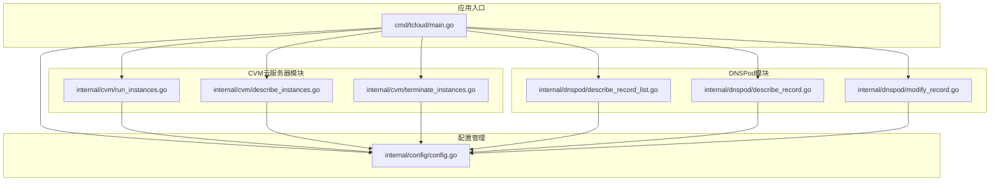

**图表来源**
- [main.go:1-220](file://cmd/tcloud/main.go#L1-L220)
- [config.go:1-70](file://internal/config/config.go#L1-L70)

**章节来源**
- [main.go:1-220](file://cmd/tcloud/main.go#L1-L220)
- [go.mod:1-10](file://go.mod#L1-L10)

## 核心组件

### 配置管理系统

配置系统是整个工作流的核心基础设施，负责管理所有云服务相关的参数配置。

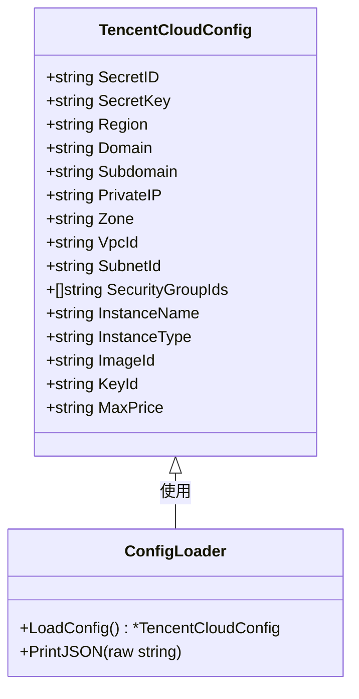

**图表来源**
- [config.go:11-28](file://internal/config/config.go#L11-L28)
- [config.go:30-59](file://internal/config/config.go#L30-L59)

### CVM云服务器管理模块

CVM模块提供了完整的云服务器生命周期管理功能：

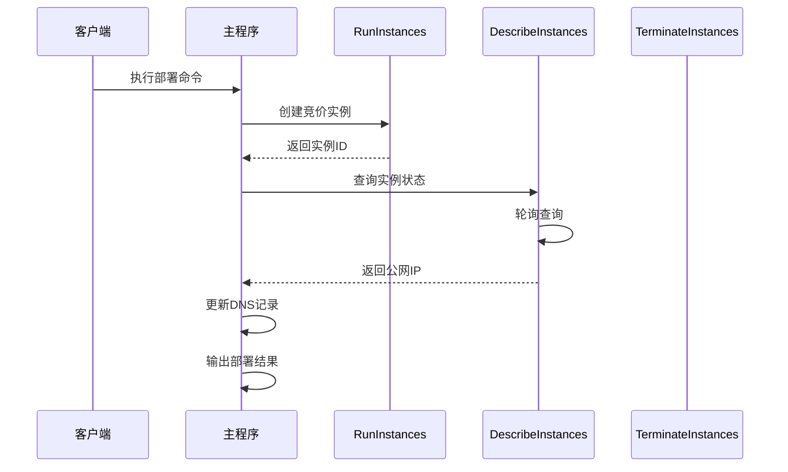

**图表来源**
- [main.go:85-131](file://cmd/tcloud/main.go#L85-L131)
- [run_instances.go:14-91](file://internal/cvm/run_instances.go#L14-L91)
- [describe_instances.go:15-64](file://internal/cvm/describe_instances.go#L15-L64)

### DNSPod域名解析管理模块

DNSPod模块负责域名解析记录的查询和修改：

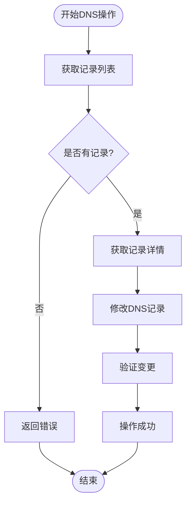

**图表来源**
- [describe_record_list.go:14-46](file://internal/dnspod/describe_record_list.go#L14-L46)
- [describe_record.go:14-37](file://internal/dnspod/describe_record.go#L14-L37)
- [modify_record.go:14-41](file://internal/dnspod/modify_record.go#L14-L41)

**章节来源**
- [config.go:1-70](file://internal/config/config.go#L1-L70)
- [run_instances.go:1-92](file://internal/cvm/run_instances.go#L1-L92)
- [describe_instances.go:1-101](file://internal/cvm/describe_instances.go#L1-L101)
- [terminate_instances.go:1-37](file://internal/cvm/terminate_instances.go#L1-L37)
- [describe_record_list.go:1-47](file://internal/dnspod/describe_record_list.go#L1-L47)
- [describe_record.go:1-38](file://internal/dnspod/describe_record.go#L1-L38)
- [modify_record.go:1-42](file://internal/dnspod/modify_record.go#L1-L42)

## 架构概览

整个系统采用分层架构设计，实现了清晰的关注点分离：

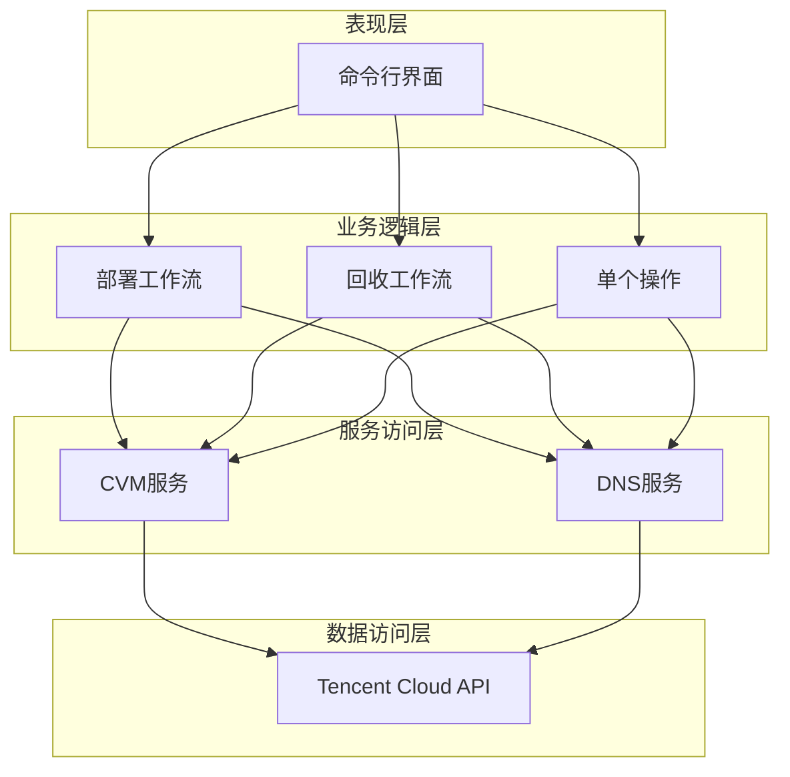

**图表来源**
- [main.go:27-196](file://cmd/tcloud/main.go#L27-L196)
- [run_instances.go:14-91](file://internal/cvm/run_instances.go#L14-L91)
- [describe_record_list.go:14-46](file://internal/dnspod/describe_record_list.go#L14-L46)

## 详细组件分析

### 命令行接口设计

主程序实现了完整的命令行接口，支持多种操作模式：

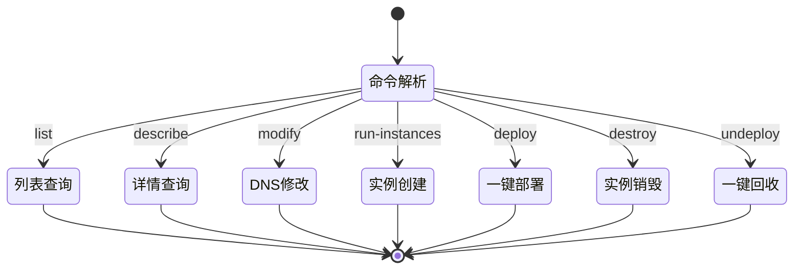

**图表来源**
- [main.go:27-196](file://cmd/tcloud/main.go#L27-L196)

### 部署工作流实现

部署工作流是系统的核心功能，实现了完整的自动化部署流程：

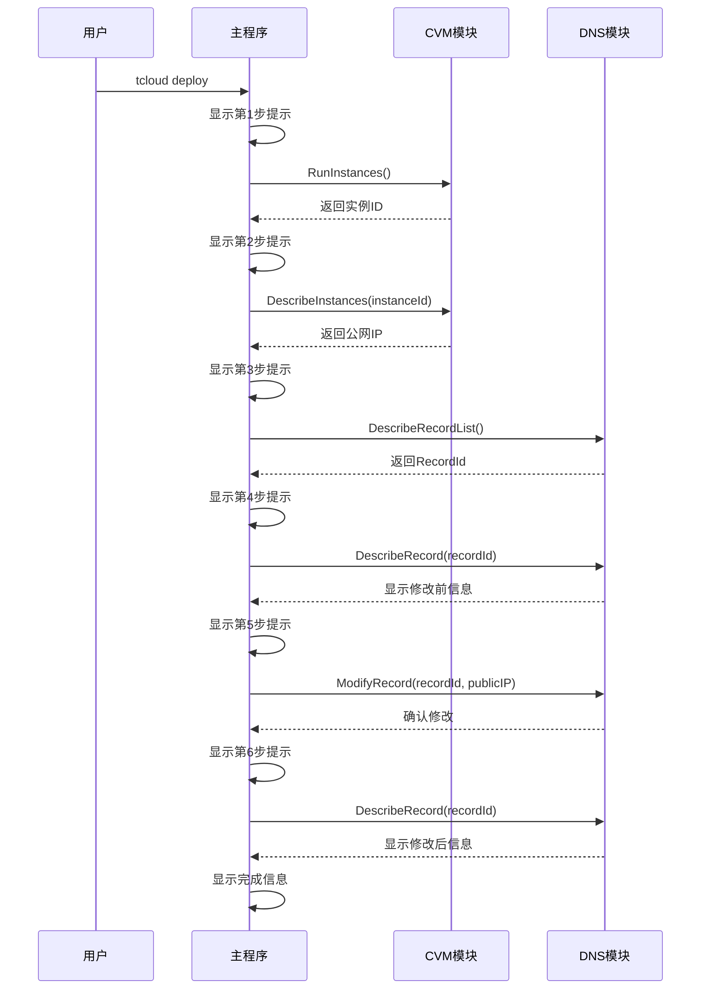

**图表来源**
- [main.go:85-131](file://cmd/tcloud/main.go#L85-L131)
- [run_instances.go:14-91](file://internal/cvm/run_instances.go#L14-L91)
- [describe_instances.go:15-64](file://internal/cvm/describe_instances.go#L15-L64)
- [describe_record_list.go:14-46](file://internal/dnspod/describe_record_list.go#L14-L46)
- [describe_record.go:14-37](file://internal/dnspod/describe_record.go#L14-L37)
- [modify_record.go:14-41](file://internal/dnspod/modify_record.go#L14-L41)

### 错误处理机制

系统实现了完善的错误处理机制，确保工作流的健壮性：

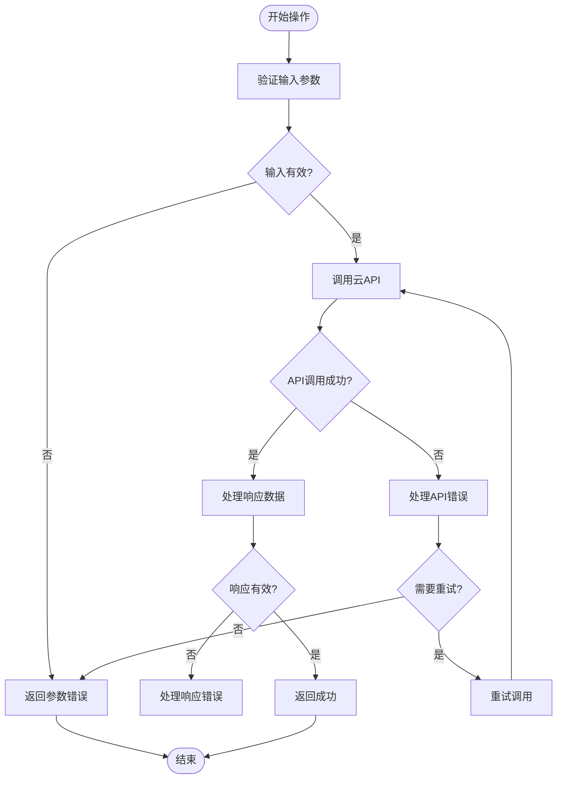

**图表来源**
- [run_instances.go:73-78](file://internal/cvm/run_instances.go#L73-L78)
- [describe_instances.go:31-36](file://internal/cvm/describe_instances.go#L31-L36)
- [describe_record_list.go:27-32](file://internal/dnspod/describe_record_list.go#L27-L32)

**章节来源**
- [main.go:1-220](file://cmd/tcloud/main.go#L1-L220)
- [run_instances.go:1-92](file://internal/cvm/run_instances.go#L1-L92)
- [describe_instances.go:1-101](file://internal/cvm/describe_instances.go#L1-L101)
- [terminate_instances.go:1-37](file://internal/cvm/terminate_instances.go#L1-L37)
- [describe_record_list.go:1-47](file://internal/dnspod/describe_record_list.go#L1-L47)
- [describe_record.go:1-38](file://internal/dnspod/describe_record.go#L1-L38)
- [modify_record.go:1-42](file://internal/dnspod/modify_record.go#L1-L42)

## 工作流定制指南

### 添加新的工作流步骤

要向现有工作流中添加新的步骤，可以按照以下步骤进行：

1. **创建新的功能模块**：在相应的包中添加新的函数或方法
2. **更新主程序逻辑**：在主程序中添加对新步骤的调用
3. **实现错误处理**：确保新步骤包含适当的错误处理逻辑
4. **测试集成**：验证新步骤与现有工作流的集成

### 修改执行顺序

工作流的执行顺序主要由主程序中的步骤序列决定。要修改执行顺序：

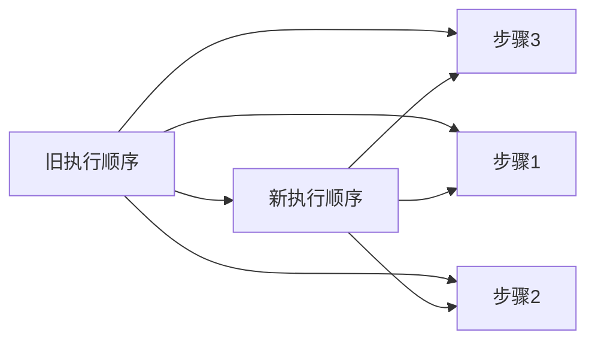

**图表来源**
- [main.go:85-131](file://cmd/tcloud/main.go#L85-L131)

### 调整参数配置

配置参数的调整可以通过以下方式进行：

1. **修改配置结构体**：在配置文件中添加新的字段
2. **更新配置加载逻辑**：确保新字段被正确加载
3. **验证配置有效性**：添加配置验证逻辑

**章节来源**
- [main.go:85-131](file://cmd/tcloud/main.go#L85-L131)
- [config.go:11-28](file://internal/config/config.go#L11-L28)

## 批量操作与并发执行

### 并发执行设计

当前系统采用串行执行模式，但可以轻松扩展为并发执行：

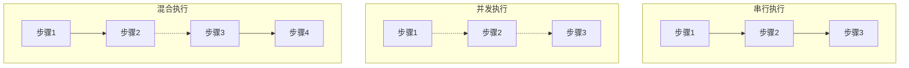

### 资源池管理

建议实现以下资源池管理策略：

1. **连接池管理**：为云API客户端实现连接池
2. **限流控制**：实现API调用频率限制
3. **超时管理**：设置合理的超时时间
4. **重试机制**：实现指数退避重试

### 负载均衡策略

对于多区域或多账户的场景，可以实现：

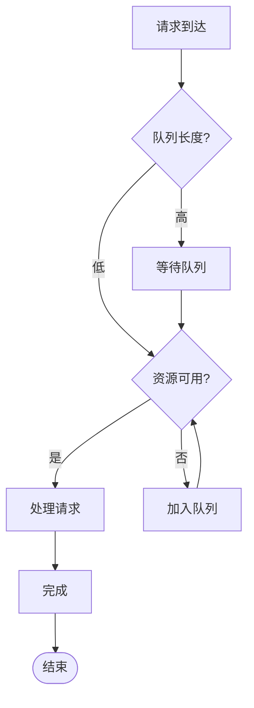

## 定时任务与CI/CD集成

### 定时任务实现

可以使用以下方式实现定时任务：

1. **Cron表达式**：使用标准的cron语法
2. **时间轮算法**：实现高效的定时器
3. **外部调度器**：集成Kubernetes CronJob或类似工具

### CI/CD流水线集成

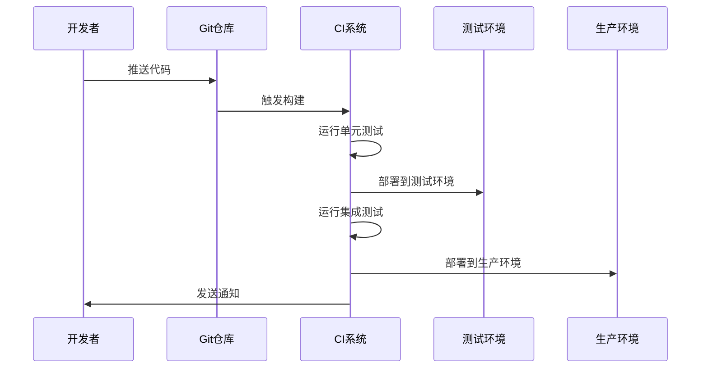

**图表来源**
- [main.go:200-219](file://cmd/tcloud/main.go#L200-L219)

### 自动化调度

建议实现以下自动化调度功能：

1. **健康检查**：定期检查云资源状态
2. **成本优化**：自动停止闲置资源
3. **备份策略**：定期创建资源备份
4. **告警通知**：异常情况自动通知

## 监控、性能优化与资源管理

### 性能监控指标

建议收集以下性能指标：

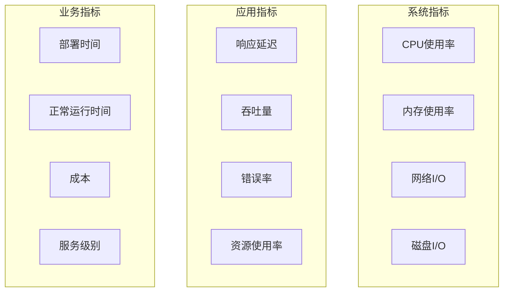

### 资源管理最佳实践

1. **资源标签化**：为所有资源添加统一的标签
2. **成本追踪**：实现详细的成本统计和分析
3. **容量规划**：基于历史数据进行容量预测
4. **自动扩缩容**：实现基于负载的自动扩缩容

### 错误处理与恢复

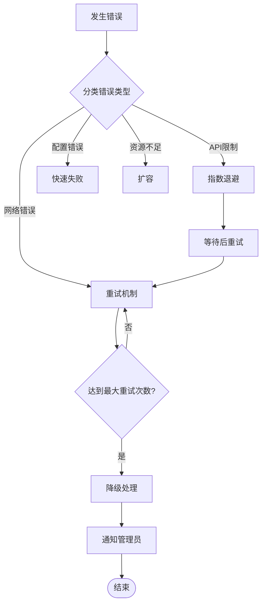

## 版本控制与配置管理

### 版本控制策略

建议采用以下版本控制策略：

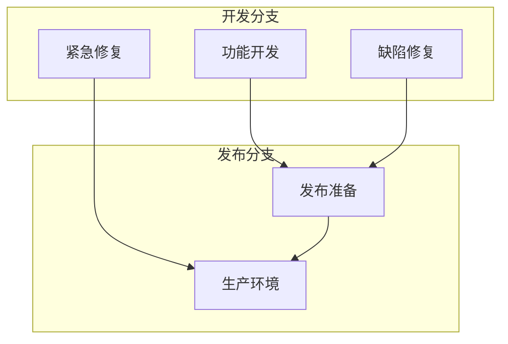

### 配置管理

配置管理的关键要素：

1. **配置分离**：开发、测试、生产环境配置分离
2. **敏感信息保护**：密钥和密码的安全存储
3. **配置验证**：启动时验证配置的有效性
4. **配置热更新**：支持运行时配置更新

### 回滚机制

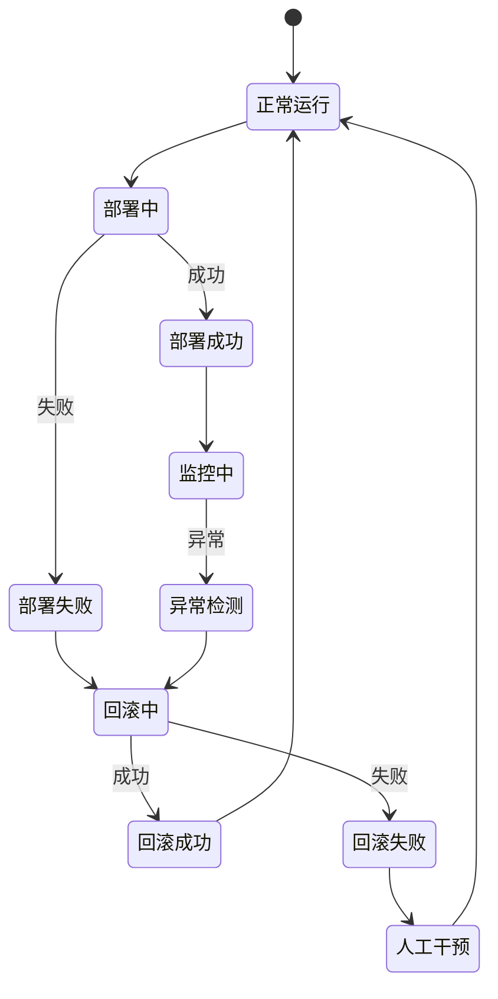

## 故障排除指南

### 常见问题诊断

1. **认证失败**：检查SecretID和SecretKey配置
2. **网络连接问题**：验证网络连通性和防火墙设置
3. **权限不足**：确认IAM角色和权限策略
4. **API限制**：检查配额和速率限制

### 日志记录策略

建议实现多层级日志记录：

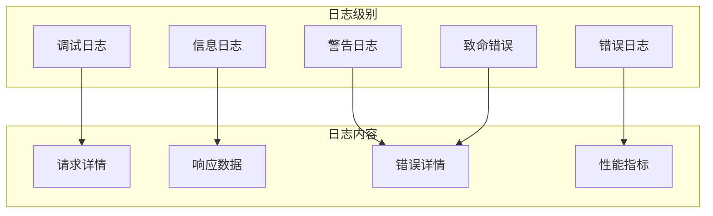

### 性能调优

1. **数据库查询优化**：添加必要的索引和优化查询
2. **缓存策略**：实现适当的缓存机制
3. **连接池优化**：调整连接池大小和超时设置
4. **异步处理**：将耗时操作改为异步执行

**章节来源**
- [main.go:199-219](file://cmd/tcloud/main.go#L199-L219)
- [run_instances.go:73-78](file://internal/cvm/run_instances.go#L73-L78)
- [describe_instances.go:31-36](file://internal/cvm/describe_instances.go#L31-L36)
- [describe_record_list.go:27-32](file://internal/dnspod/describe_record_list.go#L27-L32)

## 结论

本工作流系统展现了良好的架构设计和实现质量，具有以下优势：

1. **模块化设计**：清晰的功能分离便于维护和扩展
2. **配置驱动**：灵活的配置管理支持多环境部署
3. **错误处理**：完善的错误处理机制确保系统稳定性
4. **自动化程度高**：完整的端到端自动化流程

### 改进建议

1. **增加工作流编排**：实现更复杂的工作流编排能力
2. **增强监控告警**：完善监控指标和告警机制
3. **支持更多云服务**：扩展对其他腾讯云服务的支持
4. **实现工作流模板**：提供可复用的工作流模板

该系统为云资源管理提供了一个坚实的基础，通过合理的设计和扩展，可以满足各种复杂的自动化需求。