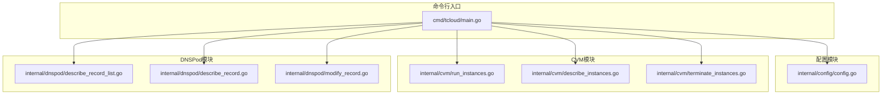
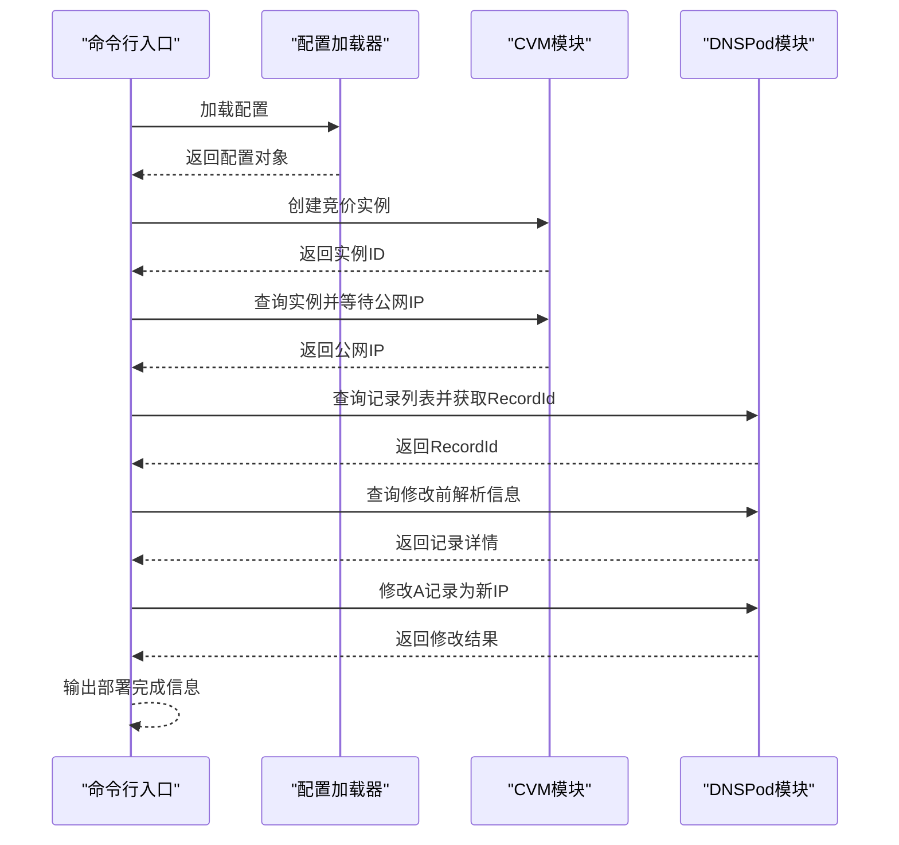
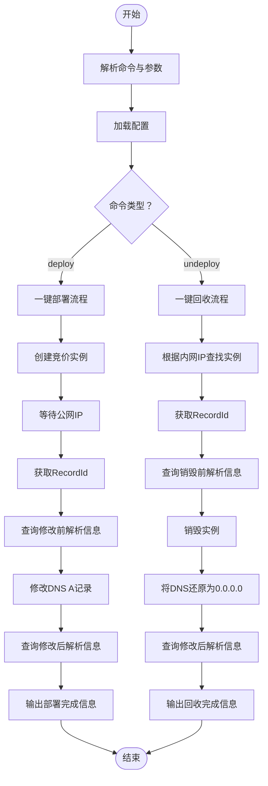
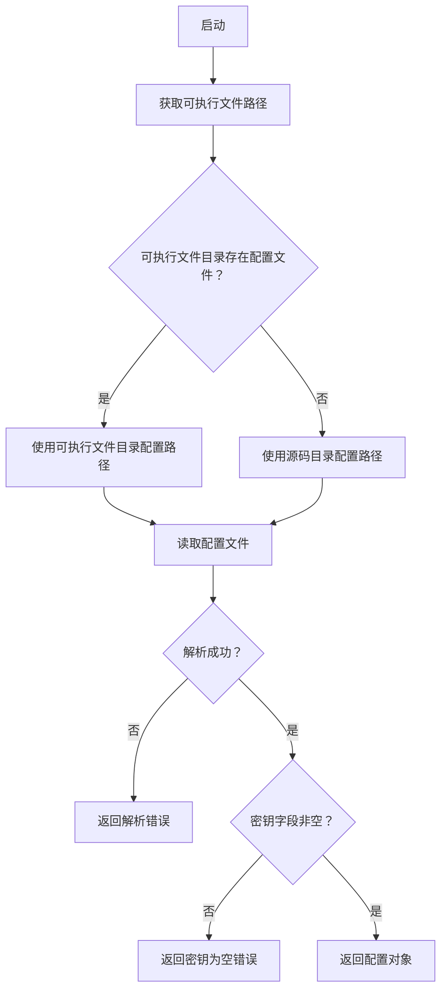
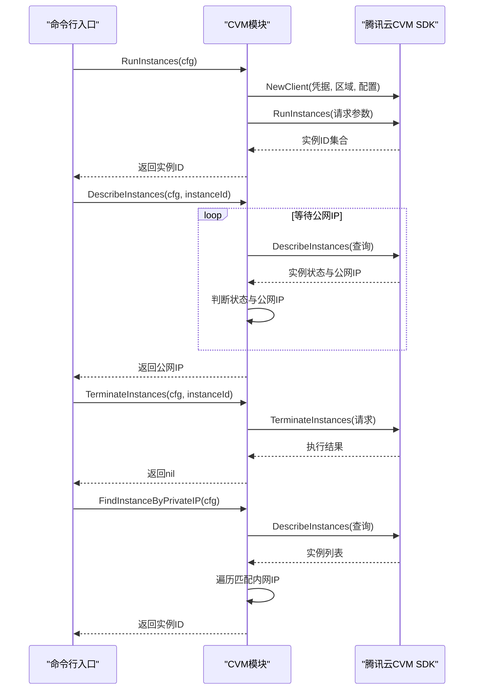
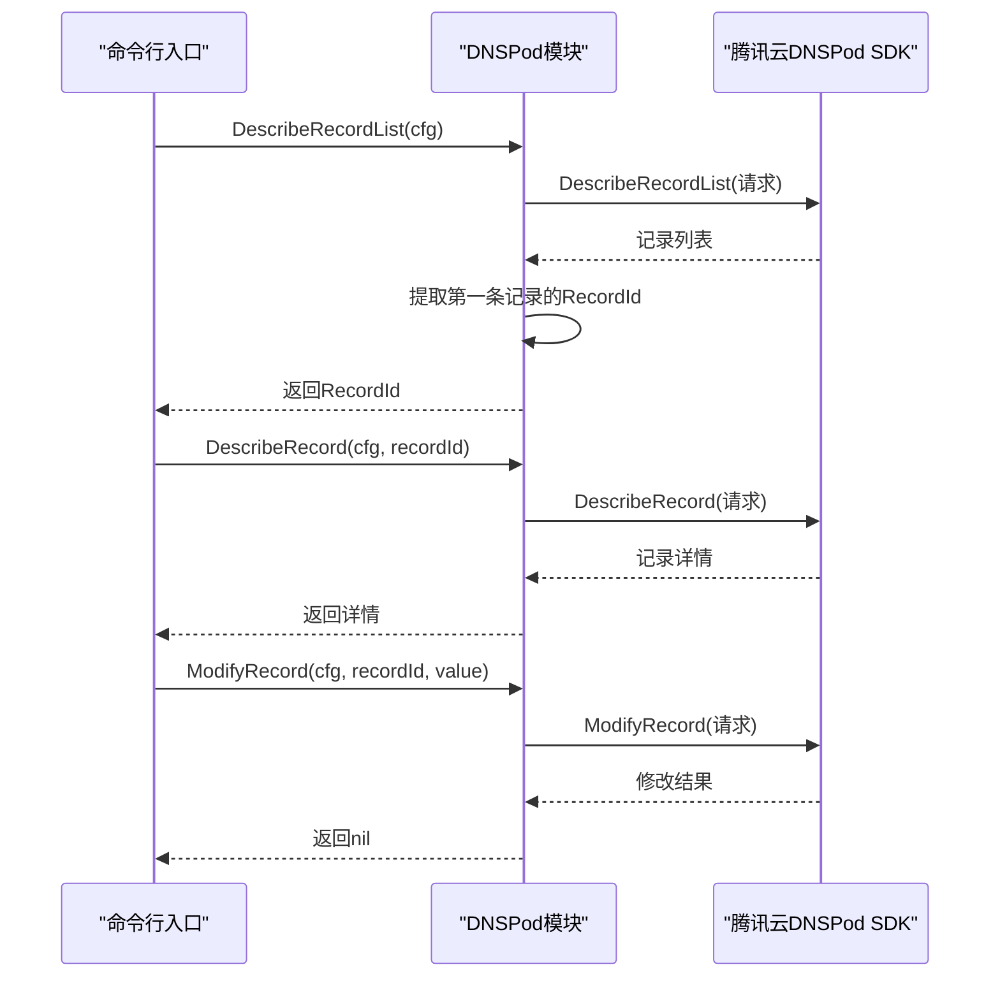
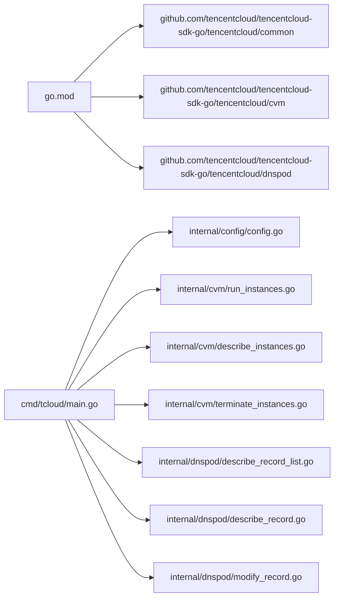
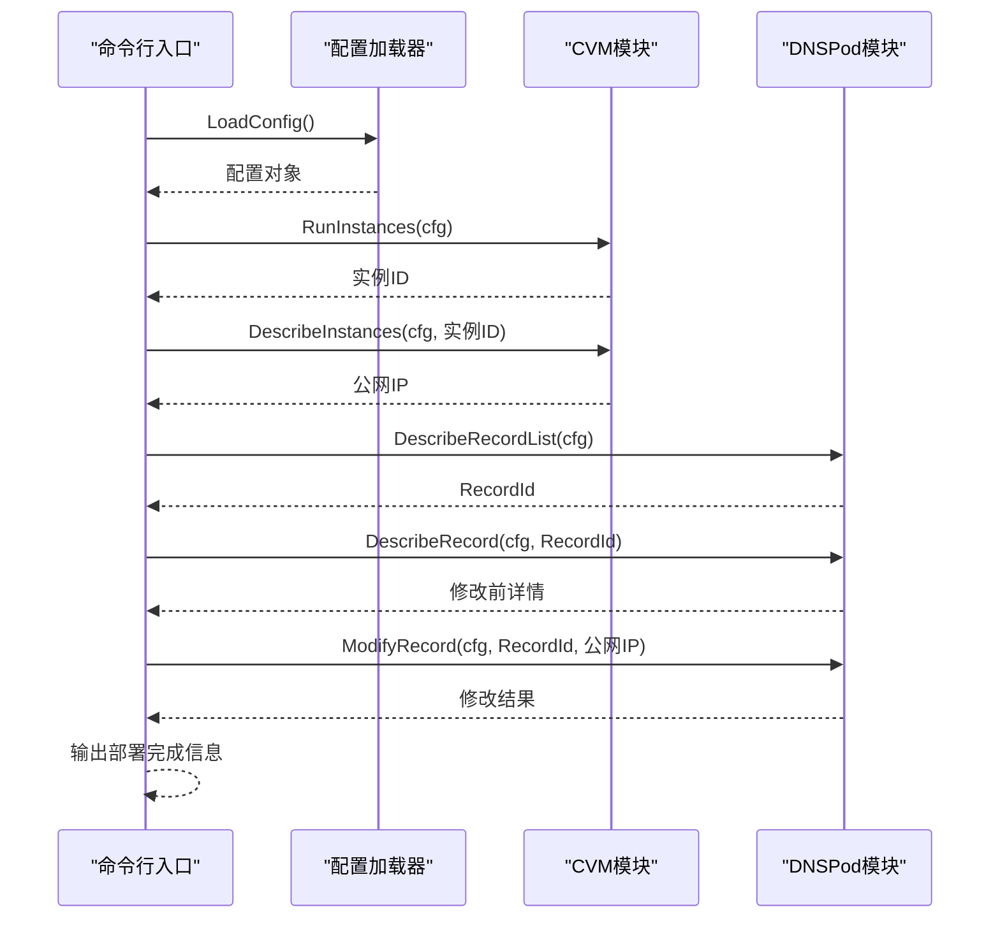

# 自动化工作流

<cite>
**本文引用的文件**
- [main.go](file://cmd/tcloud/main.go)
- [config.go](file://internal/config/config.go)
- [run_instances.go](file://internal/cvm/run_instances.go)
- [describe_instances.go](file://internal/cvm/describe_instances.go)
- [terminate_instances.go](file://internal/cvm/terminate_instances.go)
- [describe_record_list.go](file://internal/dnspod/describe_record_list.go)
- [describe_record.go](file://internal/dnspod/describe_record.go)
- [modify_record.go](file://internal/dnspod/modify_record.go)
- [go.mod](file://go.mod)
</cite>

## 目录
1. [简介](#简介)
2. [项目结构](#项目结构)
3. [核心组件](#核心组件)
4. [架构总览](#架构总览)
5. [详细组件分析](#详细组件分析)
6. [依赖关系分析](#依赖关系分析)
7. [性能考虑](#性能考虑)
8. [故障排查指南](#故障排查指南)
9. [结论](#结论)
10. [附录](#附录)

## 简介
本项目提供一套基于腾讯云服务的自动化工作流，支持一键部署与一键回收。通过统一入口命令行工具，用户可以完成以下流程：
- 一键部署：创建竞价CVM实例 → 等待公网IP分配 → 获取DNS记录ID → 修改A记录指向新IP → 输出部署结果
- 一键回收：根据内网IP查找实例 → 获取DNS记录ID → 查看修改前解析信息 → 销毁实例 → 将DNS记录还原为0.0.0.0 → 输出回收结果

该工作流以模块化方式组织，分别封装了配置加载、CVM实例管理、DNS记录管理等能力，并在主程序中编排完整的业务步骤与错误处理。

## 项目结构
项目采用按功能域分层的组织方式：
- cmd/tcloud：命令行入口，负责解析参数、调度各子功能、打印步骤与结果
- internal/config：配置加载与校验，支持从可执行文件目录或源码目录读取配置
- internal/cvm：CVM相关操作封装（创建、查询、销毁、按内网IP查找）
- internal/dnspod：DNSPod相关操作封装（查询记录列表、查询单条记录、修改记录）

图表来源
- [main.go:1-220](file://cmd/tcloud/main.go#L1-L220)
- [config.go:1-70](file://internal/config/config.go#L1-L70)
- [run_instances.go:1-92](file://internal/cvm/run_instances.go#L1-L92)
- [describe_instances.go:1-101](file://internal/cvm/describe_instances.go#L1-L101)
- [terminate_instances.go:1-37](file://internal/cvm/terminate_instances.go#L1-L37)
- [describe_record_list.go:1-47](file://internal/dnspod/describe_record_list.go#L1-L47)
- [describe_record.go:1-38](file://internal/dnspod/describe_record.go#L1-L38)
- [modify_record.go:1-42](file://internal/dnspod/modify_record.go#L1-L42)

章节来源
- [main.go:1-220](file://cmd/tcloud/main.go#L1-L220)
- [config.go:1-70](file://internal/config/config.go#L1-L70)

## 核心组件
- 配置加载器：从可执行文件所在目录或源码目录读取配置文件，解析为结构化配置对象；对密钥字段进行基础校验
- CVM操作集：创建竞价实例、查询实例状态与公网IP、销毁实例、按内网IP查找实例
- DNSPod操作集：查询记录列表并提取RecordId、查询单条记录详情、修改A记录值
- 主程序编排：根据命令分支执行相应流程，串联各模块调用，打印步骤与结果，处理错误并退出

章节来源
- [config.go:31-59](file://internal/config/config.go#L31-L59)
- [run_instances.go:14-91](file://internal/cvm/run_instances.go#L14-L91)
- [describe_instances.go:15-64](file://internal/cvm/describe_instances.go#L15-L64)
- [terminate_instances.go:14-36](file://internal/cvm/terminate_instances.go#L14-L36)
- [describe_record_list.go:14-46](file://internal/dnspod/describe_record_list.go#L14-L46)
- [describe_record.go:14-37](file://internal/dnspod/describe_record.go#L14-L37)
- [modify_record.go:14-41](file://internal/dnspod/modify_record.go#L14-L41)
- [main.go:85-132](file://cmd/tcloud/main.go#L85-L132)
- [main.go:147-190](file://cmd/tcloud/main.go#L147-L190)

## 架构总览
整体架构遵循“入口编排 + 功能模块”的设计模式。入口程序负责：
- 参数解析与命令分发
- 流程步骤编排与顺序控制
- 统一错误处理与退出策略
- 结果输出与审计信息展示

各功能模块职责清晰，内部通过腾讯云SDK调用对应API，返回标准化结果或错误信息。

图表来源
- [main.go:85-132](file://cmd/tcloud/main.go#L85-L132)
- [config.go:31-59](file://internal/config/config.go#L31-L59)
- [run_instances.go:14-91](file://internal/cvm/run_instances.go#L14-L91)
- [describe_instances.go:15-64](file://internal/cvm/describe_instances.go#L15-L64)
- [describe_record_list.go:14-46](file://internal/dnspod/describe_record_list.go#L14-L46)
- [describe_record.go:14-37](file://internal/dnspod/describe_record.go#L14-L37)
- [modify_record.go:14-41](file://internal/dnspod/modify_record.go#L14-L41)

## 详细组件分析

### 命令行入口与流程编排
- 支持命令：list、describe、modify、run-instances、deploy、destroy、undeploy
- deploy流程：创建实例 → 等待公网IP → 获取RecordId → 查询修改前解析信息 → 修改DNS → 查询修改后解析信息 → 输出结果
- undeploy流程：查找实例 → 获取RecordId → 查询销毁前解析信息 → 销毁实例 → 将DNS还原为0.0.0.0 → 查询修改后解析信息 → 输出结果
- 错误处理：任一步骤失败均打印错误并退出，避免半成品状态

图表来源
- [main.go:85-132](file://cmd/tcloud/main.go#L85-L132)
- [main.go:147-190](file://cmd/tcloud/main.go#L147-L190)

章节来源
- [main.go:12-196](file://cmd/tcloud/main.go#L12-L196)

### 配置加载器
- 优先从可执行文件所在目录读取配置文件；若不存在则回退到源码目录
- 解析JSON为结构化配置对象，校验密钥字段非空
- 提供格式化输出JSON的辅助函数

图表来源
- [config.go:31-59](file://internal/config/config.go#L31-L59)

章节来源
- [config.go:31-59](file://internal/config/config.go#L31-L59)

### CVM模块
- 创建竞价实例：设置计费方式、可用区、机型、镜像、系统盘、私有网络、公网带宽、登录密钥、安全组、增强服务、市场选项等
- 查询实例并等待公网IP：轮询查询实例状态与公网IP，设定最大重试次数与间隔
- 销毁实例：传入实例ID执行终止操作
- 按内网IP查找实例：遍历所有实例，匹配指定内网IP并返回实例ID

图表来源
- [run_instances.go:14-91](file://internal/cvm/run_instances.go#L14-L91)
- [describe_instances.go:15-64](file://internal/cvm/describe_instances.go#L15-L64)
- [terminate_instances.go:14-36](file://internal/cvm/terminate_instances.go#L14-L36)
- [describe_instances.go:66-100](file://internal/cvm/describe_instances.go#L66-L100)

章节来源
- [run_instances.go:14-91](file://internal/cvm/run_instances.go#L14-L91)
- [describe_instances.go:15-64](file://internal/cvm/describe_instances.go#L15-L64)
- [terminate_instances.go:14-36](file://internal/cvm/terminate_instances.go#L14-L36)
- [describe_instances.go:66-100](file://internal/cvm/describe_instances.go#L66-L100)

### DNSPod模块
- 查询记录列表：根据域名与子域名过滤，返回记录列表并提取第一条记录的RecordId
- 查询单条记录：根据域名、子域名与RecordId查询记录详情
- 修改记录：设置A记录类型、线路、值、RecordId与子域名，执行修改操作

图表来源
- [describe_record_list.go:14-46](file://internal/dnspod/describe_record_list.go#L14-L46)
- [describe_record.go:14-37](file://internal/dnspod/describe_record.go#L14-L37)
- [modify_record.go:14-41](file://internal/dnspod/modify_record.go#L14-L41)

章节来源
- [describe_record_list.go:14-46](file://internal/dnspod/describe_record_list.go#L14-L46)
- [describe_record.go:14-37](file://internal/dnspod/describe_record.go#L14-L37)
- [modify_record.go:14-41](file://internal/dnspod/modify_record.go#L14-L41)

## 依赖关系分析
- 外部依赖：腾讯云SDK（common、cvm、dnspod），版本由go.mod声明
- 内部依赖：入口程序依赖配置模块与各功能模块；功能模块之间无直接耦合，通过配置对象传递参数
- 错误传播：各模块统一返回错误，入口程序在每一步骤后检查并处理

图表来源
- [go.mod:5-9](file://go.mod#L5-L9)
- [main.go:7-9](file://cmd/tcloud/main.go#L7-L9)

章节来源
- [go.mod:5-9](file://go.mod#L5-L9)
- [main.go:7-9](file://cmd/tcloud/main.go#L7-L9)

## 性能考虑
- 轮询等待公网IP：通过固定重试次数与间隔平衡可靠性与等待时间，可根据环境调整重试上限与间隔
- API调用频率：各模块独立调用，避免不必要的重复请求；可在上层增加缓存或去重逻辑
- 错误快速失败：任一步骤失败立即退出，减少无效调用与资源占用
- 日志与审计：通过步骤输出提供基本审计信息，便于问题定位与合规记录

## 故障排查指南
- 配置文件加载失败：确认配置文件路径与权限；检查密钥字段是否正确
- API错误：检查网络连通性、地域与可用区配置、权限策略
- 实例公网IP等待超时：确认竞价实例计费与配额、网络配置、实例状态
- DNS记录未找到：确认域名与子域名配置、记录是否存在
- 销毁失败：确认实例ID正确、实例状态允许终止、权限策略

章节来源
- [config.go:44-58](file://internal/config/config.go#L44-L58)
- [run_instances.go:72-91](file://internal/cvm/run_instances.go#L72-L91)
- [describe_instances.go:23-64](file://internal/cvm/describe_instances.go#L23-L64)
- [describe_record_list.go:26-46](file://internal/dnspod/describe_record_list.go#L26-L46)
- [terminate_instances.go:25-36](file://internal/cvm/terminate_instances.go#L25-L36)

## 结论
本项目通过简洁的命令行接口与模块化的功能实现，提供了可靠的自动化工作流。一键部署与一键回收流程覆盖了从实例创建到DNS变更的关键步骤，并在每个环节提供明确的反馈与错误处理。建议在生产环境中结合配置管理、日志审计与监控告警，进一步提升稳定性与可观测性。

## 附录

### 扩展与最佳实践
- 批量操作：在现有流程基础上，可扩展批量创建实例、批量修改多个子域或批量销毁实例的能力
- 定时任务：结合系统计划任务或容器编排平台，定期执行部署/回收流程，实现弹性伸缩
- CI/CD集成：将命令行工具作为流水线步骤，配合环境变量与密钥管理，实现自动化发布与回收
- 监控与日志：接入日志系统与指标采集，记录关键步骤耗时与成功率；结合告警策略及时发现异常
- 审计与合规：在流程中增加审计标记与访问控制，确保操作可追溯、可审计

### 关键流程图（代码级）

图表来源
- [main.go:85-132](file://cmd/tcloud/main.go#L85-L132)
- [config.go:31-59](file://internal/config/config.go#L31-L59)
- [run_instances.go:14-91](file://internal/cvm/run_instances.go#L14-L91)
- [describe_instances.go:15-64](file://internal/cvm/describe_instances.go#L15-L64)
- [describe_record_list.go:14-46](file://internal/dnspod/describe_record_list.go#L14-L46)
- [describe_record.go:14-37](file://internal/dnspod/describe_record.go#L14-L37)
- [modify_record.go:14-41](file://internal/dnspod/modify_record.go#L14-L41)