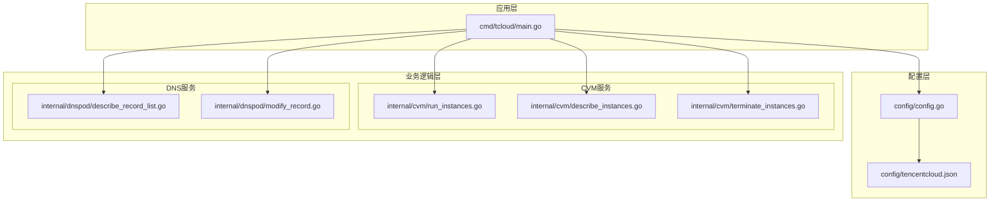
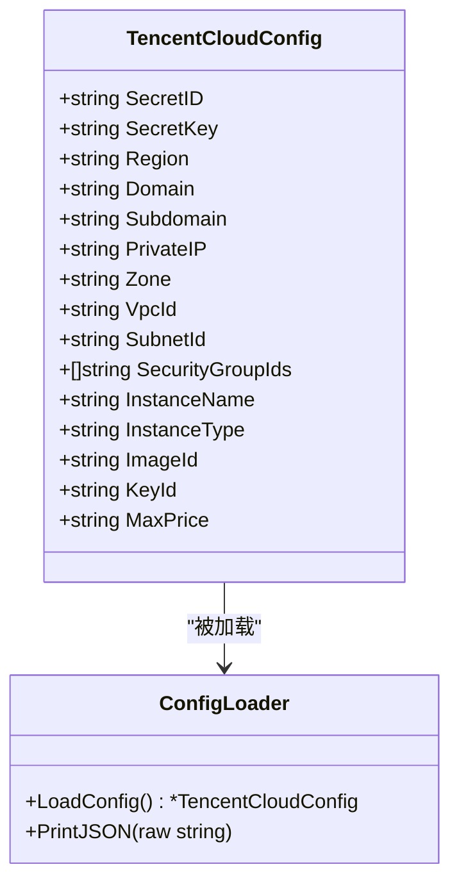
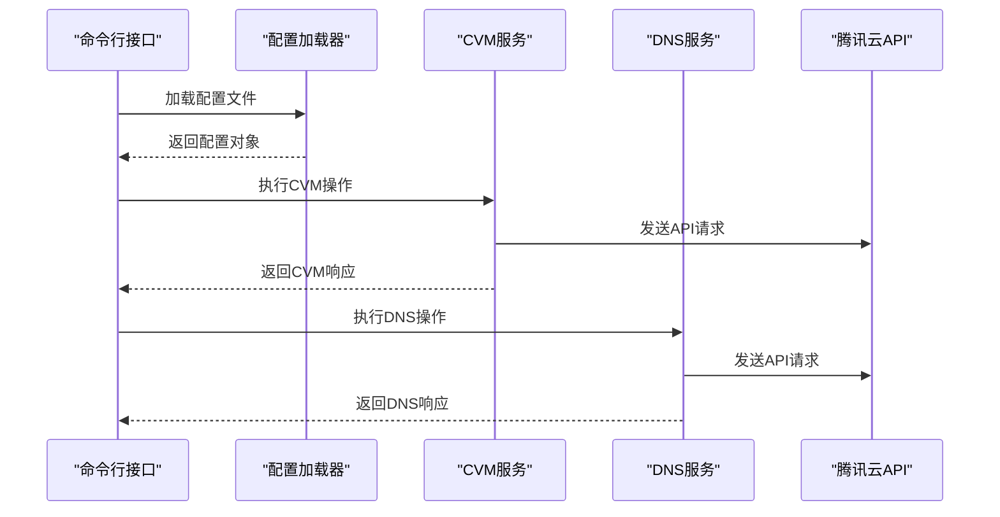
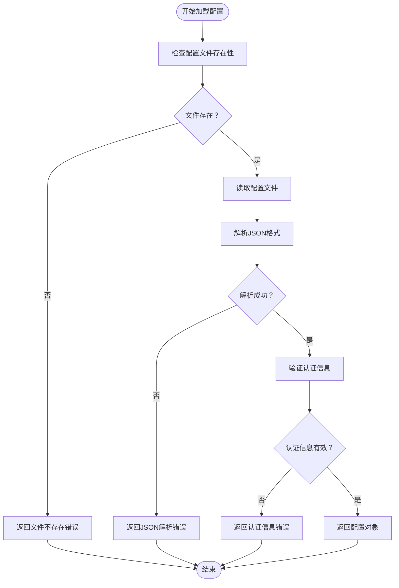
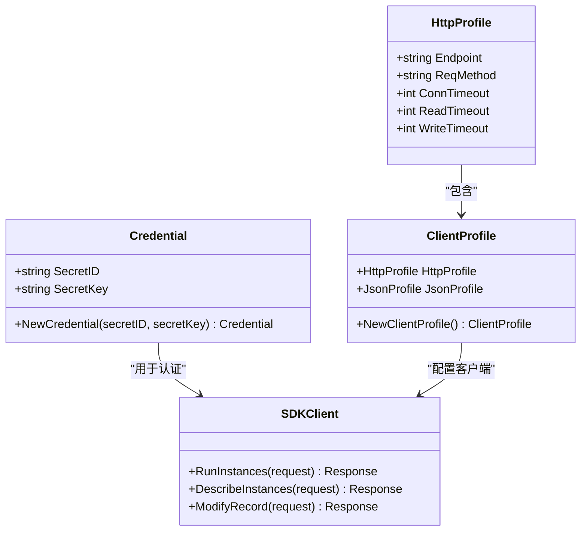
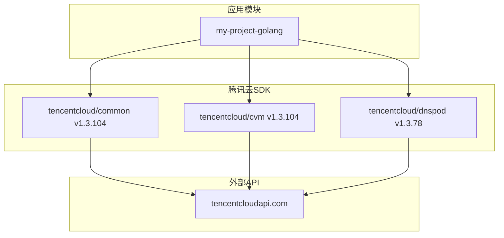

# 配置指南

<cite>
**本文档引用的文件**
- [config/config.go](file://config/config.go)
- [internal/config/config.go](file://internal/config/config.go)
- [config/tencentcloud.json](file://config/tencentcloud.json)
- [cmd/tcloud/main.go](file://cmd/tcloud/main.go)
- [internal/cvm/run_instances.go](file://internal/cvm/run_instances.go)
- [internal/cvm/describe_instances.go](file://internal/cvm/describe_instances.go)
- [internal/cvm/terminate_instances.go](file://internal/cvm/terminate_instances.go)
- [internal/dnspod/describe_record_list.go](file://internal/dnspod/describe_record_list.go)
- [internal/dnspod/modify_record.go](file://internal/dnspod/modify_record.go)
- [go.mod](file://go.mod)
</cite>

## 目录
1. [简介](#简介)
2. [项目结构](#项目结构)
3. [核心组件](#核心组件)
4. [架构概览](#架构概览)
5. [详细组件分析](#详细组件分析)
6. [依赖分析](#依赖分析)
7. [性能考虑](#性能考虑)
8. [故障排除指南](#故障排除指南)
9. [结论](#结论)
10. [附录](#附录)

## 简介

本指南详细说明了腾讯云配置管理系统的结构和使用方法。该系统基于Go语言开发，集成了腾讯云CVM（云服务器）和DNSPod（域名解析）服务，提供了完整的配置管理功能。配置文件采用JSON格式，支持多种环境和安全配置选项。

## 项目结构

项目采用模块化设计，主要包含以下结构：



**图表来源**
- [config/config.go:1-70](file://config/config.go#L1-L70)
- [cmd/tcloud/main.go:1-220](file://cmd/tcloud/main.go#L1-L220)

**章节来源**
- [config/config.go:1-70](file://config/config.go#L1-L70)
- [cmd/tcloud/main.go:1-220](file://cmd/tcloud/main.go#L1-L220)

## 核心组件

### 配置数据结构

系统的核心是`TencentCloudConfig`结构体，定义了所有必要的配置参数：



**图表来源**
- [internal/config/config.go:11-28](file://internal/config/config.go#L11-L28)
- [internal/config/config.go:30-70](file://internal/config/config.go#L30-L70)

### 配置文件位置策略

配置文件加载采用双路径策略：
1. **优先路径**：可执行文件所在目录下的`config/tencentcloud.json`
2. **回退路径**：项目根目录下的`config/tencentcloud.json`

这种设计确保了程序在不同部署环境下的灵活性。

**章节来源**
- [internal/config/config.go:31-59](file://internal/config/config.go#L31-L59)

## 架构概览

系统采用分层架构，配置管理贯穿整个应用生命周期：



**图表来源**
- [cmd/tcloud/main.go:18-23](file://cmd/tcloud/main.go#L18-L23)
- [internal/cvm/run_instances.go:15-20](file://internal/cvm/run_instances.go#L15-L20)
- [internal/dnspod/describe_record_list.go:15-20](file://internal/dnspod/describe_record_list.go#L15-L20)

## 详细组件分析

### 配置文件结构详解

#### 基础认证配置
- **secret_id**：腾讯云访问密钥ID
- **secret_key**：腾讯云访问密钥
- **region**：腾讯云区域标识符

#### 域名解析配置
- **domain**：主域名
- **subdomain**：子域名
- **private_ip**：内网IP地址

#### 网络配置
- **zone**：可用区标识符
- **vpc_id**：虚拟私有云ID
- **subnet_id**：子网ID
- **security_group_ids**：安全组ID数组

#### 实例配置
- **instance_name**：实例名称
- **instance_type**：实例规格类型
- **image_id**：镜像ID
- **key_id**：密钥对ID
- **max_price**：竞价实例最高价格

**章节来源**
- [config/tencentcloud.json:1-18](file://config/tencentcloud.json#L1-L18)
- [internal/config/config.go:12-28](file://internal/config/config.go#L12-L28)

### 配置验证机制

系统实现了多层次的配置验证：



**图表来源**
- [internal/config/config.go:31-59](file://internal/config/config.go#L31-L59)

**章节来源**
- [internal/config/config.go:31-59](file://internal/config/config.go#L31-L59)

### API认证机制

系统使用腾讯云标准的API认证机制：



**图表来源**
- [internal/cvm/run_instances.go:16-20](file://internal/cvm/run_instances.go#L16-L20)
- [internal/dnspod/describe_record_list.go:16-20](file://internal/dnspod/describe_record_list.go#L16-L20)

**章节来源**
- [internal/cvm/run_instances.go:16-20](file://internal/cvm/run_instances.go#L16-L20)
- [internal/dnspod/describe_record_list.go:16-20](file://internal/dnspod/describe_record_list.go#L16-L20)

### 网络参数配置

系统支持灵活的网络配置选项：

#### VPC网络配置
- **VPC ID**：指定虚拟私有云
- **子网ID**：指定子网
- **内网IP**：静态分配内网IP地址
- **安全组**：多个安全组ID组合

#### 计费参数
- **竞价实例**：使用SPOTPAID计费模式
- **最高价格**：通过max_price字段控制
- **公网带宽**：200Mbps BGP线路

**章节来源**
- [internal/cvm/run_instances.go:35-47](file://internal/cvm/run_instances.go#L35-L47)
- [config/tencentcloud.json:9-16](file://config/tencentcloud.json#L9-L16)

## 依赖分析

系统依赖腾讯云官方SDK：



**图表来源**
- [go.mod:5-9](file://go.mod#L5-L9)

**章节来源**
- [go.mod:5-9](file://go.mod#L5-L9)

## 性能考虑

### 配置加载优化
- 支持缓存机制，避免重复文件读取
- 异常处理优化，快速失败策略
- 内存使用优化，结构体字段按需初始化

### API调用优化
- 连接池复用，减少连接建立开销
- 超时时间合理设置，平衡响应速度和稳定性
- 错误重试机制，提高API调用成功率

## 故障排除指南

### 常见配置错误

#### 配置文件路径错误
**问题症状**：程序启动时报配置文件不存在
**解决方法**：
1. 确认配置文件位于正确的相对路径
2. 检查可执行文件与config目录的相对位置
3. 使用绝对路径或调整工作目录

#### 认证信息无效
**问题症状**：API调用返回认证失败
**解决方法**：
1. 验证secret_id和secret_key格式正确
2. 确认密钥权限足够访问目标服务
3. 检查密钥是否过期或被禁用

#### 网络配置冲突
**问题症状**：实例创建失败或网络连接异常
**解决方法**：
1. 验证VPC和子网ID正确性
2. 检查内网IP地址是否已被占用
3. 确认安全组规则允许所需流量

### 配置验证方法

#### JSON格式验证
使用在线JSON验证工具检查配置文件语法
```bash
# 使用jq验证JSON格式
jq . config/tencentcloud.json
```

#### 字段完整性检查
```bash
# 检查必需字段是否存在
jq '.secret_id, .secret_key, .region, .domain, .subdomain' config/tencentcloud.json
```

#### 环境兼容性测试
```bash
# 测试配置文件加载
go run ./cmd/tcloud list
```

**章节来源**
- [internal/config/config.go:44-59](file://internal/config/config.go#L44-L59)

## 结论

本配置管理系统提供了完整的腾讯云服务集成方案，具有以下特点：

1. **安全性**：支持多种认证方式和权限控制
2. **灵活性**：支持多环境配置和动态切换
3. **可靠性**：完善的错误处理和重试机制
4. **易用性**：简洁的配置文件格式和命令行接口

系统适用于需要自动化管理腾讯云资源的场景，特别是需要频繁部署和回收的开发测试环境。

## 附录

### 配置文件模板

```json
{
    "secret_id": "",
    "secret_key": "",
    "region": "",
    "domain": "",
    "subdomain": "",
    "private_ip": "",
    "zone": "",
    "vpc_id": "",
    "subnet_id": "",
    "security_group_ids": [],
    "instance_name": "",
    "instance_type": "",
    "image_id": "",
    "key_id": "",
    "max_price": ""
}
```

### 版本管理建议

1. **语义化版本控制**：使用MAJOR.MINOR.PATCH格式
2. **配置兼容性**：新增字段时保持向后兼容
3. **变更日志**：记录重要的配置变更
4. **备份策略**：定期备份配置文件

### 多环境配置最佳实践

1. **环境分离**：开发、测试、生产环境使用独立配置
2. **敏感信息保护**：使用环境变量或密钥管理服务
3. **配置模板**：提供标准化的配置模板
4. **自动化部署**：结合CI/CD流程实现配置自动化