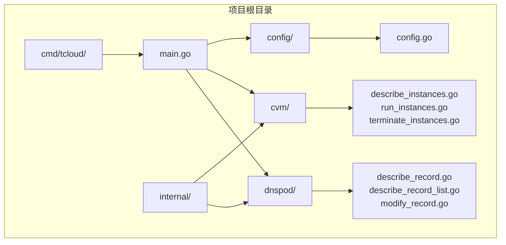
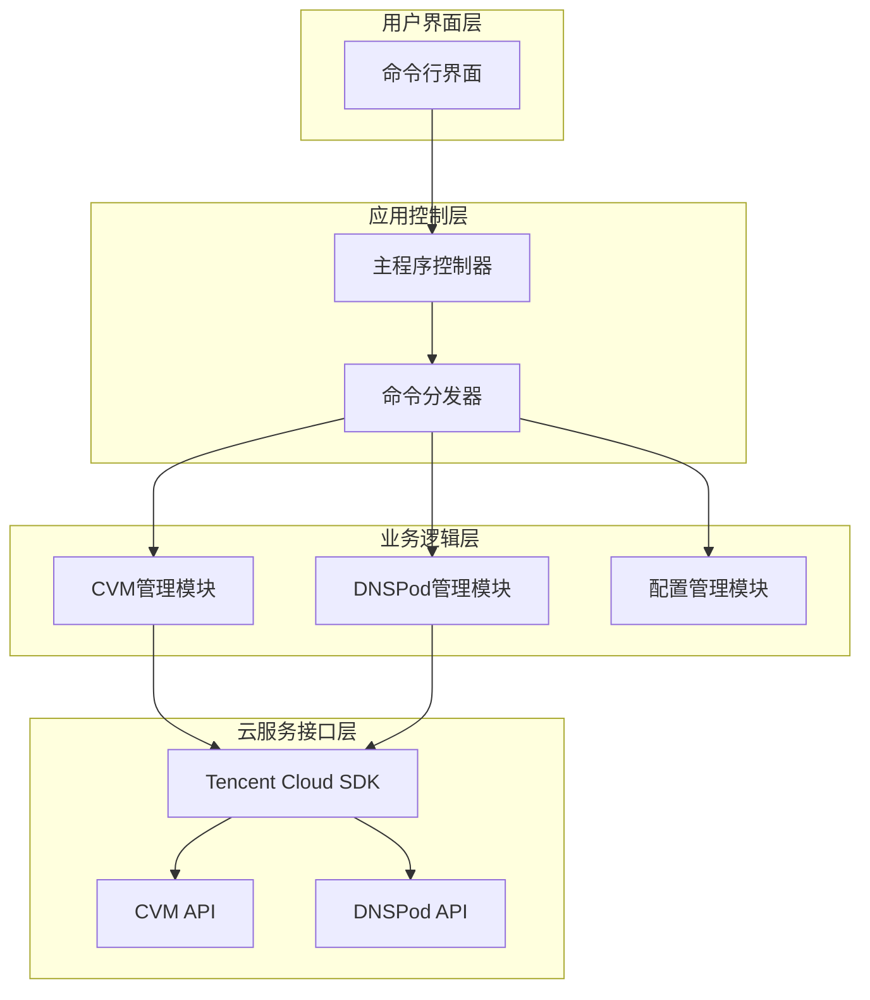
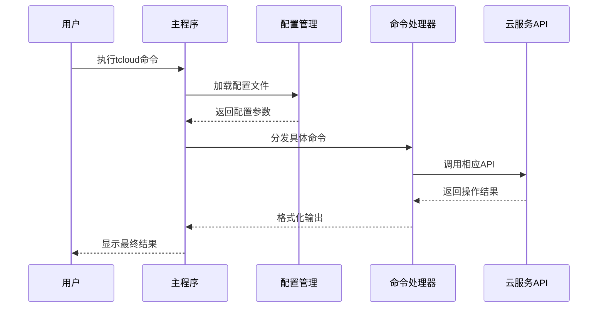
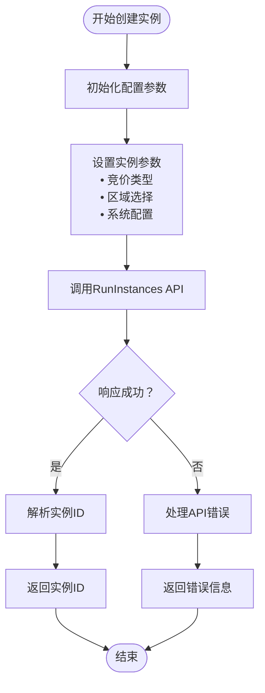
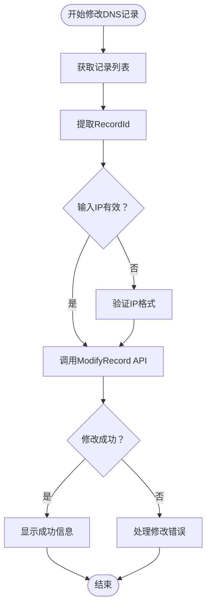
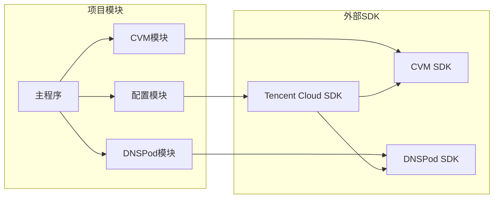

# 项目概述

<cite>
**本文档引用的文件**
- [main.go](file://cmd/tcloud/main.go)
- [config.go](file://internal/config/config.go)
- [describe_instances.go](file://internal/cvm/describe_instances.go)
- [run_instances.go](file://internal/cvm/run_instances.go)
- [terminate_instances.go](file://internal/cvm/terminate_instances.go)
- [describe_record.go](file://internal/dnspod/describe_record.go)
- [describe_record_list.go](file://internal/dnspod/describe_record_list.go)
- [modify_record.go](file://internal/dnspod/modify_record.go)
- [go.mod](file://go.mod)
</cite>

## 目录
1. [项目简介](#项目简介)
2. [项目结构](#项目结构)
3. [核心组件](#核心组件)
4. [架构设计](#架构设计)
5. [详细组件分析](#详细组件分析)
6. [技术栈与依赖](#技术栈与依赖)
7. [应用场景](#应用场景)
8. [性能考虑](#性能考虑)
9. [故障排除指南](#故障排除指南)
10. [结论](#结论)

## 项目简介

腾讯云自动化管理工具是一个基于Go语言开发的命令行工具，专门用于简化腾讯云CVM（云服务器）实例管理和DNSPod域名解析管理的自动化操作。该项目通过提供一键化的部署和回收流程，显著降低了云资源管理的复杂性和人工操作成本。

### 核心目标

- **简化云资源管理**：通过自动化脚本替代繁琐的手工操作
- **提高运维效率**：提供一键部署和回收功能，减少重复性工作
- **降低运营成本**：利用竞价实例模式，实现成本优化的云服务管理
- **增强系统可靠性**：通过标准化流程确保操作的一致性和可追溯性

### 主要功能特性

1. **CVM实例管理**
   - 竞价实例创建和销毁
   - 实例状态监控和公网IP获取
   - 基于内网IP的实例查找

2. **DNSPod域名解析管理**
   - 解析记录列表查询
   - 单条记录详情获取
   - A记录的动态修改

3. **一体化部署流程**
   - 从实例创建到DNS配置的完整自动化
   - 支持一键回收和还原机制

## 项目结构

该项目采用模块化的Go语言项目结构，遵循清晰的分层设计原则：



**图表来源**
- [main.go:1-220](file://cmd/tcloud/main.go#L1-L220)
- [config.go:1-70](file://internal/config/config.go#L1-L70)

### 文件组织策略

- **cmd/tcloud/**：应用程序入口点，包含主程序逻辑
- **internal/config/**：配置管理模块，处理腾讯云API认证和参数配置
- **internal/cvm/**：CVM云服务器管理功能实现
- **internal/dnspod/**：DNSPod域名解析管理功能实现

**章节来源**
- [main.go:12-196](file://cmd/tcloud/main.go#L12-L196)
- [config.go:30-59](file://internal/config/config.go#L30-L59)

## 核心组件

### 配置管理系统

配置系统负责管理腾讯云API的认证信息和业务参数，支持从多个位置加载配置文件，确保部署的灵活性。

### CVM管理模块

提供完整的CVM生命周期管理功能：
- **实例创建**：支持竞价实例的自动化创建
- **状态监控**：实时监控实例状态并等待公网IP分配
- **实例销毁**：安全地终止指定实例
- **实例查找**：基于内网IP快速定位目标实例

### DNSPod管理模块

实现域名解析的自动化管理：
- **记录查询**：获取指定域名的解析记录列表
- **详情获取**：查询单条解析记录的详细信息
- **记录修改**：动态更新A记录的IP地址

**章节来源**
- [config.go:11-28](file://internal/config/config.go#L11-L28)
- [run_instances.go:14-91](file://internal/cvm/run_instances.go#L14-L91)
- [describe_record_list.go:14-46](file://internal/dnspod/describe_record_list.go#L14-L46)

## 架构设计

### 整体架构图



**图表来源**
- [main.go:27-196](file://cmd/tcloud/main.go#L27-L196)
- [config.go:31-59](file://internal/config/config.go#L31-L59)

### 设计理念

1. **模块化设计**：每个功能模块独立封装，便于维护和扩展
2. **配置驱动**：通过配置文件集中管理所有云服务参数
3. **错误处理**：完善的错误处理机制，确保操作的健壮性
4. **日志输出**：详细的步骤提示和状态反馈

### 技术选型

- **编程语言**：Go 1.26.3，具备优秀的并发性能和跨平台能力
- **云SDK**：腾讯云官方Go SDK，确保API调用的稳定性和兼容性
- **HTTP客户端**：基于官方SDK的HTTP请求封装
- **JSON处理**：标准库JSON序列化，支持配置文件和API响应处理

## 详细组件分析

### 主程序控制流



**图表来源**
- [main.go:12-196](file://cmd/tcloud/main.go#L12-L196)

### CVM实例创建流程



**图表来源**
- [run_instances.go:15-91](file://internal/cvm/run_instances.go#L15-L91)

### DNS记录修改流程



**图表来源**
- [describe_record_list.go:14-46](file://internal/dnspod/describe_record_list.go#L14-L46)
- [modify_record.go:14-41](file://internal/dnspod/modify_record.go#L14-L41)

**章节来源**
- [main.go:76-131](file://cmd/tcloud/main.go#L76-L131)
- [main.go:147-190](file://cmd/tcloud/main.go#L147-L190)

## 技术栈与依赖

### 核心技术栈

| 组件 | 版本 | 用途 |
|------|------|------|
| Go语言 | 1.26.3 | 主要开发语言 |
| Tencent Cloud SDK | 1.3.104 | CVM云服务API调用 |
| Tencent Cloud SDK | 1.3.78 | DNSPod API调用 |

### 外部依赖关系



**图表来源**
- [go.mod:5-9](file://go.mod#L5-L9)

### 配置文件结构

系统支持灵活的配置文件加载机制，可以在多个位置查找配置文件：

- **优先级1**：可执行文件所在目录下的config子目录
- **优先级2**：项目根目录下的config子目录

配置文件包含以下关键参数：
- 腾讯云认证信息（SecretID、SecretKey）
- 区域和可用区配置
- VPC网络参数
- 安全组配置
- 实例规格和镜像信息

**章节来源**
- [config.go:31-59](file://internal/config/config.go#L31-L59)
- [go.mod:1-10](file://go.mod#L1-L10)

## 应用场景

### 目标用户群体

1. **DevOps工程师**：需要自动化管理云资源的运维人员
2. **开发者**：需要快速部署测试环境的开发团队
3. **小型企业IT管理员**：需要简化云服务管理的非专业用户
4. **教育机构**：需要教学演示的计算机科学课程

### 典型使用场景

#### 场景一：快速部署测试环境
```bash
# 一键部署完整测试环境
go run ./cmd/tcloud deploy
```

#### 场景二：动态IP更新
```bash
# 更新域名解析到新IP
go run ./cmd/tcloud modify 203.0.113.10
```

#### 场景三：批量回收资源
```bash
# 一键回收所有测试资源
go run ./cmd/tcloud undeploy
```

### 与同类工具的差异化优势

1. **一体化解决方案**：同时支持CVM和DNSPod管理，无需切换多个工具
2. **竞价实例优化**：专门针对腾讯云竞价实例的特殊处理流程
3. **详细的状态反馈**：提供每一步操作的详细进度和结果
4. **错误处理完善**：包含完整的错误捕获和用户友好的错误信息
5. **配置驱动**：通过配置文件实现环境隔离和参数复用

## 性能考虑

### 并发处理能力

- **异步API调用**：各模块独立处理API请求，避免阻塞
- **重试机制**：对竞价实例创建等需要等待的操作提供重试逻辑
- **超时控制**：合理的超时设置确保操作不会无限等待

### 资源管理

- **连接池管理**：SDK自动管理HTTP连接，减少资源消耗
- **内存优化**：及时释放不再使用的变量和响应数据
- **日志级别控制**：可根据需要调整日志输出量

## 故障排除指南

### 常见问题及解决方案

#### 配置文件加载失败
**问题描述**：无法找到或读取配置文件
**解决方案**：
1. 确认配置文件存在于正确路径
2. 检查配置文件权限设置
3. 验证JSON格式的正确性

#### API认证失败
**问题描述**：腾讯云API调用返回认证错误
**解决方案**：
1. 验证SecretID和SecretKey的有效性
2. 检查API密钥的权限范围
3. 确认区域配置的正确性

#### 实例创建超时
**问题描述**：竞价实例创建后无法获取公网IP
**解决方案**：
1. 检查网络配置和安全组规则
2. 验证竞价价格设置是否合理
3. 等待更长时间或调整重试参数

### 调试建议

1. **启用详细日志**：观察每一步操作的详细输出
2. **检查网络连接**：确保能够访问腾讯云API端点
3. **验证参数配置**：确认所有必需参数都已正确设置

**章节来源**
- [main.go:199-219](file://cmd/tcloud/main.go#L199-L219)
- [config.go:54-56](file://internal/config/config.go#L54-L56)

## 结论

腾讯云自动化管理工具通过简洁而强大的设计，成功解决了云资源管理中的痛点问题。其模块化架构、完善的错误处理机制和用户友好的交互设计，使其成为管理腾讯云资源的理想选择。

### 核心价值主张

1. **简化复杂性**：将复杂的云操作简化为简单的命令行调用
2. **提高效率**：通过自动化减少手动操作时间
3. **降低成本**：利用竞价实例模式实现成本优化
4. **增强可靠性**：标准化流程确保操作的一致性和可追溯性

### 发展方向

未来可以考虑的功能扩展：
- 支持更多腾讯云服务的自动化管理
- 添加图形化用户界面选项
- 实现定时任务和自动化调度功能
- 增加监控和告警集成